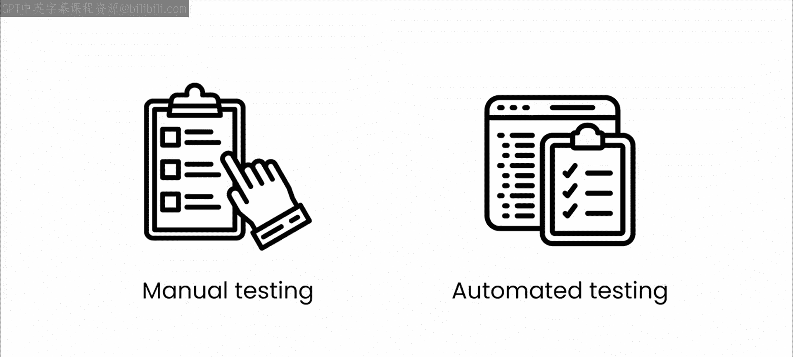
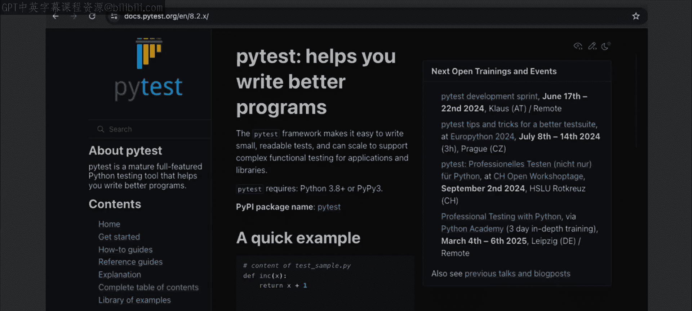
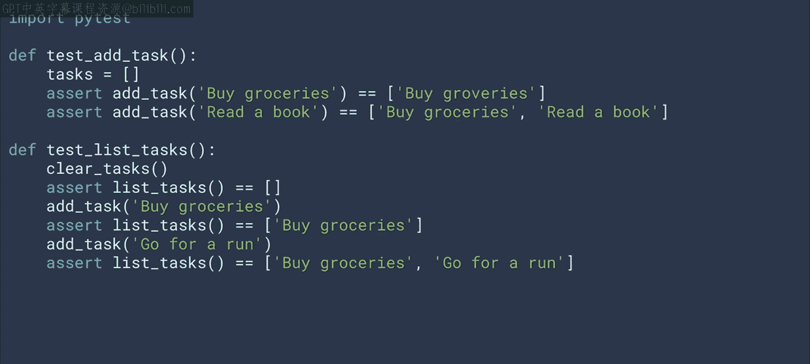
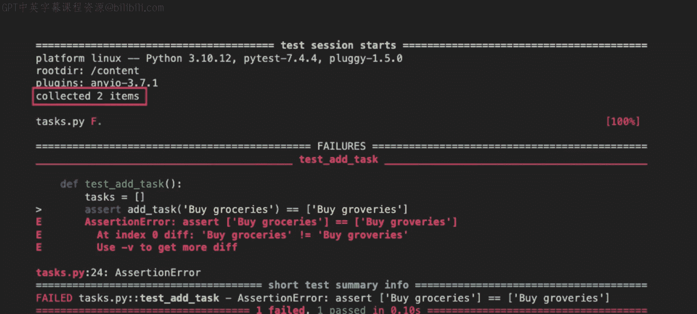
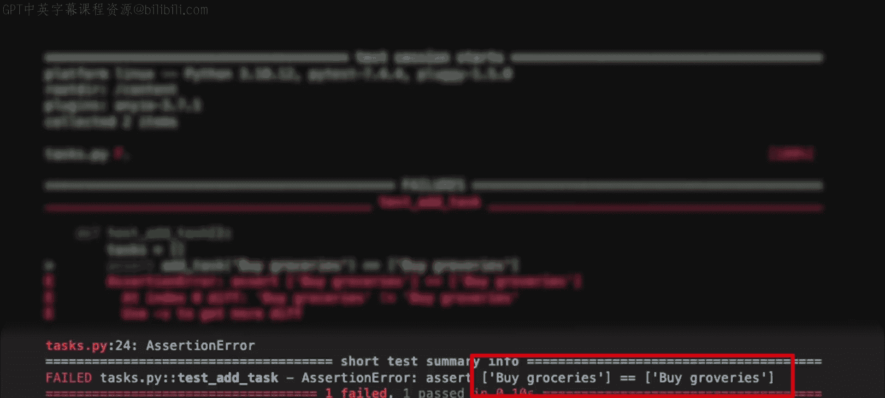
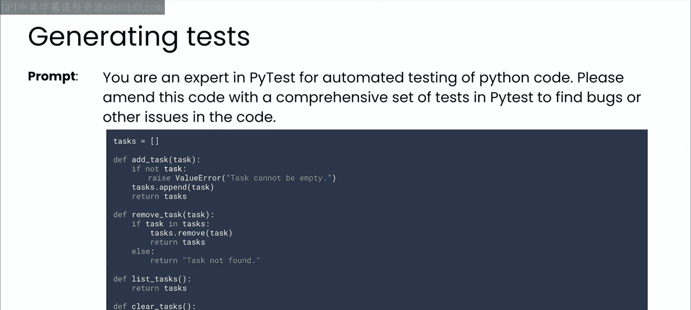
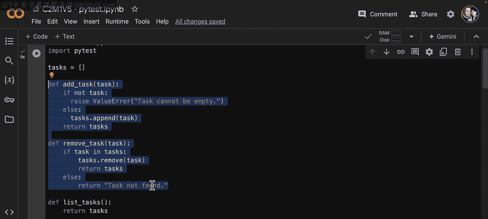
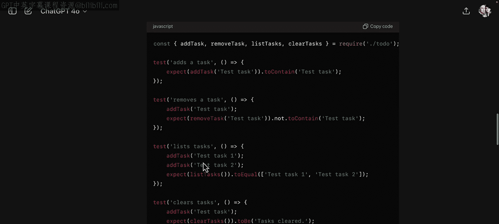

# 30：自动化测试 🧪

在本节课中，我们将学习自动化测试的概念、优势以及如何使用Pytest框架和大型语言模型（LLM）来高效地构建测试套件。

自动化测试是上一节视频中探讨的功能测试的自然延伸。手动功能测试能确保代码的各个函数按预期工作，但这种方法可能耗时且容易出错。自动化测试则利用软件工具自动执行这些重复性任务，从而节省时间并确保一致性。

自动化测试可以频繁运行，提供快速反馈并能够及早发现问题。这在代码库不断增长以及对现有功能进行修改时尤为重要。自动化测试有助于长期保持软件的质量和可靠性。

由于本课程使用Python作为工作语言，我们将使用Pytest进行自动化测试。Pytest是一个强大且灵活的Python测试框架。它使得编写简单且可扩展的测试用例变得容易，并且开箱即用地提供了许多有用功能，例如夹具（fixtures）和参数化测试。

其他语言也存在类似的框架，稍后我们会简要提及。这里快速回顾一下你将使用的简单待办事项列表场景：你将使用一个简单的列表作为数据结构来存储所有待办任务。该应用将包含允许你向待办列表添加或移除任务的方法。你还可以打印出你的任务，或者直接清空整个待办列表。

之前你使用单元测试（unit Test）测试了这个功能。以下是你在上一个视频中看到的用于添加和移除任务功能测试的代码，包括移除不存在任务的边界情况。

现在，让我们看看如何使用Pytest构建相同的测试。

## 使用Pytest进行测试

你需要为下一部分安装Pytest。如果你在本地运行，可以通过在终端中运行 `pip install pytest` 来完成。如果你使用的是Coursera编码环境或Google Colab，它已经为你安装好了。Pytest可以自动发现并运行你的测试，提供清晰易读的输出。

测试可以直接包含在你的Python代码脚本中，也可以放在以 `test_` 为前缀的子目录的单独文件中。Pytest自动发现测试的一种方式是查找代码中以 `test_` 单词为前缀的函数。为了简单起见，我们将在这里遵循这个约定。

以下是添加了一些Pytest测试函数的待办列表代码示例，首先测试是否正确添加任务，然后查看是否正确列出所有任务。我故意在这里包含了一个错误。你能看到它吗？如果需要，可以暂停视频一秒钟。

现在，如果你用 `pytest` 运行这个，你会得到类似这样的输出。注意，这里只有两个测试，但只有一个通过了。

对于失败的那个，我们会得到一些关于原因的详细信息。你可以看到我在测试用例中拼错了“groceries”。如果你在检查代码时没有发现这个错误，请不要担心，这正是自动化测试如此有用的原因。

## 利用LLM生成测试

好了，现在你对Pytest的工作原理有了一定的了解，让我们将LLM重新引入这个过程。通过一个分配角色的提示，你可以让GPT帮助你构建测试套件。在这里，你要求模型运用专家级的Pytest知识，为待办列表代码编写一套全面的测试。

运行这个提示，GPT应该会为你返回一些不错的测试代码。让我们看看它为我创建了什么。

我们可以在notebook中查看一些我们为处理不同情况而添加的新内容，例如添加一个空任务。关于这个测试的一个有趣之处在于良好的Python编码实践：如果我们尝试添加一个空任务，我们希望在这种情况下引发一个错误。因此，现在当我们进行测试时，不仅要检查值，还要检查错误。

类似地，对于移除任务，我们想说当任务存在时，我们会遍历任务并移除它；但如果任务不存在，我们只返回一个字符串。这里有两种不同的情况：一种引发错误，一种返回字符串。我们想看看这些情况的测试用例。我们本可以只使用一个字符串而不追加任务，或者在这里本可以只返回一个错误，但我只是想涵盖两个例子。

现在，当我们往下看测试用例时，以添加任务为例。首先我们会清空任务，然后断言：如果你添加任务一，你期望列表只包含任务一；一旦你添加任务二，你期望列表包含任务一和任务二；一旦你添加任务三，你期望它包含任务一、任务二、任务三，等等。

但如果我们想在任何时候尝试添加一个空任务，我们期望返回一个错误，而不管列表看起来如何。因此，我们不需要事先清空列表或做任何类似的事情。然后我们只需说，如果我们测试添加一个空任务，我们想看看Pytest是否引发那个错误，即一个值错误，正如我们在这里所做的：我们看到如果没有任务，我们引发值错误“任务不能为空”，并且当我们尝试添加一个空任务时，它确实引发了该错误，正如你在这里看到的。

类似地，正如我们之前看到的，例如对于移除任务，我们将清空任务，添加三个任务。如果我们有一、二、三，并且我们尝试移除二，我们期望它变成一和三；如果我们尝试移除一，我们期望它变成三；如果我们尝试移除四，那么我们期望返回字符串“任务未找到”，因为这是我们在这里的架构方式。在实际应用中，我建议你在这种情况下引发错误，而不是仅仅返回一个字符串，但我只是想从测试的角度展示两种场景下的样子。

一旦你完成了这些，当然，你会期望这个被返回。但此时你已经添加了一、二、三，移除了二和一，所以你会期望移除三会返回一个空列表。这里还有其他一些测试，如列出任务、清空任务等，都值得一看。

另外需要注意的是，在顶部我写了 `%%file task.py`，这是Colab特有的语法，用于将此代码保存为文件 `task.py`。所以当我运行这个时，代码实际上并没有执行，而是被Colab保存为 `task.py`。然后当我来到这个单元格时，我将用 `pytest` 运行 `task.py`。我们可以运行它，并看到所有测试都通过了。

所以，这里没有误报，看起来它正按照我们希望的方式工作。但对你来说，一个好的课后作业是决定在这里你更倾向于做什么：是希望在这种情况下引发错误然后测试它，还是只想返回状态什么也不做然后测试它。不过，最好在整个过程中保持一致。

## 自动化测试的优势与扩展

使用LLM帮助编写自动化测试的一个优势是，它会以一致的风格编写它们。这对你和你的团队非常有帮助，尤其是在代码库不断增长以及后续添加新功能及其相关测试时。

Pytest只是一个单一的自动化测试框架，而且是一个非常优秀的框架。当然，如果你想尝试不同的框架，或者你在使用不同的编程语言工作，请尽管去实验。例如，如果我要求LLM将我的Python待办列表代码转换成JavaScript，它会很乐意地完成。

然后你可以要求它推荐JavaScript的自动化测试库，并让它用这些库为你编写一些测试。当我尝试这个时，它继续建议了Jest框架，并编写了这段代码。

这里重要的是，无论你使用哪种语言，只要对你代码的功能有良好的理解，你就可以引导LLM为你完成那些详尽的工作。它可以帮助你生成测试用例，为像Pytest或Jest这样的自动化测试框架编写脚本，以及更多。

## 从功能测试到性能测试

到目前为止，你只是在测试你的代码是否正常运行。但它运行得好吗？这意味着是否快速、用户体验良好，并且在高流量或其他压力条件下表现如何？这将把我们带到测试的下一个阶段：性能测试。让我们进入下一个视频来了解一下。

---

**本节课总结**

在本节课中，我们一起学习了自动化测试的核心概念。我们了解到自动化测试是功能测试的延伸，能够节省时间、确保一致性并及早发现问题。我们重点介绍了使用Pytest框架在Python中编写和运行自动化测试的方法，并通过一个待办事项列表的示例演示了测试用例的编写和错误排查。更重要的是，我们探索了如何利用大型语言模型（LLM）来辅助生成全面且风格一致的测试套件，这能显著提高测试编写的效率。最后，我们认识到自动化测试不仅限于功能验证，还引出了对软件性能进行测试的需求，为下一阶段的学习做好了准备。