# 31：6_软件性能测试 🚀

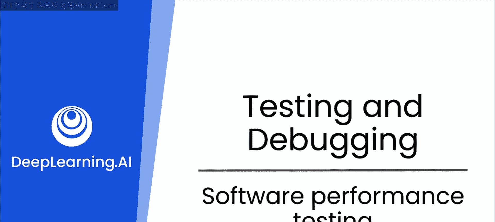

在本节课中，我们将要学习软件性能测试的两个核心方面：测量执行时间和识别性能瓶颈。我们将通过一个具体的Python代码示例，演示如何利用大语言模型（LLM）来辅助我们完成这些任务，并学习如何通过提供详细上下文来获得更优的代码优化建议。

性能测试对于确保应用程序在生产环境中高效运行并能够处理预期的用户负载至关重要。

## 性能测试概述

上一节我们介绍了测试的基本概念，本节中我们来看看性能测试的具体实践。性能测试主要关注两个核心方面：测量代码的执行时间，以及识别代码中的性能瓶颈。我们将使用Python语言进行演示，但其原理适用于任何编程语言，LLM可以帮助你编写必要的测试代码。

## 测量执行时间

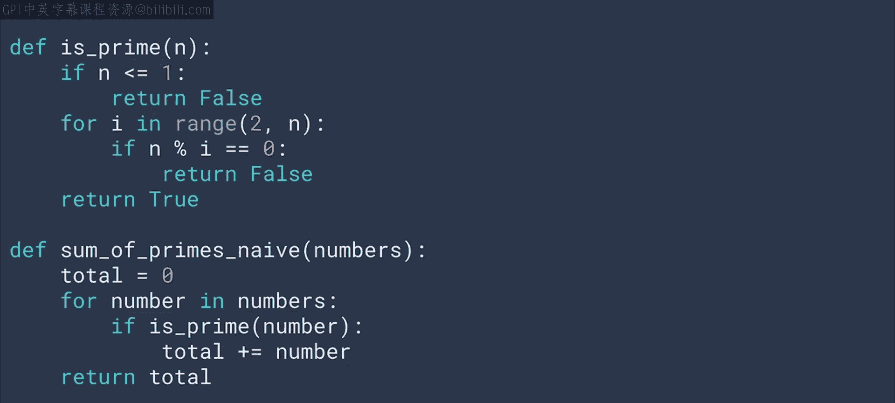

我们将从一个计算密集型的示例开始。以下代码用于找出一个范围内的所有质数并计算它们的总和。

```python
def is_prime(n):
    if n < 2:
        return False
    for i in range(2, int(n**0.5) + 1):
        if n % i == 0:
            return False
    return True

def sum_of_primes_naive(limit):
    total = 0
    for number in range(2, limit + 1):
        if is_prime(number):
            total += number
    return total

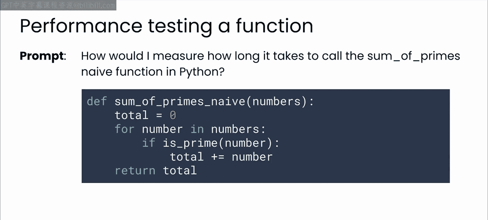

result = sum_of_primes_naive(100000)
print(result) # 输出约4.54亿
```

我们的目标是为这段代码添加测量执行时间的功能。如果你熟悉Python，可能会知道可以使用`timeit`模块。如果不熟悉，可以借助LLM来生成代码。

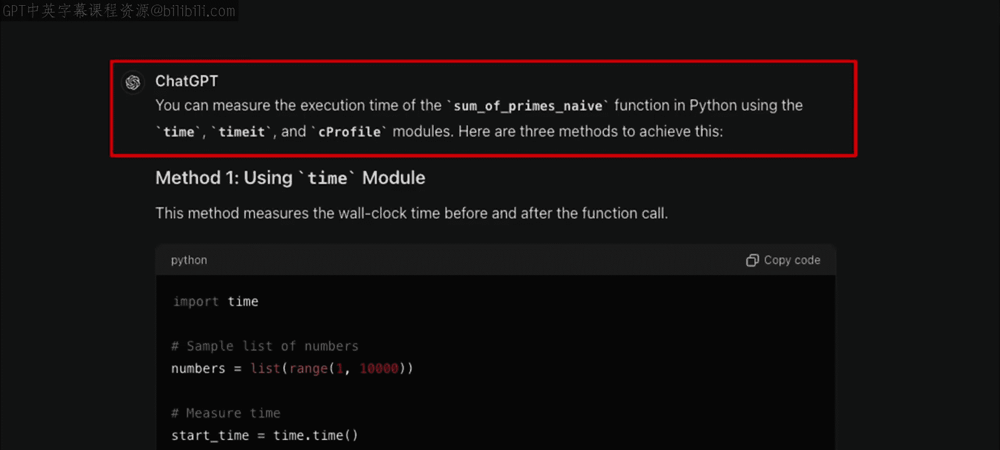

以下是向LLM提问的一个示例：

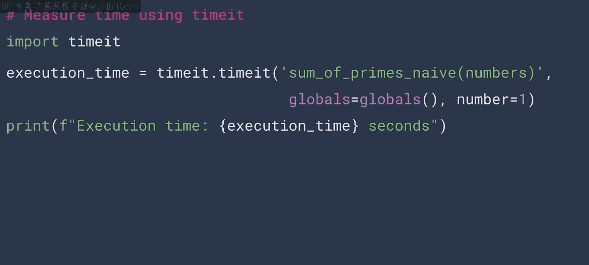

> “如何在Python中测量一个函数的执行时间？”

LLM的回复可能会介绍几种不同的方法，包括使用`time`模块、`timeit`模块和`cProfile`库。这种洞察对于不熟悉该领域生态系统的开发者非常有帮助，LLM可以拓宽你的经验。

根据LLM的建议，我们生成了如下测量代码：

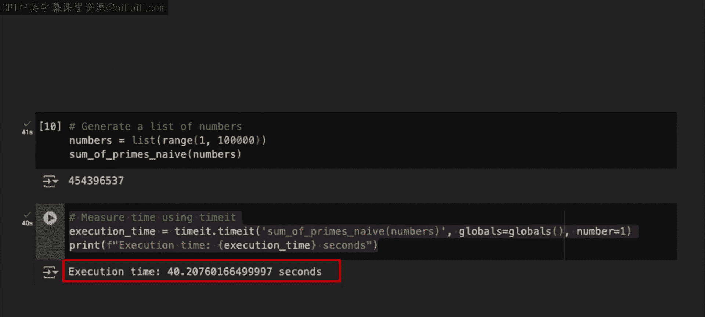

```python
import timeit

execution_time = timeit.timeit(lambda: sum_of_primes_naive(100000), number=1)
print(f"Execution time: {execution_time} seconds")
```

运行这段代码，可以看到执行时间略超过40秒。请注意，使用`timeit.timeit`时，务必指定`number`参数（函数被调用的次数），其默认值为100万。如果不指定，运行这段测试代码可能会耗费非常长的时间。

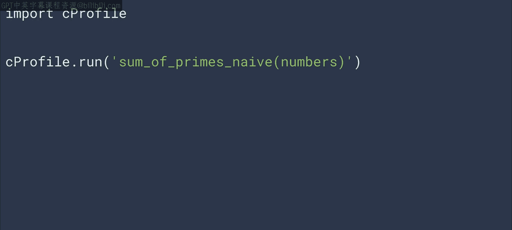

## 识别性能瓶颈

上面的代码运行非常慢。虽然你可以直接提示LLM来改进这段简单的代码，但对于现实世界中更长、更复杂的代码，LLM可能会遇到困难。

在这种情况下，你可以通过提供关于当前性能问题的更深层上下文来帮助LLM改进代码。LLM之前建议的Python `cProfile`库是一个非常有用的工具，它可以通过测量各个函数所花费的时间来帮助你具体了解代码中的瓶颈所在。

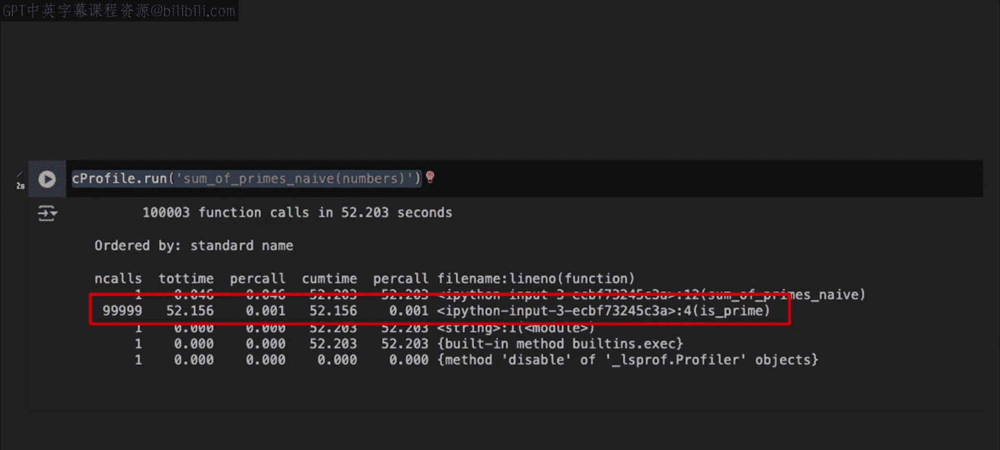

以下是使用`cProfile`进行分析的代码：

```python
import cProfile

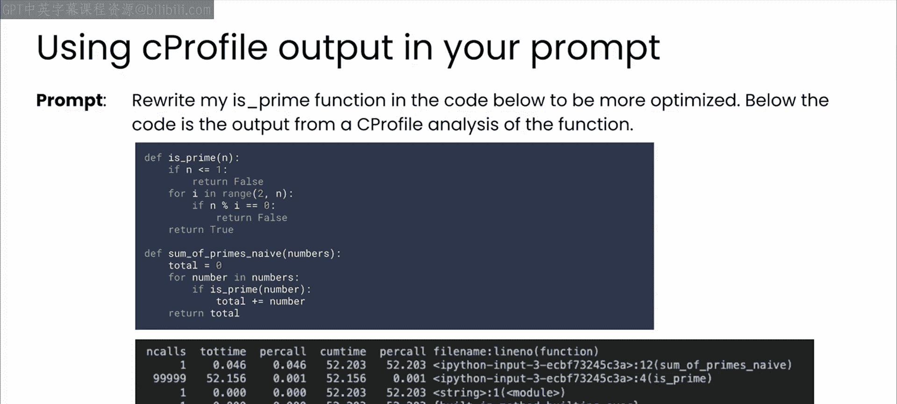

cProfile.run('sum_of_primes_naive(100000)')
```

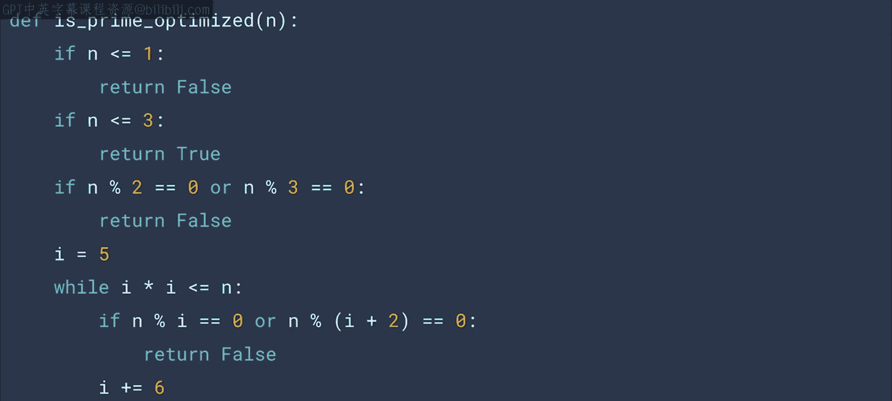

运行后，你会得到类似下面的输出。这次分析运行了大约52秒，但关键是要看大部分时间花在了哪里。输出显示，绝大部分时间都消耗在`is_prime`函数上。在总共52秒中，只有0.046秒不在这个函数里，因此它显然是一个性能瓶颈。

## 利用上下文进行优化

这正是你可以传递给LLM的那种详细的附加上下文，以帮助它为你编写尽可能最佳的优化代码。

现在，与其只是要求模型寻找加速代码的地方，不如在你的提示词中包含`cProfile`的分析结果，并明确要求LLM专门优化`is_prime`函数。

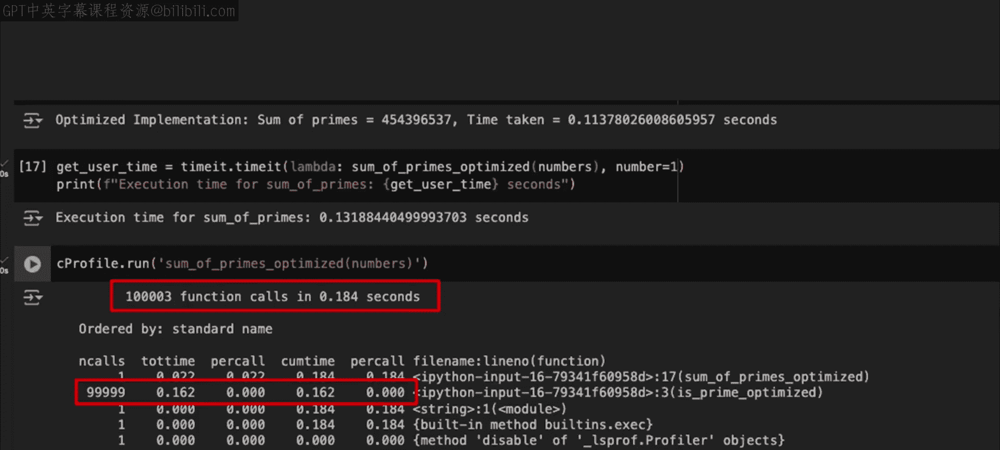

以下是优化后的`is_prime`函数代码：

```python
def is_prime_optimized(n):
    if n < 2:
        return False
    if n == 2:
        return True
    if n % 2 == 0:
        return False
    for i in range(3, int(n**0.5) + 1, 2):
        if n % i == 0:
            return False
    return True
```

如果你好奇这个优化算法从何而来，可以直接询问LLM，它会为你详细讲解质数计算的原理。

运行这段新代码，LLM建议的优化将执行时间从之前的40-50秒减少到了不到一秒。再次使用`cProfile`进行分析，你会看到优化后的`is_prime_optimized`函数虽然仍是耗时最多的部分，但对于10万次调用仅需0.16秒，性能已经比之前好得多，瓶颈效应大大减弱。

你可以尝试用比10万大得多的值来测试这个新函数，看看它的优化效果如何。

## 核心要点与总结

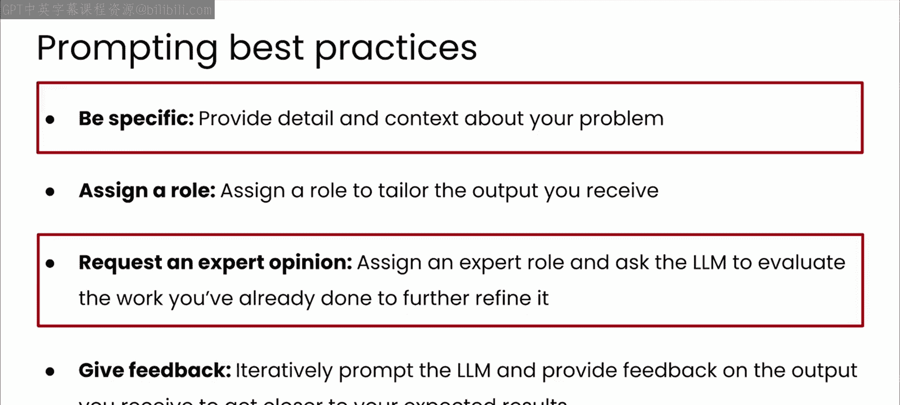

本节课中我们一起学习了性能测试的实践方法。遵循提示词最佳实践的重要经验有两点：

首先，你可以要求LLM提供专家意见。LLM会就如何提升性能给出很好的建议，甚至向你介绍你可能不熟悉的库。性能测试是一项专业工作，通过在开发代码时主动思考这些问题，你可以帮助你的工程同事更高效地完成工作。

其次，也许更重要的是，在你的提示词中提供详细的上下文，总是能从LLM那里获得更有用的回复。正如你在本视频中所做的，当你向模型提供了`cProfile`的分析结果时，这些结果帮助LLM确定了如何修复由那个特定的慢速质数函数引起的性能瓶颈。

当然，这只是一个例子。但我认为，掌握这些技能对你大有裨益。这个例子代表了成为一名更优秀程序员所需要做的事情类型。

现在，还有最后一种测试需要考虑。这种测试非常重要，因为一旦出错后果相当严重。请在下一个视频中与我一起探索安全测试。