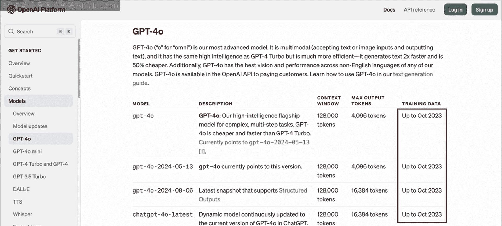
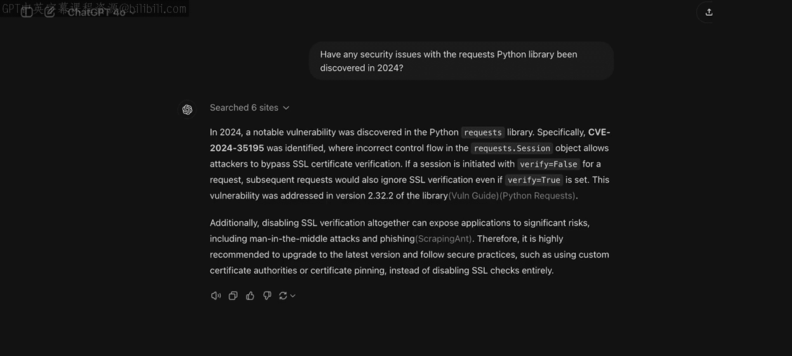
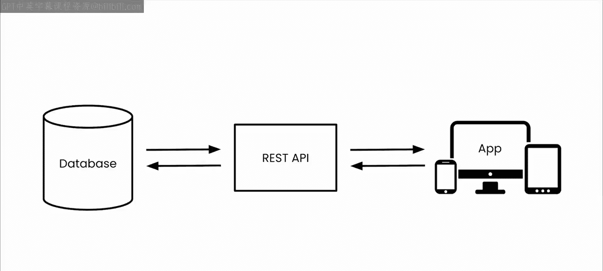
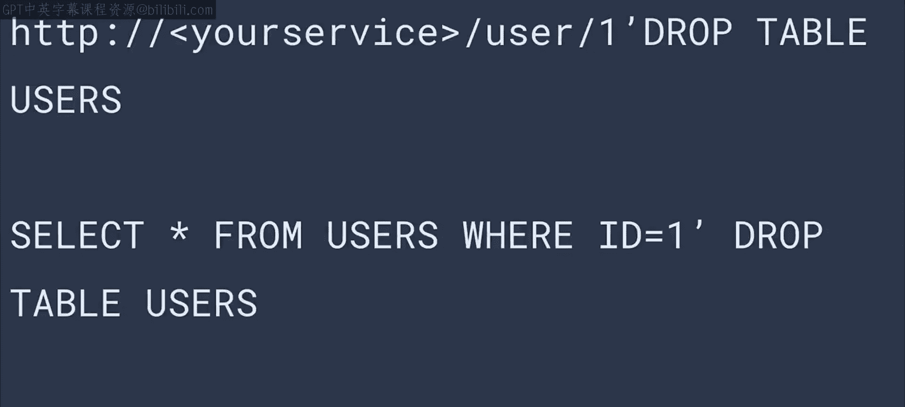

# 32：安全测试 🔒

在本节课中，我们将要学习本模块的最后一种测试类型：安全测试。这是一种非常有趣的测试，因为它既是大型语言模型能提供大量帮助的领域，同时也是我最不放心完全依赖LLM的领域。

## 为何对LLM在安全领域需保持谨慎？ 🤔

上一节我们介绍了安全测试的重要性，本节中我们来看看为何需要谨慎使用LLM进行安全测试。主要有以下几个原因。

首先，任何应用程序，特别是那些通过互联网API公开暴露资产或计算能力的程序，其潜在的安全漏洞时刻面临攻击。这是一场“打地鼠”游戏，一方是应用程序、框架、操作系统和云基础设施的创建者，另一方是攻击者和黑客。新的攻击手段和漏洞利用方式不断被发现，相应的补丁和防御方法也在持续更新。

然而，大型语言模型的训练并不频繁。例如，本课程中使用的GPT-4，其知识截止日期是2023年10月。这意味着其权重中编码的世界知识在此日期之后的信息是缺失的。虽然付费版ChatGPT可以浏览网络并对其发现的内容进行推理，但您可能知道，这并非总是可靠的。

因此，在安全领域，这种知识截止日期是LLM的一个重要限制，您必须考虑。LLM能够提供关于一般性安全问题的指导，包括广泛采用的应用安全最佳实践。但对于您应用程序的所有其他部分，**切勿将安全责任外包给LLM**。它可以帮助您，但您确实需要在真正的安全专家协助下深入理解安全问题。



## LLM如何助力团队沟通与协作 💬

现在，我们来看看LLM可以在哪些方面帮助您的团队更好地运作和沟通。通过让模型扮演安全专家的角色，它可以启动您与人类同事之间的对话。



以下是LLM可以协助启动安全讨论的几个方面：
*   **识别潜在风险**：LLM可以基于常见漏洞模式，提出应用程序可能面临的安全风险。
*   **生成检查清单**：它可以创建初步的安全审查清单，供团队讨论和细化。
*   **解释安全概念**：LLM可以用简单的语言解释复杂的安全术语和原理，促进团队共同理解。
*   **模拟攻击场景**：它可以描述常见的攻击向量（如SQL注入、跨站脚本）如何作用于您的应用。

## 实战示例：使用LLM辅助分析应用安全 🛡️

接下来，让我们通过一个具有代表性的小例子，看看如何借助GPT-4这样的LLM来思考应用程序的安全性。

我们将从一个简单的、具有代表性的应用程序开始。它提供一个基于Web的REST API来访问后端数据库，用于用户管理。通过这个API，用户可以添加、编辑、删除或更新系统中的用户，用户信息将存储在数据库中。

例如，数据库中的用户可能如下所示，他们拥有一个ID、用户名和密码。



```json
{
  "id": 1,
  "username": "alice",
  "password": "plaintext_password123"
}
```

使用Flask，您可以轻松创建用于操作此数据库的API。例如，如果您想查看特定用户的详细信息，可以通过 `/user/<id>` 这样的URL来实现。用于返回用户详情（如果存在）的代码大致如下所示：

```python
@app.route('/user/<user_id>')
def get_user(user_id):
    query = f"SELECT * FROM users WHERE id = {user_id};"
    result = db.execute(query)
    user = result.fetchone()
    return jsonify(user)
```

这段代码查询数据库以查找传入的用户ID，然后获取结果并将其打包成JSON返回给调用者。顺便提一下，课程下载资料中包含一个笔记本，其中有此应用程序的完整代码，如果您想打开并跟随操作的话。

## 识别安全漏洞：SQL注入 🎯

我相信您已经想到了至少一个安全漏洞。那就是，只要后端有数据库，并且前端接受参数，就有可能存在所谓的**SQL注入**攻击。让我们简单看看这是如何发生的。

您的代码提供了这样一个API端点，端点是`/user/<id>`，它获取一个参数，比如`1`。然后，您的后端会使用这个`1`来查找具有该ID的用户，您的应用程序会按预期工作。

但在某些SQL数据库中，像撇号这样的特殊字符可以用来表示“停止前一个查询，转而运行这个查询”。因此，恶意攻击者可能会这样做：`/user/1'; DROP TABLE users; --`。不安全的代码可能会执行此操作，从而删除整个用户表，或者更糟的是，他们可能通过精心构造的查询访问您所有用户的信息。

所以，SQL注入是始终需要警惕的问题。那么，我们这里的应用程序是否容易受到这种攻击呢？在此之后是一个可选练习，供您自己尝试：使用提供的笔记本，看看是否能发现一些漏洞。



## 总结 📝

本节课中我们一起学习了安全测试。我们了解到，虽然LLM在提供通用安全最佳实践和促进团队讨论方面非常有帮助，但由于其知识存在截止日期且安全威胁动态变化，绝不能完全依赖LLM来保障应用程序安全。安全的核心仍在于开发者的深入理解和安全专家的审核。我们通过一个简单的Flask API示例，分析了SQL注入这一常见漏洞，并强调了在开发中保持安全意识的重要性。