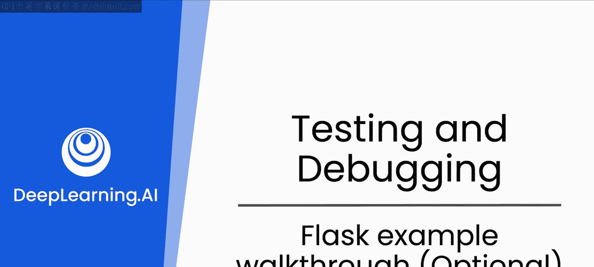
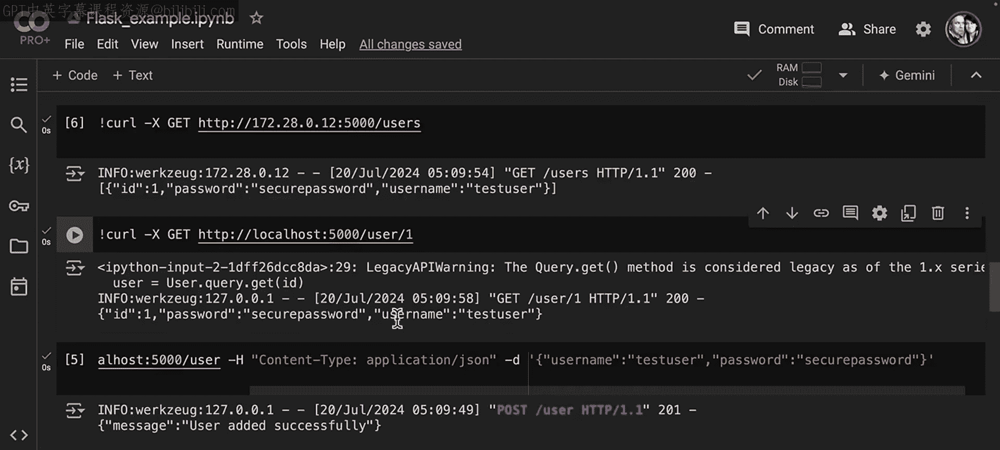
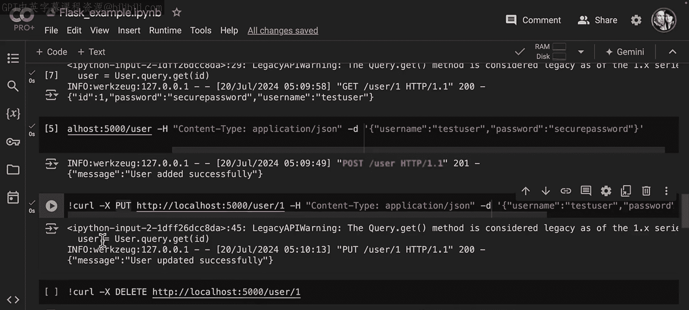
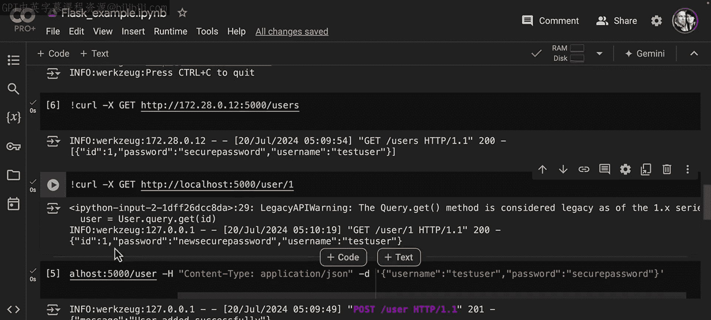
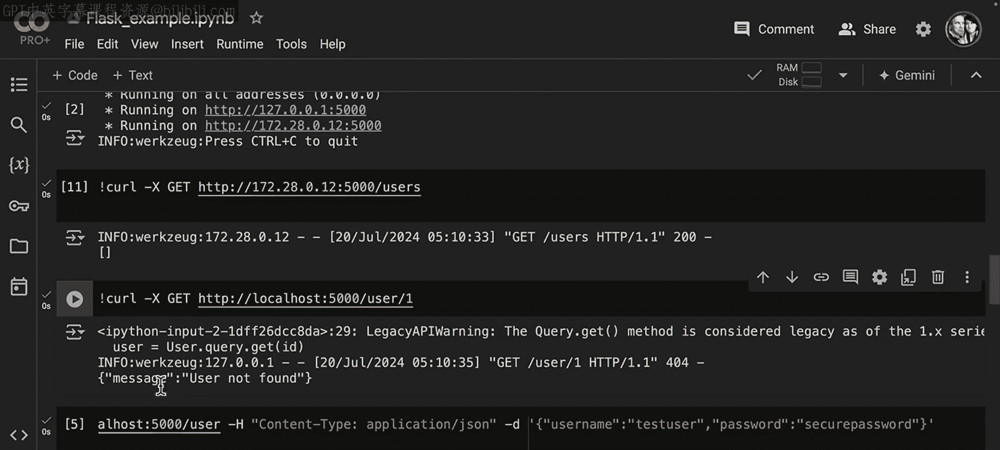
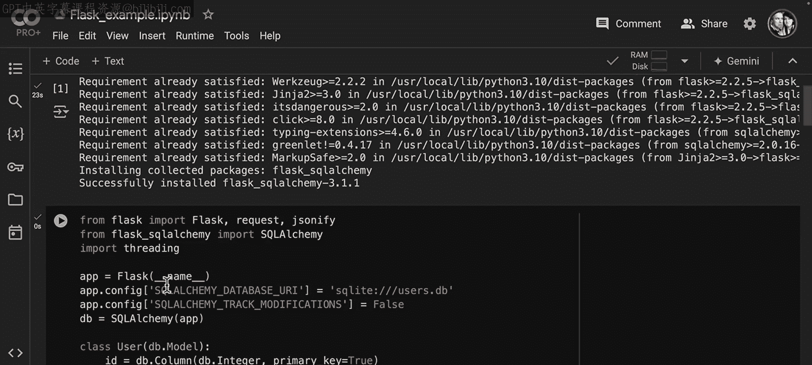

# 33：Flask示例演练（可选）🔍



在本节中，我们将快速演练一个Flask应用程序。这个示例程序是后续进行安全分析的练习对象。如果你对Flask框架不熟悉，本次演练将帮助你理解其基本结构，从而能更有效地与你的大语言模型（LLM）进行关于代码安全的讨论。

## 概述

我们将创建一个简单的Flask应用，它使用SQLAlchemy与SQLite数据库交互，并实现基本的用户（User）增删改查（CRUD）功能。通过这个示例，你将了解Flask应用的基本组成部分和运行流程。

## 环境准备与初始化

首先，我们需要安装SQLAlchemy库。这是一个Python的SQL工具包和对象关系映射（ORM）工具。

```bash
pip install SQLAlchemy
```

安装完成后，我们开始查看和编写代码。首先，我们创建一个新的Flask应用，并配置数据库。

```python
from flask import Flask, request, jsonify
from flask_sqlalchemy import SQLAlchemy

app = Flask(__name__)
app.config['SQLALCHEMY_DATABASE_URI'] = 'sqlite:///users.db'
db = SQLAlchemy(app)
```

以上代码初始化了一个Flask应用，并指定使用SQLite数据库，数据库文件名为`users.db`。`SQLAlchemy(app)`将数据库与我们的应用实例绑定。

## 定义数据模型

接下来，我们需要定义数据模型。在这个应用中，我们创建一个`User`类来映射数据库中的用户表。

```python
class User(db.Model):
    id = db.Column(db.Integer, primary_key=True)
    username = db.Column(db.String(80), unique=True, nullable=False)
    password = db.Column(db.String(120), nullable=False)
```

这个`User`类继承自`db.Model`，它定义了三个字段：
*   `id`: 主键，整数类型。
*   `username`: 用户名，字符串类型，要求唯一且非空。
*   `password`: 密码，字符串类型，要求非空。

运行应用时，这段代码会创建数据库上下文和对应的`users`表。

## 实现应用路由（API端点）

现在，我们来为应用定义路由，也就是API端点。这些端点将处理不同的HTTP请求，实现对用户数据的操作。

首先，我们定义一个根路由，返回简单的欢迎信息。

```python
@app.route('/')
def home():
    return 'Welcome to Security Testing Demo'
```

接下来，我们实现针对用户资源的核心CRUD操作。

### 获取所有用户

我们使用GET方法访问`/users`端点来获取所有用户。

```python
@app.route('/users', methods=['GET'])
def get_users():
    users = User.query.all()
    return jsonify([{'username': u.username, 'password': u.password} for u in users])
```

这段代码查询数据库中的所有用户，并将他们的用户名和密码以JSON格式返回。**请注意，在实际应用中，直接返回用户密码是严重的安全漏洞，此处仅用于演示。**

### 获取特定用户

我们使用GET方法访问`/users/<id>`端点来获取特定ID的用户。

```python
@app.route('/users/<int:user_id>', methods=['GET'])
def get_user(user_id):
    user = User.query.get(user_id)
    if user:
        return jsonify({'username': user.username, 'password': user.password})
    return jsonify({'message': 'User not found'}), 404
```

如果找到对应ID的用户，则返回其信息；否则返回“用户未找到”的消息和404状态码。

### 创建新用户

我们使用POST方法向`/users`端点提交数据来创建新用户。

```python
@app.route('/users', methods=['POST'])
def add_user():
    data = request.get_json()
    new_user = User(username=data['username'], password=data['password'])
    db.session.add(new_user)
    db.session.commit()
    return jsonify({'message': 'User added successfully'})
```

该端点从请求的JSON体中获取`username`和`password`，创建一个新的`User`对象，添加到数据库会话并提交。

### 更新用户信息

我们使用PUT方法访问`/users/<id>`端点来更新现有用户的信息。

```python
@app.route('/users/<int:user_id>', methods=['PUT'])
def update_user(user_id):
    user = User.query.get(user_id)
    if not user:
        return jsonify({'message': 'User not found'}), 404
    data = request.get_json()
    user.username = data.get('username', user.username)
    user.password = data.get('password', user.password)
    db.session.commit()
    return jsonify({'message': 'User updated successfully'})
```

该端点首先查找用户，如果存在，则用请求中的数据更新其用户名和密码字段。

### 删除用户

我们使用DELETE方法访问`/users/<id>`端点来删除用户。

```python
@app.route('/users/<int:user_id>', methods=['DELETE'])
def delete_user(user_id):
    user = User.query.get(user_id)
    if not user:
        return jsonify({'message': 'User not found'}), 404
    db.session.delete(user)
    db.session.commit()
    return jsonify({'message': 'User deleted successfully'})
```

该端点查找用户并将其从数据库会话中删除。

## 运行与测试应用





代码编写完成后，我们运行这个Flask应用。



```python
if __name__ == '__main__':
    db.create_all() # 创建数据库表
    app.run(debug=True)
```

服务器启动后，我们可以使用`curl`命令或任何API测试工具（如Postman）来模拟客户端请求，测试各个端点是否正常工作。

以下是测试流程示例：
1.  **GET /users**: 初始返回空列表 `[]`。
2.  **GET /users/1**: 返回 `{"message": "User not found"}`，状态码404。
3.  **POST /users**: 提交JSON `{"username": "test_user", "password": "secure_password"}`， 返回成功消息。
4.  **再次 GET /users**: 返回包含新用户的列表。
5.  **GET /users/1**: 返回用户1的详细信息。
6.  **PUT /users/1**: 提交JSON `{"password": "new_secure_password"}`， 更新用户密码。
7.  **再次 GET /users/1**: 确认密码已更新。
8.  **DELETE /users/1**: 删除用户1。
9.  **最终 GET /users**: 确认用户列表为空。

通过以上步骤，我们验证了这个简易Flask应用的CRUD功能全部运行正常。



## 总结

本节课我们一起学习并实践了一个完整的Flask应用示例。我们从环境配置、数据模型定义开始，逐步实现了处理GET、POST、PUT、DELETE等HTTP方法的API端点，完成了对用户资源的完整管理。这个应用虽然简单，但涵盖了Web后端开发的基本模式，是后续进行代码安全分析和与LLM讨论的绝佳起点。



在接下来的课程中，你将有机会在未评分的实验环节获取此应用的代码，并学习如何具体分析此类代码的安全性。