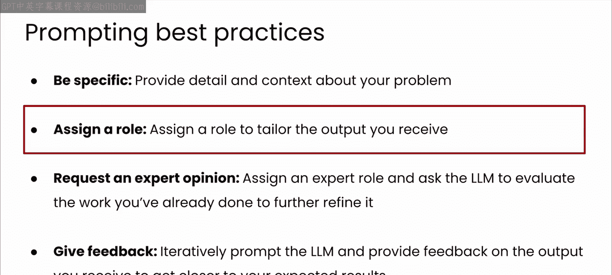
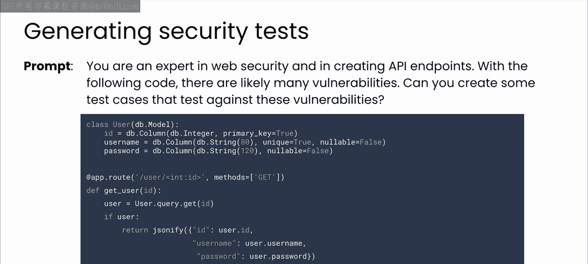
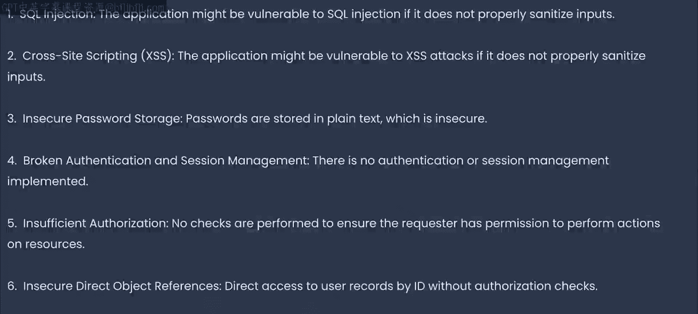
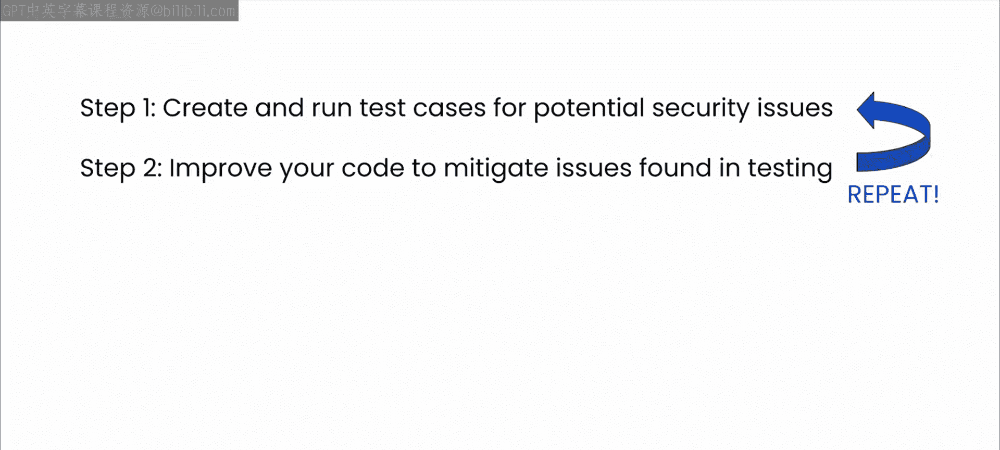
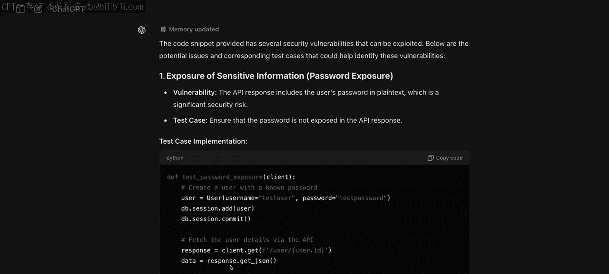

# 34：分析代码安全漏洞 🔍

在本节课中，我们将学习如何利用大型语言模型（LLM）作为你的结对编程伙伴，来分析和识别代码中的安全漏洞。我们将遵循一个系统性的流程：首先让LLM分析代码并生成测试用例，然后根据测试结果与LLM协作修复问题。

---



现在你已经有了代码，是时候测试其安全性了。你应该运用在本课程中学到的所有提示原则。其中，为GPT-4等模型赋予一个特定角色将特别有效，例如“一家曾遭受多次黑客攻击公司的安全专家”。将笔记本中的代码传递给模型，看看它会提出什么建议。如果你想的话，可以花几分钟尝试自己找出模型将要指出的问题，然后看看你猜对了多少。


本课的剩余部分在笔记本环境中运行效果不佳。因此，如果你想跟着代码操作，我建议你设置自己的Python环境。否则，仅通过视频了解思路也可以。我们将要涵盖的通用原则适用于所有软件的安全测试。



我的建议是，你首先应该做的是让你的LLM结对编程伙伴识别潜在漏洞，然后为这些漏洞生成测试代码。对于我们在此使用的Flask应用程序，我使用了如下提示词并提供了代码：

```text
你是一位安全专家。请分析以下代码，指出潜在的安全漏洞，并为这些漏洞生成测试用例。
```

我简单地分配了角色，并要求它为其可能发现的漏洞提供测试用例。




它确实给了我一个潜在漏洞列表，包括前面提到的SQL注入、跨站脚本攻击（XSS）——攻击者可能通过API在查询中返回恶意代码，然后该代码在他人浏览器中执行并造成破坏。它还发现了不安全的密码存储问题，因为我的密码是以明文存储的。

以下是它识别出的主要问题列表：

*   **SQL注入**：用户输入未经验证直接拼接进SQL查询。
*   **跨站脚本攻击**：未对用户输入进行转义，可能导致恶意脚本在浏览器执行。
*   **不安全的密码存储**：密码以明文形式存储在数据库中。
*   **直接访问用户记录**：任何人无需授权即可列出包括密码在内的任何用户详细信息。

这导致了数据（在本例中是密码）的暴露，这对黑客来说显然是一个金矿。


我已经在笔记本中提供了生成的测试用例，但如前所述，在笔记本中运行服务器会遇到限制。第一个进行SQL注入的测试用例实际上会导致正在运行的Flask服务器崩溃，并且很难调试原因。这就是为什么在本地运行代码是更好的前进方式。关于构建和运行你自己的本地Flask Python环境，你可以访问此处显示的URL，该链接也在本视频的注释中提供。

当然，每个应用程序和类型都不同，其安全漏洞也会有所不同。因此，不幸的是，没有一种适用于所有应用程序的安全方法。但与LLM协作的通用设计模式仍然适用，主要包括两件事：

第一，在分析你的代码后，让LLM为你生成测试用例。我经常发现这一步对于激发我的灵感非常有用，让我想到一些可能遗漏的方面，而LLM甚至可能没有相关的上下文来推理这些方面。所以，花些时间确保测试用例正确，并运行它们来发现错误。

第二，在测试用例发现错误后，与LLM协作，提出改进代码以缓解这些问题的方案。直接让LLM为你重写整个代码可能非常诱人——通过传入所有内容并要求它查找并修复错误，尤其是在上下文窗口不断增大的情况下。但我认为这可能会带来麻烦。我建议你遵循我们在此使用的流程化方法：分析代码 -> 生成测试用例 -> 针对这些用例进行测试 -> 发现问题 -> 深入分析特定问题 -> 与LLM协作修复它们 -> 然后持续重复此过程。此时，你可以分析整个代码库，然后回到第一步，不断重复，直到你对代码的安全性感到满意为止。

你还需要在此阶段让你的安全专家同事参与进来，确保你提出的修复方案符合你公司或行业特定的任何安全协议和要求。重复这个循环，直到你和你的同事都满意代码已尽可能安全。记住，代码永远不会完成，因为代码将始终面临攻击。这不是一件你可以一次性交付、签字确认，然后就高枕无忧地认为它将永远安全的事情——如果那样就好了。




这是一项艰巨的工作，需要付出大量努力。但我确实希望，通过让LLM作为你的代码伙伴，可以减少一些这样的努力。




这为我们关于测试的模块画上了句号。你已经看到了如何使用LLM来分析你的代码，帮助你识别和实施测试用例，以及如何评估和测试代码库中的性能和安全性问题。通过从一开始就将这些测试考量融入你的编码实践，你将为与测试和安全角色的同事建立更高效、更顺畅的合作关系奠定基础。这里的理念不是让LLM取代这些角色中的任何一个，而是帮助你预见他们的需求，编写出更好的代码，让你和他们的工作都更轻松。

---

**总结**

本节课中，我们一起学习了利用LLM进行代码安全分析的完整流程。核心方法是：**赋予LLM安全专家角色 -> 分析代码并生成针对性测试用例 -> 运行测试定位问题 -> 与LLM协作迭代修复**。我们认识到，安全是一个持续的过程，没有一劳永逸的解决方案。通过将LLM作为结对编程伙伴融入这个流程，我们可以更系统、更高效地发现和修复漏洞，编写出更健壮、更安全的代码，并与安全团队更好地协作。