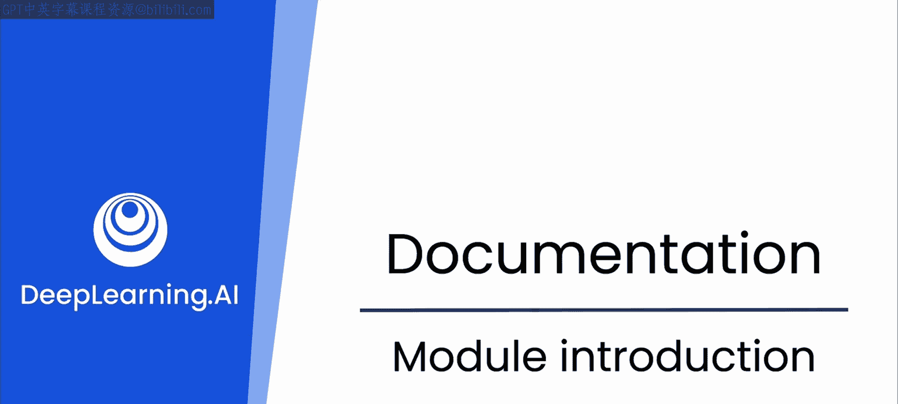
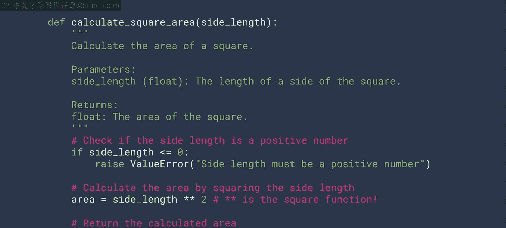
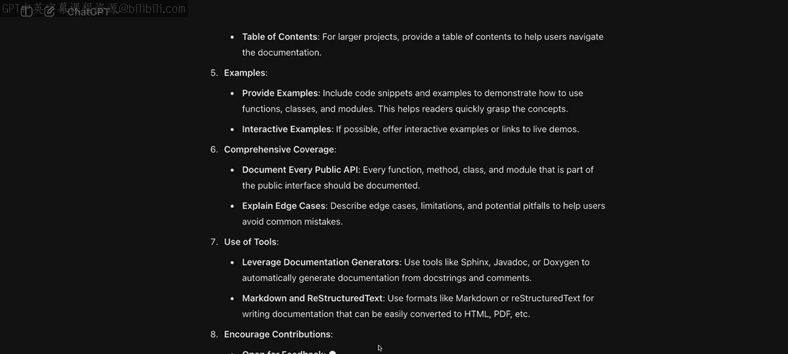

# 35：文档的重要性与LLM辅助

在本模块中，我们将探讨文档在软件开发中的重要性。文档既是提升代码质量与易用性的手段，也是促进与团队成员及其他利益相关者沟通的工具。

你可能会认为编写文档很简单，无非是写一些文字来解释代码的功能，记住正确的注释语法，然后继续工作。从编程初期开始，我们就在做这件事，因此本课程也将其包含在内。

然而，尽管我们花费大量时间编写文档并自认为擅长于此，但在工作中仍会经常遇到令人困惑的代码，不禁想问：“这是谁写的？简直一团糟，我完全看不懂。” 这是因为编写优秀的文档实际上是一门艺术。

关于什么是优秀的代码文档，存在许多不同的观点。有人认为文档应尽可能精简，因为优美的代码本身就能说明一切；也有人喜欢在几乎每一行代码都添加注释，以确保代码意图没有歧义。

如果你向一个大语言模型（LLM）请教如何编写优秀的代码文档，它可能会给出一个包含许多要点的回答，类似于这样：

以下是LLM可能提出的关于优秀文档的原则：
*   优秀文档的原则
*   良好的写作技巧
*   文档的结构
*   针对特定受众进行写作

显然，需要考虑的方面很多。在接下来的几个视频中，我们将回归基础，探讨如何自己编写优秀文档的最佳实践，以及LLM如何能在此过程中为你提供最佳支持。

毕竟，代码文档是与他人沟通的重要方式，无论是你的开发同事、代码测试人员、安全专家，还是需要部署你代码的工程合作伙伴。你的文档越好，每个人的工作就会越轻松。

那么，让我们进入下一个视频，开始深入思考究竟是什么构成了优秀的文档。

---

**本节课总结**

在本节课中，我们一起学习了文档在软件开发中的核心价值，认识到编写优秀文档的挑战性，并初步了解了LLM在辅助文档创作方面的潜力。我们明确了本模块的学习目标：掌握编写优秀文档的最佳实践，并学会利用LLM工具提升文档质量。