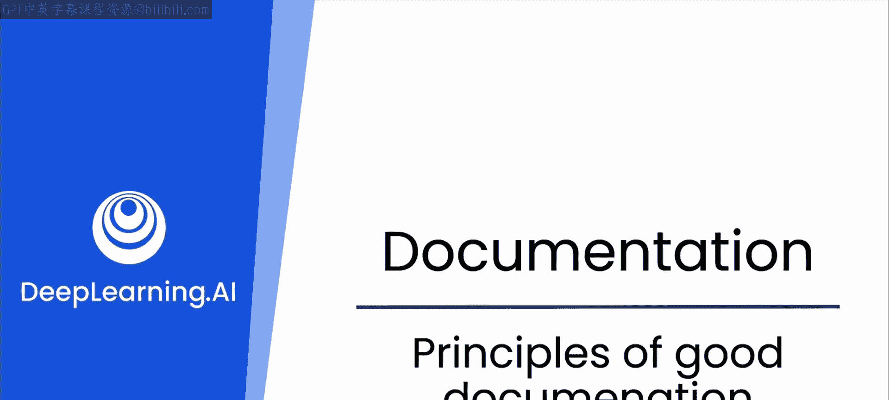
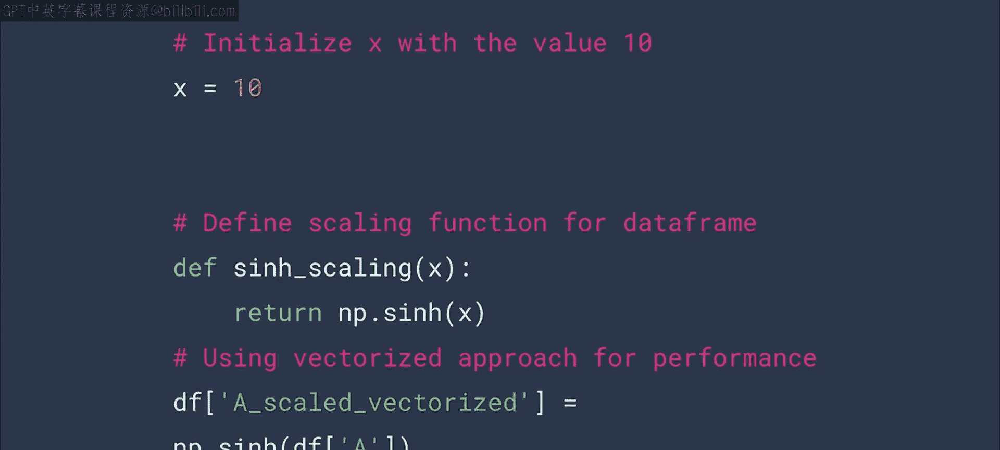
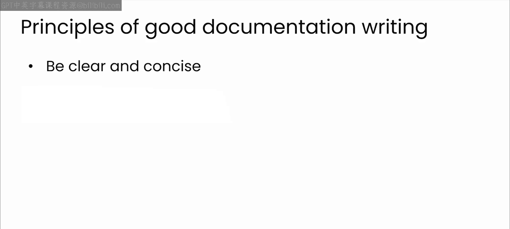
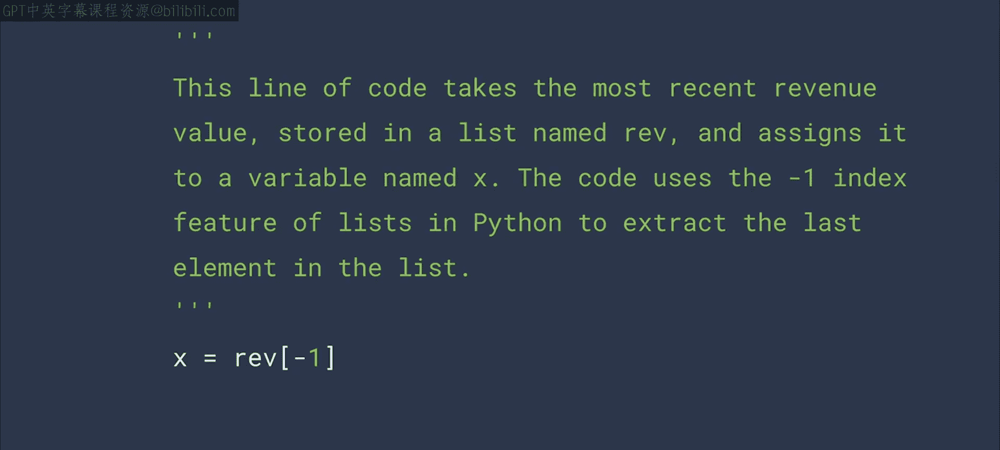
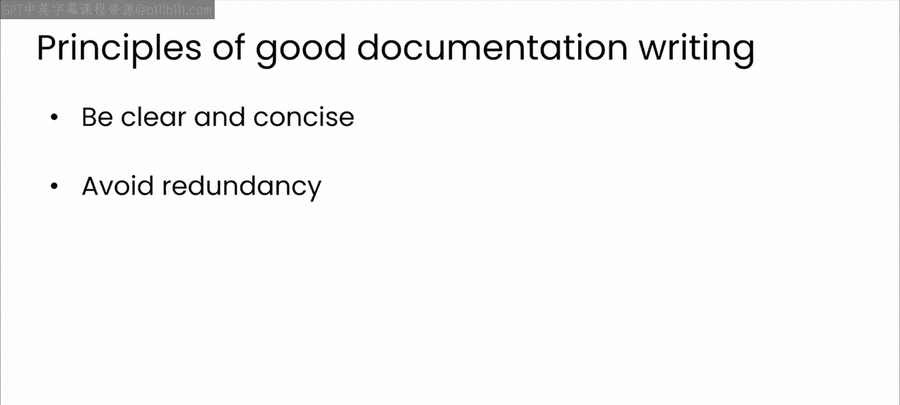
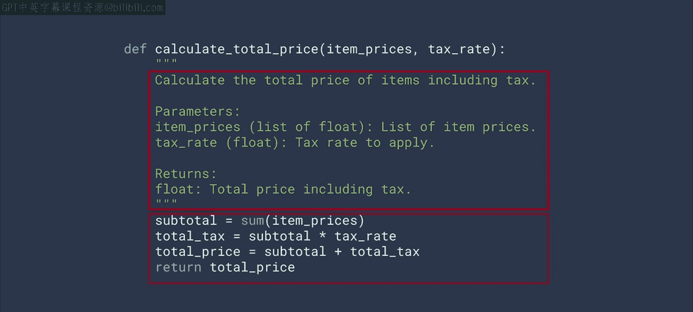
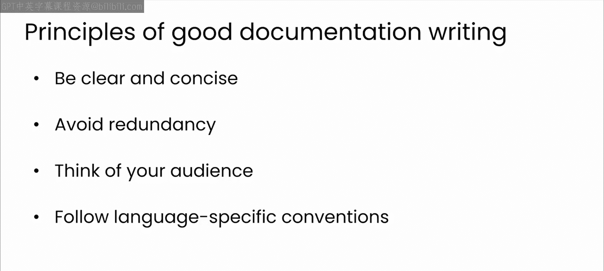
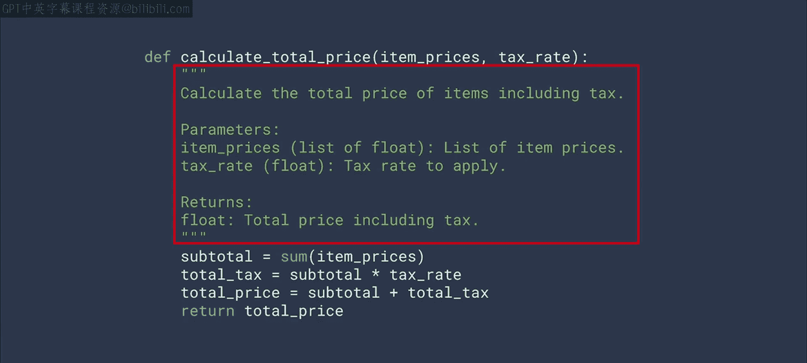
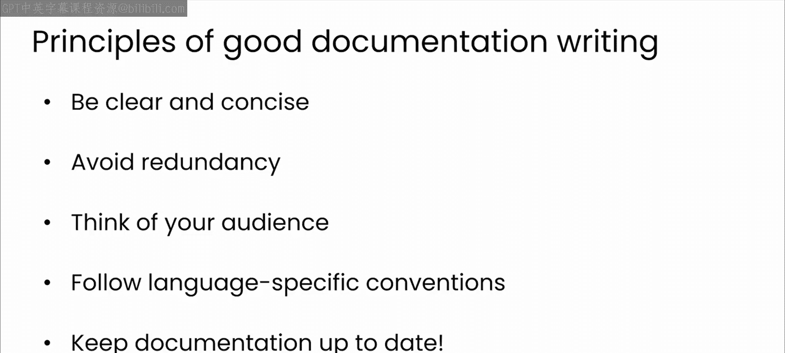
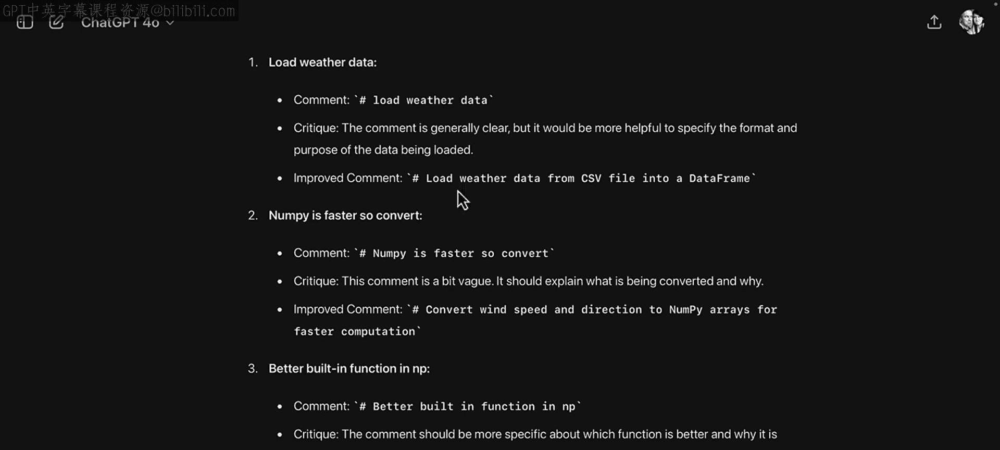

# 36：良好文档的原则 📝



在本节课中，我们将要学习良好代码文档的核心原则。文档是软件开发中不可或缺的一部分，它能显著提升代码的可读性、可维护性和团队协作效率。我们将探讨什么是好的文档，以及如何应用这些原则来改进你的代码。



---

## 什么是良好文档？ 🤔

良好文档可以采取多种形式。它可以像解释特定代码块目的的内联注释一样简单。它也可能是一套更复杂的指令或解释，就像你在软件开发工具包（SDK）或应用程序编程接口（API）中找到的那样。

良好文档的首要作用是提高代码可读性，但其好处远不止于此。

---

## 良好文档的重要性 💡

上一节我们介绍了文档的多种形式，本节中我们来看看编写良好文档带来的具体好处。

以下是良好文档的几个关键益处：

*   **便于团队理解**：文档完善的代码更容易被他人理解。这在团队环境中至关重要，因为多个开发人员可能在同一代码库上工作。如果你的代码解释清晰、易于理解，团队在接手代码并继续推进自己的任务时，就能快速掌握你的工作内容。
*   **有助于防止技术债务**：技术债务在你为了尽快将某些东西投入生产而走捷径时产生。但未来其他人将承担理解你所做工作的负担，尤其是认知负荷。良好的文档有助于减轻这种负担。
*   **辅助维护工作**：当你或其他人在代码编写数月甚至数年之后重新审视它时，良好的文档有助于快速理解代码的目的和逻辑，从而更容易进行更新、维护和调试。
*   **加速新成员上手**：文档是他人学习你的代码是什么以及如何使用它的主要工具。当有新成员加入团队时，如果代码文档完善，将帮助新开发人员更快地跟上进度，减少他们的学习曲线，提高生产力。
*   **提升整体代码质量**：编写文档通常会迫使你更深入地思考你的代码，这可能导致更好的设计决策和更少的错误。

---

## 良好文档的核心原则 🧭

鉴于编写良好文档有这么多好处，让我们花点时间具体探讨一下“良好”的含义。以下是一些在工作中非常实用的良好文档原则。

### 原则一：清晰且简洁



你的文档应该清晰且简洁。这一原则无论你是在编写内联注释还是完整的SDK文档都适用。

例如，下面是一个没有传达任何信息的模糊内联注释：
```python
# 更新数据
data.update()
```
这里的“更新”具体指什么？一个更清晰的注释应该是这样的：
```python
# 用新用户信息刷新缓存
data.update()
```
只需几个词，你现在就了解了代码在做什么。当然，你应该尽可能使用最少的词语。过多的文档会使你的代码非常难以阅读。多行注释可能画蛇添足，它不需要解释Python的基本功能。

### 原则二：避免冗余



另一个能保持代码易于管理和阅读的原则是避免冗余。



例如，在这个Python脚本中，变量命名非常具有描述性，代码的功能相当清晰：
```python
def calculate_total_price(unit_price, quantity):
    """
    计算商品总价。

    参数:
        unit_price (float): 商品单价。
        quantity (int): 商品数量。

    返回:
        float: 计算出的总价。
    """
    total_cost = unit_price * quantity
    return total_cost
```
顶部的文档注释很有用，因为它定义了输入类型。但你不会想在这一部分添加内联注释，因为代码的功能已经相当清楚了。

如果你正在处理更复杂的文档，例如一个完整的SDK，避免冗余对于使文档易于导航至关重要。在多个地方放置相同的信息可能导致不一致、用户错误，并使文档更难以维护。它也会不必要地使你的文档变得臃肿。



### 原则三：考虑受众

文档是供人阅读的，因此在心中设定特定的受众可以帮助你调整文档的语气和详细程度，使其对目标用户最有用。

例如，在处理内部私有项目时，你可能会引用内部要求和规范。但你不希望在面向公众的文档中这样做，因为外部用户无法访问这些资源。

另一个需要牢记的重要问题是，文档约定可能因编程语言而异。像Java和Python这样的语言有由社区维护的完善的文档编写指南。

例如，Python使用称为**文档字符串（Docstrings）** 的注释作为记录代码的标准方式。上面看到的 `calculate_total_price` 函数就是一个例子，文档字符串是紧跟在函数定义之后出现的字符串字面量。你会将它放在函数、类或模块的定义中。

这些文档字符串的样式在一个名为 **PEP 257** 的文档中进行了概述。Python有许多这样的Python增强提案（PEP），它们可以帮助开发人员标准化他们的代码，遵循这些指南是最佳实践。

### 原则四：保持文档更新



最后，这一点非常重要：保持你的文档处于最新状态。

代码就像一个有生命的事物。随着周围环境的变化和错误的发现，它也在不断演变。保持代码最新将帮助你避免技术债务，并使你的代码从长远来看更易于维护。



当然，我想你已经猜到我要说什么了：**大型语言模型（LLM）** 可以帮助你在处理文档时维护这些原则。

---

## LLM如何辅助文档工作？ 🤖

除了帮助你编写注释，LLM还可以帮助你跨语言工作，为你的目标受众建议合适的语气，并分析文档以提出改进建议。

接下来，让我们动手实践，看看LLM如何帮助你处理不同类型的文档。我们将从一个看似简单的任务开始：内联注释。我们将在下一个视频中详细探讨。



---



## 总结 📋

本节课中我们一起学习了良好代码文档的核心原则及其重要性。我们了解到，良好的文档应该是清晰、简洁、避免冗余、考虑受众并保持更新的。遵循这些原则不仅能提升代码质量，还能促进团队协作和项目的长期可维护性。最后，我们认识到大型语言模型可以成为我们遵循这些原则、编写更好文档的强大助手。