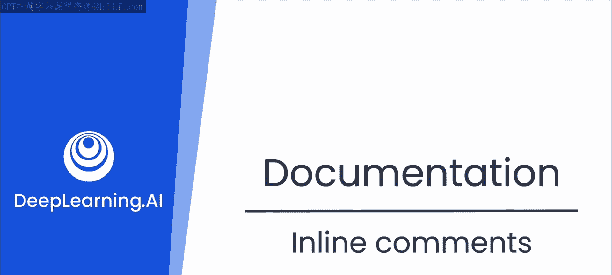
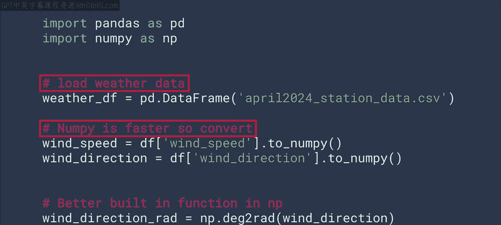
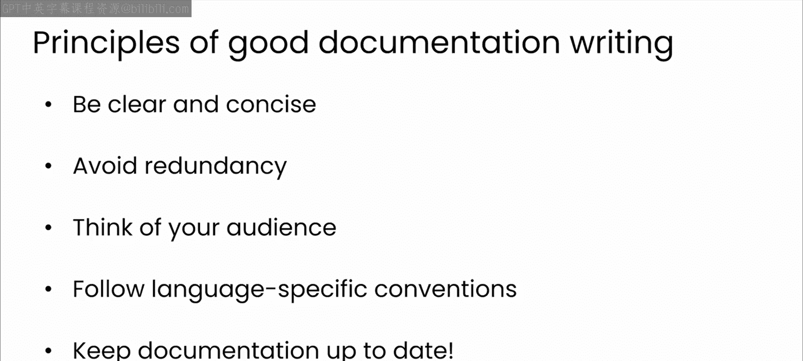
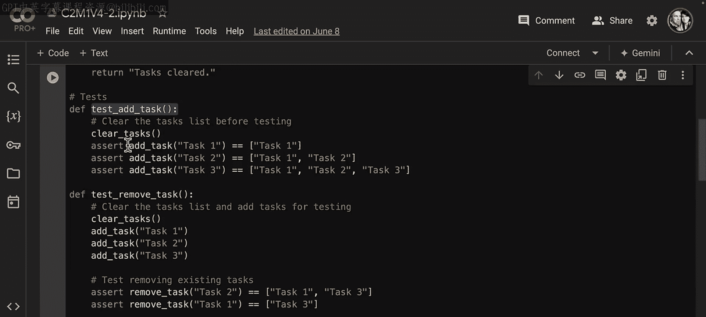
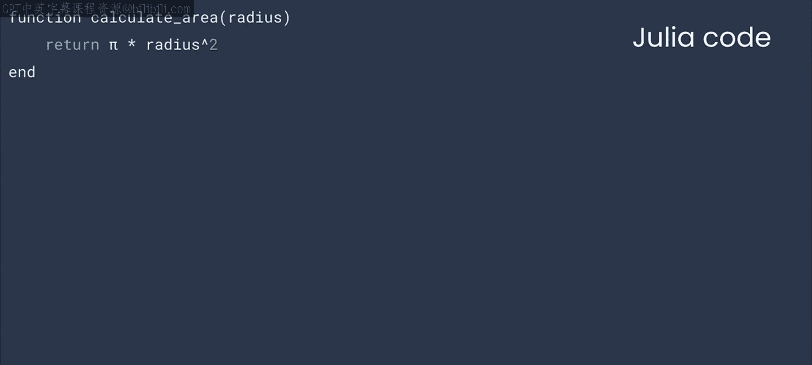
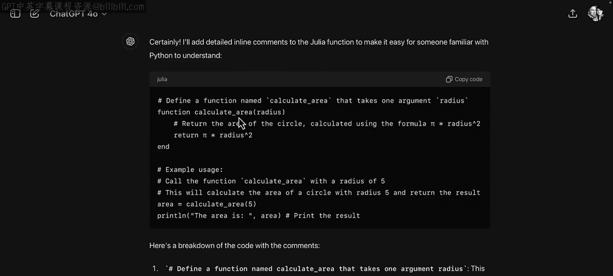
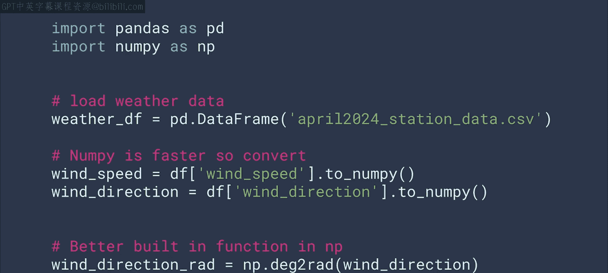
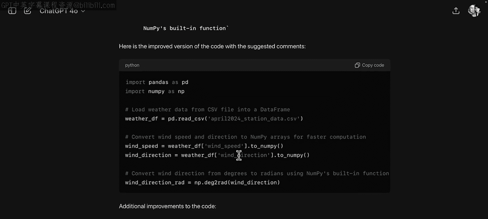

# 37：12_内联注释 📝



在本节课中，我们将要学习内联注释——代码文档最基本的形式，并探讨如何利用大语言模型来编写、优化和理解内联注释，从而提升代码的可读性和可维护性。

## 什么是内联注释？ 🤔





内联注释是代码文档中最基础的形式。它们是简短的注释，用于解释单行代码或整个代码块的功能。

你可能从编程初期就开始编写这类注释，但你是否曾花时间深入思考过如何编写和使用它们？例如，你可能会在编码时使用内联注释为自己做笔记，以便记住正在做什么或为何选择某个特定的库或模块。然而，这类注释可能难以被他人理解。



因此，请尝试应用上一节视频中提到的优秀文档原则，确保你的内联注释不仅对今天的你有用，也对未来可能需要处理你代码的队友或他人有价值。

## 利用LLM编写内联注释 🛠️

上一节我们介绍了优秀文档的原则，本节中我们来看看大语言模型如何帮助你写好内联注释。

在使用LLM作为结对编程伙伴时，你可能已经注意到，模型在建议代码时经常会编写有用的内联注释。这非常有帮助。当然，你可以通过在提示词中提供更多上下文信息，来引导LLM以对你的项目最有用的方式编写注释。

以下是你可以尝试的几种指导方式：

*   **针对不同受众调整注释**：你可以要求模型根据不同的使用场景或受众来修改其编写内联注释的方式。
*   **为现有代码添加注释**：LLM非常擅长为文档不全的现有代码编写注释。模型在训练中形成的人工智能理解能力，使其能够阅读代码、理解其意图，然后添加注释来帮助你理解代码在做什么。

## 实践：为代码添加注释 💻

现在轮到你了。我将提供一些代码，你可以使用ChatGPT来生成内联注释。



**示例一：Python冒泡排序函数**
```python
def sort_list(arr):
    n = len(arr)
    for i in range(n):
        for j in range(0, n-i-1):
            if arr[j] > arr[j+1]:
                arr[j], arr[j+1] = arr[j+1], arr[j]
    return arr
```
暂停视频，尝试使用ChatGPT为此函数添加注释。



效果如何？你觉得模型的建议怎么样？从函数名可以看出这是一个冒泡排序。虽然ChatGPT的内联注释可能没有明确指出这是冒泡排序（它只是逐行注释），但它仍然意识到这是用于排序的代码。这很酷。鉴于它理解了这一点，我现在对生成的注释更有信心了。也许你的体验相同，或者在你的案例中，它甚至识别出了这是冒泡排序。

在学习本课程时，请留意这些细节。看到LLM智能地解析事物总是很有趣的。

## 利用LLM优化现有注释 ✨

最后，我认为LLM还可以通过批判你编写的任何注释并提供改进建议，来帮助你处理内联注释。

让我们回到本节视频前面的一个例子：计算风速的代码。以下是包含一些略显模糊的内联注释的代码。

```python
def calculate_wind_speed(pressure_gradient, density):
    # 计算风速
    wind_speed = (pressure_gradient / density) ** 0.5
    return wind_speed # 返回结果
```



在此处暂停视频，并要求LLM对这段代码中的注释给出反馈。你可以尝试不同的提示词变体，甚至可以提及你在本模块中学到的优秀文档原则，看看LLM会提供什么建议。

以下是我的发现：
模型在这里提出了一些很好的建议。它为注释增加了正式性和清晰度，这将使这些注释对其他人或六个月后重新查看代码的你更有用。它还给出了一些非常有帮助的通用改进意见。当然，它返回了已实施建议并准备使用的新代码。



## 总结 📋

本节课中我们一起学习了内联注释。尽管内联注释是编码的基本元素，很容易被忽视，但正如你所见，它们能极大地影响代码质量。你已经看到了几种与LLM合作改进这些注释的不同方法，这既快捷又简单。

因此，在未来的开发中，你可以始终确保你的内联注释能够提升代码质量。在下一个视频中，你将探索一种更复杂、更形式化的注释形式：文档注释。我们下节课见。