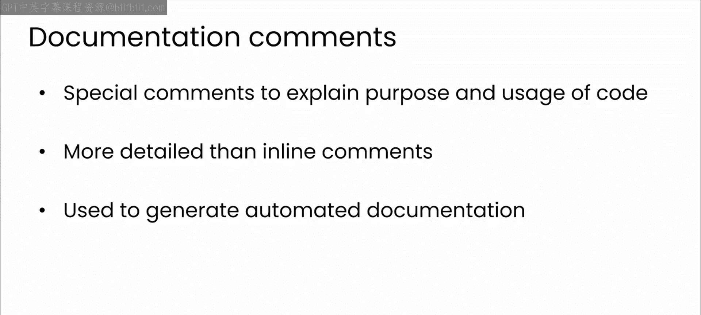
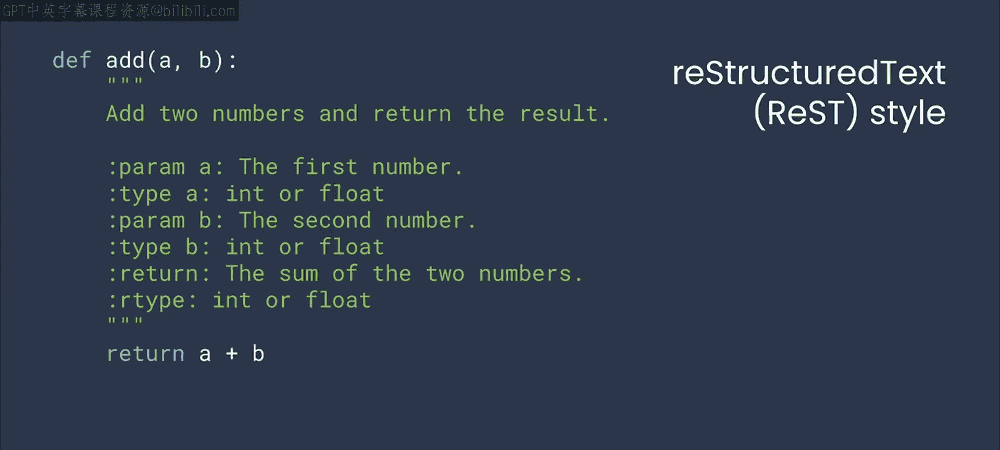
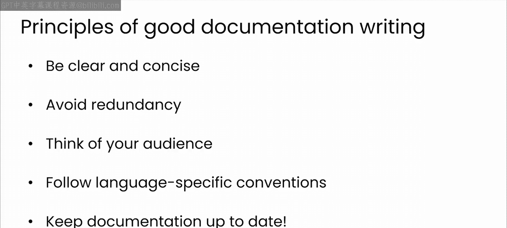
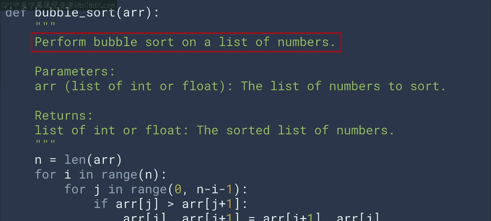
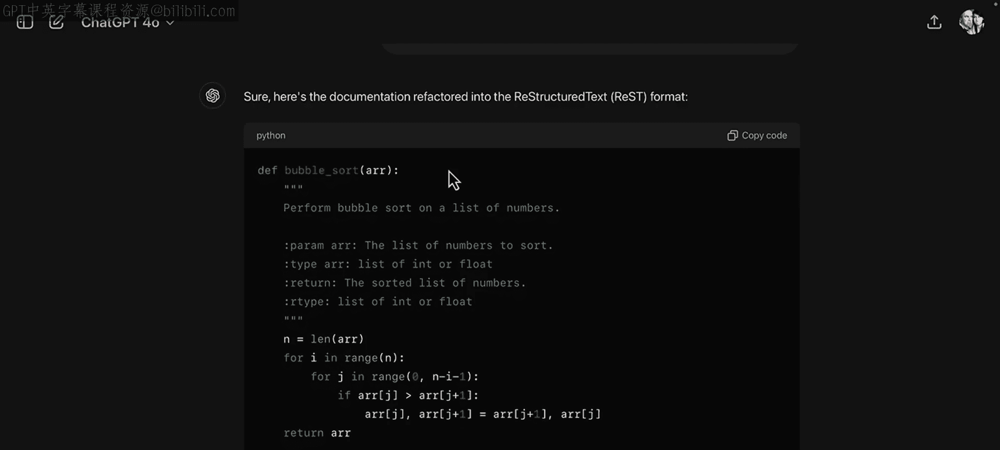

# 38：13_文档注释

在本节课中，我们将要学习文档注释的概念、重要性，以及如何利用大型语言模型高效地生成和重构Python文档字符串。

## 概述

上一节我们介绍了行内注释，本节中我们来看看文档注释。行内注释有助于澄清代码逻辑，使其更易于理解，但它们并不适用于全面的文档需求，这正是文档注释的用武之地。

文档注释，也称为文档字符串，是一种特殊的注释，用于详细解释代码块的目的、参数和返回值。它们比常规的行内注释更详细、更结构化，并且在自动生成文档方面扮演着特殊角色。



## 什么是文档注释？

文档注释是帮助他人理解你代码的关键工具。编写良好的文档注释，可以帮助你的同事在不向你提出大量问题的情况下使用你的代码。在此方面与大型语言模型合作，可以节省你的时间，并确保你创建出尽可能好的文档注释。

大多数现代编程语言都内置支持或拥有社区公认的文档注释标准变体。以下是几个例子：

*   **JavaScript**：`/** ... */` 注释位于函数开始之前。
*   **Ruby**：注释以粉色文本显示。

在本视频中，我们将重点学习在Python中的实现，即文档字符串。以下是一个简单的例子：

```python
def calculate_area(length, width):
    """
    计算矩形的面积。

    参数:
        length (float): 矩形的长度。
        width (float): 矩形的宽度。

    返回:
        float: 矩形的面积。
    """
    return length * width
```

文档字符串是一个多行字符串，紧跟在函数定义之后，用于解释函数的目的、接受的输入参数以及返回的值。

## ython文档字符串的样式

Python的文档字符串可以遵循几种不同的样式约定，让我们看看每种样式的例子。

以下是几种主要的样式：

*   **Google风格**：设计为直接且易于阅读。上面展示的`calculate_area`函数示例就是Google风格。
*   **NumPy/SciPy风格**：与Google风格类似，但在参数和返回部分的格式上略有不同。
*   **reStructuredText风格**：通常与Sphinx等文档工具一起使用。这种样式看起来与前几种有很大不同，因为各项内容没有分成不同的章节。

## 使用LLM生成文档字符串



现在，让我们看看如何与大型语言模型合作，在Python中生成优秀的文档字符串。

对于文档注释而言，牢记良好文档的原则更为重要，因为它们更长、涉及更多组件，并且通常用于生成面向公众的文档。

### 1. 为函数自动生成文档字符串



使用大型语言模型可以节省你的时间，并确保整个代码库的一致性。与之前一样，你需要向ChatGPT提供一段代码，然后提示它为你生成一个文档字符串。

以下是你之前看到的`calculate_area`函数的Python实现，但没有文档字符串：

```python
def calculate_area(length, width):
    return length * width
```

请暂停视频，尝试与GPT合作，为这段代码生成一个文档字符串。

以下是我得到的一个示例结果。模型生成了一个描述函数功能的文档字符串，然后描述了其参数和返回值。看起来这次模型选择了使用Google风格，但如果我想要不同的格式，我可以要求模型进行更改。

### 2. 尝试更多代码

以下是另一段可以尝试的代码，请暂停视频并试一试。

```python
def greet(name):
    return f"Hello, 数据科学与人工智能笔记（一）!"
```

你得到了什么样的文档字符串？你对它满意吗？你还会尝试其他方法吗？或者看看是否可以使用提示词让它生成不同风格的文档字符串。我发现它通常默认为Google格式。你能覆盖这个默认设置吗？

### 3. 为特定受众生成文档字符串

以下是之前的冒泡排序代码，请再次暂停视频，尝试为此生成一个文档字符串。



```python
def sort_list(arr):
    n = len(arr)
    for i in range(n):
        for j in range(0, n-i-1):
            if arr[j] > arr[j+1]:
                arr[j], arr[j+1] = arr[j+1], arr[j]
    return arr
```

考虑为特定受众编写这个文档字符串，例如新手开发者或通常使用C++或Java编程的人。看看这会如何改变输出。有趣的是，这是我得到的结果。你注意到什么有趣的地方了吗？是的，你猜对了，它实际上识别出这是冒泡排序。

### 4. 使用LLM重构文档字符串

最后，尝试使用大型语言模型来重构文档字符串，让它将刚刚为冒泡排序生成的文档字符串改为reStructuredText风格。



以下是我的模型如何响应的。你可以看到它将信息重构为reStructuredText风格所需的结构。当你考虑为自动化文档生成工具准备代码时，这种重构能力非常有用。大型语言模型在这里可以真正节省时间，并帮助你避免可能影响文档质量和生成时间的错误。

## 总结

本节课中我们一起学习了文档注释的核心概念及其重要性。我们了解了Python中几种主要的文档字符串样式，并重点实践了如何利用大型语言模型来自动生成、优化和重构文档字符串，特别是为了适配像Sphinx这样的自动文档生成工具。现在你已经知道如何获取格式正确的Python文档字符串，下一节我们将学习如何在这些工具的帮助下，利用大型语言模型创建漂亮的文档页面。