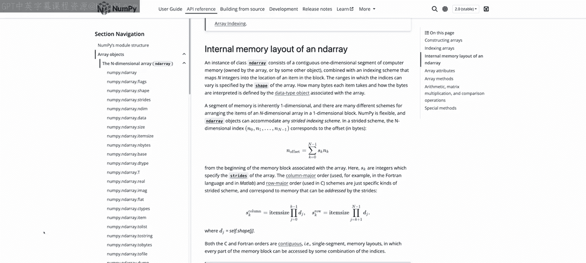
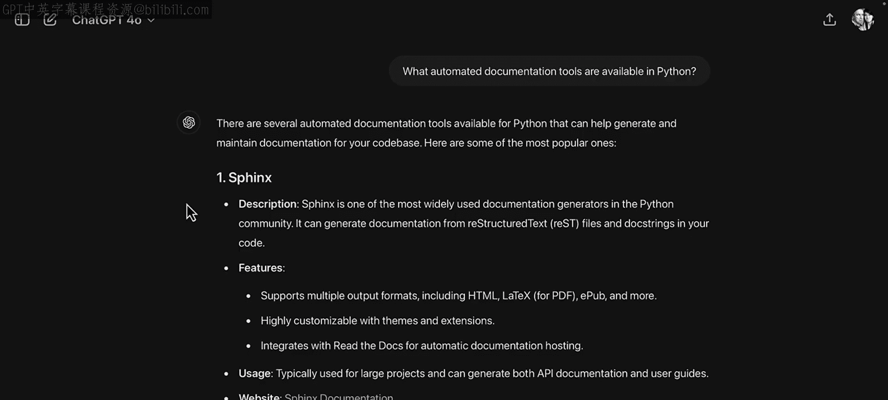
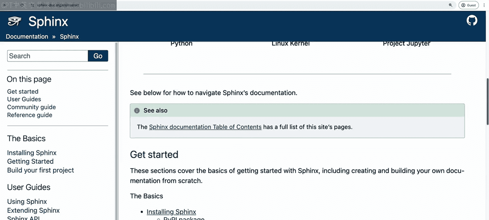
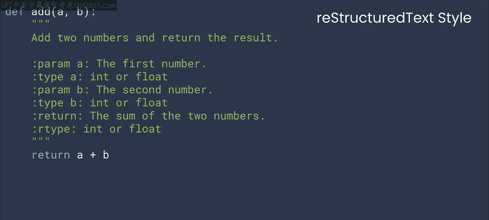
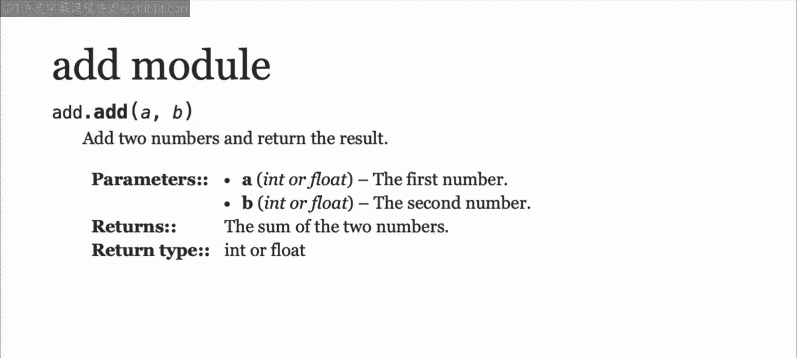
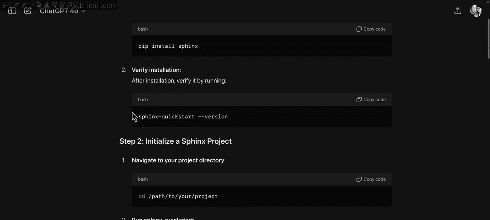
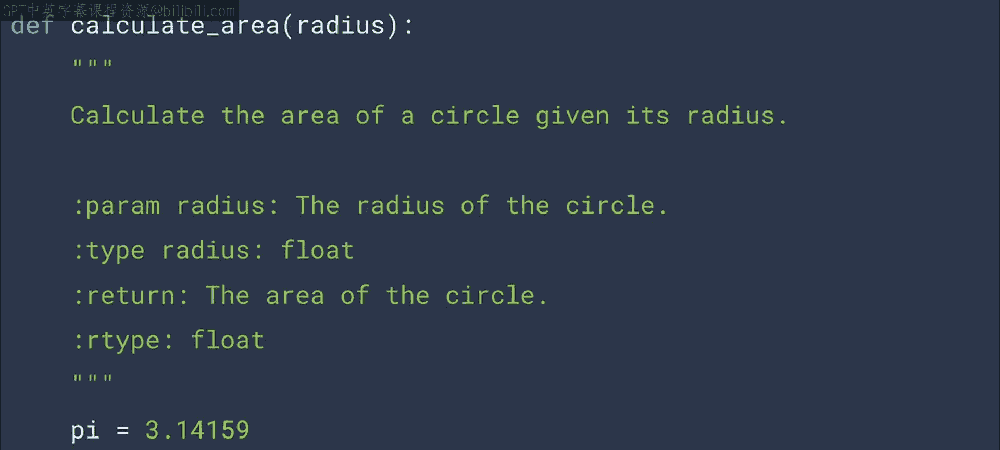
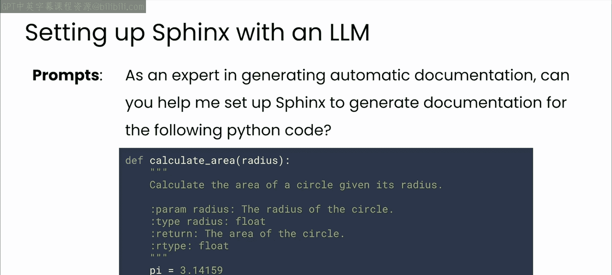
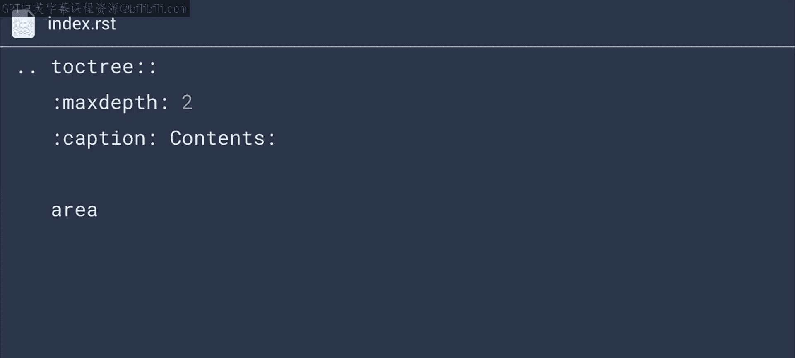
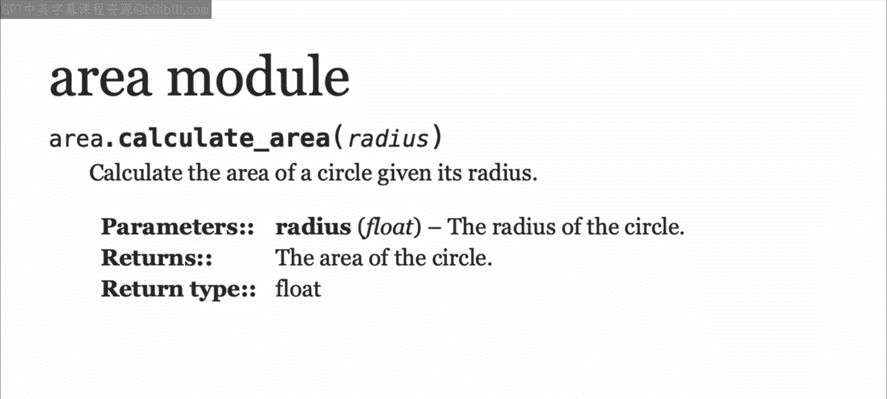

# 39：自动化文档工具 📄

在本节课中，我们将学习如何利用自动化工具，将代码中的文档注释（Docstrings）转化为美观、专业的文档页面。这能极大地帮助你的同事和用户理解并使用你的代码。

## 概述

代码中的文档注释是帮助他人理解并成功使用你代码的重要工具。然而，直接阅读这些注释字符串可能并不方便。幸运的是，存在一些工具可以将代码中的文档注释转化为易于浏览的文档页面。如果你不熟悉这些工具，或者不知道如何安装和使用它们，你可以随时向你的大语言模型（LLM）助手寻求帮助。



## 选择合适的文档工具 🛠️

上一节我们提到了LLM可以帮助你了解文档工具。当你向LLM咨询时，它会为你推荐一些选项，甚至指导你如何设置它们。



对于Python语言，**Sphinx**是最全面且使用最广泛的文档生成工具。接下来，让我们深入了解Sphinx。

## 深入了解Sphinx 📖



Sphinx是Python社区中用于生成文档的工具。它可以将reStructuredText格式的文档字符串转换为HTML、PDF等多种格式，是开发者创建专业文档的必备工具。



Sphinx最初是为Python编程语言本身生成文档而创建的，但其功能非常通用，可以用于任何项目。它读取你的reStructuredText文件和文档字符串，并将它们整合成一个连贯的文档网站。Sphinx能够输出多种格式，包括HTML、Windows帮助文件、LaTeX、EPub等等。

## 安装与设置Sphinx ⚙️



要开始使用Sphinx，你需要先进行安装和设置。这同样是LLM可以协助你的任务。

如果你向模型咨询如何安装和设置Sphinx，它会为你提供一步一步的安装指导。你可以提供你正在运行的系统等上下文信息，以获得最适合你特定环境的指令。



以下是安装和初始化的基本步骤：

1.  **安装Sphinx**：第一步非常简单，你可以使用pip进行安装。
    ```bash
    pip install sphinx
    ```
    请注意，如果你想跟着操作，最好在你自己的开发环境中进行。

2.  **初始化Sphinx项目**：安装完成后，运行Sphinx快速启动命令来建立一个新的Sphinx项目。
    ```bash
    sphinx-quickstart
    ```
    该脚本会问你一些问题，通常你可以直接接受默认选项，或者至少给出合理的回答。不过，我通常会覆盖“将源代码和文档放在同一目录”的默认设置，我喜欢将它们分开存放。我将在后续的截屏演示中展示我的做法。

完成这些步骤后，你就得到了一个非常基础的Sphinx安装，并且看到了快速启动脚本是如何为你编译出一个网站的。

## 生成文档内容并与Sphinx集成 🔄

接下来，你将编写一些真实的代码，与ChatGPT合作生成文档字符串，然后学习如何确保它能与Sphinx配合生成新的文档。

让我们从一段基础代码开始，比如之前视频中用到的计算圆面积的函数。

首先，与LLM合作，为这个函数编写一个reStructuredText格式的文档字符串。你可以尝试赋予它不同的角色或给出不同的指令，直到得到类似下面这样的文档字符串。

```python
def area_of_circle(radius):
    """
    Calculate the area of a circle.

    :param radius: The radius of the circle.
    :type radius: float
    :return: The area of the circle.
    :rtype: float

    Example:
        >>> area_of_circle(5)
        78.53981633974483
    """
    return 3.141592653589793 * radius * radius
```
如你所见，注释中的文本清晰明了，并且结构遵循reStructuredText格式，非常适合与Sphinx集成。

此时，你需要一点关于Sphinx的专业知识才能充分发挥其功能。但如果你不具备这些知识，与你喜欢的LLM合作仍然可以让你快速上手并运行。



以下所有的配置代码和指令都是由GPT在被告知它是自动生成文档的专家后，为我提供的。我随后向它提供了我的代码，并请它帮助我设置Sphinx。

## 配置Sphinx项目 ⚙️

Sphinx使用一个名为`conf.py`的Python配置文件来设置一切。你需要向这个文件添加代码，告诉它你的源代码在哪里。



以下是我在一个名为`sphinx_test`的Colab目录中使用的配置（我稍后会在截屏中展示）：
```python
import os
import sys
sys.path.insert(0, os.path.abspath('.'))
```
根据你放置源代码目录的位置，这里的路径可能会有所不同。

仍然在`conf.py`文件中，你可能会看到`extensions`被设置为一个空列表。如果是这种情况，使用这行代码：
```python
extensions = ['sphinx.ext.autodoc']
```
如果里面已经有内容了，不要覆盖它，但要添加一个包含`sphinx.ext.autodoc`的字符串。

对于之前的Python代码，我刚刚在源代码目录中创建了一个名为`area.py`的Python文件。但除此之外，你还需要另一个扩展名为`.rst`的文件，它看起来像这样：
```
area
====

.. automodule:: area
   :members:
   :undoc-members:
   :show-inheritance:
```
Sphinx使用这个文件来确定在生成文档时要深入到文档字符串的哪个层级。

然后，名为`index.rst`的主RST文件需要更新，以包含你刚刚创建的`area`模块。
```
Welcome to Sphinx Test's documentation!
=======================================

.. toctree::
   :maxdepth: 2
   :caption: Contents:

   area
```

## 生成最终文档 🎉



一旦配置完成，你只需调用类似`make html`的命令，Sphinx就会将你所有的代码编译成文档。我们编写的`area`模块的文档看起来应该有点像这样（一个结构清晰的HTML页面，展示了函数签名、参数说明和示例）。

我知道我刚才讲得很快，所以请加入下一节视频，我将一步一步带你完成整个过程。



## 总结


本节课中，我们一起学习了如何利用大语言模型（LLM）辅助选择和设置自动化文档工具。我们重点介绍了Python社区最流行的工具——Sphinx，了解了它的基本功能，并学习了从安装、配置到生成文档页面的核心步骤。通过将清晰的reStructuredText格式的文档注释与Sphinx结合，你可以轻松地为你的代码创建专业、易读的文档。