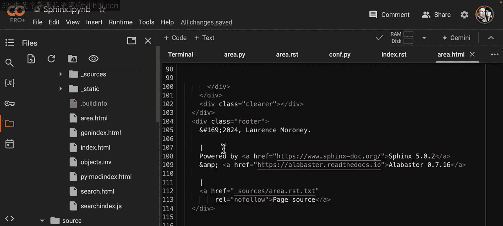
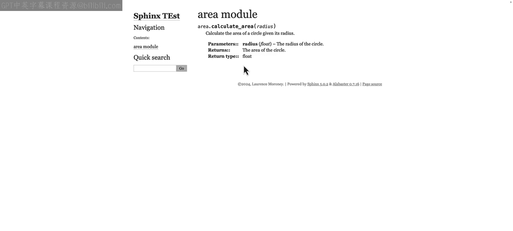

# 40：使用Sphinx进行自动文档生成演练（可选）📄


在本节课中，我们将学习如何使用Sphinx工具为Python代码自动生成文档。我们将从零开始，在一个新的目录中配置Sphinx，并为一个简单的计算面积的Python模块生成完整的HTML格式文档。

## 概述

我们将通过一系列步骤，演示如何设置Sphinx环境、准备源代码和配置文件，并最终生成可读的文档。这个过程展示了如何利用工具自动化文档编写，这对于大型项目尤其有用。

## 环境准备与初始化

首先，我们需要在Google Colab环境中启动一个终端，并创建一个新的工作目录。

以下是具体步骤：

1.  在Colab左侧边栏中，找到并点击“终端”选项卡，打开命令行界面。
2.  在终端中，使用 `mkdir` 命令创建一个名为 `sphinx_test` 的新目录。
    ```bash
    mkdir sphinx_test
    ```
3.  使用 `cd` 命令切换到新创建的目录。
    ```bash
    cd sphinx_test
    ```

## 运行Sphinx快速启动

进入目录后，我们运行Sphinx的快速启动命令来初始化项目配置。

以下是Sphinx初始化过程中的关键配置选项：

*   **分离源目录和构建目录**：选择“是”，这有助于保持项目结构清晰。
*   **项目名称**：输入 `sphinx_test`。
*   **作者名称**：输入你自己的名字。
*   **项目版本**：可以留空或根据需求填写。
*   **项目语言**：保持默认的“英语”。

运行以下命令开始初始化：
```bash
sphinx-quickstart
```
按照终端中的提示依次回答上述问题。完成后，Sphinx会在当前目录生成必要的配置文件。

## 准备源代码文件

上一节我们初始化了Sphinx项目，本节中我们来看看需要被生成文档的源代码。

我们需要在 `source` 目录下创建一个Python文件。这个文件包含一个计算面积的函数。

1.  在文件视图中，进入 `source` 目录。
2.  创建一个名为 `area.py` 的新文件。
3.  将以下代码粘贴到文件中并保存：
    ```python
    def calculate_area(length, width):
        """
        Calculate the area of a rectangle.

        :param length: The length of the rectangle.
        :type length: float
        :param width: The width of the rectangle.
        :type width: float
        :return: The area of the rectangle.
        :rtype: float
        """
        area = length * width
        return area
    ```

## 创建文档源文件

接下来，我们需要创建一个 `.rst` 文件，这是Sphinx用来生成文档的源文件。

1.  在 `source` 目录下，创建一个名为 `area.rst` 的新文件。
2.  将以下内容粘贴到文件中：
    ```
    Area Module
    ===========

    .. automodule:: area
       :members:
       :undoc-members:
       :show-inheritance:
    ```
    这个文件指示Sphinx自动为 `area` 模块生成文档，包括其所有成员。

## 配置 `conf.py` 文件

现在，我们需要修改Sphinx的主配置文件 `conf.py`，以正确设置路径并启用自动文档扩展。

以下是需要修改的关键部分：

1.  打开 `source/conf.py` 文件。
2.  找到被注释掉的 `sys.path` 设置行，取消注释并将其修改为当前项目在Colab中的绝对路径。例如：
    ```python
    sys.path.insert(0, os.path.abspath('/content/sphinx_test/source'))
    ```
3.  在 `extensions` 列表中添加Sphinx的自动文档扩展：
    ```python
    extensions = ['sphinx.ext.autodoc']
    ```
4.  保存文件。

## 更新索引文件

为了让新模块出现在文档的索引中，我们需要修改 `index.rst` 文件。



1.  打开 `source/index.rst` 文件。
2.  在 `toctree` 指令下，添加对 `area` 模块的引用。确保缩进正确：
    ```
    .. toctree::
       :maxdepth: 2
       :caption: Contents:

       area
    ```
3.  保存文件。

## 生成HTML文档

所有配置完成后，我们可以使用Sphinx生成最终的HTML文档。



1.  回到终端，确保当前目录在 `sphinx_test` 中。
2.  运行以下命令来构建HTML文档：
    ```bash
    make html
    ```
3.  如果一切顺利，Sphinx会成功编译，并在 `build/html` 目录下生成HTML文件。你可以通过文件浏览器找到 `area.html` 并查看生成的文档。

生成的文档将清晰展示 `area` 模块中 `calculate_area` 函数的详细信息，包括参数说明和返回值类型。

## 总结

本节课中我们一起学习了使用Sphinx为Python代码自动生成文档的完整流程。我们从环境初始化开始，逐步完成了创建源代码、编写文档配置文件、调整项目设置，并最终生成了可浏览的HTML文档。掌握这项技能能帮助你为任何规模的Python项目快速创建专业、整洁的文档，极大地提升代码的可维护性和团队协作效率。虽然本次演示以Python为例，但相同的原则也适用于其他编程语言和文档工具。