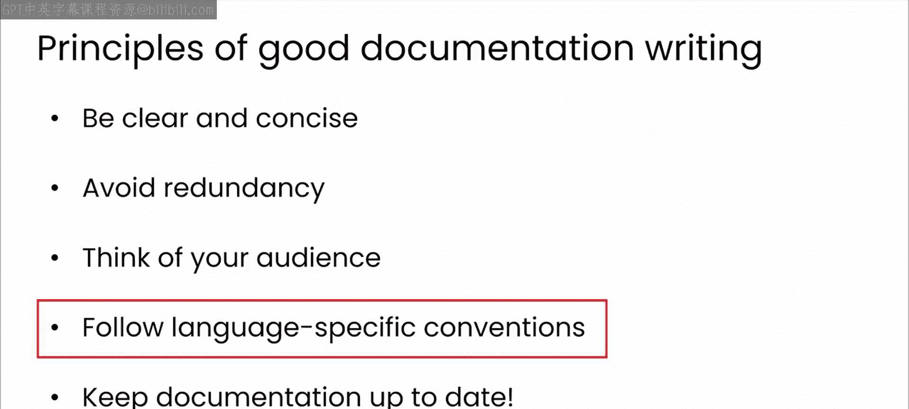
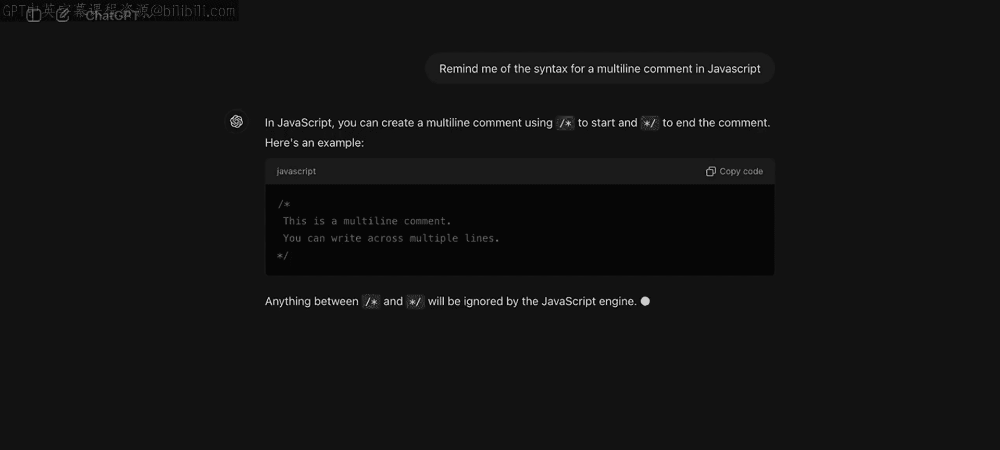
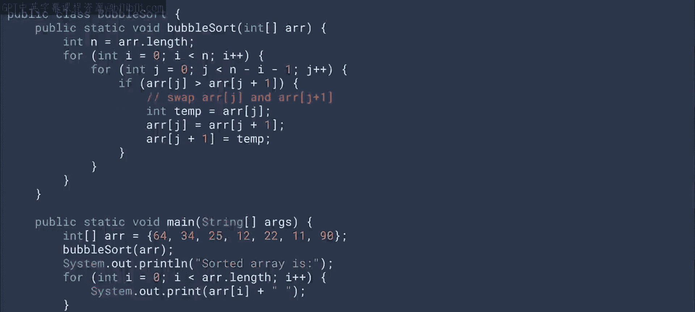
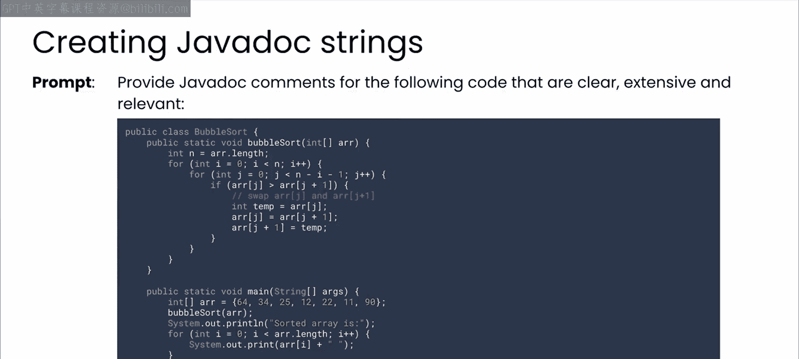
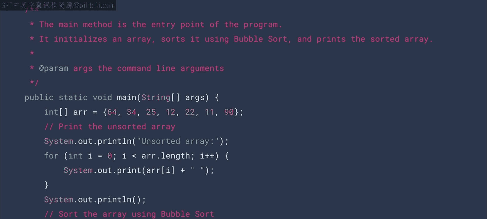
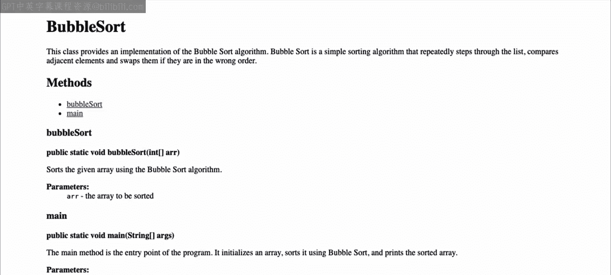
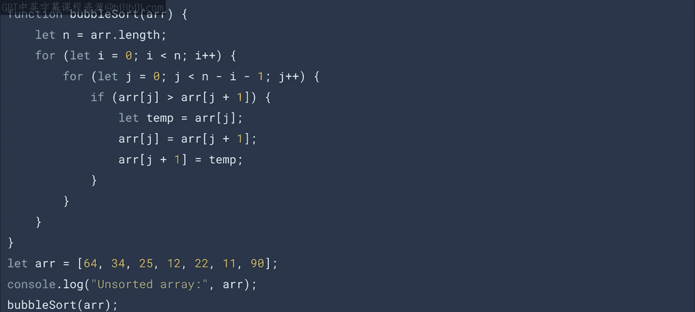
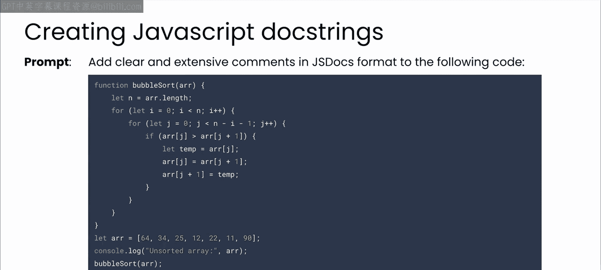
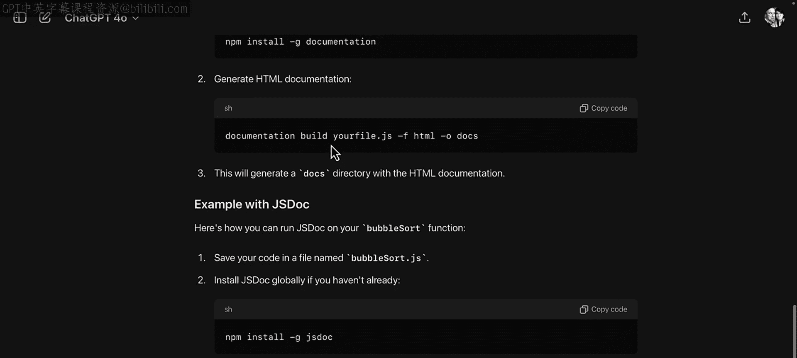
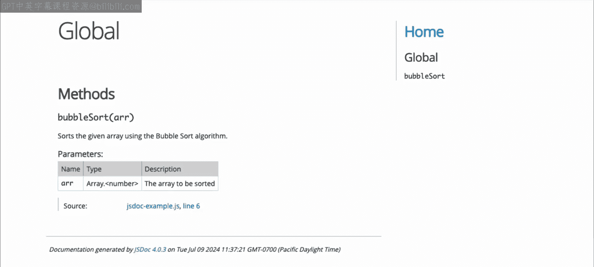

# 41：16_其他编程语言中的文档 📝

在本节课中，我们将学习大型语言模型如何帮助您为不同编程语言编写清晰、结构良好的文档。我们将探讨不同语言在文档风格和工具上的差异，并通过具体示例展示LLM如何辅助生成符合特定语言规范的文档。

## 概述

在前面的模块中，我们探索了LLM如何帮助编写有用且结构良好的文档。从简短的内联注释到软件库或SDK的更广泛文档，您已经了解了LLM如何格式化您的注释字符串，以确保其可读性、清晰度，并便于自动化工具处理。虽然Python是本课程的工作语言，但您所学习的良好文档原则在很大程度上也适用于其他语言，只要您考虑到任何特定于语言的约定。

## 语言间的差异与最佳实践



上一节我们介绍了文档的基本原则，本节中我们来看看不同编程语言在文档实践上的具体差异。



最佳实践确实因语言而异，而LLM始终可以帮助您了解这些差异。

一个明显的区别在于常见的语法。LLM可以帮助您确保为您正在使用的任何语言正确使用语法。

注释的数量也各不相同。例如，某些语言在其编码风格上本身就更具教学性。Python以及Ruby、Go实际上是很好的例子。因此，注释可以更简洁，因为代码本身如果写得好，就能解释正在发生的事情。其他语言如Java、C#、PHP，其文档和注释往往更加正式和冗长，需要遵循明确定义的结构。

在自动化文档方面，一些语言对此有很好的内置支持，而其他语言则可以依赖第三方工具。像C和Fortran这样的旧语言则几乎没有这方面的支持。同样，LLM可以帮助您应对这些差异，并就使用的工具提供建议。

## 使用LLM优化其他语言的文档

以下是使用LLM优化其他语言文档的几个示例。

### Java文档示例

让我们从Java开始。如果您熟悉Java，它有一种称为JavaDoc的格式，用于自动生成文档。



这是与之前视频中Python版本相同的冒泡排序算法的一些Java代码。您可以立即看出这段代码比Python版本更难阅读。



```java
public class BubbleSort {
    public static void sort(int[] arr) {
        int n = arr.length;
        for (int i = 0; i < n-1; i++) {
            for (int j = 0; j < n-i-1; j++) {
                if (arr[j] > arr[j+1]) {
                    int temp = arr[j];
                    arr[j] = arr[j+1];
                    arr[j+1] = temp;
                }
            }
        }
    }
}
```

使用提示词“提供清晰、详尽且相关的JavaDoc注释”，可以得到以下代码。您可以立即看到这里的注释是多么详细。

首先，对于函数本身，其注释太长，无法全部放在一张幻灯片上，但您可以看到JavaDoc是如何完成的。模型足够智能，可以从其内容推断出这是一个冒泡排序算法。



同样，它为main函数创建了JavaDoc，描述了它的功能。

```java
/**
 * 该类实现了冒泡排序算法。
 */
public class BubbleSort {
    /**
     * 使用冒泡排序算法对整数数组进行升序排序。
     * 该算法重复遍历数组，比较相邻元素并在顺序错误时交换它们。
     * 每次遍历后，最大的未排序元素会“冒泡”到其正确位置。
     *
     * @param arr 要排序的整数数组。该数组将被原地修改。
     */
    public static void sort(int[] arr) {
        // ... 排序逻辑
    }
}
```

如果您熟悉Java SDK，它附带了一个JavaDoc工具，该工具可以读取您的源代码，获取这些注释，并将它们转换为HTML。这是从这些注释生成的示例页面。



因此，使用LLM可以真正减少生成这些文档的摩擦。它们通常需要非常特定的格式，并且需要大量试错才能使其完全正确，而LLM确实可以加快这一过程。

### JavaScript文档示例

JavaScript是另一种具有良好形式化文档字符串格式的语言，它称为JSDoc语法。让我们看一个例子。



这是用于冒泡排序数组的JavaScript代码，与其他语言非常相似，只是语法不同。



```javascript
function bubbleSort(arr) {
    let n = arr.length;
    for (let i = 0; i < n-1; i++) {
        for (let j = 0; j < n-i-1; j++) {
            if (arr[j] > arr[j+1]) {
                let temp = arr[j];
                arr[j] = arr[j+1];
                arr[j+1] = temp;
            }
        }
    }
    return arr;
}
```

现在，让我们要求LLM使用类似“添加清晰、详尽的注释和JSDoc到代码中”的提示词。

模型将给出看起来与此类似的输出。

注释的结构与JavaDoc中的非常相似。现在，就像Python一样，有多种工具可用于获取代码中的注释并使用它们生成文档页面。



您可能已经知道这些工具，但如果您不知道，只需向LLM询问想法即可。

我得到了几个工具建议，并决定尝试JSDoc工具。您可以使用Node包管理器NPM在开发环境中安装此工具。

我们将在下一个模块中更详细地讨论NPM，但现在，我将把它留作一个练习，让您自己研究如何安装JSDoc工具。向LLM询问是一个很好的起点。

如果您使用Node用户可用的JSDoc工具，可以快速将JavaScript代码转换为文档。这是为我们刚刚查看的冒泡排序生成的页面。



实际上，它提供的不仅仅是一个页面。它提供了一个完整的站点，带有指向源代码的深层链接，因此您可以看到各个函数的位置。这非常酷。

## 总结

本节课中我们一起学习了LLM如何成为编写清晰、结构良好的注释和文档的有用伙伴。它们还可以帮助您识别和使用能够在许多不同语言中生成美观文档的工具。所有这些都将帮助其他人快速上手您的代码。

在下一个视频中，我们将通过讨论良好、最新的文档的最后一个好处来结束本章，那就是它有助于使您的代码在生产环境中更易于维护。我们那里见。