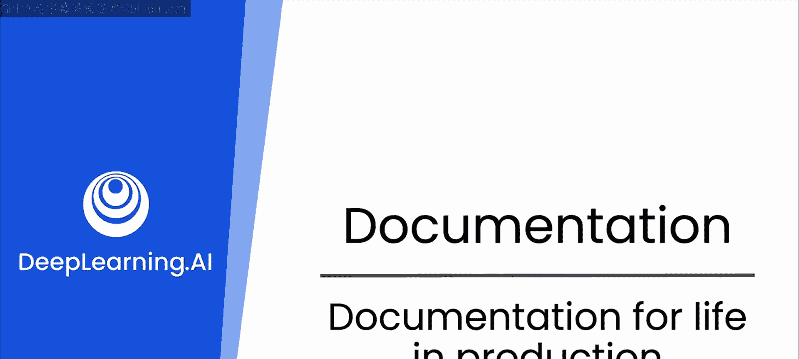
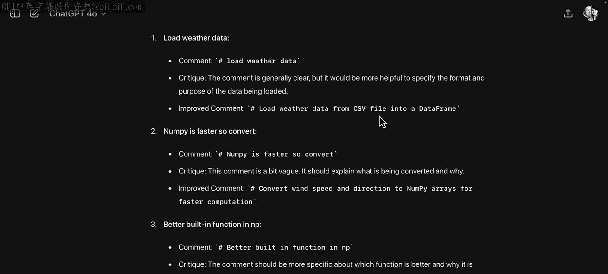
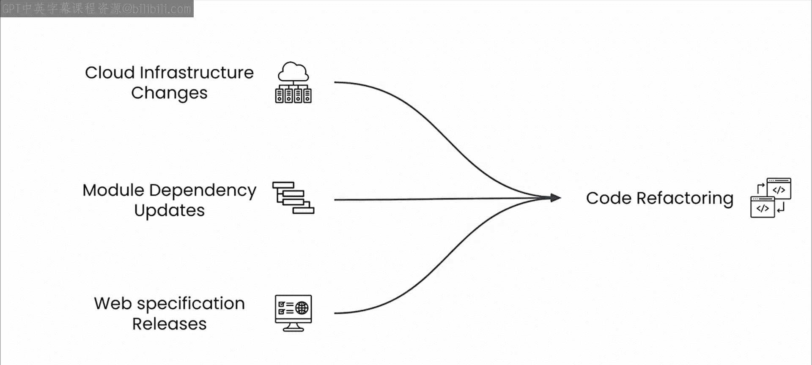

# 42：17_生产环境中的文档

在本节课中，我们将探讨优秀文档在生产环境中的关键作用。我们将了解清晰的文档如何提升代码的可维护性、加速问题修复，并帮助团队高效协作。最后，我们会简要介绍大语言模型在管理依赖项方面的潜力。

## 📝 模块回顾与文档价值

在本模块中，我们深入探讨了文档的各个方面。好的文档能够彻底改变你的代码质量。

从简短的内联注释到精心编写的文档字符串，这些注释都能帮助你构建详尽的文档页面。注释使你的代码更易于阅读和理解。

希望你现在已经确信，以大语言模型作为文档伙伴，可以快速有效地完成这项关键工作。有了大语言模型的帮助，就没有理由再写出糟糕的文档。

## 🚀 优秀文档的生产环境优势

接下来，我们重点强调优秀文档的最后一个关键好处：它能极大地帮助你的代码在生产环境中良好运行。

如果你的代码具备良好的可读性，并通过优秀的文档字符串和注释进行了解释，那么它将更容易维护。你的工程团队能够快速理解代码的功能，从而实现更快的错误修复和更新。

对于技术支持或开发者关系等教育角色的同事来说，你编写良好的文档会让他们更容易学会如何使用你的代码，并让用户对其产生兴趣。

众所周知，代码就像有生命的事物，因为它所处的生态系统（如云基础设施、模块依赖项、网络规范等）在不断变化。一旦投入生产，你的代码很可能需要频繁重构，以适应这些不断变化的依赖关系。

## 🔧 文档与依赖管理

好的文档将使这个过程对你以及任何使用你代码的人都更加顺畅。

事实上，在处理依赖项相关的问题时，大语言模型非常有用，例如包版本控制、库依赖等。而这正是本课程最后一个模块的重点。

因此，让我们进入下一个视频，开始探索如何利用大语言模型进行依赖项管理。

## ✅ 总结

本节课我们一起学习了优秀文档在生产环境中的重要性。我们了解到，清晰的文档能提升代码可维护性、促进团队协作，并为应对不断变化的技术依赖打下坚实基础。在接下来的课程中，我们将深入探讨大语言模型在依赖管理方面的具体应用。