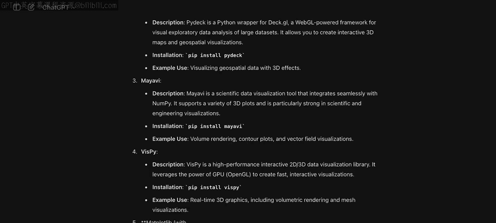
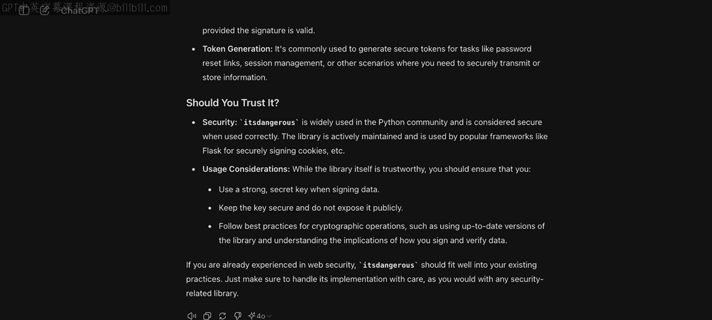
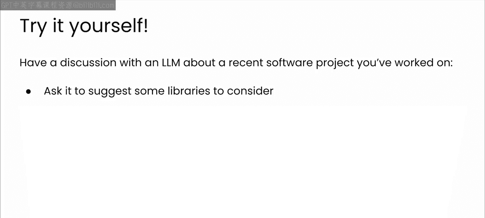
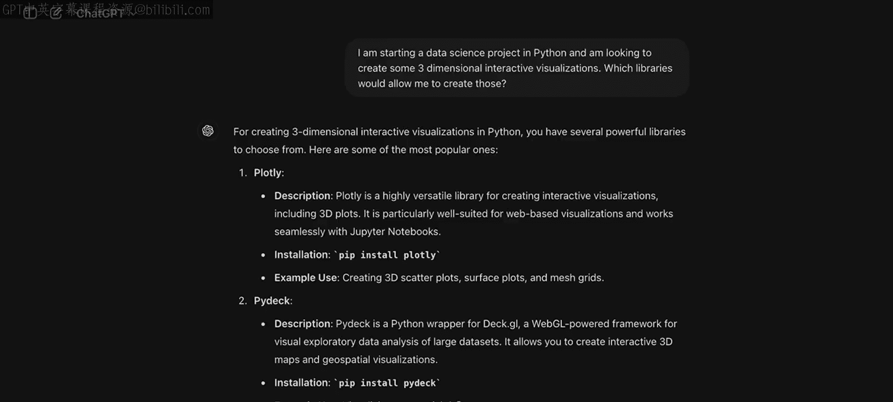
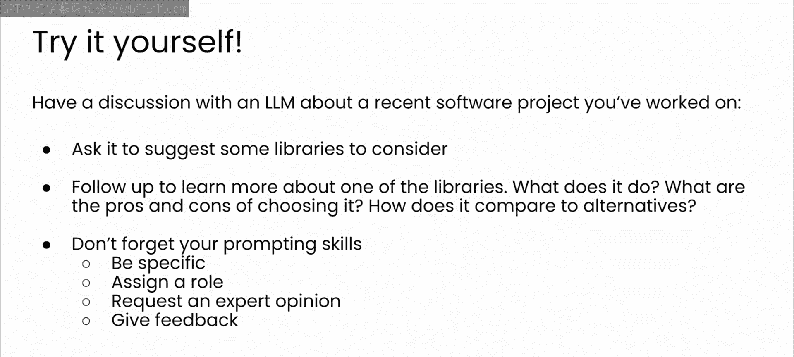

# 43：依赖管理模块介绍 🧩

## 概述

在本节课中，我们将要学习现代软件开发中一个至关重要的环节：依赖管理。我们将了解什么是依赖，它们带来的好处与挑战，并重点探讨大型语言模型（LLM）如何帮助我们更有效地选择、学习和处理项目中的依赖关系。

现代软件开发依赖于一系列令人眼花缭乱的依赖项，从Web开发到机器学习，再到网络和基础设施。很可能，如果你正在处理某项任务，总会有现成的库或框架来帮助你完成工作。

## 什么是依赖？

上一节我们提到了依赖的普遍性，本节中我们来看看依赖的具体定义。

简单来说，依赖是你的项目为了正常运行所依赖的库或模块。依赖至关重要，因为它们允许我们利用现有的代码、框架和工具来更快、更高效地构建自己的应用程序。

以下是依赖的主要类型：
*   **内部依赖**：你自己编写并存在于项目内部的模块或包。
*   **外部依赖**：你引入项目中的第三方库。

例如，如果你是一名开发Web应用的Python开发者，你可能会使用Flask或Django作为Web框架。如果你在进行数据分析，你可能会依赖NumPy或Pandas这样的库。

## 依赖带来的挑战

虽然依赖是强大的工具，但它们也会带来不少麻烦。了解这些挑战是有效管理依赖的第一步。

以下是依赖管理中的常见挑战：
1.  **版本冲突**：当不同的依赖项需要同一库的不同版本时发生。例如，应用程序的一部分可能使用某流行库的2.0版本，而另一部分仍在使用1.0版本。这会导致兼容性问题和应用程序错误。
    *   `库A` -> 需要 `common-lib v2.0`
    *   `库B` -> 需要 `common-lib v1.0`
2.  **安全漏洞**：使用过时或未打补丁的库会使你的项目面临安全风险。如果某个依赖的1.0版本存在漏洞，整个应用程序都可能处于危险之中。
3.  **传递性依赖**：你引入的依赖项本身也可能有自己的依赖项。结果会形成一个复杂的传递性依赖网络，你需要管理这些依赖的行为、漏洞和更新。

## LLM如何助力依赖管理？

面对这些挑战，LLM可以成为一个巨大的帮助。在了解了问题之后，我们来看看解决方案。在课程第三个也是最后一个模块中，你将学习LLM如何在依赖管理的许多方面提供帮助，从最初选择要基于哪些依赖项构建，到了解新库的功能，再到管理依赖的常见挑战（如版本冲突和安全漏洞）。LLM可以帮助你和你的团队在构建软件项目所依赖的依赖项时做出更好的选择。

以下是LLM在依赖管理中的主要应用方式：

1.  **依赖选择与推荐**：LLM可以帮助你集思广益，为项目选择合适的库和包。例如，如果你想进行数据可视化，LLM可以告知你可选的方案，并帮助你为项目挑选最佳工具。你为模型提供的上下文越多，推荐结果就越符合你的需求。
2.  **依赖学习与理解**：LLM可以帮助你了解更多在工作中遇到的依赖项。例如，如果你发现项目使用了一个不熟悉的包，可以请LLM告诉你更多关于它的信息。虽然文档或在线论坛也有帮助，但与LLM的交互式对话通常能让你更具体地了解某个依赖是否是你的最佳选择。
3.  **识别依赖冲突**：LLM通常可以帮助发现依赖冲突。较新的模型擅长处理大量文本，你甚至可以直接将项目的依赖关系分享给模型，并要求它识别任何潜在的冲突。
4.  **解决依赖问题**：一旦识别出冲突，LLM可以帮助你着手解决。它们可能会建议不同的方法或替代库，以帮助你解决遇到的障碍。

## LLM的局限性

当然，你可能已经预见到LLM在此背景下的某些弱点。在利用其优势的同时，我们也必须认识到其局限。

以下是LLM在依赖管理中的主要弱点：
*   **信息时效性**：LLM对库或包的了解仅限于其训练数据截止日期之前的变化。某些模型可以通过联网搜索来增强其知识，但如果你使用的库更新极快，或处于快速发展领域，LLM可能无法知晓与你的项目最相关的最新变化。
*   **对冷门库支持有限**：LLM在提供对较冷门库的支持时，可能不那么有帮助或准确。LLM对某个主题的编码知识量取决于其在训练期间接触该主题文本的频率。如果你需要使用一个较冷门的库，模型产生不准确或“幻觉”代码片段的可能性会增加，因为它可能没有足够的数据来支撑其回答。

## 动手实践

在我们深入探讨每一种工作模式之前，我认为你自己尝试一下会很有帮助。

请与LLM讨论一个你最近正在进行的软件项目。让它推荐一些可以考虑的库，然后跟进以了解更多关于它推荐的某个库的信息。你可以选择一个你已经很了解的库，看看你是否同意它的结果；或者借此机会了解一个新库。请始终记住你一直在练习的提示技巧：提供上下文、给予反馈、分配角色、征求专家意见。

## 总结

本节课中我们一起学习了软件项目依赖管理的重要性与复杂性。依赖很有用，但也存在风险，因为你将项目的成功与其他人的工作绑定在一起，而这些通常是你没有直接合作、甚至可能从未见过的人。LLM可以成为一个有效的工具，帮助你谨慎地做出决策，并应对引入这些依赖所带来的复杂性。让我们从一个强大的工具——虚拟环境开始，它可以帮助你探索不同的依赖项，而不会对开发环境造成损害。