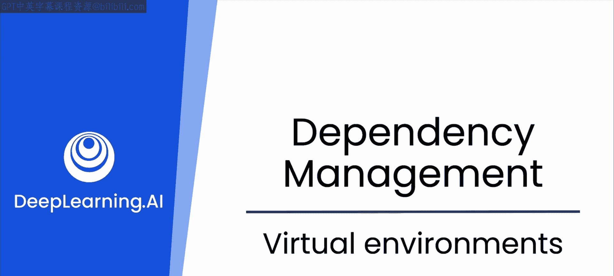
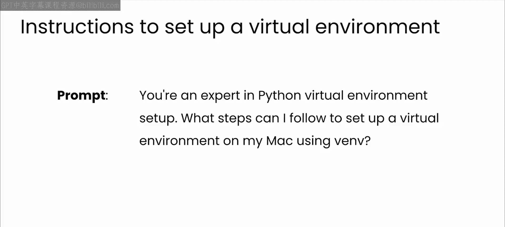
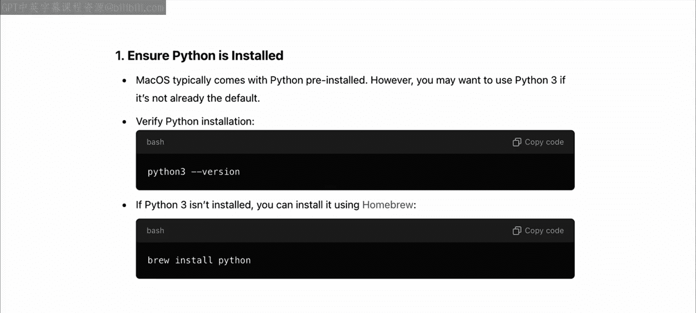
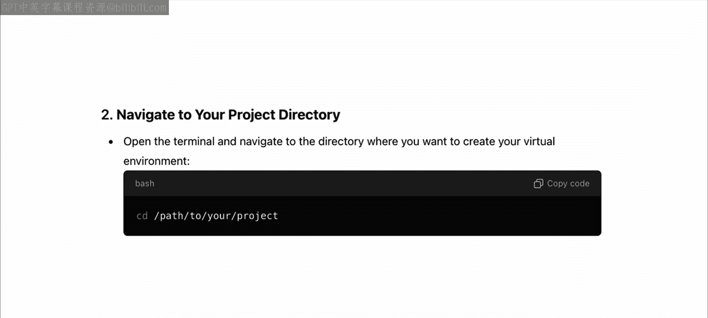
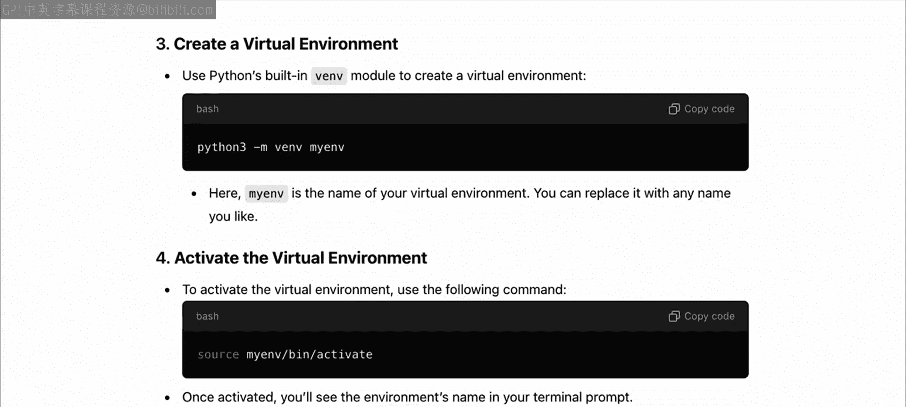
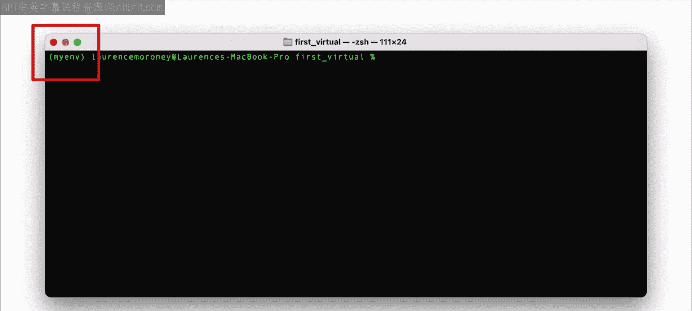
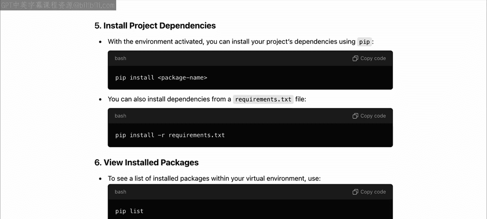
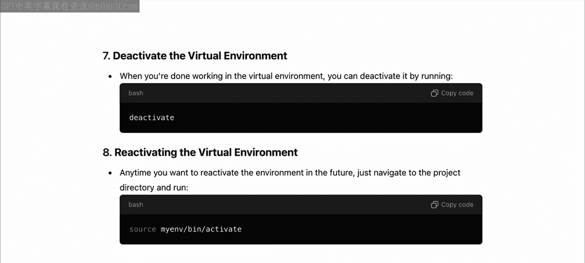
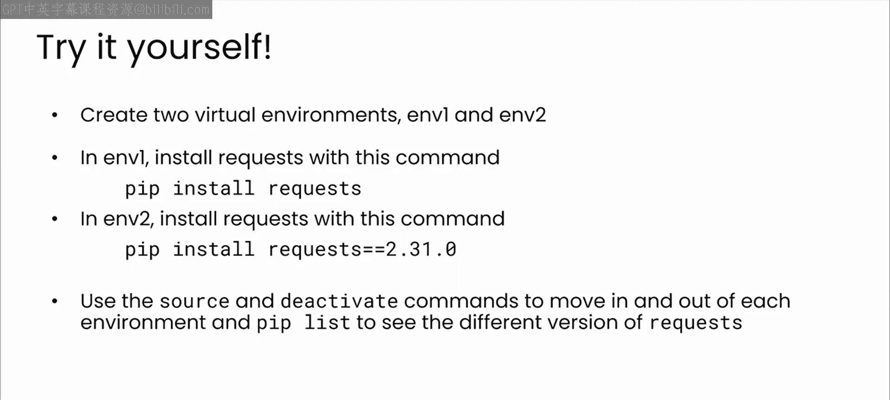

# 44：19_虚拟环境 🐍

在本节课中，我们将要学习软件开发中一个至关重要的概念：虚拟环境。我们将了解它的作用、好处，并通过实际操作学习如何在Python中创建和管理虚拟环境。

## 概述

成功的依赖管理的第一步，是拥有一个可以安全地为特定项目尝试不同库的空间。

虚拟环境正是为此目的而设计的。

## 什么是虚拟环境？ 🧩

虚拟环境是一个独立的工作空间，它允许你管理特定项目的依赖项，而不会影响其他项目。

这种隔离对于避免不同项目及其各自的依赖集之间发生冲突至关重要。

例如，将幻灯片想象成代表一台开发机器。

左边的黄色方框是一个为运行“应用1”而设计的虚拟环境。为此，它需要“库版本1”和“框架版本2”。

与此同时，右边的绿色方框是第二个为运行“应用2”而设计的虚拟环境。这可能是一个较新的应用，因此它基于“库版本2”和“框架版本5”。

你会注意到，每个环境中是相同的框架和库，但版本不同。“应用1”可能需要“库版本1”，而它与“库版本2”不兼容。因此，如果“应用2”需要“库版本2”，安装它会破坏“应用1”。

如果你试图在同一台开发机器上运行这些应用，这就会产生冲突。相反，通过将每个应用划分到单独的虚拟环境中，你可以将它们彼此隔离，并且只让每个应用访问其合适的依赖项。

## 使用虚拟环境的好处 ✨

以下是使用虚拟环境的主要优势：

*   **隔离性**：虚拟环境与其他所有环境隔离，因此每个项目都可以拥有自己的依赖集，不会受到其他项目意外更新的影响。这是避免跨项目冲突的好方法。
*   **可复现性**：例如，你可以将项目发送给队友，通过加载相同的虚拟环境配置，他们可以期望应用程序以与你相同的方式运行。
*   **易于管理**：通过保持设置隔离，并且只使用特定项目所需的内容，你可以更容易地长期管理、维护和更新依赖项，尤其是在你同时进行多个项目时。

## 动手设置虚拟环境 🛠️

现在你已经对虚拟环境有了概览，让我们实际动手设置一些。在本模块中，我希望你有机会尝试即将探索的概念。你将看到如何在Python中设置虚拟环境，并探索可用于安装包和管理依赖项（如Pip）的工具。

这里你将使用一个名为 **Venv** 的工具。如果你熟悉它，可以跳过。或者，你可能会发现这些材料作为复习很有用。对于其他人，让我们简要了解一下如何使用Venv启动和运行，并且我们将有一个LLM（大语言模型）在身边帮助我们。

首先，我将提示LLM告诉我如何在Mac上使用Venv设置Python虚拟环境。

> 注意：我要求它提供在我的机器（Mac）上设置的说明。

它给了我针对Mac的具体说明，例如使用Homebrew安装Python（如果我尚未安装的话）。首先，它告诉我只需确保已安装Python并检查其版本号。如果未安装Python，则可以使用Homebrew安装它。

这最终被证明是非常好的建议，因为我已习惯于在云端使用开发环境，以至于我的本地环境变得非常生疏。这是我喜欢与这样的LLM一起工作的原因之一。它没有假设，并迫使你挑战自己的假设。

接下来，它告诉我导航到要创建虚拟环境的目录。

进入正确的目录后，你可以调用 `python3 -m venv`，然后是你的环境名称。这里环境名为“myenv”，但你可以随意命名。

现在，你调用 `source` 加上你的环境名称 `/bin/activate` 来激活你的环境。例如：`source myenv/bin/activate`。

如果一切正常，你的终端提示符开头会显示你的环境名称，像这样。

现在你的虚拟环境已激活，你可以在其中安装库或其他依赖项，就像通常那样，而不会影响你的主环境或任何其他环境。

要列出已安装的包，你可以调用 `pip list`。

完成后，你可以简单地调用 `deactivate` 来停用虚拟环境。

如果你想重新激活一个环境，可以使用与第一次激活时相同的 `source` 命令。

## 实践活动 📝

在接下来的几个视频中，我希望你能够创建自己的虚拟环境。你可以随时重看本视频以获取说明，或者提示你的LLM为你的特定机器提供说明。

然后，我希望你尝试以下活动：

1.  使用 `venv` 创建两个虚拟环境。将它们命名为 `env1` 和 `env2`。
2.  使用 `pip` 在每个环境中安装 `requests` 库，但安装方式略有不同：
    *   在 `env1` 中，使用 `pip install requests`。
    *   在 `env2` 中，使用 `pip install requests==2.31.0`。
3.  在 `env1` 中，你将获得 `requests` 库的最新版本。
4.  在 `env2` 中，你将获得2023年5月的一个特定版本。
5.  使用 `source` 和 `deactivate` 命令在每个环境中进出。
6.  使用 `pip list` 获取依赖项版本的详细信息。

花些时间探索，感受一下。

完成后，请在下一个视频中与我汇合，在那里你将看到LLM如何帮助你就如何在刚刚创建的环境中选择要使用的库做出明智的选择。

## 总结

本节课中我们一起学习了虚拟环境的核心概念。我们了解到虚拟环境是一个隔离的工作空间，用于管理项目特定的依赖，从而避免冲突、保证可复现性并简化项目管理。我们通过实际操作，使用 `venv` 工具创建了虚拟环境，并使用 `pip` 安装了不同版本的包。掌握虚拟环境是进行专业Python开发的基础技能。