# 45：20_研究依赖项 🔍

在本节课中，我们将学习如何利用大语言模型（LLM）来理解和研究软件项目的依赖项。我们将从生成依赖项清单开始，到使用工具锁定版本，最后探讨如何利用LLM快速了解项目所依赖的库。

## 概述：理解项目依赖项

现代软件项目通常依赖于大量外部库。这些库本身又依赖于其他库，形成了一个复杂的依赖网络。作为开发者，理解和管理这些依赖是日常工作的重要部分。

上一节我们介绍了如何设置虚拟环境。本节中，我们来看看如何具体研究和管理这些依赖项。

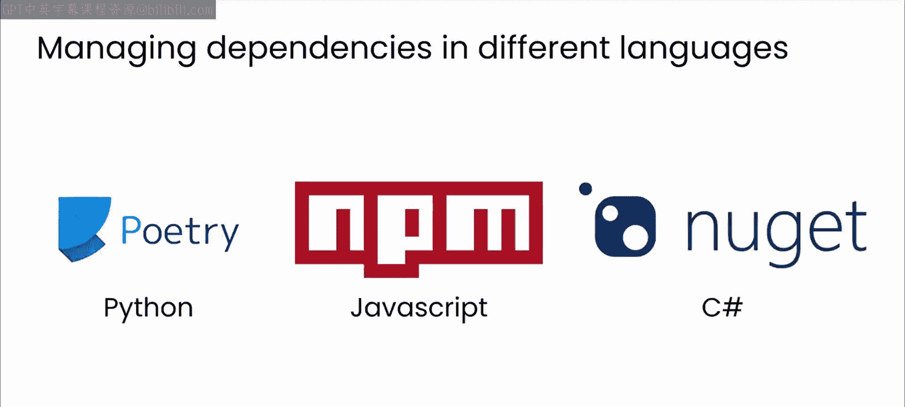

## 使用包管理器

你可能已经熟悉一些用于管理依赖项的高级工具。例如，在Python生态中，有 `poetry` 或 `pip` 等工具可以简化这一过程。JavaScript开发者可能熟悉 `npm`，而C#开发者则可能使用 `NuGet`。

虽然包管理器仍然是管理依赖项的主要工具，但LLM可以帮助你更好地理解项目的依赖关系，并就如何最好地满足项目需求做出明智的决策。

## 生成依赖项清单

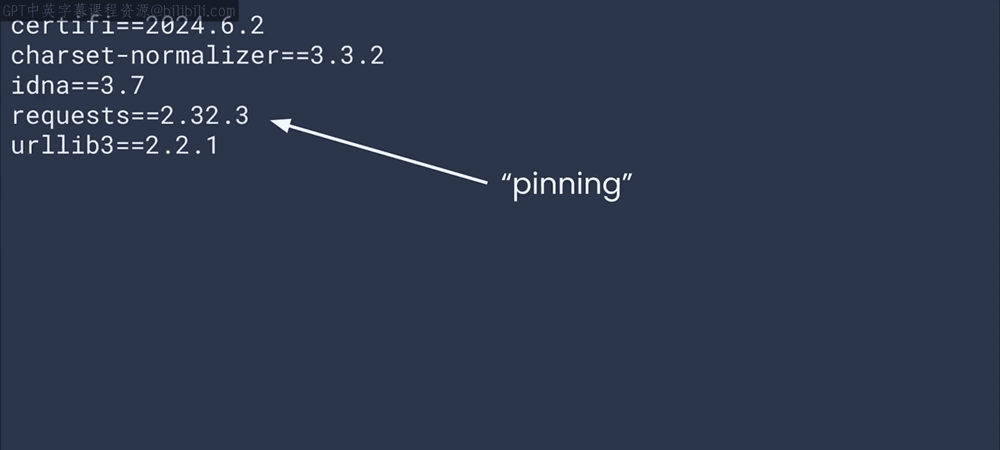

在上一节视频中，你使用了 `pip list` 来列出环境中安装的包。现在，尝试一个非常相似的命令：`pip freeze`。

你将得到一个包含版本号的依赖项列表，看起来像这样：
```bash
requests==2.32.3
flask==3.0.3
```
等号后面的版本号（例如 `requests` 的 `2.32.3`）通常被称为“锁定”。这意味着你指定了项目构建时所使用的 `requests` 库的确切版本。

## 使用 `pip-tools` 管理依赖

有一个独立且强大的命令行工具叫做 `pip-tools`，它可以帮助你保持基于 `pip` 的包处于最新状态，即使你已经锁定了版本。它主要由两个命令组成：`pip-compile` 和 `pip-sync`。

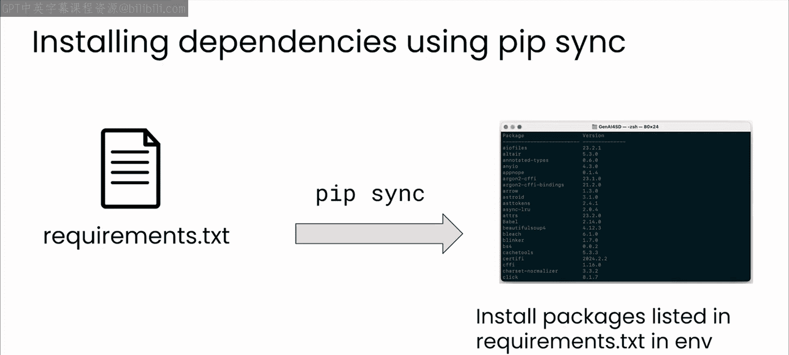

以下是使用 `pip-tools` 的典型流程：
1.  首先，在一个名为 `requirements.in` 的文件中列出项目的直接依赖项。
2.  然后，对此文件调用 `pip-compile`，它将为你生成一个 `requirements.txt` 文件。这个文件可用于在未来指定依赖项。
3.  稍后你将看到，`pip-sync` 可以用来安装或更新所有这些依赖项。

让我们看一个例子。

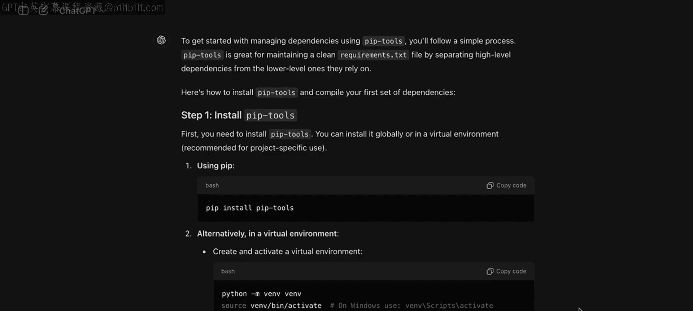

## 实践操作：编译依赖项

在接下来的几个步骤中，请确保你有一个激活的虚拟环境。如果你不知道如何操作，请返回上一节视频。


现在，我将向LLM询问关于安装 `pip-tools` 和编译我的第一组依赖项的建议。

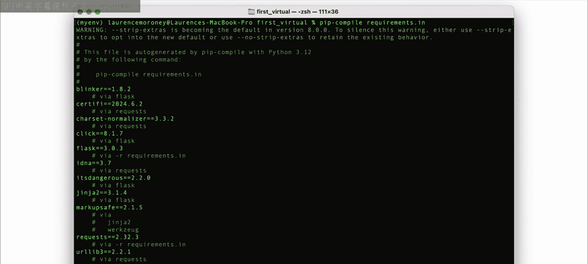

以下是我机器上的操作过程：
1.  首先，我使用 `pip` 从命令行安装了 `pip-tools`。
    ```bash
    pip install pip-tools
    ```
2.  安装完成后，它告诉我创建一个名为 `requirements.in` 的文件，列出项目的直接依赖项。回想一下，这些是 `requests` 和 `flask`。
    ```txt
    # requirements.in
    requests
    flask
    ```
3.  最后，它告诉我使用我的 `requirements.in` 文件调用 `pip-compile`。
    ```bash
    pip-compile requirements.in
    ```

这是我得到的输出。真正酷的是，它找出了你的依赖项的依赖项，并确保它们被包含在生成的 `requirements.txt` 中。

生成的 `requirements.txt` 看起来像这样：
```txt
# This file is autogenerated by pip-compile with python 3.12
# To update, run:
#
#    pip-compile requirements.in
#
blinker==1.8.2
    # via flask
click==8.1.7
    # via flask
flask==3.0.3
itsdangerous==2.2.0
    # via flask
jinja2==3.1.4
    # via flask
markupsafe==2.1.5
    # via jinja2
requests==2.32.3
werkzeug==3.0.3
    # via flask
```
现在，里面有很多我没有直接要求的东西，因为它们是我的依赖项的依赖项，包括像 `itsdangerous` 和 `Werkzeug` 这样的库。

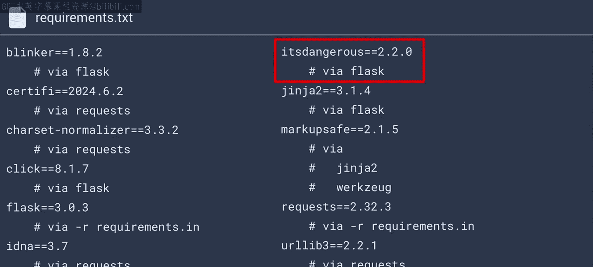

因为我要求了 `requests` 和 `flask`，所以我在不知不觉中依赖了它们。这带来了一定的风险，特别是对于一个名为 `itsdangerous` 的库。

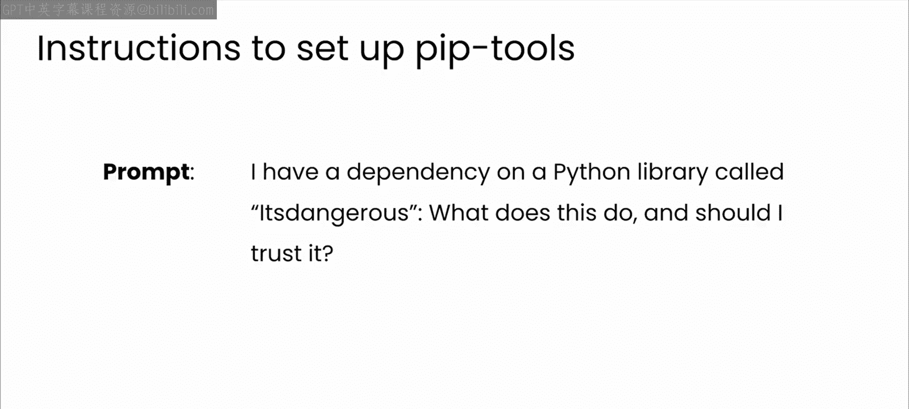

## 利用LLM理解依赖项

这正是LLM可以作为一个有用工具的地方，帮助你理解这些依赖项。

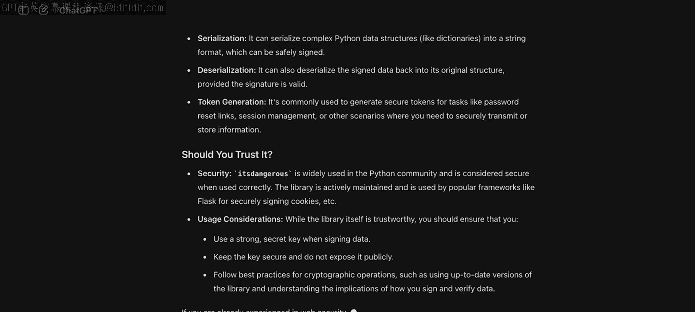

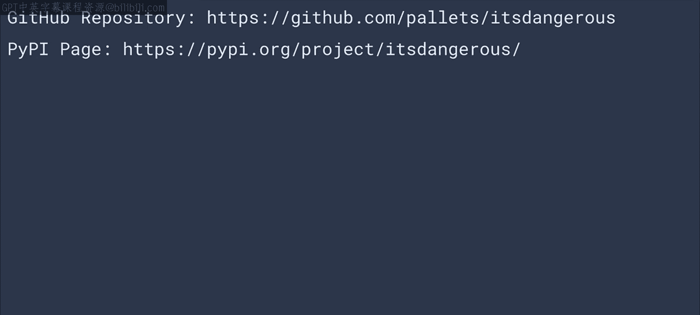

我可能会写一个这样的提示词：
> 我有一个对名为 `itsdangerous` 的Python库的依赖。它是做什么的？我应该信任它吗？

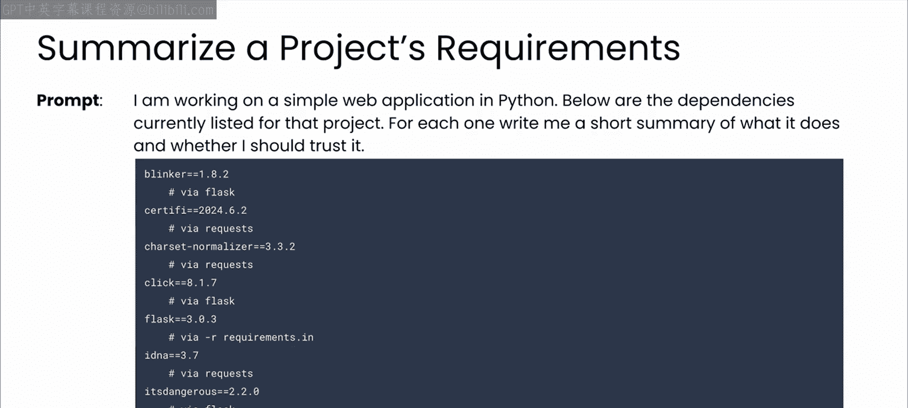

然后你会得到一个类似这样的答案，为你提供关于该库的大量细节，也许能让你尽管它的名字听起来危险，也能多信任它一点。

它甚至可以给你提供可以了解更多信息的URL。

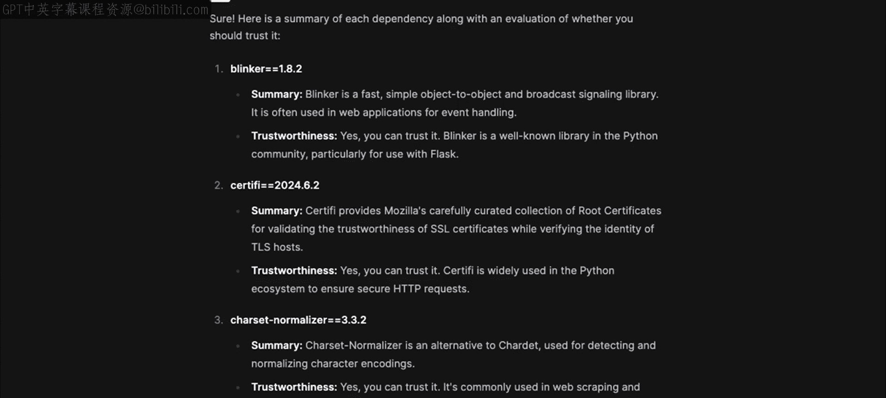

当然，因为你正在使用LLM，你总是可以更进一步，要求它一次性快速总结所有依赖项，就像这样：
> 请为我总结 `requirements.txt` 中列出的每个依赖项的作用。

LLM非常擅长响应这类复杂查询，它们可以帮助你快速熟悉项目中所有的依赖项。

## 同步环境依赖

像这样编译包的一个巨大好处是，它允许你或你的同事复制你正在使用的虚拟环境。这可以让两个开发者在同步工作的同时，确保软件行为保持一致。

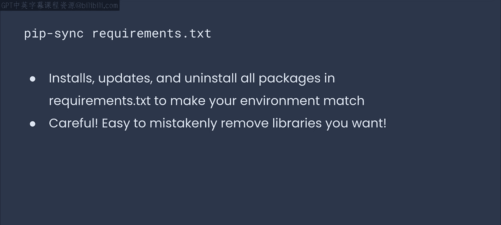

为此，你将使用我之前提到的 `pip-sync` 命令。这个命令会读取你生成的 `requirements.txt` 文件，然后安装、升级或卸载当前环境中的所有包，以精确匹配 `requirements.txt` 中列出的内容。

请注意，执行 `pip-sync` 会移除任何未在 `requirements.txt` 文件中指定的库。这意味着如果你与同事共享一个 `requirements.txt` 文件，他们也可以运行 `pip-sync`，并确保他们基于同一组包进行工作。

## 动手练习

现在是时候自己尝试一下了。
1.  创建一个名为 `env1` 的环境。
2.  在此环境中创建一个 `requirements.in` 文件，并像我刚才展示的那样添加几个包。
3.  将其编译成 `requirements.txt` 文件。
4.  使用LLM了解更多关于那里列出的所有包的信息。有没有什么让你感到意外的？
5.  然后，假设你想要克隆你的环境（也许是为了让同事可以在同一个项目上工作）。创建第二个名为 `env2` 的环境，并弄清楚如何将 `env2` 中的依赖项与 `env1` 中的同步。

如果你遇到困难，就向你的LLM寻求帮助。暂停视频，花点时间完成这个任务，完成后继续。

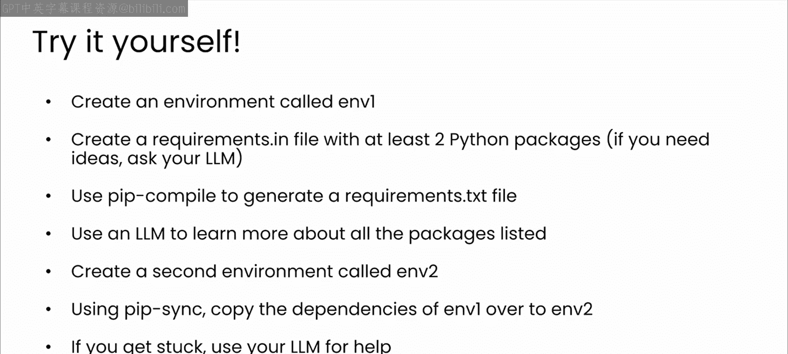

## 总结

正如你在活动中所看到的，LLM可以成为一个非常有用的工具，帮助你快速理清项目底层复杂的依赖关系网。你将更好地理解项目所构建的开发栈，并且如果需要更多帮助，有能力提出个性化的后续问题。

当然，如果你在导航那些允许你打包并与队友共享环境的工具时需要帮助，LLM仍然是一个有用的向导。

尽管你尽了最大努力，仍然会遇到依赖冲突。所以，让我们进入下一节视频，学习如何在你最喜欢的LLM的帮助下调试这些问题。