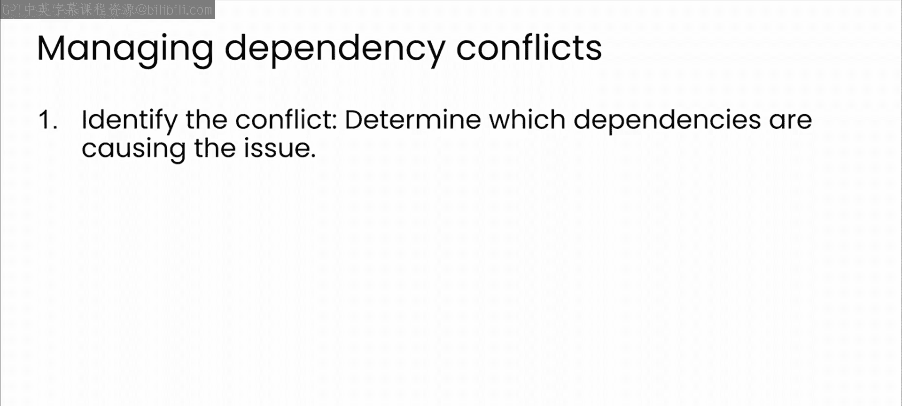
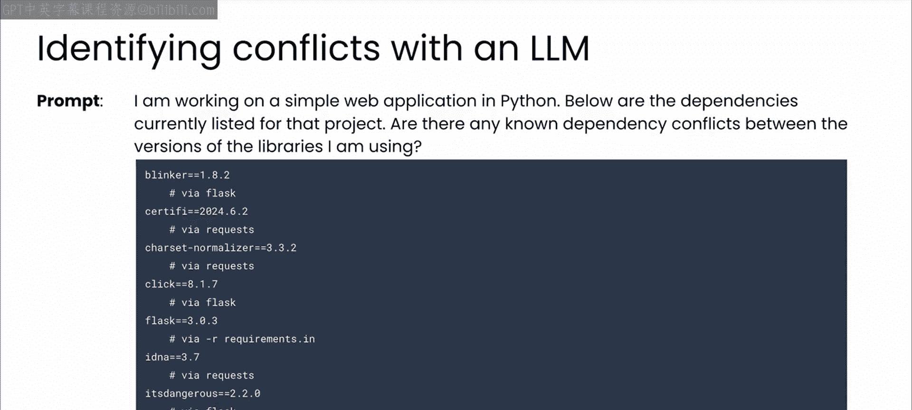
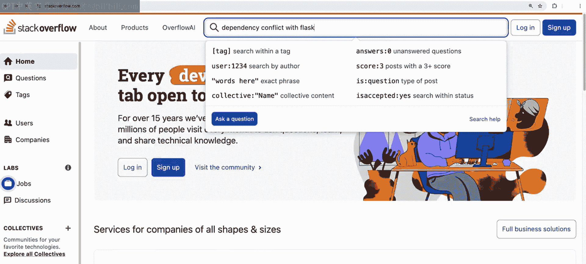
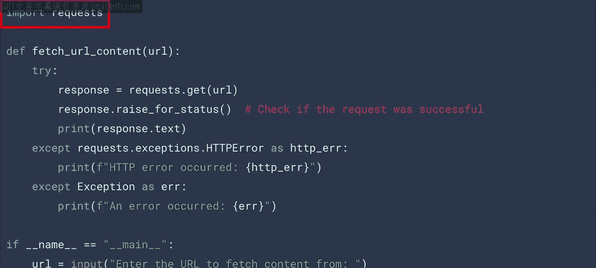
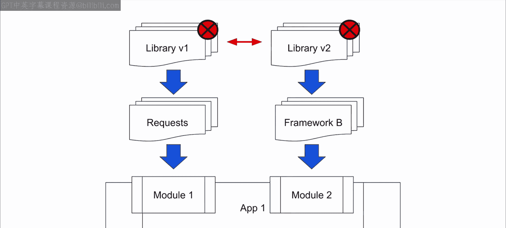
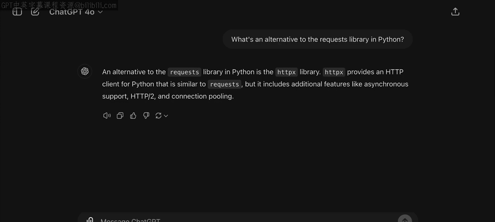
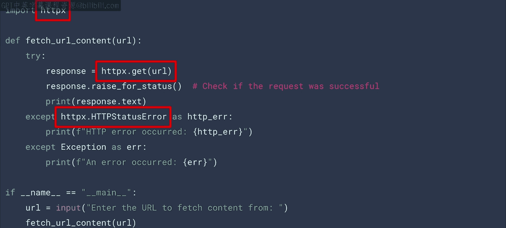

# 46：依赖冲突 🔧

在本节课中，我们将要学习软件开发中一个常见的挑战：依赖冲突。我们将了解其成因，并探讨如何借助大型语言模型（LLM）来识别和解决这些问题。

## 概述

依赖冲突是软件开发中的常见难题。当项目中的不同包需要同一个依赖项的不同版本时，就会发生冲突，这可能导致兼容性问题和项目错误。本节我们将系统地学习如何利用LLM作为助手，遵循一个清晰的框架来应对这一挑战。

## 依赖冲突的成因

上一节我们介绍了依赖管理的基本概念，本节中我们来看看冲突具体是如何发生的。

依赖冲突发生在不同包需要同一依赖项的不同版本时。这会导致兼容性问题和项目错误。可以这样理解：你的应用可能使用了两个框架A和B。框架A依赖于某个库的版本1，而框架B依赖于同一个库的版本2。你无法通过虚拟环境解决此问题，因为只有一个应用。



## 解决依赖冲突的框架

当然，没有放之四海而皆准的答案。但正是在这里，LLM作为助手可以发挥巨大作用。在尝试解决问题时，遵循一个框架是很有帮助的。



我喜欢遵循以下步骤。首先，识别冲突并找出是哪些依赖项导致了问题。

以下是解决依赖冲突的具体步骤：

1.  **识别冲突**：找出引发问题的具体依赖项。一个很好的方法是将你的 `requirements.txt` 文件上传给LLM，并询问它库之间是否存在冲突。这种方法非常有用，有时能直接给出解决方案。
2.  **寻找兼容版本**：寻找一个能在整个依赖链中适用于所有库的库版本。如果其训练数据中存在相关信息，LLM或许能提供建议。
3.  **更新与迭代**：根据任何建议更新你的依赖项，并持续迭代直到问题解决。

## 当标准方法失效时

使用上述方法很少无法解决问题。但如果确实未能解决，你通常有两条路可走。



以下是两种备选方案：

*   **查找已知解决方案**：你通常会遇到一个已知问题，这意味着会有详细记录的处理方法。如果LLM不知道这些方法，传统的网页或Stack Overflow搜索可能会有所帮助。
*   **寻找替代库**：这里是LLM真正能派上用场的地方，即寻找具有不同依赖链的替代库。LLM可以帮助你找到一个满足需求的不同库，然后重构你的代码以使用该库。

## 实战示例：替换请求库



例如，这里有一段代码，它使用Python中常见的 `requests` 库从给定URL获取数据。

```python
import requests

response = requests.get('https://api.example.com/data')
data = response.json()
```



现在假设你遇到这样一种情况：这个模块使用的 `requests` 依赖于某个库的版本1，而另一个模块使用的不同框架依赖于该库的版本2。正如我们之前讨论的，这种情况很容易导致你的应用出现依赖冲突。



一种解决方案是向LLM询问替代方案。现在它告诉我一个名为 `httpx` 的库。

```python
import httpx



async with httpx.AsyncClient() as client:
    response = await client.get('https://api.example.com/data')
    data = response.json()
```

对我来说，将代码重构为使用 `httpx` 而不是 `requests` 就变成了一项简单的任务。事实上，我完全可以请LLM帮我完成。在这里你可以看到，我只需要在代码中的几个地方做一些调整。

此时，我可以尝试查看依赖方面是否一切恢复正常，并迭代自己以达到理想的解决方案。

## 总结

本节课中我们一起学习了如何处理依赖冲突。与所有事情一样，依赖管理和解决依赖冲突没有一刀切的解决方案。但希望这些简短的示例能帮助你了解在面临这些难题时，如何从LLM那里获得协助。希望你能加入下一节视频，我们将讨论如何使用LLM来解决因项目引入依赖而产生的安全漏洞。