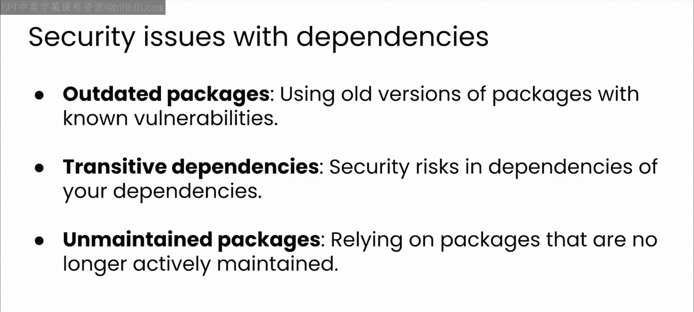
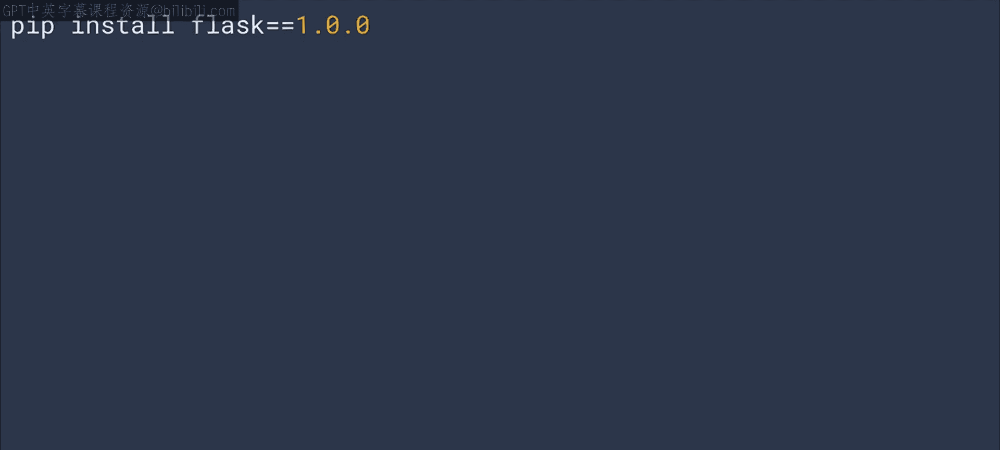
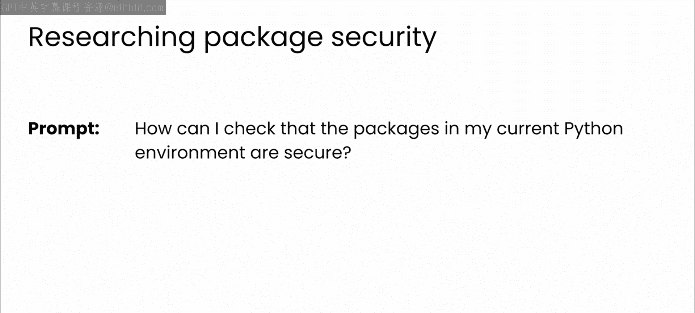
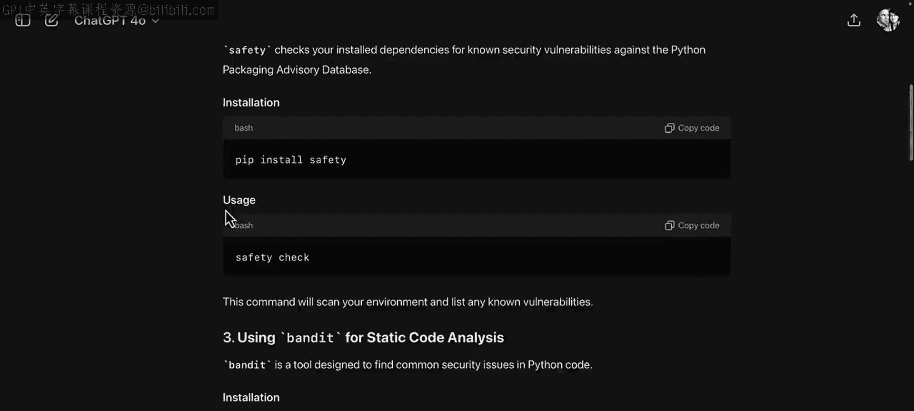
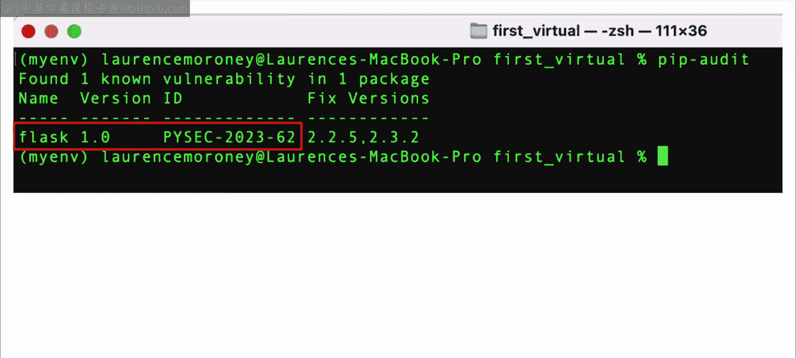
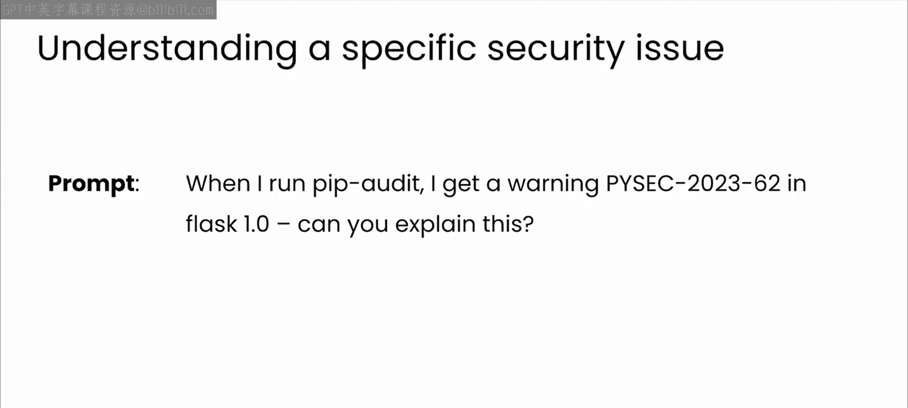
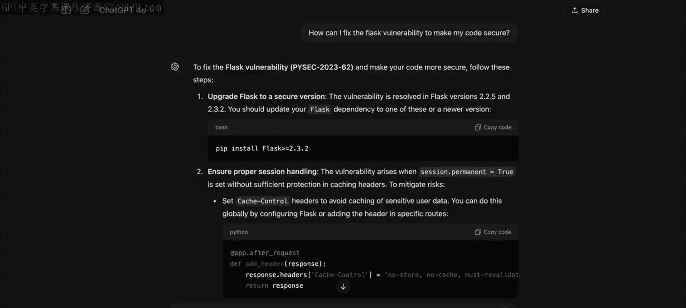
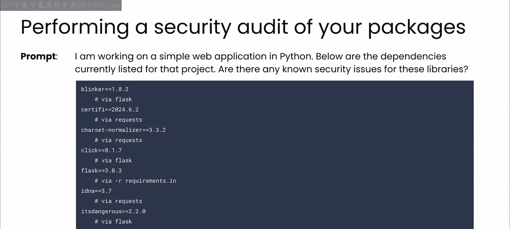
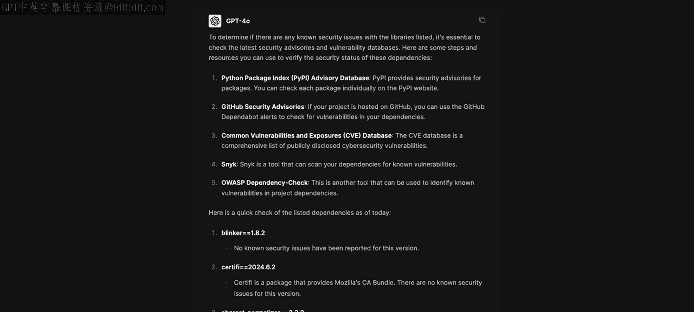
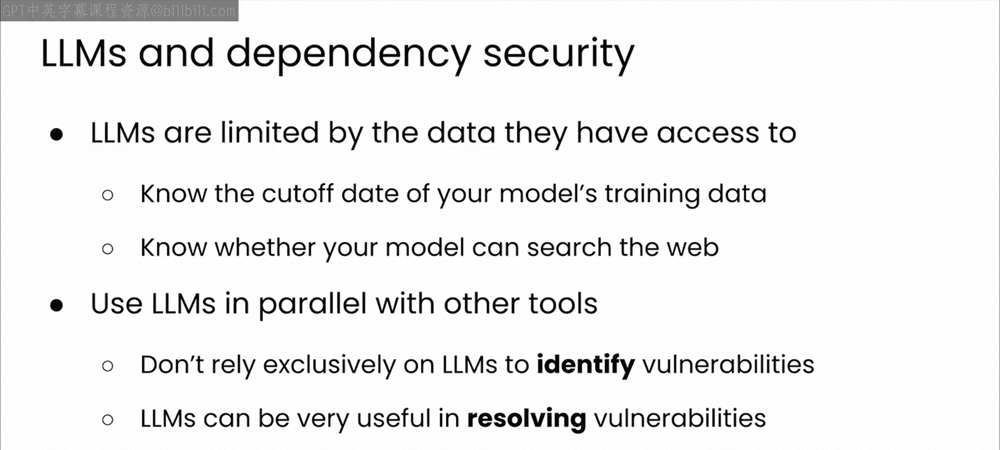

# 47：依赖项与安全 🔒

在本节课中，我们将要学习软件开发中依赖项管理的重要性，以及它们如何可能引入安全漏洞。我们将探讨如何利用大语言模型（LLM）作为结对编程伙伴，结合专业工具来识别和缓解这些风险，从而维护项目的安全性。

## 依赖项与安全风险概述

依赖项允许你基于其他开发者的工作成果进行构建，但它们也可能引入安全漏洞。理解并减轻这些风险对于维护一个安全的项目至关重要。

## 安全问题的来源

以下是依赖项可能引发安全问题的几种主要方式。

### 1. 过时的软件包

最常见的安全问题来源是过时的软件包。与所有代码一样，软件包和依赖项会不断受到黑客的攻击，或其维护者会对其进行安全测试。当检测到新的漏洞或威胁时，软件包通常会发布更新和通知。然而，这些更新很容易被忽略，特别是当该软件包位于你的依赖链深处时。

### 2. 传递依赖项的更新与缺陷

与上述情况非常相似的是，你的传递依赖项可能存在需要更新的缺陷。要跟上每个软件包的每个版本是一项艰巨的任务，尤其是当它们不是直接依赖项时。因此，让LLM作为结对编程伙伴来帮助你处理这些困难是理所当然的选择。

### 3. 依赖未维护的软件包



当依赖一个已不再维护的软件包时，问题就出现了。可能存在已发现但你尚不知晓的漏洞，并且活跃的攻击可能正在发生。使用未维护的软件包存在严重风险。



我发现这是使用LLM的一个特别有用的方式。通过询问关于软件包的信息，LLM通常会根据其训练数据截止日期提供相关信息。

## 实践：引入安全漏洞示例



让我们看一个如何在软件中引入安全漏洞的例子。如果你一直跟着课程操作，你应该已经有一个安装了Flask和Requests的虚拟环境。接下来你需要做的是降级Flask的版本。

无论你当前安装的是哪个版本的Flask，你都需要将其降级到1.x版本。你可以通过像这样指定版本1来实现：

```bash
pip install flask==1.0
```

通过回退到这个非常旧的版本，几乎可以保证它至少存在一些已知的漏洞。

## 利用LLM识别安全工具

如果你不是Python开发者，可能会想知道有哪些工具可以帮助你检查软件包中的漏洞。你总是可以询问你的LLM。

以下是提示词示例：“如何检查我当前Python环境中的软件包是否安全？”



当我这样做时，得到了以下结果。遵循本课程的主题，如果你对某事不确定，可以随时询问ChatGPT或你喜欢的LLM作为结对编程伙伴。在这个案例中，我询问了如何检查软件包安全性。

GPT回复了一系列建议，包括使用`pip-audit`，并展示了如何安装和使用它，以及其他工具如`safety`（它拥有Python软件包安全咨询数据库，可以据此检查漏洞）、使用`bandit`进行静态代码分析、使用`pip check`来检查过期或有漏洞的软件包。你也可以手动使用`pip list`和`pip install`等命令进行检查。当然，如果你使用类似GitHub Actions的CI/CD流水线，还可以实现自动化安全检查。



这里有很多推荐，其中第一个就是`pip-audit`，我们将在课程中探索这个工具。



## 使用`pip-audit`工具

最推荐的工具是`pip-audit`，这是一个常用的工具。我按照说明安装了`pip-audit`并运行它，以下是输出结果。

它标记出了一个问题：`PYSEC-2023-62`。

## 向LLM咨询具体漏洞

现在你有了这个具体的问题，可以询问你的LLM。提示词如下：“当我运行`pip audit`时，收到关于Flask 1.0的警告`PYSEC-2023-62`。你能解释一下吗？”

像GPT-4这样的新模型能够进行互联网搜索，超越其训练数据中的信息，因此更有可能为你提供最新的信息。较旧的模型可能尚未具备此功能，因此了解你所使用模型的训练数据截止日期以及它是否具备整合最新信息的能力非常重要。



作为回应，你应该会得到一个关于该错误的详细解释，以便理解其影响。当然，你也可以向LLM寻求修复方案。它不仅会提供帮助你更新到修复版本的代码，还可能提供更新应用程序中任何相关代码的方法，以确保此漏洞不会影响你。

这是我的输出示例。

此时，如果你使用的是在本模块早期创建的相同环境，可以更新你的Flask，然后再次运行`pip audit`。希望你将看不到任何漏洞。

## 扩展：使用LLM审计所有依赖项



在上一个例子中，你使用LLM来检查特定漏洞，但你同样可以轻松地要求它审计所有依赖项。提示词如下：“我正在用Python开发一个简单的Web应用程序，以下是该项目当前列出的依赖项。这些库是否存在任何已知的安全问题？”

在这里，我只是询问了`requirements.txt`文件中固定的每个软件包是否存在已知漏洞。

## 关于使用LLM进行安全审计的思考

我想谈谈这个例子，因为个人对于以这种方式使用LLM持有复杂的感觉，有趣的是，许多现代LLM也是如此。当我使用GPT-4模型运行这个提示词时，它实际上建议我使用像我们刚刚回顾过的`pip-audit`或`safety`这样的工具来检查软件包中的漏洞。老实说，我同意这是一个更好的方法，可以收集关于软件包漏洞的更可靠数据：使用工具，而不是LLM。

GPT-4o是一个较新的模型，具有搜索网络的能力，可以用更最新的信息来增强其训练数据。因此，虽然它一开始建议了其他确认依赖项安全性的方法，但它也报告了每个依赖项的任何已知安全问题。

这引发了我关于使用LLM作为维护依赖项安全工具的一些思考。



## LLM在安全领域的局限性

如你所知，LLM受限于其训练数据和所能访问的数据。了解你所使用模型的训练数据截止日期以及该模型是否能够搜索网络以超越其训练数据获取信息，这一点很重要。

即便如此，我仍然认为LLM最好与其他工具并行使用。特别是，我建议不要完全依赖LLM来识别漏洞。



## 总结

本节课中我们一起学习了依赖项管理中的核心安全挑战。我们了解到，安全风险主要源于**过时的软件包**、**传递依赖项的缺陷**以及**依赖未维护的软件包**。

我们实践了如何通过降级Flask版本来模拟引入漏洞，并学习了如何使用`pip-audit`等专业工具来检测它们。更重要的是，我们探讨了如何将LLM作为结对编程伙伴，在理解具体漏洞（如`PYSEC-2023-62`）、获取修复建议以及辅助审计方面发挥作用。

然而，关键结论是：**LLM应作为专业安全工具的补充，而非替代品**。它们最适合在发现问题后帮助理解和解决问题。本次课程快速浏览了Python中的`pip-audit`工具，以及如何将其与GPT等LLM结合使用来维护依赖项的安全。Python中还有许多其他工具，当然，如果你使用其他语言，它们也拥有自己的生态系统。让我们进入本模块的最后一个视频，看看LLM如何在其他语言的依赖项管理中提供帮助。