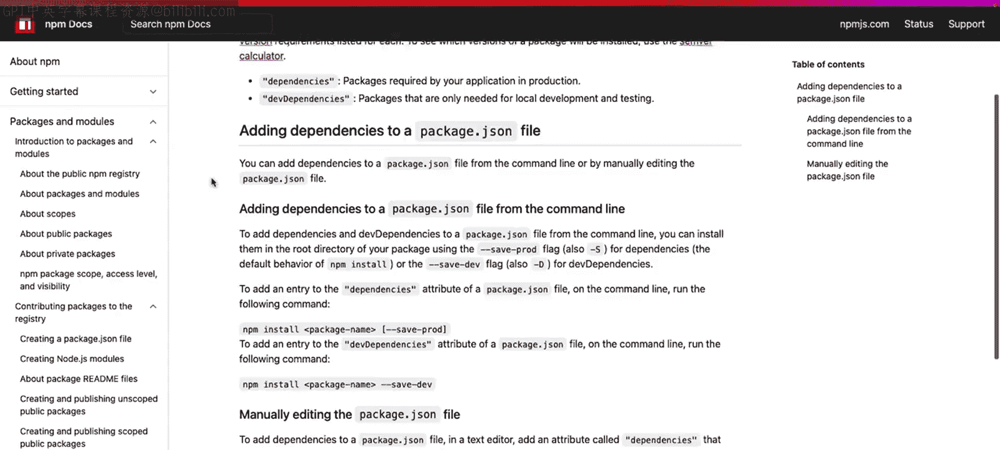
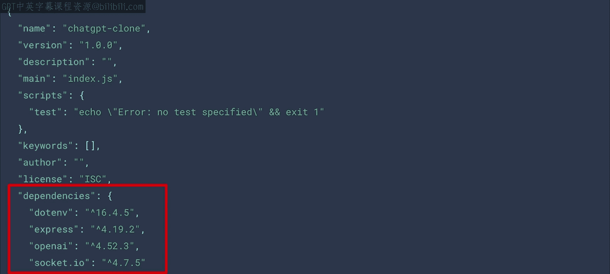
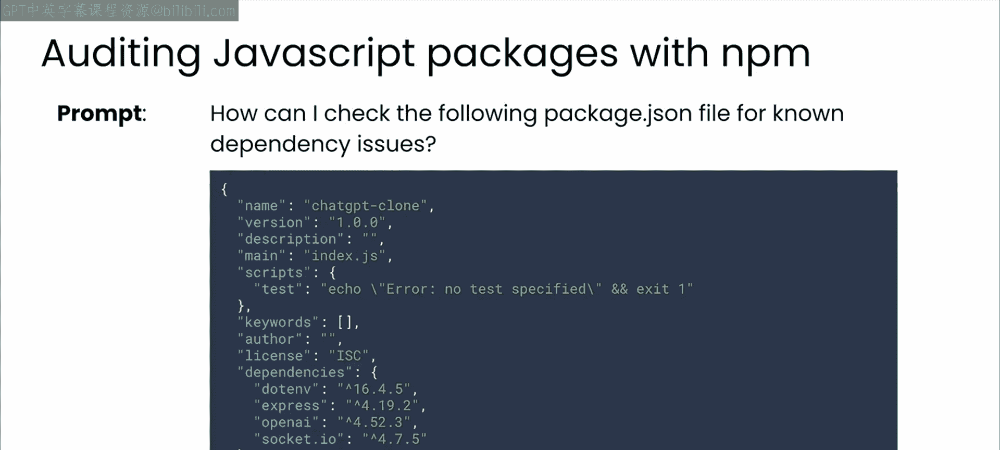
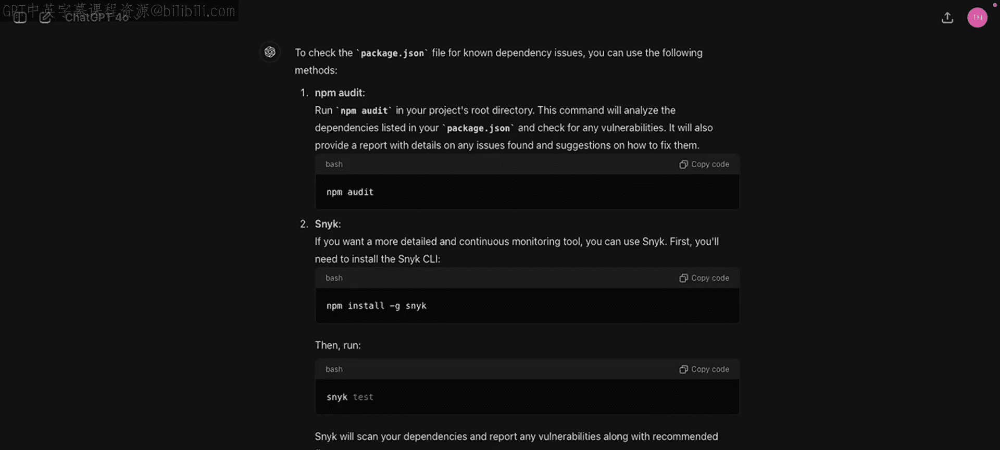
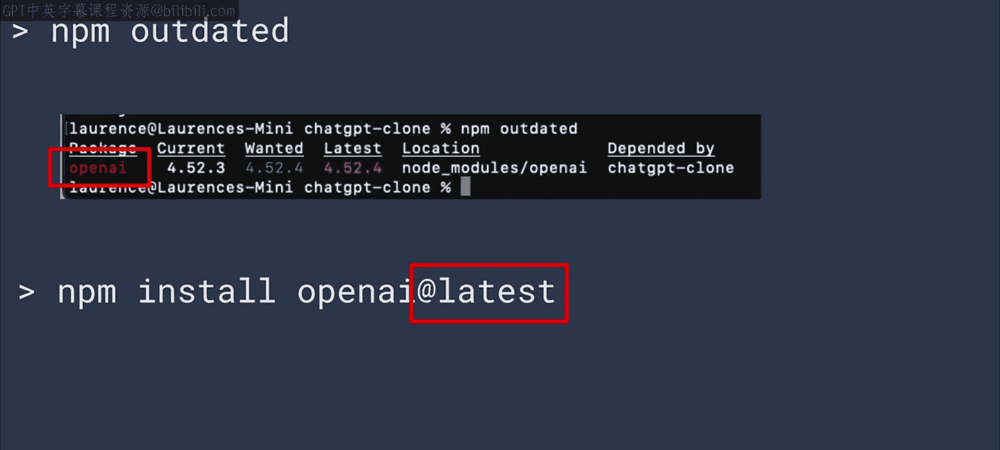

# 48：其他编程语言的依赖管理 📦

在本节课中，我们将学习如何将大语言模型（LLM）应用于不同编程语言的依赖管理。我们将回顾LLM在此领域的优势与局限，并通过一个Node.js的实例，展示其具体应用方法。

## 概述

在本模块中，你已经了解了依赖如何帮助你利用其他开发者的工作成果，以及LLM如何协助你管理这些依赖带来的挑战和复杂性。之前的所有示例都基于Python，但在实际工作中，你很可能需要处理多种不同的语言。无论你使用何种语言或框架，本模块开头介绍的核心思想都同样适用，只是具体工具会有所不同。

## LLM在依赖管理中的优势与局限

上一节我们介绍了依赖管理的基本概念，本节中我们来看看LLM在此任务中的具体能力与注意事项。

LLM在以下方面表现卓越：
*   **头脑风暴**：擅长为你推荐项目中可用的库和包。
*   **学习辅助**：可以帮助你深入了解某个依赖项。
*   **问题识别**：有时能协助你识别依赖冲突和安全漏洞。
*   **解决方案**：是帮助你找到上述问题解决方案的得力工具。

然而，LLM的能力受限于其训练数据。你必须注意你所使用模型的训练数据截止日期，以及它是否能访问网络。此外，对于冷门或晦涩的库，LLM的帮助可能有限。

## 应用于其他语言：以Node.js为例

了解了LLM的通用能力后，让我们看看如何将这些概念应用到其他编程语言中。例如，假设你是一名使用Node.js的JavaScript开发者。

NPM是一个出色的包管理器，它的功能远不止安装包。它能够管理来自NPM注册表的依赖，确保你使用的库版本始终安装了正确的依赖项。



LLM可以成为你的助手，帮助你分析代码以确定正确的依赖，甚至审计你当前的依赖集合。


如果你熟悉使用NPM，就会知道它使用一个名为 `package.json` 的配置文件。

```json
{
  "name": "my-app",
  "version": "1.0.0",
  "dependencies": {
    "express": "^4.18.2",
    "lodash": "^4.17.21"
  }
}
```

这个文件展示了关于你应用的一切信息，包括所需的依赖及其版本。






你可以将这个文件内容传递给LLM以寻求建议。




LLM会给出诸如运行 `npm audit` 来检查依赖项中的漏洞等提示。在我的案例中，应用里没有发现任何问题，但你应该检查自己的项目中是否存在漏洞。




你还可以运行 `npm outdated` 来检查包的状态。在我的案例中，确实发现了一个过时的包。


使用 `npm install <package-name>@latest` 可以轻松修复这个问题。

## 总结

本节课中我们一起学习了如何将LLM应用于不同编程语言的依赖管理。请记住，无论你使用何种语言，LLM都可以帮助你：
*   总结可用的库。
*   调试依赖冲突。
*   梳理潜在的安全漏洞。

尤其是在与更大的开发团队协作时，你经常需要在多种语言和环境之间切换。LLM可以帮助你快速熟悉新环境的工作方式，并指导你与团队共同做出解决问题的明智选择。希望这里学到的一些思路能赋能你和你的团队，构建出更令人兴奋的项目。