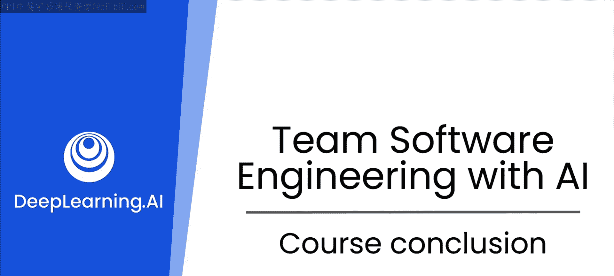

# 49：课程总结

在本课程中，我们学习了如何利用生成式AI来辅助个人及团队进行软件开发。让我们一起回顾所学内容。

## 回顾课程内容

上一节我们探讨了AI在依赖管理中的应用，现在让我们对整个课程进行总结。

以下是我们在本课程中探索的三个主要领域：

1.  **软件测试**
    你首先探索了大型语言模型（LLM）辅助软件测试的各种方式。无论是进行探索性测试、功能测试、性能测试还是安全测试，LLM都能帮助你构思需要测试的场景，并协助你编写相应的测试用例。

2.  **代码文档**
    接着，我们探讨了文档的生成，范围从行内注释一直到完整的API文档乃至更广泛的文档。LLM能够帮助你开发清晰、全面且有用的文档。拥有更好的文档，你的团队能更高效地使用彼此的代码、帮助新成员快速上手，并实现代码的长期维护。

3.  **依赖管理**
    最后，你看到了LLM如何应对依赖管理中的诸多挑战。无论你是在探索有哪些可用的库、深入了解某个特定库，还是解决诸如版本冲突或安全漏洞等与依赖相关的挑战，LLM都能根据你团队的具体需求提供有针对性的建议。

## 总结与展望

本节课中我们一起学习了生成式AI在软件测试、文档编写和依赖管理三大核心开发环节中的强大辅助能力。

我希望本课程不仅展示了AI如何帮助你成为一名更优秀的程序员，更说明了它如何能帮助你超越个人局限，掌握成为专业软件工程团队中更出色一员所需的工具。

祝你编程愉快。