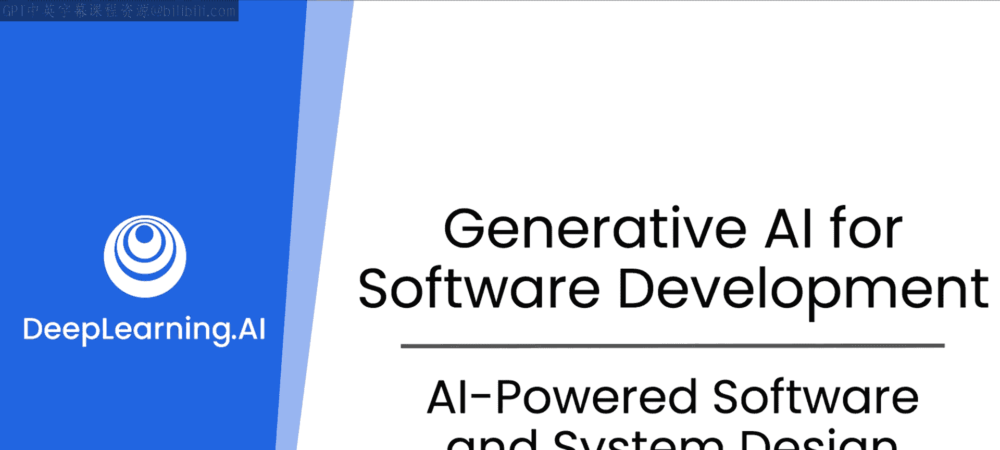

# 50：课程概述与介绍

在本课程中，我们将探索如何利用生成式AI超越简单的代码编写，来构建更好的应用程序和设计更优的软件。这是关于软件开发的生成式AI技能系列课程的第三部分，也是最后一部分。

## 课程回顾与引入

在前两门课程中，我们学习了如何与AI结对编程，以编写、分析代码，并提升其在生产环境中的性能和健壮性。我们还看到了AI如何帮助创建测试用例、编写文档和管理依赖项，所有这些都有助于团队更高效地协作。

本节中，我们将深入探讨如何利用AI更深层次的知识，而不仅仅是写代码，来构建更好的应用程序和设计更优的软件。

## 核心学习目标

本课程的核心是超越代码本身，思考代码如何与其他组件交互，以及如何形成最终产品。以下是本课程将涵盖的几个关键领域：

1.  **配置与日志**：你的代码可能需要读取复杂的配置文件、写出日志文件，或者处理数据的序列化与反序列化。
2.  **数据库设计**：学习如何使用大语言模型来帮助你构建和设计最高效的数据库模式，甚至用示例数据填充它，并思考如何高效地构建跨表查询。
3.  **设计模式**：利用全球开发者积累的数百万“人年”经验所总结出的设计模式，特别是“四人帮”设计模式。对于初学者，这些模式可能相当晦涩，而大语言模型可以非常强大地帮助你建议合适的设计模式，并为你提供该模式的起始代码。

## 设计模式的实际应用

识别正确的设计模式并知道何时使用它可能非常困难。以下是一个实际案例：

几周前，我在实现一个与多个软件交互的接口时，使用了一个庞大的 `switch` 语句将其拼凑在一起。幸运的是，一个大语言模型提示我使用一种名为“工厂方法”的设计模式。

简单来说，工厂方法是一种面向对象编程概念，它允许你编写代码来实例化对象，而无需预先指定它们的具体类。这是一个相当复杂的设计模式，我可能理解但并不深入。但关键在于，AI审视了我的代码，提示我一种更好的架构方式，并给了我示例代码来告诉我如何在Python中实现它。

这帮助我从一个相当丑陋的 `switch` 语句式设计，转变为一个更清晰、更易扩展的设计。我将代码展示给一些人看，他们认为很不错，但更重要的是，AI帮助我完成了工作。它激发了你的灵感，让你思考使用工厂方法，并且没有让你停留在那里——它还提供了示例代码。然后，你作为一名工程师，能够利用这些示例代码解决问题，并以一种更高效、更易于维护的方式实现它。

## 课程展望

希望本课程能让你看起来更出色。接下来，让我们进入下一个视频，开始深入学习序列化与反序列化、数据库以及设计模式。

---

**本节课总结**：我们一起回顾了前两门课程的内容，并引入了第三门课程的核心目标：利用AI进行高级软件设计，包括处理配置与数据、设计数据库模式以及应用复杂的设计模式。我们通过一个工厂方法模式的实例，看到了AI如何在实际开发中提供灵感和具体的实现指导。