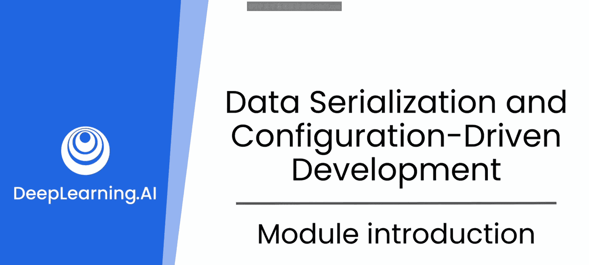
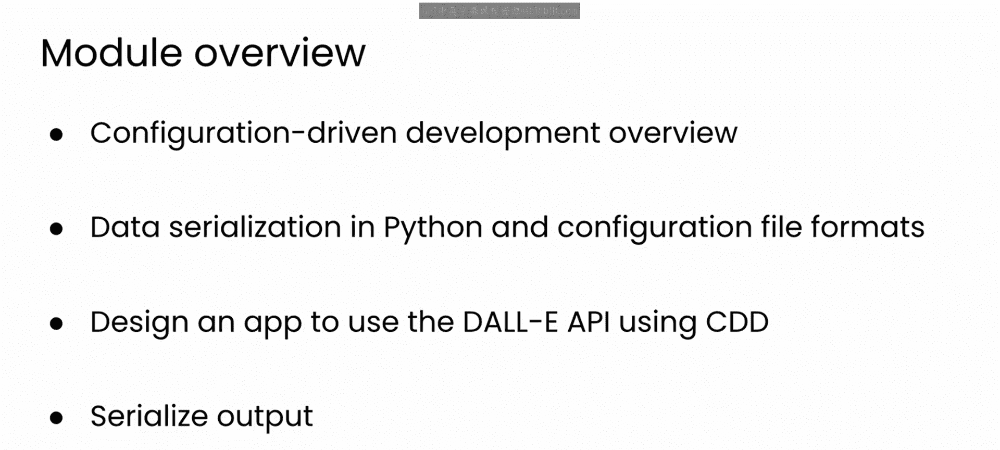

# 51：1_模块介绍

在本节课中，我们将学习如何利用大型语言模型来辅助设计应用程序的架构。我们将从一个初始概念出发，逐步构建一个简单的、可运行的原型。

## 概述：配置驱动开发

我们将要探索的方法论是**配置驱动开发**，简称 **CDD**。

这是一种软件开发方法，应用程序的行为、功能和设置通过**外部配置文件**来控制，而非硬编码在应用程序的核心逻辑中。这种方法增强了软件的灵活性，以应对不断变化的需求，并允许非技术团队成员在不修改代码的情况下调整应用程序的某些行为。

作为本模块的一部分，我们也将探讨文件序列化。我曾参与过成功运用CDD的工程项目。本模块的目标并非说服你在工作中使用CDD，而是希望你能通过一个实例，了解大型语言模型如何帮助你选择和实施一个能广泛影响软件项目的设计范式。

本模块及本课程旨在帮助你思考大型语言模型如何协助你处理类似这样的重大设计决策。我认为CDD是一个绝佳的入门示例。😊

## 学习路径

以下是本模块的学习步骤：

首先，我们将概述CDD，以便你理解其整体方法、优势与劣势。

上一节我们介绍了CDD的概念，本节中我们来看看具体的技术准备。接下来，你将快速回顾如何在Python中读取、写入和序列化数据。CDD依赖于配置文件的读写，这同时也将是一个练习使用你可能已久未接触的库的机会，而大型语言模型将在此过程中提供帮助。

😊，在掌握了基础知识后，你将与大型语言模型合作，使用CDD方法构建一个示例项目。该项目将使用图像生成模型Dolly来生成图像。本专项课程一直重点关注LLM，因此，我相信你会乐于看到另一种类型的生成式AI在实际中的应用。

在大型语言模型的辅助下，你还将以CDD风格设计代码，将参数外部化到配置文件中，从而增加项目设计的灵活性。你还将能够序列化应用程序的输出，使你更容易管理和分享生成的图像。

我认为这是一个有趣的项目，也是一个很好的机会，让你反思大型语言模型如何帮助你处理和考量项目中那些更大的设计问题。😊

那么，接下来就请跟随我进入下一个视频，开始我们的学习之旅。

## 总结

本节课中我们一起学习了配置驱动开发的基本概念及其优势，并预览了如何借助大型语言模型来实践这一设计范式，为后续动手构建项目奠定了基础。