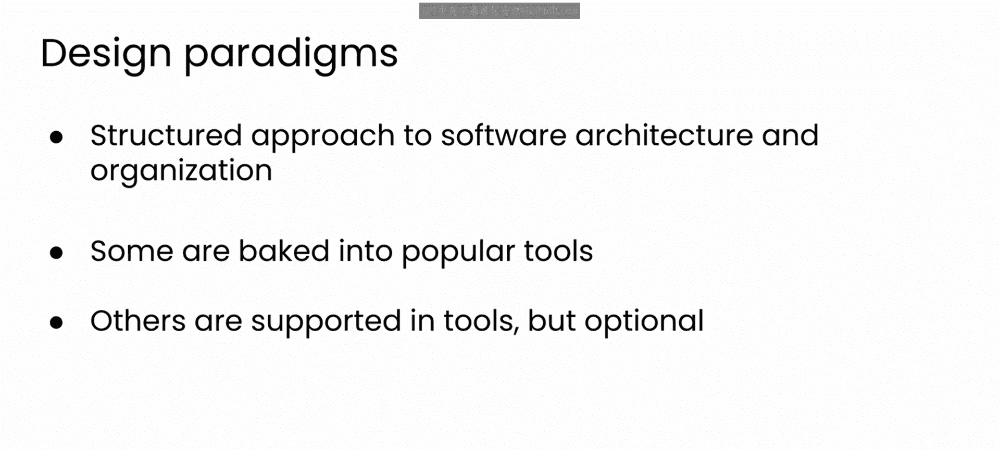
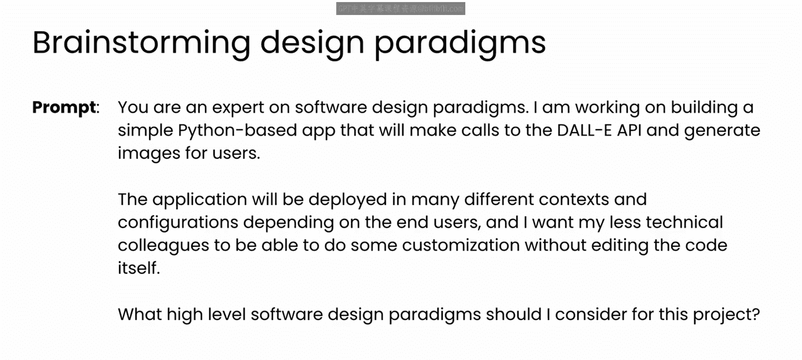
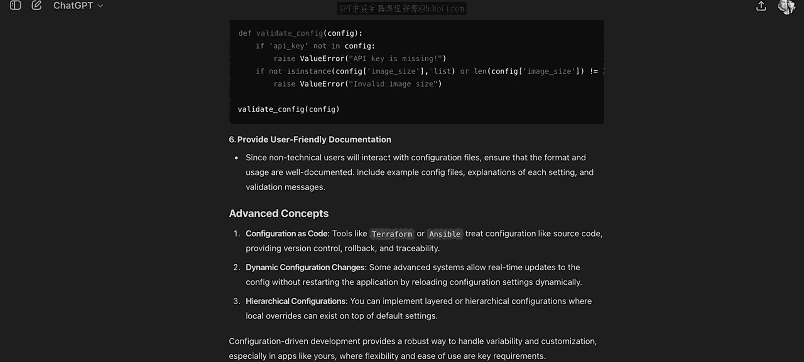
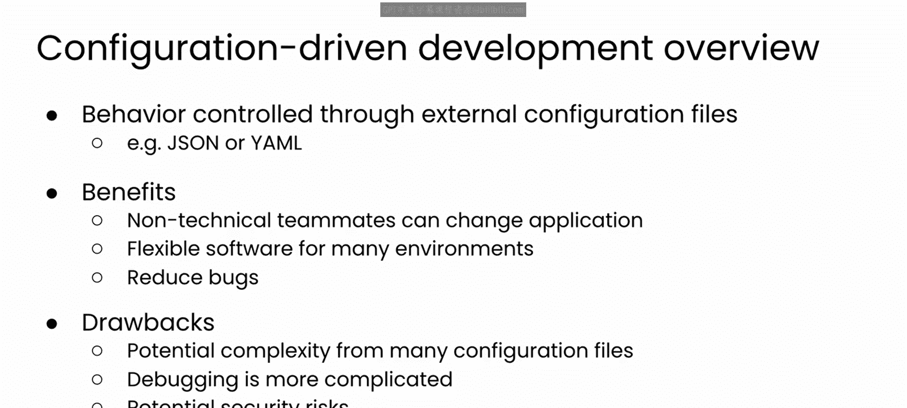
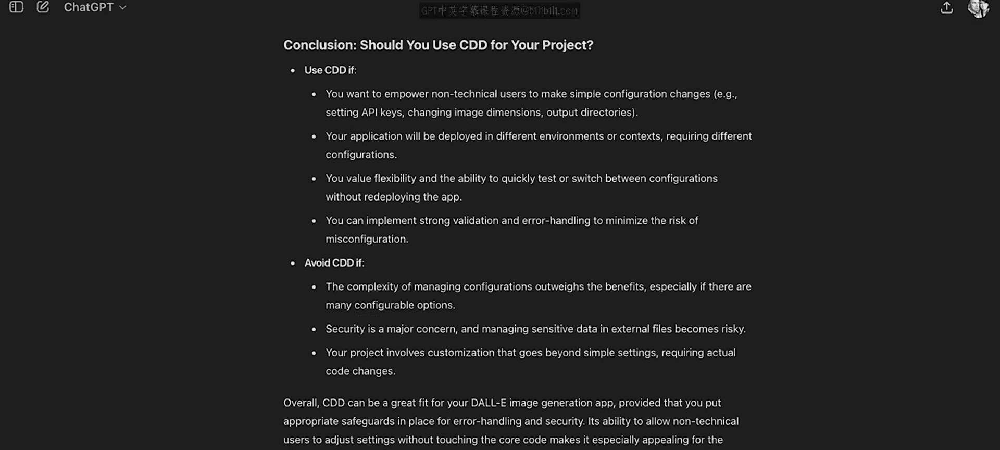

# 52：配置驱动开发概述

在本节课中，我们将要学习配置驱动开发这一软件设计范式。我们将探讨其核心概念、优缺点，并了解如何利用大型语言模型来辅助我们进行此类高层次的设计决策。

## 设计范式与LLM的辅助作用

在深入配置驱动开发的细节之前，我们先花点时间思考设计范式，以及如何利用大型语言模型来选择它们。

所谓设计范式，指的是任何用于解决常见开发挑战的、结构化的软件架构与组织方法。这些范式为解决软件设计与实现中的重复性问题提供了指导原则和模式。

你可能熟悉其中一些方法，例如**面向对象编程**或**模型-视图-控制器**。它们非常流行，以至于已经内置于编程语言和流行框架中。你可能甚至没有意识到自己正在选择使用它们。你可能只是在使用Java、C#、Flask或React，而这些范式与模式已经内置于那些语言或框架之中。尽管如此，它们仍会深刻影响你的软件结构方式、团队协作方式，甚至是你思考软件的方式。

你在行业中可能听过的所有范式，例如**微服务架构**或**测试驱动开发**，可能在你使用的工具中得到支持，但你的团队在构建软件时，仍然需要积极决定采用特定的方法。

在这些例子中，模块化或可靠性可能是重要的考量因素。决定遵循这些范式之一，意味着重视项目的某些方面胜过其他方面，并且这可能影响未来数年在该代码库上工作的体验。换句话说，这些都是重大的决策。

假设你被赋予了启动一个全新项目的责任。你如何思考所有这些高层次的决策？很可能你会借鉴自己的经验，或者朋友和队友的经验，甚至进行一些网络搜索。但正如你肯定期待我说的那样，我也建议你尝试与一个大型语言模型进行对话。

## 利用LLM探索设计范式

以下是我在思考本模块将要构建的项目时编写的一个提示词。

我赋予LLM一个“软件设计范式专家”的角色。我提供了我们稍后将构建的Dolly项目的背景信息，并解释了这个项目将如何构建和使用的一些设计约束，例如它可能根据最终用户的不同部署在不同的环境中。

LLM回应了多种范式建议，包括每种方法的简短摘要及其使用的好处。

在阅读了关于每种范式的一些介绍后，配置驱动开发似乎与我提示词中分享的一些约束条件很匹配。因此，我继续提示LLM，以获取关于这种方法的好处以及如何实现的更多细节。

LLM回应了关于配置驱动开发的更详细描述，包括其优点、缺点以及在实践中实现它的样子。由于这是我们将在本模块后续使用的范式，现在让我们来详细讨论其中的一些内容。

## 配置驱动开发详解

配置驱动开发是一种软件设计方法，其中应用程序的行为通过外部配置文件来控制，而不是通过源代码中的硬编码值。

想象一下，仅通过编辑一个文件就能调整你的应用程序行为。这就是配置驱动开发的魅力所在。

在实践中，它的工作方式如下。与其将值硬编码到源代码中，你可以创建外部配置文件，这些文件通常采用易于阅读的格式，如JSON或YAML。

这些配置文件可以控制各种事情，例如应用程序应使用哪些API密钥和端点、页面应显示何种语言、页面是亮色还是暗色模式，甚至可以是后端细节，如如何处理日志记录。

然后，你的项目源代码将读取这些细节，以便根据提供的设置来配置应用程序。

这种方法有许多好处。一个显而易见的好处是易于定制。这种方法允许团队成员，包括非技术同事，无需编辑源代码即可轻松更改应用程序的行为。它还使得软件更加灵活，可以轻松为不同环境进行配置。它甚至可以降低引入错误的风险，因为更改配置文件不需要编辑源代码。

当然，配置驱动开发也有一些缺点。管理许多不同的配置文件可能会变得复杂。调试问题也可能变得更加复杂，因为你的软件现在分布在源代码和配置文件之间。如果你将敏感信息放在配置文件中，还可能存在一些安全风险。

## 如何决定是否采用此范式

那么，你如何决定是否要实施这种范式呢？同样，我认为一种可行的方法是向LLM寻求建议，以权衡这些利弊。

当我这样做时，我得到了一套有用的考量因素，例如我的项目的定制需求、团队的能力、它将部署的环境多样性、长期的可扩展性考量、安全问题等等。当然，这些都是你应该考虑的重要因素。

因此，在本模块中，你将致力于实现配置驱动开发。我知道，在你的职业生涯中，可能有许多其他范式更适合你项目的需求。但我仍然鼓励你思考，像这样的互动对话如何能帮助你做出自己的设计决策。目标不是取代你作为决策者的角色，而是扩展你考虑的解决方案数量，并帮助你在项目背景下思考每个决策的利弊。

## 总结与过渡

本节课中，我们一起学习了配置驱动开发的基本概念。我们了解了它是一种通过外部配置文件控制应用行为的设计范式，探讨了其优缺点，并学习了如何利用大型语言模型来辅助我们进行此类设计决策。

现在你已经熟悉了配置驱动开发的基础知识，让我们来考虑如何实际实现它。配置驱动开发的一个核心任务是读取和写入配置文件，因此在下一个视频中，请与我一起更深入地探讨如何在Python中完成这项工作。