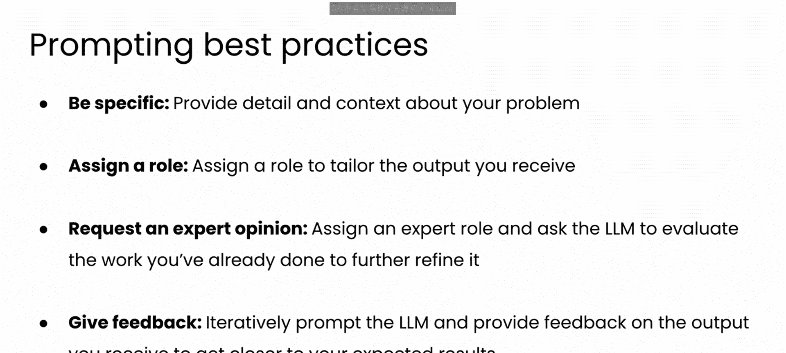
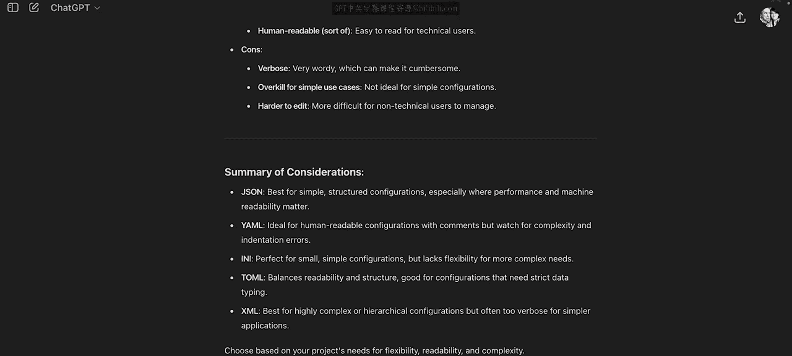
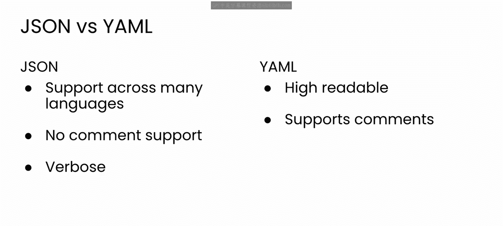
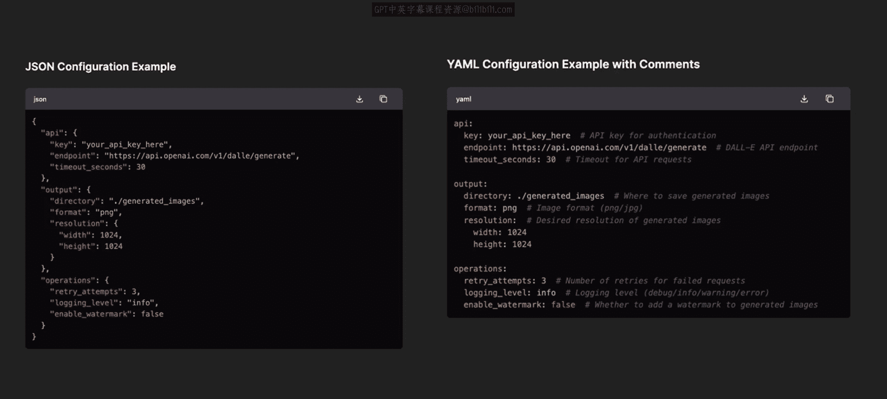
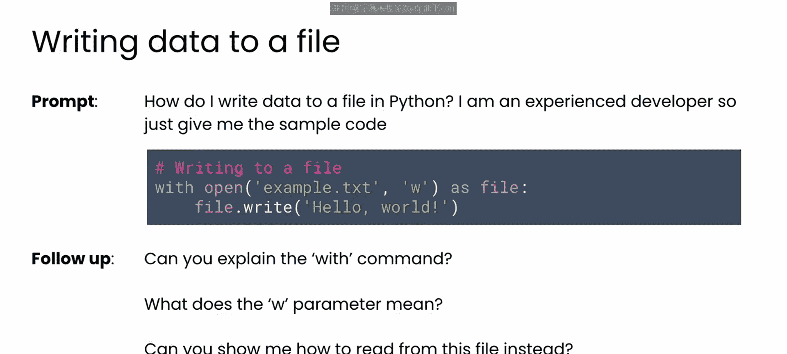
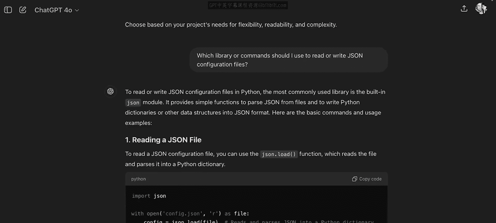

# 53：选择配置文件格式 📄

在本节课中，我们将学习如何为持续部署（CD）选择和使用外部配置文件。我们将探讨不同的配置文件格式，并了解如何使用Python来读写这些文件。

正如您所见，持续部署依赖于将配置细节移动到外部配置文件中。您的源代码随后读取这些文件，以定制软件的运行方式。

因此，让我们快速回顾一些可用于构建这些配置文件的文件格式，以及您将在这些文件上执行的一些常见操作。

这也是一个绝佳的机会，来重温您在前两门课程中一直在使用的LLM提示最佳实践。如果您完成了本专业的其他课程，那么您会知道这些最佳实践是：**具体明确**、**分配角色**（例如，扮演专家）、**请求专家意见**，并对LLM生成的文本或代码**提供反馈**。

---

## 选择配置文件格式 🤔

您需要做出的一个决定是：为配置文件使用哪种格式。您可以提示GPT并在此处征求一些建议。我只需分享项目背景，并请求一些用于构建配置文件的推荐格式，以及它们的优缺点。

模型回复了几种不同的建议，其中一些您可能很熟悉。让我们看看我得到的前两个回复：**JSON**和**YAML**。

以下是GPT推荐的两种主要格式及其特点：

*   **JSON**
    *   **优点**：结构良好，具有普遍兼容性，是Web上API请求和响应的实际标准。
    *   **缺点**：有时可读性较差，且格式较为冗长。
*   **YAML**
    *   **优点**：可读性高，支持注释，这对于配置文件很有用。
    *   **缺点**：依赖缩进（有点像Python代码），因此更容易导致错误。

如果您想查看每种格式的配置文件示例，可以直接要求GPT生成它们。这是GPT为我生成的示例配置文件。这对我决定使用哪种格式非常有帮助。YAML绝对非常易读，我也很喜欢包含注释的功能。而JSON则略显冗长，但我现在已经习惯阅读JSON文件了。我认为JSON庞大的工具生态系统可能使其成为更实用的选择。

---

## 读写配置文件的操作 💻

既然您已经选择了要使用的格式，接下来就需要编写一些代码来读写这些配置文件。

现在，假设您对Python中的文件操作有些生疏。那么，与其立即开始试验代码或阅读文档，不如从一个简单的提示开始，例如：“**如何在Python中将数据写入文件？我是一名经验丰富的开发者，请给我示例代码。**”

以下是我从该提示中得到的输出。如果您是一名经验丰富的Python程序员，这可能就是您快速回忆语法所需的全部内容。然而，如果您对这些命令中的某些不太熟悉，您可能会提出后续问题，例如：“**你能解释一下`with`命令吗？**”、“**`‘w’`参数是什么意思？**”或者“**能展示一下如何从这个文件中读取数据吗？**”。LLM将会回应，并有望帮助您填补知识上的任何空白。

但是，如果您要读写配置文件，这些技术可能并不合适。因此，让我们再跟进一次，询问在**专门读写JSON配置文件**时，是否有不同的推荐方法。

现在，GPT建议我考虑使用**`json`库**，该库用于读写JSON文件，并处理用于存储数据的文件序列化。

这将是构建应用程序架构的重要一步，因此让我们在下一个视频中更详细地看一下它。

---

在本节课中，我们一起学习了如何为CD选择配置文件格式，比较了JSON和YAML的优缺点，并初步了解了如何使用Python（特别是`json`库）来操作这些文件。下一节我们将深入探讨具体的代码实现。