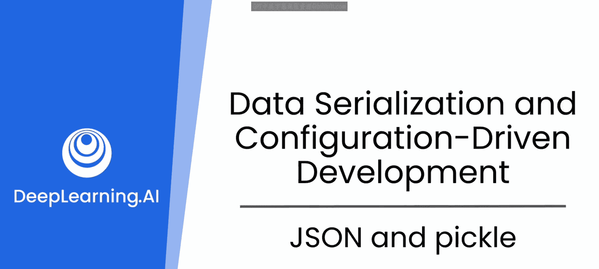
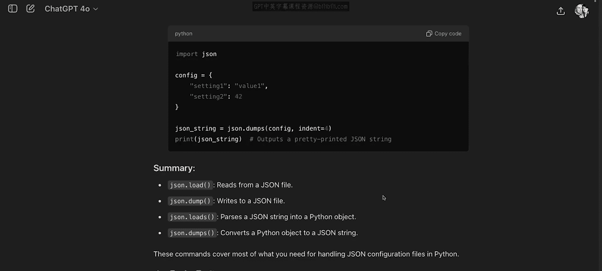
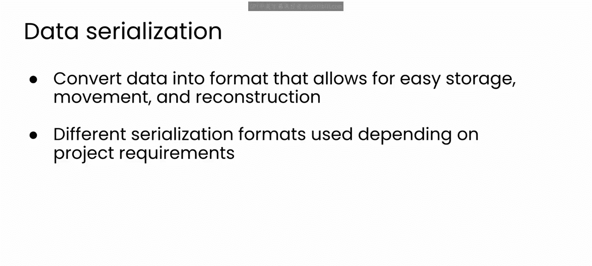
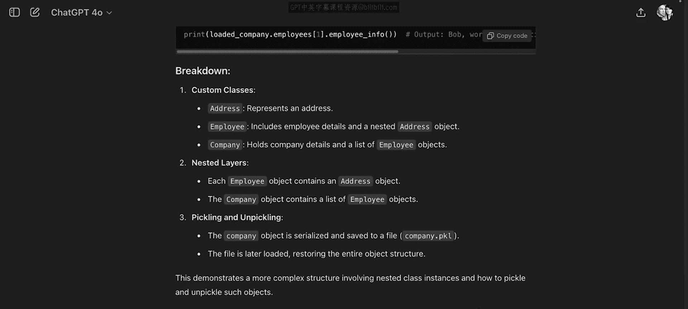

# 54：JSON与Pickle

在本节课中，我们将学习两种在Python中处理数据序列化的重要工具：JSON和Pickle。我们将了解它们各自的用途、核心命令以及如何在实际应用中选择合适的工具。

## 概述

上一节我们介绍了使用大语言模型（LLM）辅助编程的概念。本节中，我们来看看如何利用LLM的建议，学习使用JSON和Pickle库来读写应用程序的配置文件和序列化复杂数据对象。

## JSON库简介

在上一节的末尾，LLM建议我们需要使用Python的JSON库来读写应用程序的配置文件，并提到该库可以处理数据的序列化。

我知道一旦我的应用能够生成图像，我将需要能够保存和分享它们。因此，这些图像也需要被序列化。让我们花点时间更仔细地看看JSON库和文件序列化。

让我们继续与GPT进行同一个对话，并向它发送这个新的提示：“如果我打算用JSON读写配置文件，我应该熟悉哪些命令？你能给我看一些例子吗？”

模型回应建议，你最可能使用的四个命令是 `json.load` 和 `json.dump` 用于读写文件，而 `json.loads` 和 `json.dumps` 则对字符串进行相同的操作。

示例代码与我们之前看到的读写文件的代码非常相似。

因此，就读写配置文件而言，这将是一个良好的开端。如果我们想探索其他用例，可以随时回来咨询LLM。

`json` 命令为你处理的一个重要步骤是序列化Python字典，以便轻松地将其写入磁盘。

我知道你可能对此非常熟悉，但作为一个提醒，数据序列化是将数据对象和结构转换为易于存储、移动和稍后重建的格式的过程。你获取对象的内存表示（例如Python字典），并将其转换为你选择的格式（在本例中是JSON）。

## 选择序列化格式

选择正确的序列化格式和库取决于应用程序的具体需求。

你需要序列化的数据有多大？是否需要人类可读？是否需要与不同的编程语言或操作系统兼容？这些问题将决定你选择的序列化策略。

因此，回到DALL-E应用的配置文件，JSON是一个很好的选择，因为它是人类可读的，与许多平台兼容，并且存在许多用于处理它的库和工具，比如我们刚刚在Python中看到的JSON库。

但是，随着你构建应用，对于你可能包含的图像或其他对象的序列化，仅靠JSON库将无法处理所有这些。那么还存在哪些其他工具呢？

## ickle库简介

如果你有Python开发经验，那么你可能知道，在需要序列化大量数据的通用场景中，最适合的库是Pickle。

因此，让我们也向LLM询问一些关于Pickle的背景知识。我在这里用GPT-4做了这件事，你可以看到它给出的答案。它是一个用于序列化和反序列化Python对象的Python模块。它将对象转换为字节流，而反序列化则将字节流转换回对象。

那么，为什么这可能有用呢？首先，是持久性。Pickling允许你将对象的状态保存到文件中，让你在不同的程序运行之间存储数据。例如，你可以花费数小时训练一个机器学习模型，而Pickle将是在你再次运行它之前保存其数据的一种方法。

它还有助于数据传输。与其尝试将数据从对象中提取到像JSON这样的格式中，然后再读取并重新初始化对象，你可以直接保存整个对象。例如，如果你的图像生成应用想要存储像用户或图像这样的复杂对象，这可能是为以后存储该类信息的更好的通用方法。

Pickling也有助于缓存。如果有一个已初始化的对象你想共享和重用，而不是不断地需要重新初始化它，你可以直接将其保存然后重新加载。例如，如果许多用户尝试生成相同的图像，你可以决定缓存一些结果以备后用，从而节省生成这些图像的时间。

当然，另一个有用的方面是兼容性，但你应该检查你的自定义对象是否能在不同版本中工作。这是你的LLM结对程序员的一个很好的用途，可以查看你正在处理的内容是否可以被Pickle。

LLM指出的另一件事是，鉴于Pickle处理的是序列化对象，反序列化时得到的内容可能包含可执行代码。因此，在反序列化对象时要非常小心，因为你最终可能会运行一些你不想要的东西。例如，攻击者可能会用恶意内容替换你的Pickle文件。这是一个有用的提示。

## 使用Pickle

好的，让我们继续对话，探索如何使用Pickle。向GPT提问：“在Pickle中，我最需要了解的有用命令是什么？”

回应看起来与之前看到的JSON库非常相似。`pickle.load` 和 `pickle.dump` 处理向文件写入和读取序列化数据，而 `pickle.loads` 和 `pickle.dumps` 将处理与字符串之间的序列化数据。

模型还为每个命令返回了示例代码，以展示其用法。

Pickle是一个重要的库，因为它具有序列化复杂Python对象的能力。因此，让我们请求一些展示这一功能的示例代码。这里我将直接问GPT：“给我展示一个Pickle更复杂对象的例子。”

在回应中，模型现在生成了一个更复杂的对象来进行Pickle操作，这包括一个自定义类的实例和嵌套的数据层。然而，Pickle这个对象，和之前一样简单。

当我测试这段代码时，我很高兴地看到我可以让这个复杂对象完成序列化和反序列化的往返过程，并且它被完美无损地返回了。

## 总结

本节课中，我们一起快速了解了JSON和Pickle。你现在已经拥有了构建应用所需的所有技能，所以让我们开始编写代码吧。