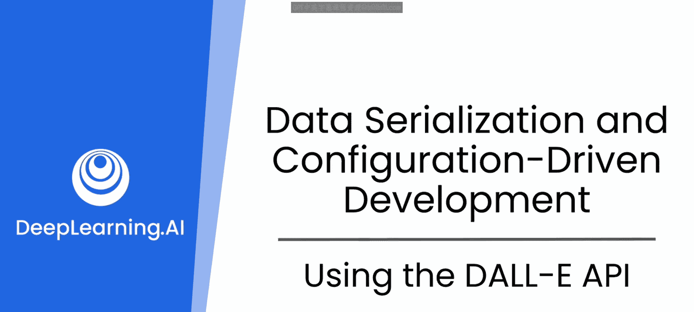
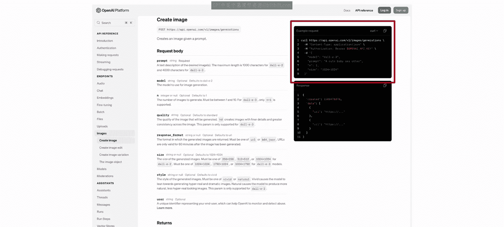
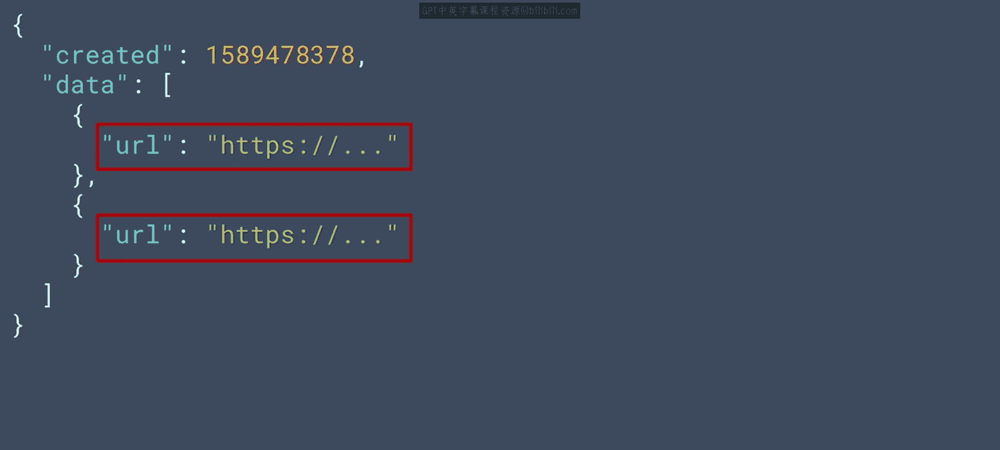
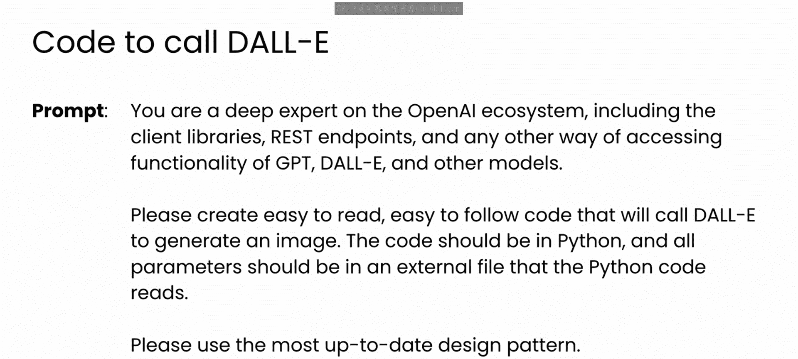
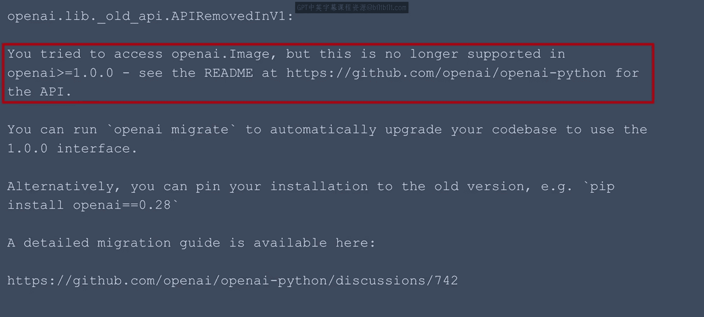
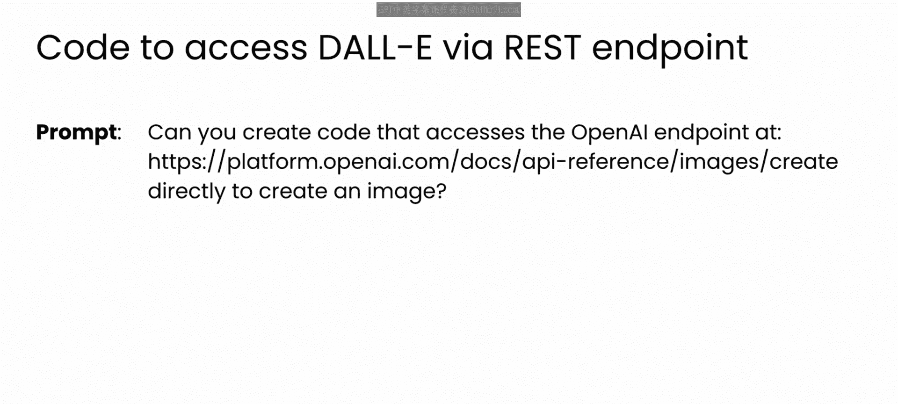
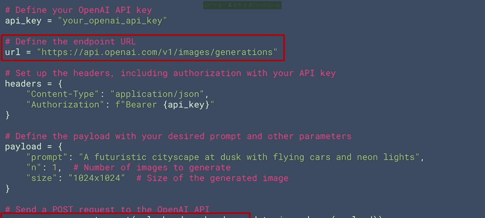

# 55：使用DALL-E API 🖼️

在本节课中，我们将学习如何利用OpenAI的DALL-E模型API来构建一个图像生成应用。我们将了解API调用的基本结构、参数设置，并探讨如何与大型语言模型协作，以编写正确且可维护的代码。



## 从LLM到图像生成模型

上一节我们介绍了如何使用大型语言模型来辅助读写JSON配置文件。本节中，我们将切换方向，开始使用OpenAI的Dalli模型API来构建我们的应用程序。


在本系列课程中，你一直在使用大型语言模型来帮助生成代码。但生成式AI并不仅限于代码或文本。像OpenAI的DALL-E这样的模型可以接收文本提示词，并用它们来生成图像。这正是我们将用来构建此应用的模型。



## 理解DALL-E API调用

通过API调用这些模型可能需要设置许多参数，如下所示。在官方文档页面，你可以看到一个用于创建图像的示例curl请求。


如你所见，为了成功调用，需要设置大量参数。我将这些参数分为两部分。

以下是第一类参数，即模型本身的参数：

*   **`prompt`**: 描述所需图像的文本。
*   **`n`**: 要生成的图像数量。
*   **`size`**: 生成图像的尺寸，例如 `"1024x1024"`。
*   **`response_format`**: 响应的格式，如 `"url"` 或 `"b64_json"`。

这些参数指导模型代表你创建图像。API文档会为你将它们分开列出。请注意，这不是参数的完整列表，但它是一个能帮助你获取图像的有用列表。

第二类参数是确保应用程序能按我们期望的方式工作的参数。在这种情况下，主要是API密钥。但正如你稍后将看到的，还有许多其他参数，例如我们希望从应用程序中保存文件的位置，以及是否要将其序列化存储。

## 处理API响应

调用DALL-E后，如果调用成功，你将收到一组URL，这些URL临时存储了为你生成的图像。响应负载看起来会像这样：



```json
{
  "data": [
    {"url": "https://example.com/image1.png"},
    {"url": "https://example.com/image2.png"}
  ]
}
```

这是一个包含`data`元素的对象，`data`元素内包含多个URL，每个都指向一张图像。你可以根据你的超参数要求DALL-E生成多张图像。上面的输出就是请求两张图像的结果。

如前所述，如果你正在创建一个应用程序来代表你进行所有这些调用，你可能希望下载并保存生成的图像，因此你必须为它们指定文件名。


## 构建应用与LLM协作实践

现在，让我们看看如何开始创建一个利用Dalli模型的应用。

我想在此快速说明，根据创建此应用的经验，这是一个绝佳的例子，说明了为何不应盲目信任LLM的输出。在录制本课程时，API正处于变动期，尽管我使用的是GPT（与生产DALL-E的公司相同的LLM），但GPT生成的代码已经过时，无法运行。因此，作为一名软件工程师，我确实必须预先做出一些决策，并根据这些决策来引导LLM。

让我来演示一下。首先，正如你在这些课程中看到的，当向LLM提示代码时，你必须非常明确。因此，对于像我们这里试图解决的问题——既需要代码又需要参数的外部文件——你应该非常清楚地说明你想要什么。



以下是我使用的提示词。如你所见，我首先为LLM分配了一个角色：OpenAI生态系统专家，深谙使用其模型所需的库和工具。我给出了明确的指令，说明我想要什么，然后要求它使用最新的设计模式。


作为回应，模型生成了这段代码。这里的`generate_image`函数使用`openai.Image`库来创建图像，它接收提示词和其他图像配置参数以设置API调用。

现在，这段代码表面看起来可能很好，但存在一个大问题：这个库已经过时了，并且是很久以前就被弃用的。因此，如果你尝试运行这段代码，很可能会收到类似这样的消息，指出`openai.Image`库不再受支持。

当我尝试按照响应中的说明操作时，我找到了一个详细的教程，但该教程专注于使用LLM端点，尚未为Dalli图像生成端点更新。




因此，我尝试使用GPT来重构代码以解决这个问题，但它最终让我在原地打转，唯一的现实解决方案是将我的客户端库降级到旧版本。不过，等到你观看本课程时，这个问题可能已经修复，代码可能可以运行。但我确实想分享我的经验，以重申你不应盲目信任LLM的观点。你应该持续测试生成的代码，并运用你的专业知识来绕过此类障碍。

## 引导LLM解决实际问题

在这里，如果你将LLM视为结对程序员，而不是盲目的代码生成机器，你们就可以开始共同解决问题。之前，你看到了可以调用来生成图像的REST端点。因此，如果你用这些具体信息引导LLM，你就可以在不降级库的情况下解决这个错误。

使用像这样的提示词，其中包含你想要使用的端点：



你现在可以获得不使用已弃用客户端库的代码，而是直接使用Python的`requests`库向端点发送POST请求。




代码中包含了一个硬编码的参数负载。如果你运行这段代码，现在会发现它可以工作。


## 迈向配置驱动设计

你在这里编写的代码是一个很好的开始，但它尚未遵循配置驱动的设计方法。为此，你必须识别代码中的可配置参数，然后重构代码，将这些参数外部化到一个文件中。同样，通过清晰、详细的提示，LLM可以帮助你完成这一步。

## 课程总结

本节课中，我们一起学习了如何使用OpenAI DALL-E API生成图像。我们了解了API调用的关键参数、如何处理响应，并重点实践了如何与大型语言模型有效协作，包括如何通过提供具体信息（如正确的API端点）来引导LLM生成可工作的代码，而不是盲目接受其初始输出。我们还认识到将代码重构为配置驱动设计的重要性。在下一节视频中，我们将看到所有这些步骤的实际操作。