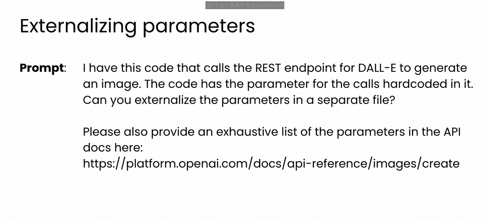
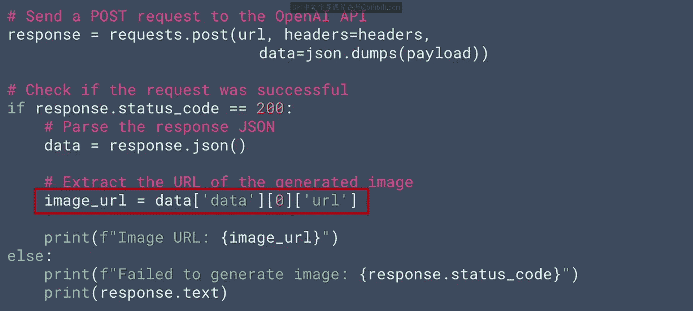
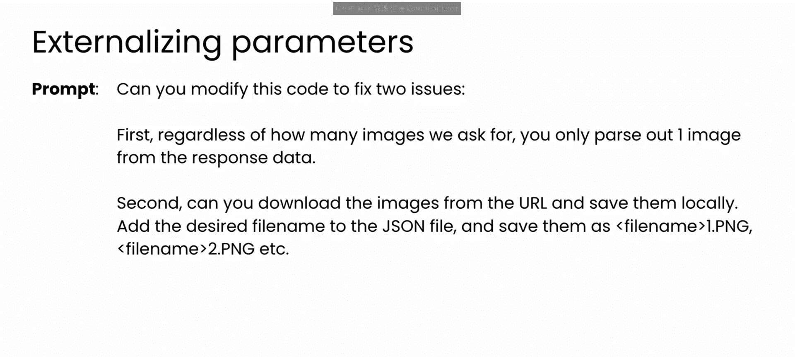
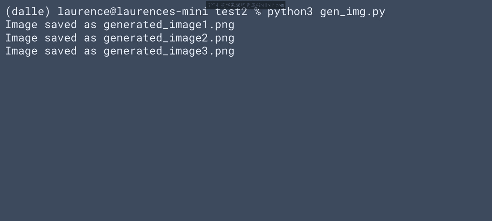
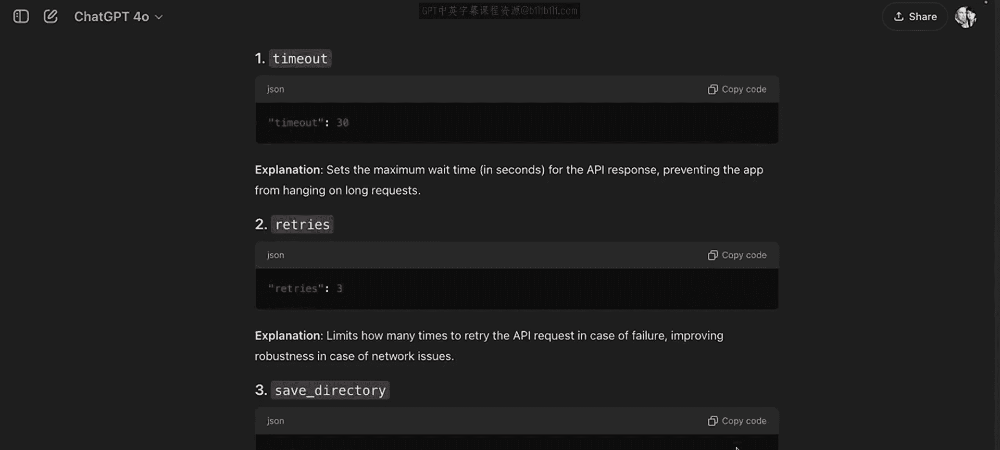
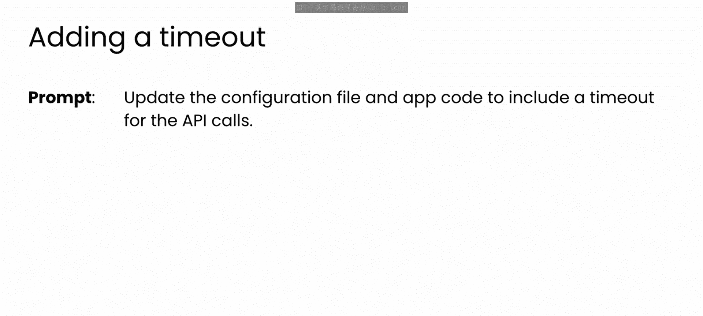
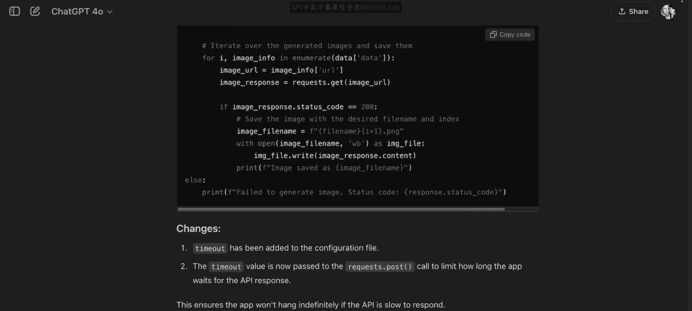
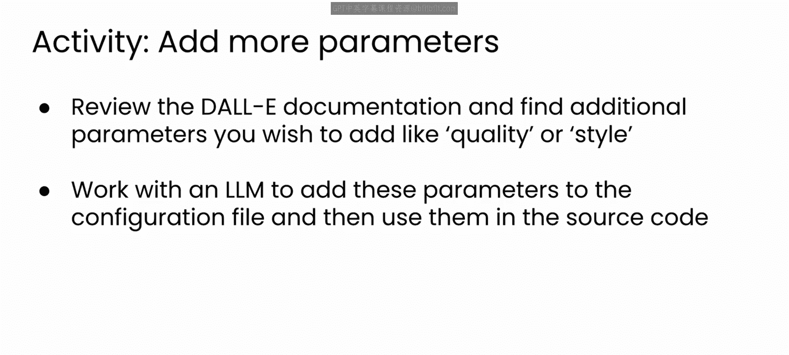

# 56：实现配置驱动开发 🛠️

在本节课中，我们将学习如何将硬编码的应用程序重构为配置驱动开发模式。我们将利用大语言模型的帮助，将配置参数外部化到独立的文件中，并逐步完善应用程序的功能。

## 概述

上一节我们介绍了如何创建一个调用DALL·E REST端点的客户端应用程序，但其配置细节被硬编码在核心逻辑中。本节中，我们将转向配置驱动开发方法，重构代码以将这些设置外部化。大语言模型可以协助我们完成这一步。

## 从硬编码到外部配置



以下是重构过程的第一步：指示大语言模型将参数外部化到一个单独的文件中。

```python
# 提示词示例：将应用程序的配置参数（如URL、API密钥、请求头）外部化到一个JSON配置文件中。
```

请注意，此提示词仅适用于具备网页浏览功能的聊天机器人应用程序。如果您的聊天机器人没有此功能，可以将文档内容复制并粘贴到提示词中。

模型随后创建了一个包含可配置参数的JSON文件。大语言模型按以下方式构建文件：控制应用程序如何调用后端模型的参数（如URL、API密钥和请求头）出现在顶部；而模型的超参数（如提示词、所需图像尺寸和数量）则被分组到第二个名为`payload`的部分。

`payload`部分存储了图像生成模型的提示词。在本例中，它要求模型创建一个“黄昏时分、带有飞行汽车和霓虹灯的未来主义城市景观”。

需要注意的是，尽管提示词要求模型列出所有参数，但它并未包含所有内容。您可以看到，外部化某些细节（如URL）有助于代码的未来维护，例如在端点变更时可以轻松更新。

模型还修改了之前的代码以使用这个配置文件。让我们逐步查看。

## 解析与使用配置文件

以下是代码的前半部分。它打开JSON文件，并使用之前见过的JSON模块加载它。

```python
import json

with open('config.json', 'r') as f:
    config = json.load(f)
```

读取参数变得非常简单，只需使用键从配置对象中选择即可。例如，可以轻松获取URL或API密钥。

```python
url = config['url']
api_key = config['api_key']
headers = config['headers']
```

构成端点有效负载的超参数则通过`payload`键作为单个数据项加载。

```python
payload = config['payload']
```

这段代码在调用端点时使用了URL、请求头和有效负载。

```python
import requests



response = requests.post(url, headers=headers, json=payload)
```

并且可以捕获响应。通常，状态码200表示请求成功。

请注意，此代码仅从响应数据中解析一张图像，无论您请求多少张图像。这可能需要修复，以便能够处理批量图像。此外，按当前写法，代码只返回图像URL，而不是图像本身。这也是需要修复的一点。一个不返回任何图像的图像生成应用程序用处不大。



## 完善应用程序功能

让我们通过另一个提示词来修复所有这些问题。由于代码已经包含在与聊天机器人的持续对话中，您可以继续对话，要求模型修改代码并修复我们刚刚看到的两个问题。

请注意，这里的提示词非常具体。我指定了文件名格式，并指出它应被包含在JSON配置文件中。

模型随后响应了更新后的代码。它更新了配置文件以包含文件名，并修改了Python代码以处理多个文件，如下所示。

代码遍历从API返回的数据，读取每个图像的URL，然后为您下载并保存每个图像。



```python
import os
from urllib.request import urlretrieve

# 假设响应数据是一个包含图像URL的列表
image_urls = response.json().get('data', [])

for i, img_url in enumerate(image_urls):
    filename = f"{config['output_filename_prefix']}_{i}.png"
    urlretrieve(img_url, filename)
    print(f"下载并保存: {filename}")
```

让我们尝试运行这段代码。我很好奇模型会生成什么样的未来主义城市景观。

运行代码后产生了以下输出，您可以看到生成了三张图像并下载为PNG文件。如果您好奇它们的样子，请看这里。



结果相当不错。模型很好地捕捉了黄昏时分的未来城市景象。

这种配置方法为我们的应用程序创造了很大的灵活性。现在，让我们尝试提示模型，看看是否还有其他可以移动到配置文件中的设置。当我向GPT征求建议时，我得到了很多有趣的想法，从登录控制到用户设置，甚至指定输出格式。



所有这些建议都很有趣，您可以尝试将它们添加到您的应用程序中。作为一个例子，让我们实现一个较简单的建议：为API调用添加超时设置。



## 添加超时配置

您可以提示模型更新应用程序代码和配置格式，以添加API调用的超时设置，指令如下：“更新配置文件和应用程序代码，为API调用包含一个超时设置。”

以下是模型生成的代码。配置文件现在包含了超时设置，应用程序代码也已更新，将其作为API调用的一部分使用。

```python
# config.json 中新增
"timeout_seconds": 30

# 应用程序代码中使用
response = requests.post(url, headers=headers, json=payload, timeout=config['timeout_seconds'])
```

至此，您拥有了一个有趣、简单且可配置的应用程序，用于使用DALL·E生成图像。正如您所见，大语言模型在开发此应用程序时提供了很大帮助。它首先建议将CDD范式作为项目的设计策略，然后帮助您按照该方法构建软件。

通过持续对话，大语言模型帮助您更新和改进应用程序，以处理新的配置选项和应用程序行为。

## 挑战与总结

这里有一个小挑战。之前我提到，GPT没有在配置文件中包含所有可用的DALL·E API参数，尽管提示词要求它这样做。花点时间回顾一下DALL·E的API文档，您会看到一些参数（如`quality`和`style`）没有包含在当前的配置设置中。

思考如何将这些参数添加到配置文件中，以及您的代码需要如何更改才能使用它们。然后尝试手动或使用大语言模型作为您的结对程序员来实现这些新的配置参数。这些是API中有用且有趣的方面，值得花时间看看是否能使其正常工作。



完成之后，您将采取的最后一个步骤是将结果与配置文件一起打包，以便与他人分享。我们将在下一个视频中解决这个问题。

本节课中，我们一起学习了如何将硬编码的应用程序重构为配置驱动开发模式。我们利用大语言模型将配置外部化，处理了批量图像下载，并添加了超时设置等新功能。这种模式提高了代码的灵活性和可维护性。