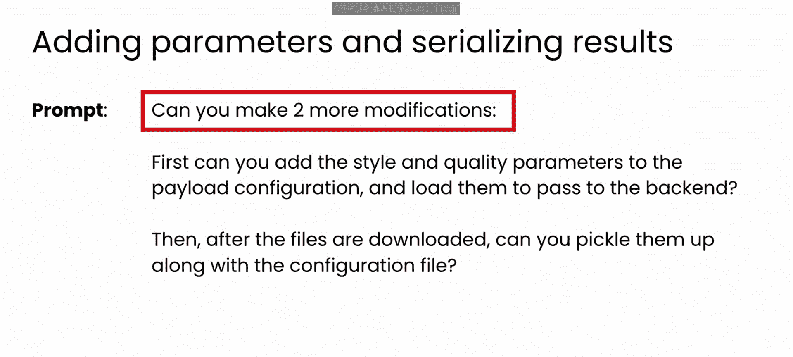
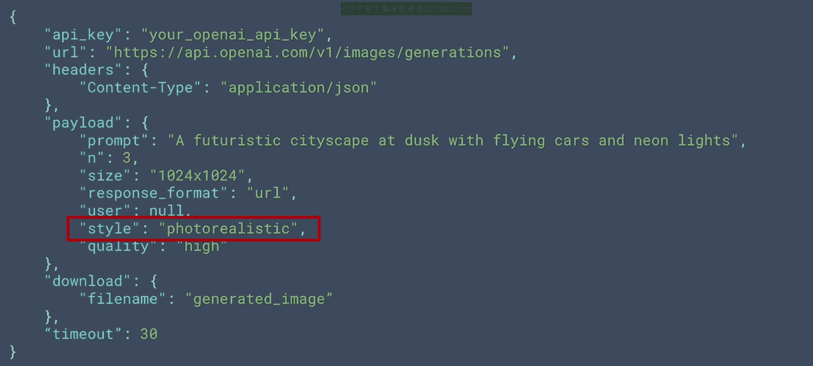
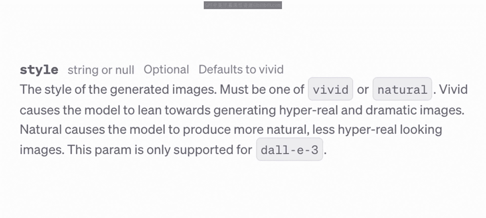
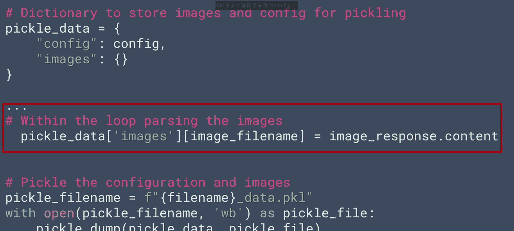
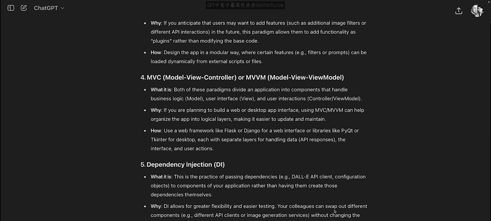

# 57：序列化结果

在本节课中，我们将学习如何将应用生成的图像及其配置设置序列化到一个文件中，以便于分享和复用。这是配置驱动开发流程的最后一步。

## 概述

上一节我们介绍了如何通过外部配置文件来驱动应用行为，实现了配置驱动开发。本节中，我们来看看如何将应用运行的结果——即生成的图像和对应的配置——打包成一个文件。这样，其他用户就可以查看这些图像，如果喜欢，还可以直接使用附带的配置来生成风格类似的图像。

## 使用Pickle进行序列化

我们的目标是将所有生成的图像文件以及生成它们所用的配置文件，合并序列化到一个单独的 `.pkl` 文件中。Python的 `pickle` 模块非常适合完成这个任务。

以下是实现此功能的核心代码步骤。首先，创建一个字典来存储配置和图像数据：

```python
import pickle

# 创建用于pickle的数据字典
pickle_data = {
    'config': config,  # 假设config是已加载的配置字典
    'images': {}
}
```

接着，在下载图像的循环中，将每张图像的数据添加到这个字典里：

```python
# 假设在一个循环中下载并处理图像
for item in config['image_details']:
    # ... 下载图像的代码 ...
    image_filename = f"image_{item['prompt'][:10]}.png"
    # 将图像数据读入内存
    with open(image_filename, 'rb') as f:
        image_data = f.read()
    # 存储到pickle数据字典中
    pickle_data['images'][image_filename] = image_data
```

最后，将整个数据字典写入一个pickle文件：





```python
# 将数据写入pickle文件
with open('app_output.pkl', 'wb') as pkl_file:
    pickle.dump(pickle_data, pkl_file)
```



现在，你就得到了一个包含所有配置和图像的 `app_output.pkl` 文件，可以轻松地分享给他人。

## 注意事项与挑战



在使用大语言模型（LLM）协助编码时，需要保持警惕。模型有时会“幻觉”出一些不存在的API参数或值。

例如，在本例中，模型为`style`参数设置了`photo realistic`这个值。但根据相关API文档，该参数实际只支持`vivid`或`natural`等选项。因此，始终需要对照官方文档验证模型生成的代码。

我留给你一个挑战：尝试编写解包（unpickle）这个数据文件的代码，提取出其中的配置，并思考如何让最终用户能利用这些参数来生成他们自己的类似图像。你可以自己尝试，或者请LLM帮助你完成。

## 本节总结

本节课中我们一起学习了如何利用`pickle`模块将应用程序的输出（图像和配置）序列化到一个文件中。这实现了结果的完整封装与便捷分享，是配置驱动开发工作流的自然延伸。



## 模块回顾与展望

至此，本模块的内容就结束了。回顾整个模块，你学到了多种有用的技术，可以帮助你在自己的开发工作中进行软件设计思考：

*   你看到了如何使用LLM来头脑风暴符合项目需求的软件设计范式。
*   你实践了一个使用**配置驱动开发**来设计和实现调用Dolly API的图像生成应用的完整例子。

在这个过程中，你看到了LLM如何帮助你做出重要的设计决策（例如配置文件的格式），并帮助你快速掌握你可能不熟悉的编码任务（例如在Python中读写文件、处理数据序列化）。

最后，你看到了LLM如何获取一些原型代码（例如使用Python SDK调用Dolly API的代码），识别出其中的可配置元素，并协助你编写配置文件和应用程序的核心逻辑。

我认为这是LLM一个非常强大的用途，它能帮助你运用久经考验的设计范式来构建高质量、灵活的软件产品。

当然，我们在本模块构建的原型中，数据处理相当简单，并未针对大型真实世界应用进行优化。虽然使用`pickle`分享应用结果很酷，但随着应用规模增长，内部数据变得更加复杂——尤其是当你需要对数据进行查询、排序和搜索时——你就必须使用数据库了。

因此，在下一个模块中，我们将更深入地探讨LLM如何帮助您为项目设计和实现数据库，内容将涵盖从**模式设计**到**查询优化**的整个流程。这将使你能够快速构建具有良好数据处理能力的健壮应用，并帮助你避免与糟糕数据库设计相关的常见问题。

让我们在下一个模块中，一起开始学习如何利用大语言模型进行数据库设计。