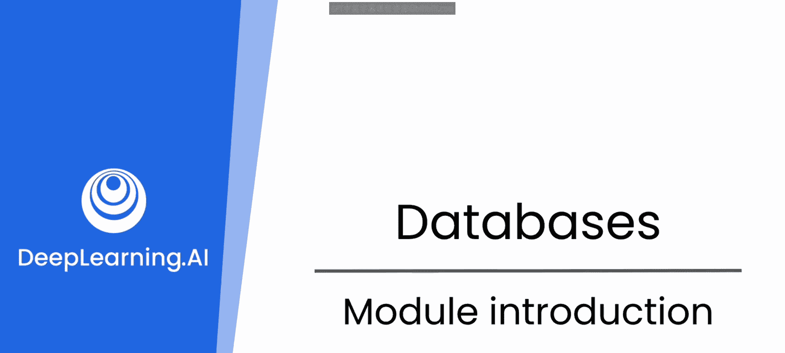

# 58：数据库设计模块介绍 🗄️

在本节课中，我们将探讨为什么在软件开发中，当应用需要处理大量数据时，一个设计良好的数据库架构至关重要。我们将了解糟糕的数据库设计可能带来的性能问题，并介绍如何利用大语言模型作为结对编程伙伴，来帮助我们设计高效、可靠的数据库架构。

当你的应用程序需要使用大量数据时，你可能需要的不仅仅是一个外部配置文件或文本文件。

特别是当这些数据需要被组织和检索时。

这正是后端数据库的用武之地。它们被构建为存储和检索信息的有效方式。

但是，为了充分发挥它们的优势，数据存储的方式需要被精心设计。

无论你的数据库引擎有多快或多强大，如果你的底层数据设计或架构执行得很糟糕，你将无法获得它提供的优势。

我可以回忆起一个故事，当时我在一个用于安全和监控的系统中工作。设计用于管理配置的嵌入式系统（深入到比特和字节级别）成本非常高。

例如，你必须控制谁可以使用哪个摄像头，以及他们将如何使用它等等。在嵌入式系统中，处理器为了分配或理解权限，实际上需要读取一个位图。

为了节省成本，我们考虑为此使用一台个人电脑，并将其嵌入到监控系统中。将信息放入结构化数据库比处理原始位图要容易得多，也更容易调试。

但在第一个版本中，数据库架构设计得非常糟糕，以至于在系统开机初始化时需要20分钟。你必须等待那么长时间才能使用它。作为对比，嵌入式系统只需要几分之一秒。这相当令人尴尬。

但幸运的是，我们修复了它。对你来说更幸运的是，大语言模型是优秀的结对编程伙伴，它们不仅能帮助你编写管理数据库的代码，还能帮助你设计高效、可靠且健壮的架构。

我们将在本课程中探讨这一点。😊

---

本节课中我们一起学习了数据库设计的重要性。我们了解到，即使拥有强大的数据库引擎，一个糟糕的架构设计也会导致严重的性能问题（如长达20分钟的初始化时间）。同时，我们也看到了将数据管理从底层位图转移到结构化数据库带来的可维护性优势。最后，我们引入了大语言模型作为强大的辅助工具，它将在后续课程中帮助我们进行高效的数据库架构设计和代码编写。