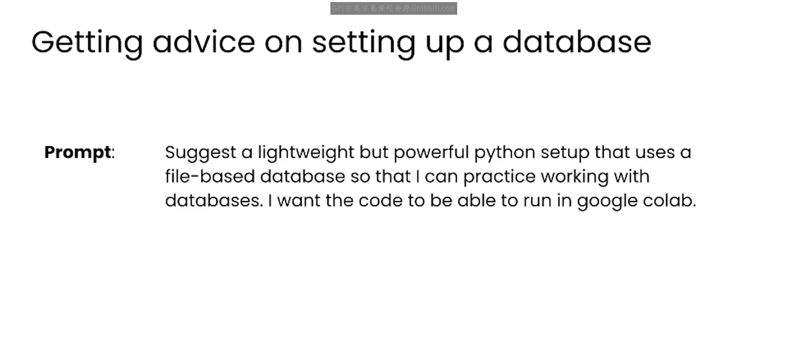
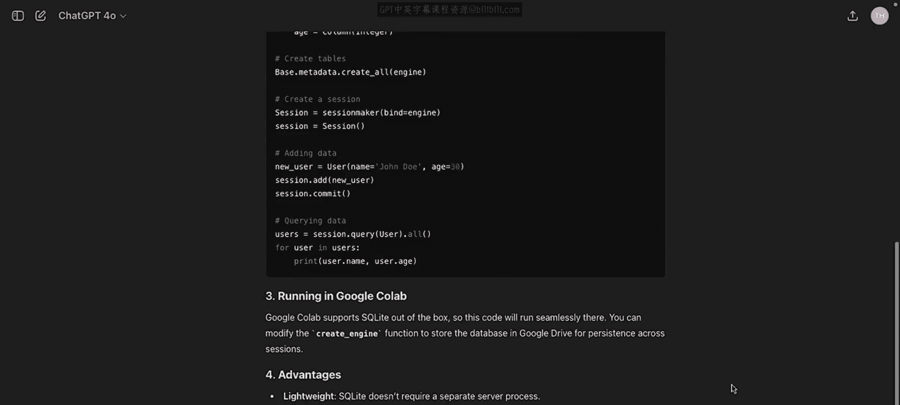
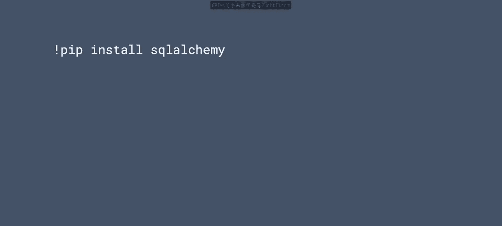
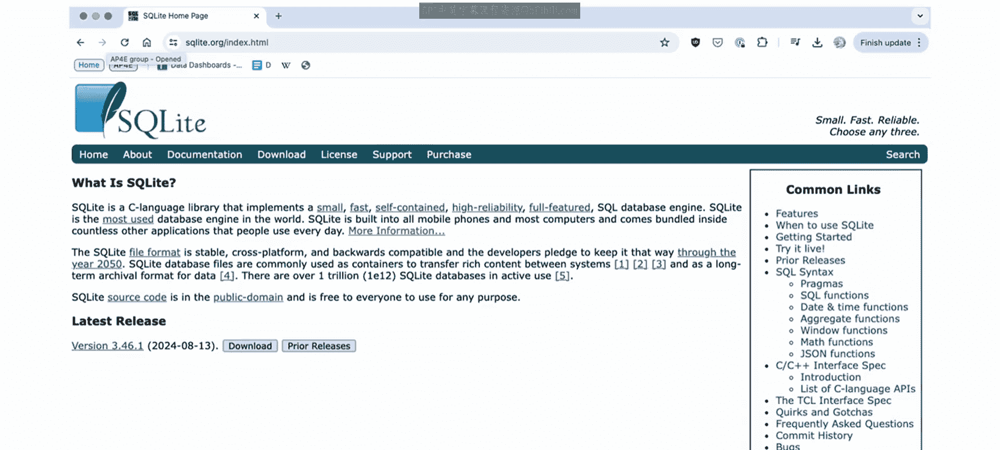
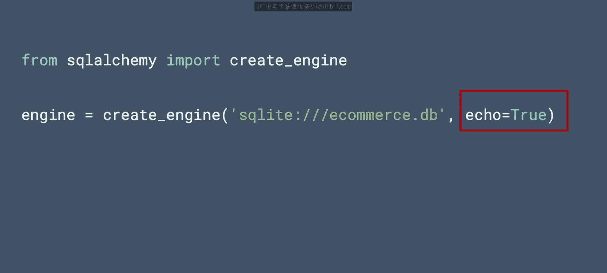
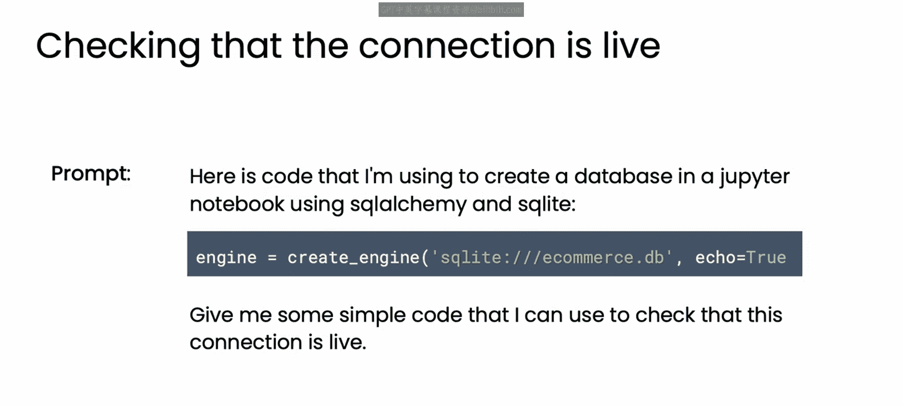
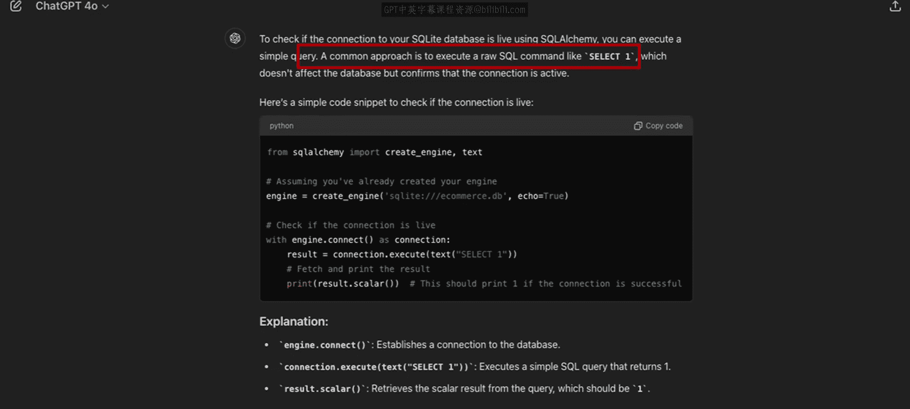
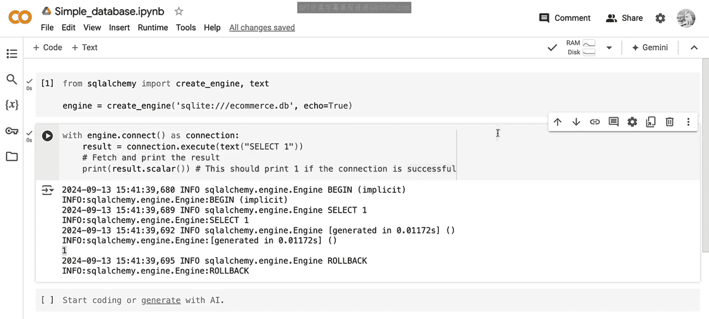

# 59：设置简单数据库 🗄️

在本节课中，我们将学习如何为数据库设计和访问实践设置一个简单的开发环境。我们将使用轻量级的文件数据库，以便轻松运行大语言模型（LLM）建议的代码。

学习数据库工作的一个挑战，首先在于要有一个可以访问的数据库。

因此，在本课程中，你将首先设置一个简单的开发环境。这个环境将允许你尝试LLM建议的任何代码，同时你思考与数据库设计和访问相关的问题。

## 选择开发工具 🛠️

在本模块中，你将使用Python中的SQLite和SQLAlchemy。这个软件包组合非常适合本课程，因为它们轻量、基于文件，并且可以在Colab或你的本地环境中运行。

如果你是一位经验丰富的Python开发者，你可能知道如何选择这个组合。但如果你不太熟悉并需要建议，你可以随时向LLM询问，让它为你推荐一个轻量级的数据库设置方案。

以下是一个你可以使用的提示词示例：
```
Suggest a lightweight but powerful Python setup that uses a file based database so I can practice working with databases. I want the code to be able to run in Google Colab.
```



当你运行这个提示时，LLM会给出建议。在本例中，它推荐的也是SQLAlchemy和SQLite的组合，并附带了如何安装和设置这些软件包的说明。




在本视频中，你将遵循一个类似的设置流程来启动和运行。


## 安装SQLAlchemy 📦

现在，让我们从SQLAlchemy开始。它是一个强大的Python库，提供了一套用于处理数据库的工具。

首先，你需要使用以下命令安装这个包：



```bash
pip install sqlalchemy
```


## 创建SQLite数据库引擎 🔧



SQLAlchemy安装完成后，你就可以设置一个示例SQLite数据库了。SQLite是一个轻量级、无服务器的关系型数据库管理系统，非常适合本课程，也非常易于使用。它包含在大多数Python设置中，因此通常不需要单独安装。


在此设置中，你将使用SQLAlchemy来创建和管理一个`.db`文件格式的数据库。

以下是导入必要库并创建连接到SQLite数据库引擎的代码：

```python
from sqlalchemy import create_engine



# 创建一个连接到SQLite数据库的引擎
engine = create_engine('sqlite:///ecommerce.db', echo=True)
```

这段代码创建了一个名为`ecommerce.db`的SQLite数据库。`echo=True`参数允许我们查看生成的SQL语句，这对于调试和理解SQLAlchemy在底层实际执行的操作非常有帮助。


## 测试数据库连接 ✅

很好，你现在已经设置好了数据库连接。当然，你应该做的第一件事是检查它是否正常工作。



在LLM出现之前，弄清楚如何测试这个连接可能需要搜索SQLAlchemy文档或Stack Overflow页面，而且你可能不容易找到你需要的答案。现在，你可以向LLM提供一些关于你如何设置数据库的上下文，并要求它提供检查连接是否存活的代码。


LLM会回复一些代码，但更重要的是，它还提供了一些检查连接的常用实践指导。在本例中，通过执行一个示例SQL查询`SELECT 1`。这种洞察是学习一个软件包、库或任何代码如何工作的绝佳方式。




如果你尝试运行这段代码，你会看到它确实在工作。首先，屏幕上会出现已执行的SQL命令，这是因为你在之前的代码中设置了`echo=True`。然后，你会看到如预期那样返回了整数`1`，这表明我们的连接是存活的。

因此，在继续使用这个数据库之前，我鼓励你按照本视频中的步骤操作，无论是在你自己的设置中还是在Colab中，然后使用上面的代码或你的LLM提供的任何代码来检查连接。



## 总结与展望 📝

本节课中，我们一起学习了如何设置一个基于SQLite和SQLAlchemy的轻量级开发环境。我们安装了必要的包，创建了数据库引擎，并学会了如何利用LLM来生成代码以测试数据库连接是否成功。


一旦你拥有了一个正常工作的数据库实例，请加入下一节课。在下一课中，我们将探索如何使用LLM来定义你的数据库模式。

😊