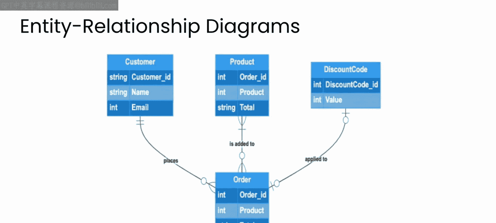
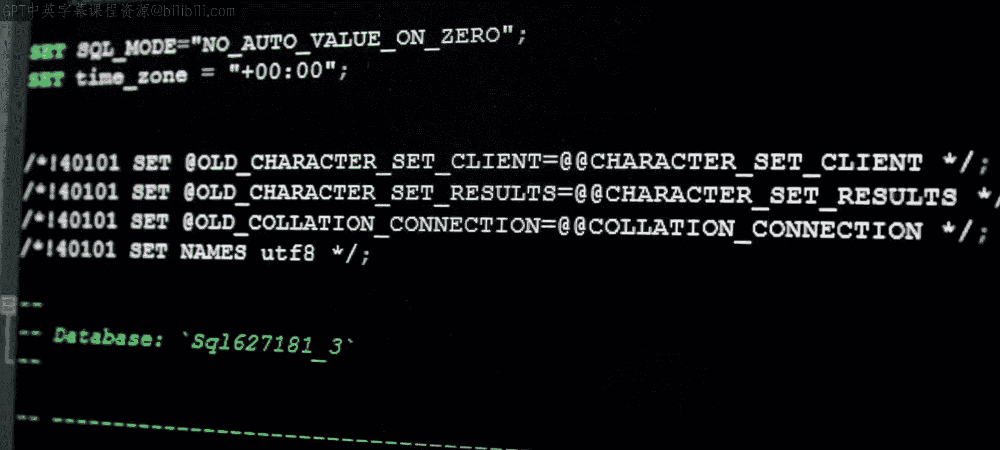
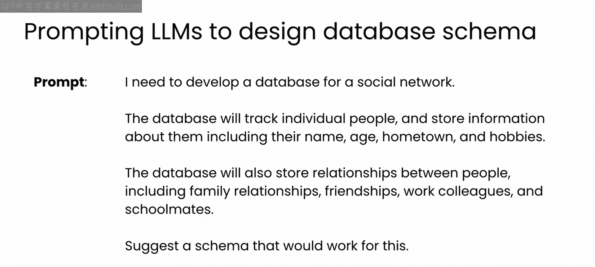
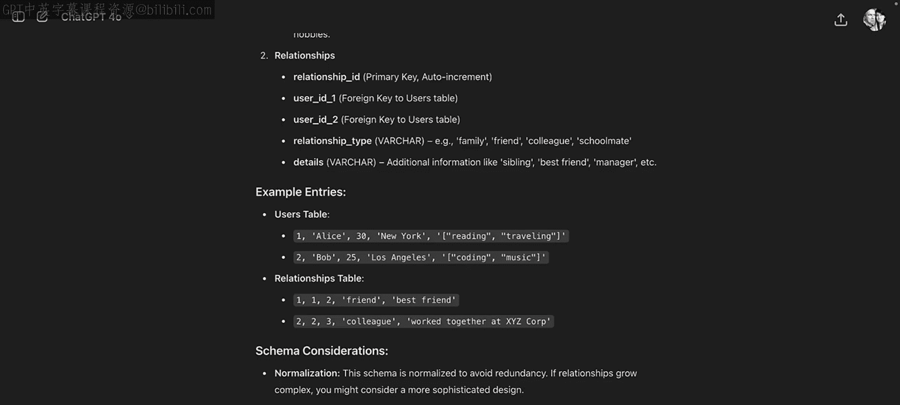
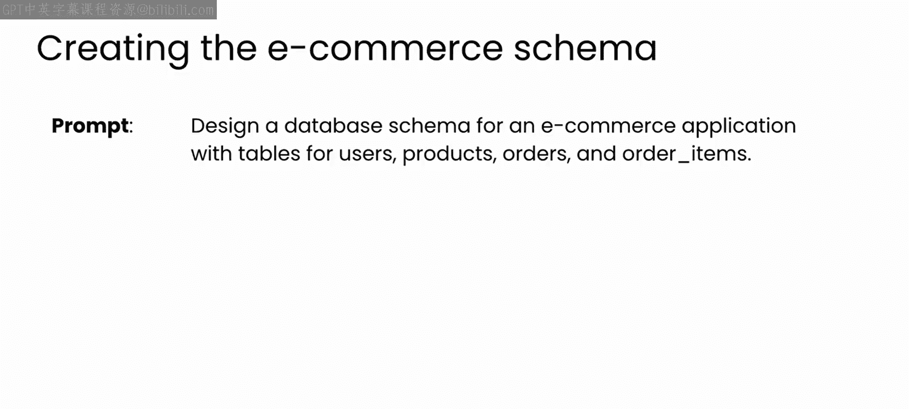
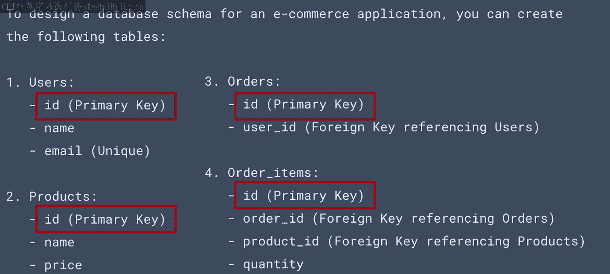
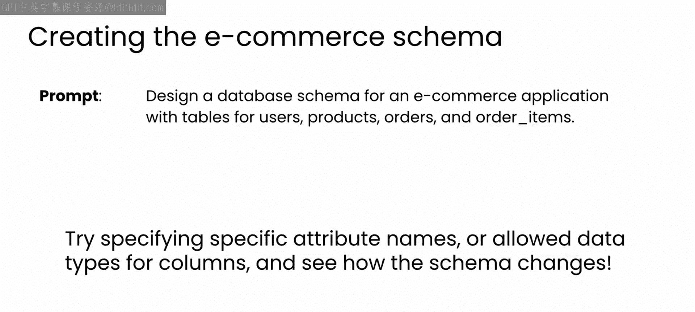
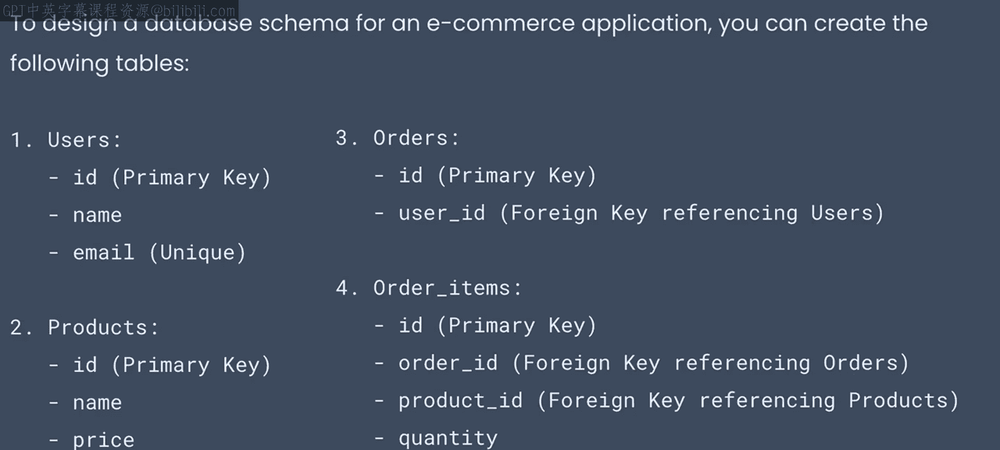
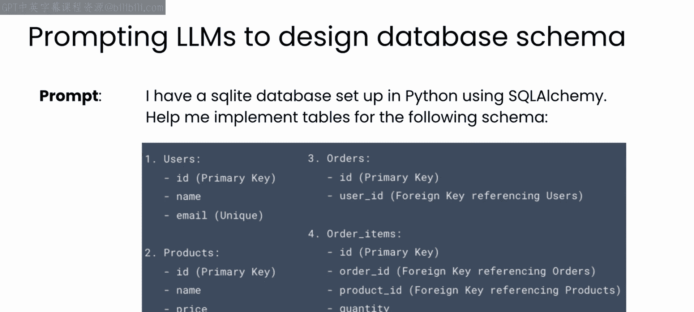
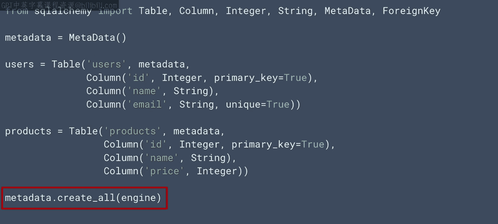

# 60：设计和实现数据库模式 🗄️

在本节课中，我们将学习如何利用大型语言模型来设计和实现数据库模式。我们将通过一个电子商务应用的例子，了解如何将自然语言描述的需求转化为具体的数据库表结构，并生成可执行的代码。

## 概述

环境设置完成后，可以进入数据库开发中最重要的一步：设计和实现数据库模式。本模块将探索一个电子商务公司的数据库示例，该数据库将存储用户及其订单信息。

## 传统数据库设计流程

数据库模式设计一直是一个结构化和协作的过程，涉及各种利益相关者和团队成员。

一个项目通常从需求收集阶段开始，团队需要确定需要存储哪些数据以及如何使用这些数据。

接下来，可能会创建一个称为实体关系图的可视化图表，以映射数据库中的记录类型、实体的属性和关系。

此图可用于决定数据库中将包含哪些表和列，以及索引策略是什么。

然后，与开发团队合作，将其实现到特定的数据库管理系统（例如 MySQL）中，并创建开发人员使用数据库所需的文档。

模式设计可能耗费大量时间和成本，并涉及许多人员和会议。

## 利用LLM进行模式设计

在LLM时代，现在可以利用AI来协助完成模式设计的大部分工作，这减少了建立工作原型所需的时间，使得后续关于生产环境实施的讨论更加高效和富有成效。

LLM可以将高级业务需求或自然语言描述转化为初步的数据库模式。

例如，如果向LLM提供一个社交网络的描述，包括网络中人员的属性和要捕获的关系，并要求它创建一个模式，LLM将建议一个详细的模式，包括表、列、属性的数据格式等。

它甚至可以创建一些示例条目，并就其做出的选择（例如它推荐的索引键）提供一些考虑因素。

LLM从互联网上的大量数据库代码示例中学习，了解如何将需求映射到模式，甚至了解哪些模式策略在不同场景下效果最佳，因此这可以节省大量时间，并让您更快地启动和运行。

## 实践：电子商务应用模式设计

让我们回到本模块将重点关注的示例：一个简单的电子商务应用，用于跟踪用户、产品、订单以及订单中的单个商品。

以下是您可以采取的方法：

*   **传统方法**：花费大量时间思考所有选项，例如定义哪些属性、它们之间的关系等。根据项目阶段，这些可能尚未明确定义。
*   **LLM辅助方法**：利用LLM对电子商务和数据库模式的理解，通过提示让它为您生成模式。

例如，使用以下提示：
`设计一个用于电子商务应用程序的数据库模式，包含用户、产品、订单和订单项的表。`

LLM将利用其数据库设计知识为每个表建议属性和键，所有这些看起来都很有用。它还确定了将用于跨表匹配记录的键，在本例中是ID。

这里使用的提示相当简单，但当然，提供的上下文越多，LLM创建模式的效果就越好。

尝试修改问题以指定属性名称或数据类型，然后观察和探索模式如何变化。

## 从设计到代码实现

虽然使用LLM设计模式非常有用，但使用它来实现其设计出的代码才是真正的变革。

它可以帮助您非常快速地构建工作原型。

此时，请尝试将电子商务数据库的这个模式转化为代码，以实现所需的表。

与LLM合作，为本模块中使用的SQLAlchemy设置创建代码，并思考如何用所需的上下文来优化您的提示，以引导LLM创建您想要的内容。

以下是我使用的方法和与LLM的对话：

我让LLM了解我的数据库设置，即我正在使用SQLite和SQLAlchemy。然后我提供了我想要实现的数据库模式。

生成的代码可能会因LLM内部的随机化而略有不同，或者您甚至可能使用不同的LLM，但整体结构应该相似。

以下是GPT-4为`users`和`products`表生成的代码，看起来相当不错。

LLM使用了`Table`对象，为模式中指定的每个属性创建了列，并为每列选择了合适的数据类型。

LLM还识别了该列是否作为主键，如果是，则添加了适当的参数。`metadata.create_all()`命令将为您在SQLite数据库上生成创建这些表的SQL语句。

本课程下载中提供了所有表的完整代码。请查看并将其与LLM为您编写的内容进行比较。如果您不理解任何差异，请随时要求它更详细地解释。

## 总结

本节课中，我们一起学习了如何利用生成式AI辅助数据库模式的设计与实现。我们了解了传统设计流程的步骤，并重点探索了如何使用LLM将自然语言需求快速转化为初步的数据库模式设计，甚至生成可直接执行的SQLAlchemy代码。这极大地加速了原型开发阶段，为后续更高效的生产环境讨论奠定了基础。

表结构就绪后，数据库即可投入使用。为此，需要思考用于向表中添加、更新和删除数据的操作，这些操作统称为CRUD。请加入下一节视频，了解如何在数据库开发的这一阶段与LLM协作。