# 61：实现CRUD操作 🛠️

在本节课中，我们将学习如何与大型语言模型（LLM）结对编程，为我们的电子商务数据库实现CRUD操作。CRUD代表**创建**、**读取**、**更新**和**删除**，这是数据库中最基本的四种操作。我们将基于之前创建的数据库进行构建。

## 理解CRUD操作

上一节我们介绍了数据库设计，本节中我们来看看如何实现核心的数据操作。

CRUD是数据库交互的基石，其含义如下：
*   **C**reate：向数据库添加新记录。
*   **R**ead：从数据库查询和检索记录。
*   **U**pdate：修改数据库中现有的记录。
*   **D**elete：从数据库中移除记录。

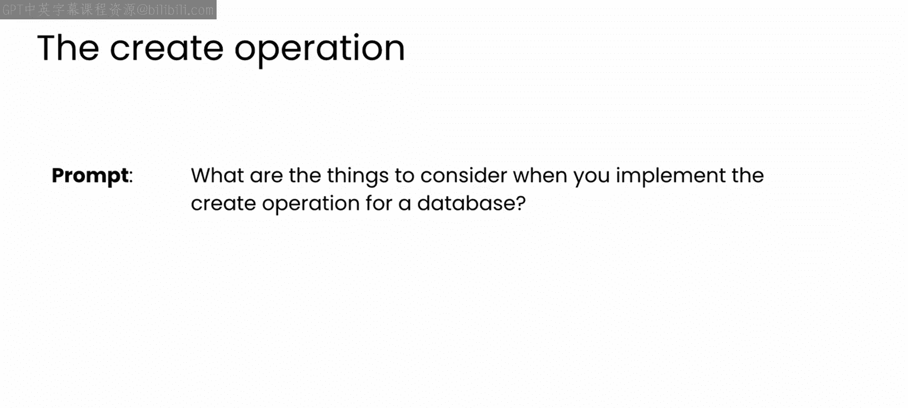

## 实现创建（Create）操作

首先，我们关注如何向数据库添加新数据。在实现创建操作时，需要考虑多个方面，LLM可以帮助我们识别这些问题。

以下是创建操作需要考虑的一些关键点：
*   数据验证
*   防止SQL注入等漏洞的安全协议
*   错误处理
*   事务管理
*   并发控制
*   审计日志

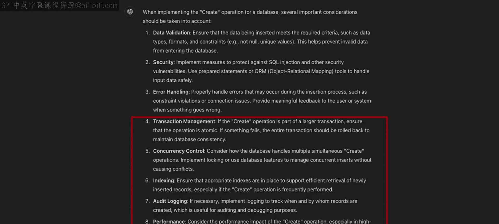

在项目初期，你可能不需要担心所有问题，但随着项目进展，可以随时向LLM寻求建议。

让我们开始请求ChatGPT帮助生成一个函数，用于向电子商务数据库的`users`表添加新用户。

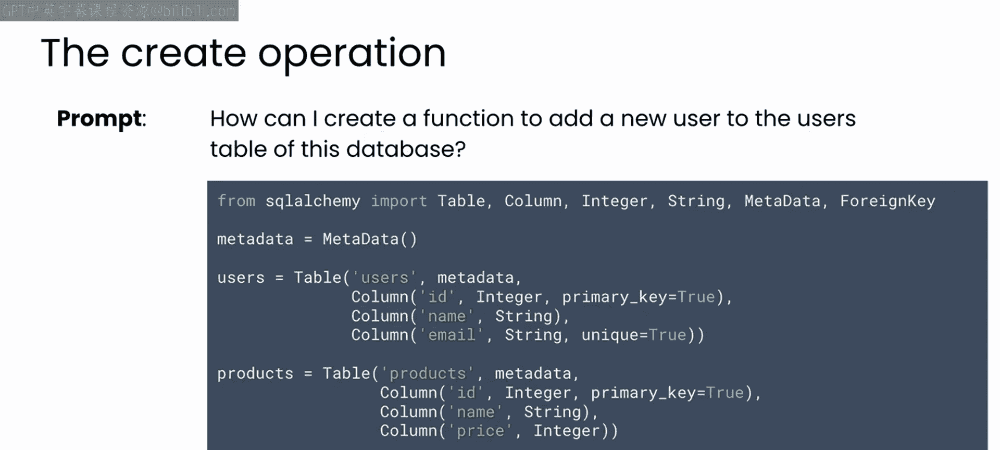

**提示示例**：
> “使用SQLAlchemy，为我的电子商务数据库的`users`表编写一个添加新用户的Python函数。”

LLM生成的代码可能如下所示，它创建了一个会话并定义了`add_user`函数：

```python
from sqlalchemy.orm import sessionmaker

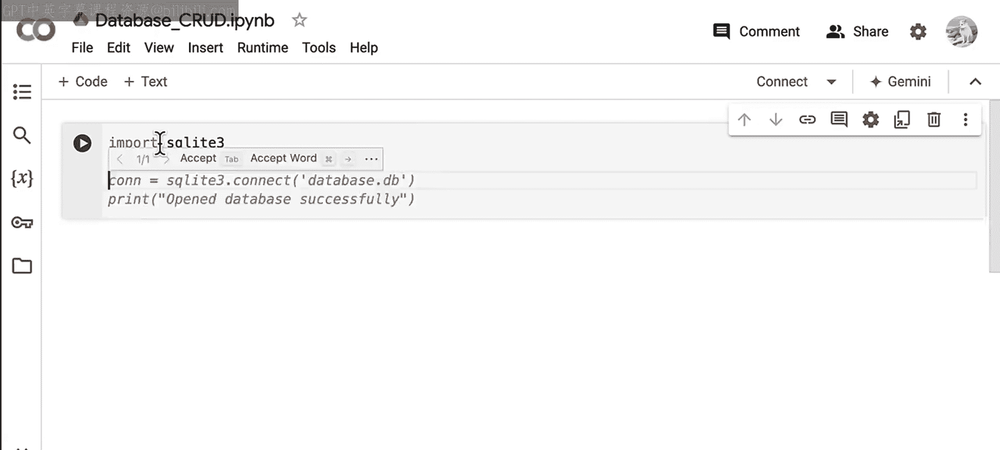

Session = sessionmaker(bind=engine)
session = Session()

def add_user(name, email):
    new_user = User(name=name, email=email)
    session.add(new_user)
    session.commit()
    print(f"User {name} added successfully.")

# 测试函数
add_user("John Doe", "john.doe@example.com")
```

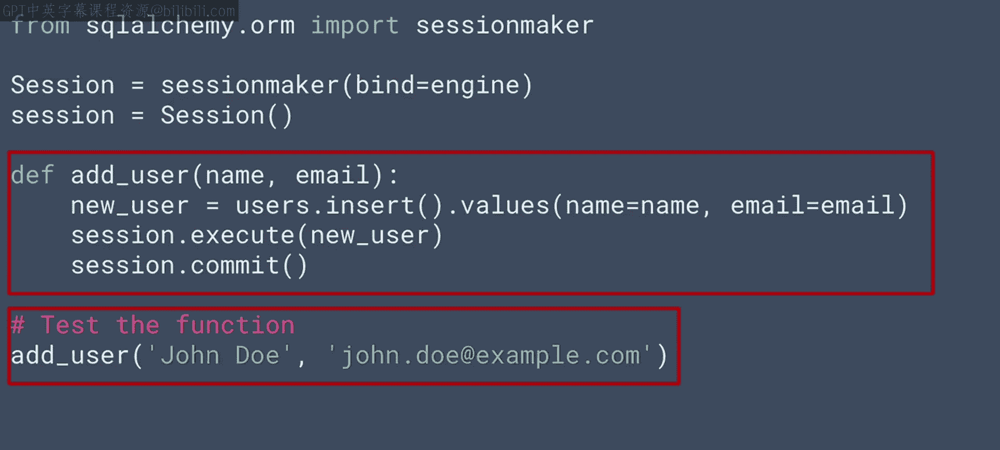

运行此代码后，SQLAlchemy会输出相应的SQL语句，表明用户已成功添加。

## 实现读取（Read）操作

成功添加数据后，我们需要验证数据是否正确写入。这就需要实现读取功能。

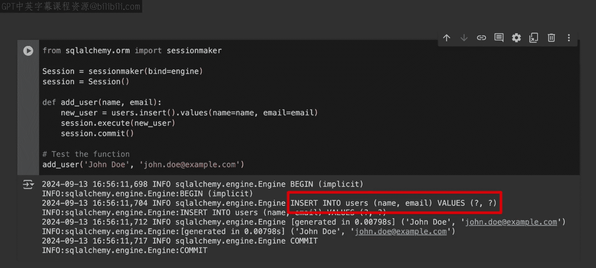

同样，我们可以用一个简单的提示让GPT创建相应的函数。

**提示示例**：
> “编写一个Python函数，使用SQLAlchemy从`users`表中读取并返回所有用户。”

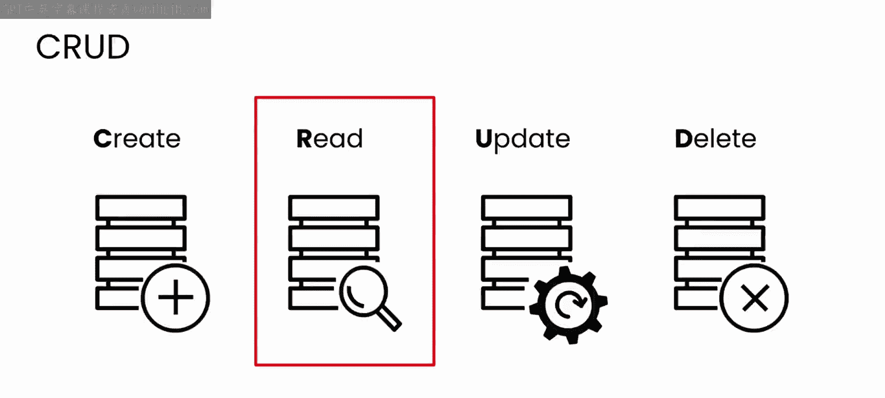

LLM生成的代码可能类似于以下内容，它执行查询并返回结果列表：


```python
def get_all_users():
    users = session.query(User).all()
    for user in users:
        print(f"ID: {user.id}, Name: {user.name}, Email: {user.email}")
    return users

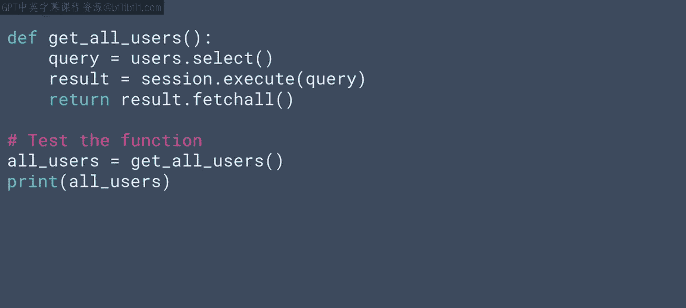

# 执行读取操作
all_users = get_all_users()
```

执行此代码将输出数据库中所有的用户记录，确认之前添加的“John Doe”已被成功检索。

## 实现更新（Update）操作

现在，假设我们需要更新用户的信息，例如修改其电子邮件地址。

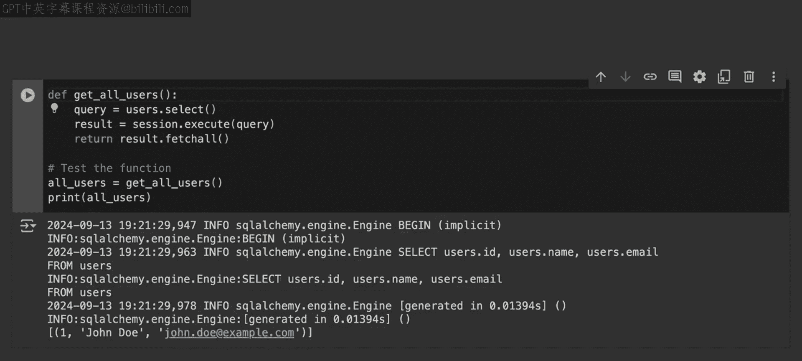

我们可以再次提示LLM生成更新代码。

**提示示例**：
> “编写一个函数，根据用户ID更新`users`表中用户的电子邮件地址。”

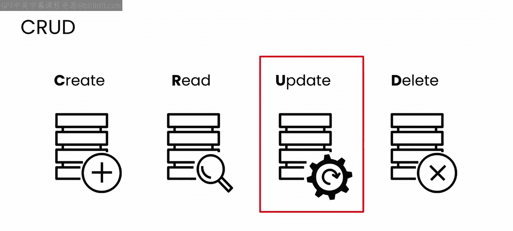

生成的函数可能如下所示，它根据ID查找用户并更新其邮箱：

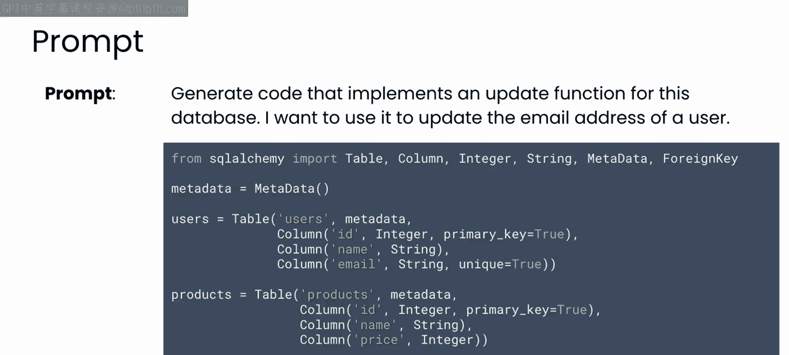

```python
def update_user_email(user_id, new_email):
    user = session.query(User).filter_by(id=user_id).first()
    if user:
        user.email = new_email
        session.commit()
        print(f"User ID {user_id} email updated to {new_email}.")
    else:
        print(f"User with ID {user_id} not found.")

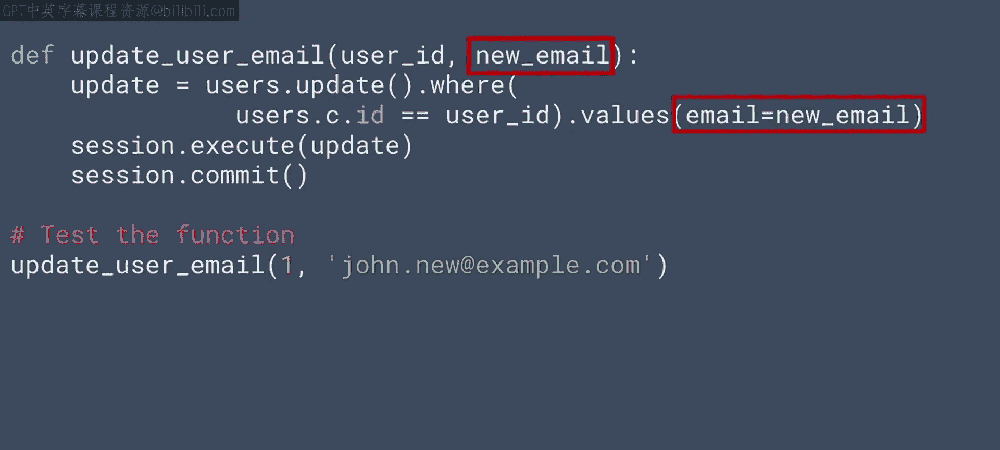

# 更新用户邮箱
update_user_email(1, "new.email@example.com")
```

执行更新后，再次运行`get_all_users`函数，可以看到用户的电子邮件地址已更改。

## 实现删除（Delete）操作

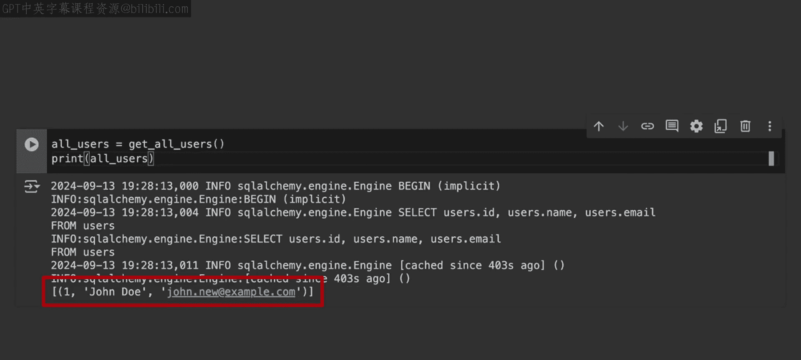

最后，我们来实现删除操作，即从数据库中移除记录。

请思考如何提示LLM编写一个根据ID删除用户的函数。

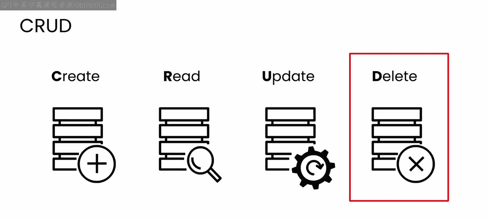

**提示示例**：
> “编写一个使用SQLAlchemy、根据用户ID从`users`表中删除用户的函数。”


LLM生成的代码可能如下：

```python
def delete_user(user_id):
    user = session.query(User).filter_by(id=user_id).first()
    if user:
        session.delete(user)
        session.commit()
        print(f"User with ID {user_id} deleted.")
    else:
        print(f"User with ID {user_id} not found.")

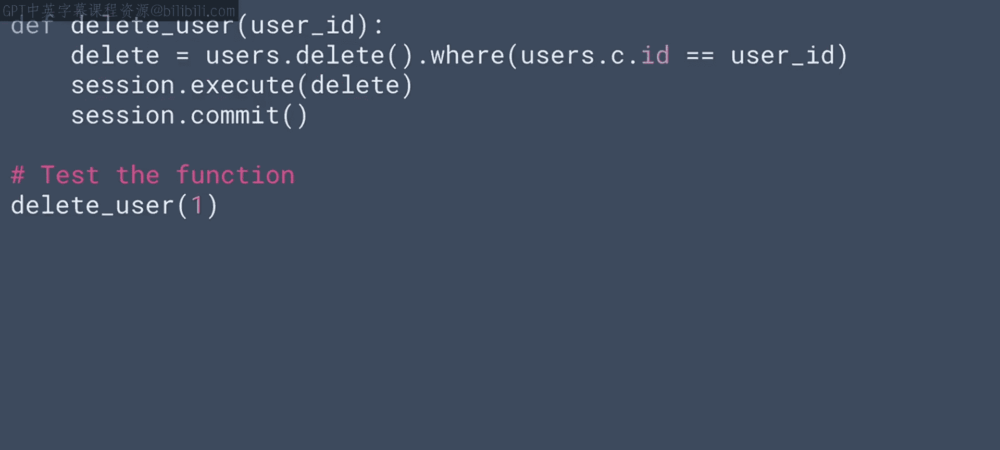

# 删除用户
delete_user(1)
```

执行删除操作后，再次调用`get_all_users`函数，应返回空列表，表明用户已被成功删除。

## 安全考量与ORM

在实现过程中，我们可能担心SQL注入的安全问题。即使我们使用SQLAlchemy的API，底层仍会生成SQL语句。

我们可以直接向LLM咨询代码的安全性。例如，提问：“我上面生成的`add_user`函数代码是否容易受到SQL注入攻击？”

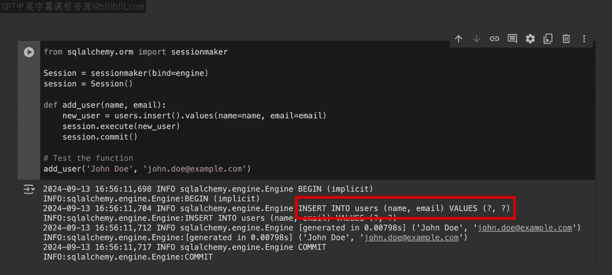

LLM可能会指出，直接使用某些方法可能存在风险，并建议采用ORM（对象关系映射）方式来更安全地处理数据。ORM将数据库表映射为Python类，其方法能有效防止SQL注入。

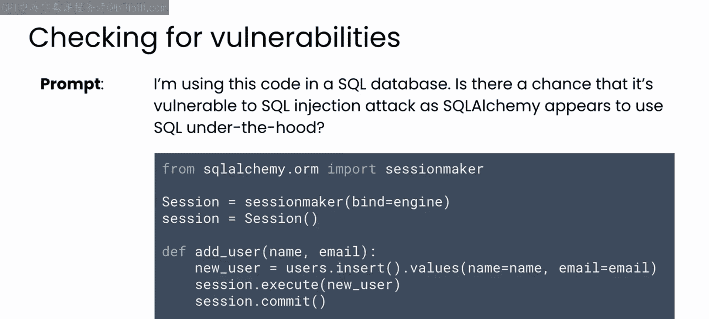

LLM提供的改进代码可能如下：

```python
# 使用ORM方式定义User类（通常在模型定义中完成）
# class User(Base):
#     __tablename__ = ‘users‘
#     id = Column(Integer, primary_key=True)
#     name = Column(String)
#     email = Column(String)

def add_user_safe(name, email):
    new_user = User(name=name, email=email) # 使用ORM对象
    session.add(new_user)
    session.commit()
    print(f"User {name} added safely via ORM.")
```

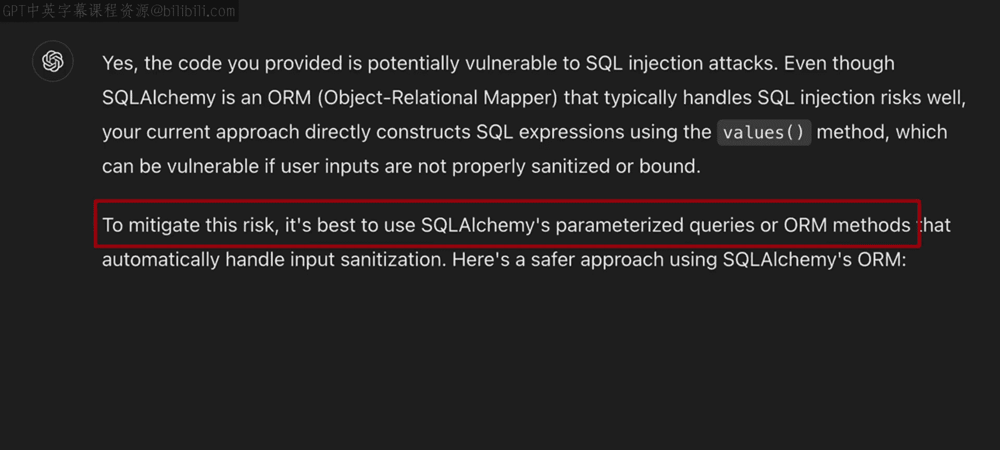

使用ORM方法添加用户，既能完成操作，也提升了安全性。

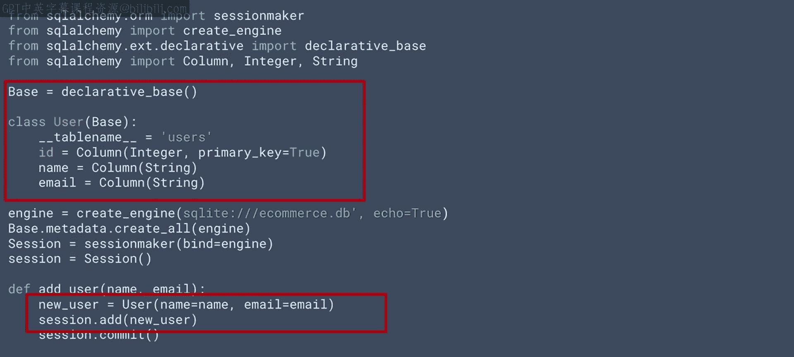

## 动手练习

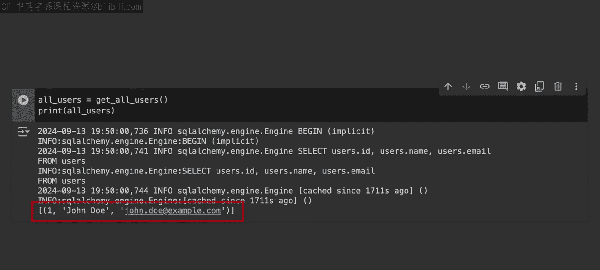

现在，你已经掌握了为用户表实现CRUD操作的方法。你的任务是：
为数据库中的另外三个表（`products`、`orders`、`order_items`）构建完整的CRUD操作。
实现这些操作后，请添加一些测试数据，并进行查询测试，确保所有功能正常工作。

## 课程总结

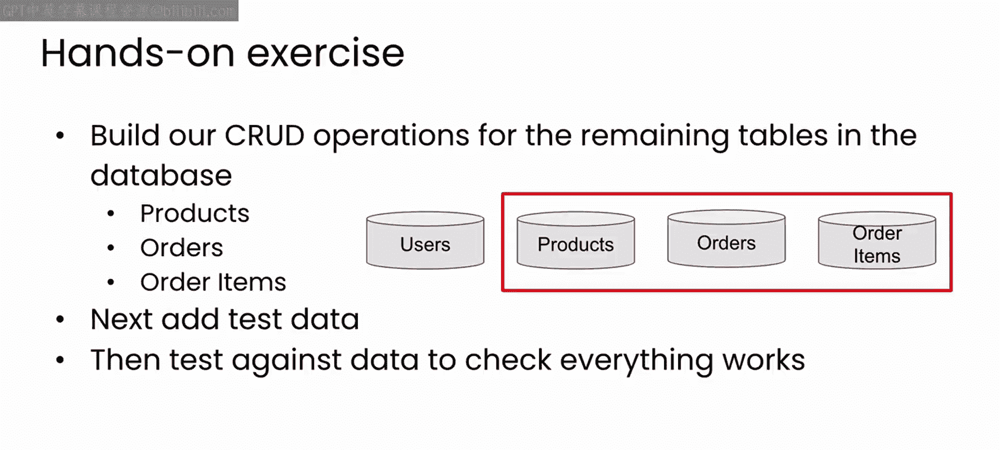

本节课中，我们一起学习了如何与LLM结对编程，逐步实现了数据库的**创建**、**读取**、**更新**和**删除**（CRUD）操作。我们看到了LLM如何快速生成代码，并提醒我们注意像SQL注入这样的安全问题，进而引导我们使用更安全的ORM模式。请尝试将所学应用到其他数据表上，以巩固这些技能。