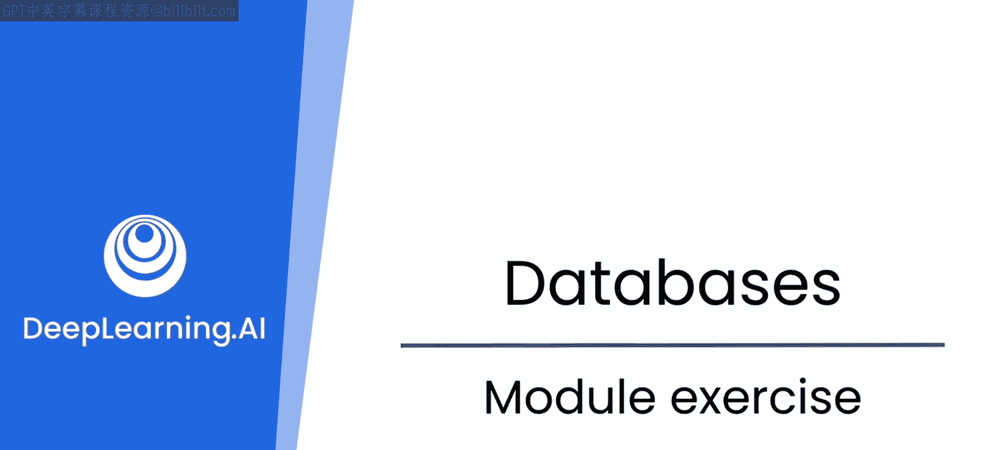
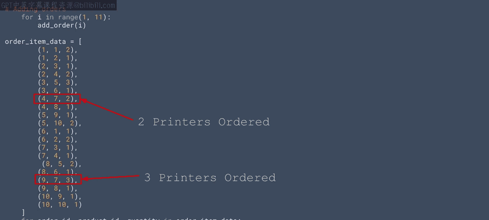

# 62：12_模块练习



## 🎯 概述
在本节练习中，我们将基于之前学习的SQLAlchemy ORM知识，为数据库中的剩余表实现CRUD功能，并使用这些功能来操作和查询数据。我们将通过具体的代码实践来巩固对安全数据库操作的理解。

## 📚 背景回顾
上一节视频中，最初的CRUD函数使用了基础代码，未能充分利用SQLAlchemy内置的所有安全特性。在视频末尾，大语言模型建议使用ORM类来构建CRUD操作函数，这些方法能提供更好的防护，以抵御SQL注入和其他安全漏洞。

## 🛠️ 练习任务
本节中，我们将开始为数据库中的剩余表（`products`、`orders`和`order_items`）实现CRUD功能。你应该使用SQLAlchemy的ORM特性来完成此任务。

完成代码实现后，你将使用这些代码向数据库添加数据。请务必严格按照提供的代码进行操作。课程资料中也提供了这段代码的下载，如果你不想全部手动输入的话。

以下是添加用户和产品的代码示例：
```python
# 示例：添加用户和产品
# 请在此处插入具体的ORM代码实现
```

以下是添加订单的代码示例：
```python
# 示例：添加订单
# 请在此处插入具体的ORM代码实现
```

## 🔍 数据查询与任务
当你的数据库正确初始化和编码，并且数据也已正确添加后，接下来需要创建代码来查询数据并执行一些常见任务。

例如，你需要创建代码来查询特定用户的所有订单，并列出该用户订购了哪些商品以及每种商品的数量。

根据我提供的数据，用户ID 1有一个订单，包含两台笔记本电脑和一部智能手机。

你应该如何编写或生成代码来得到这个结果？这实际上相当简单。

为了增加一点挑战性，你还应该创建一些代码，找出哪个商品被订购得最多，以及该商品被订购了多少单位。

答案是打印机，总共订购了五台。看看你能否得出这个结果。



## 💡 练习提示
这不是一个非常困难的练习。但如果你独自完成，可能会花费很长时间。然而，如果有一个大语言模型在你身边辅助，并且你善于使用清晰明确的提示词，那么这应该不会占用你太多时间。请尝试一下吧。

## 📖 总结
在本节练习中，我们一起使用SQLAlchemy ORM为数据表实现了CRUD功能，并实践了数据插入与复杂查询。通过将安全特性融入数据库操作，以及完成找出最畅销商品等具体查询任务，我们巩固了使用ORM进行高效、安全数据管理的技能。