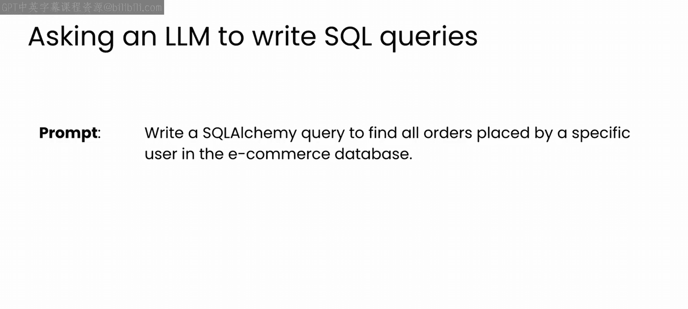
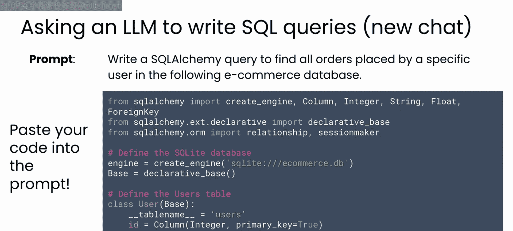
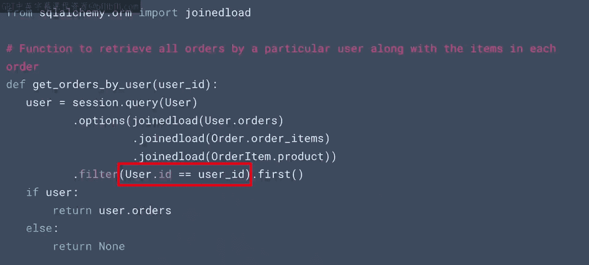
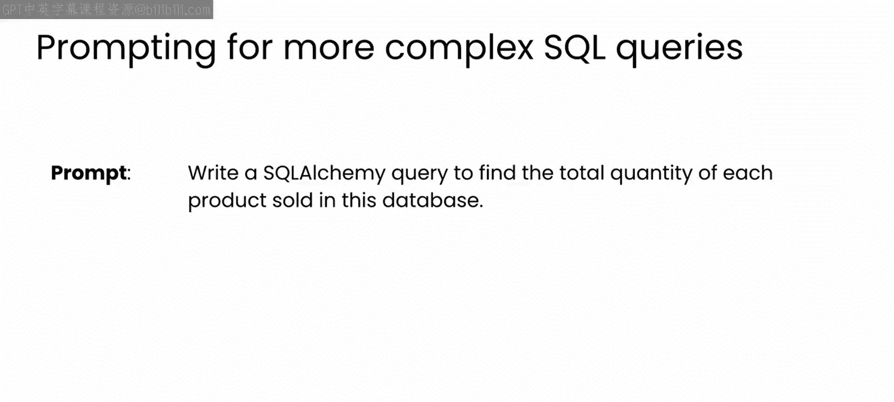
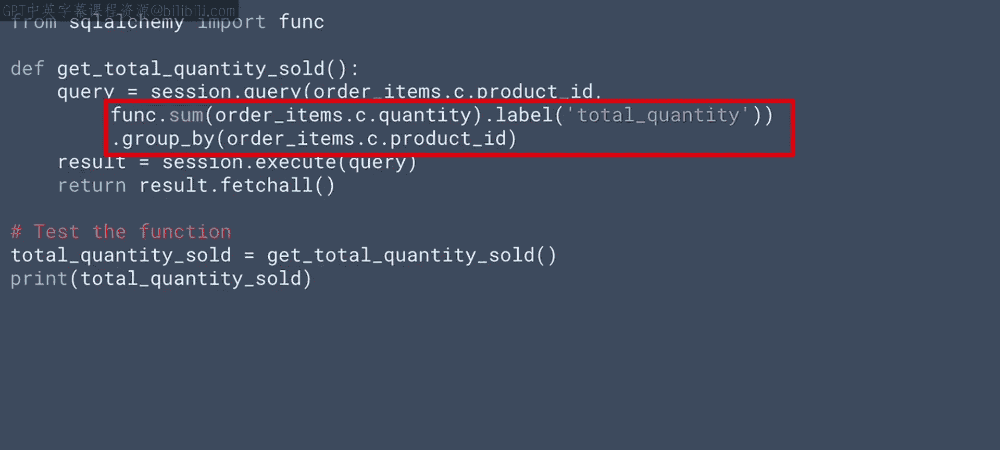
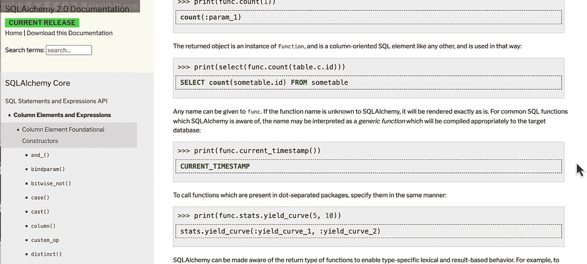

# 63：13_高级查询

在本节课中，我们将学习如何利用大语言模型（LLM）作为结对编程伙伴，来帮助我们为已构建的数据库编写查询语句。我们将从简单的查询开始，逐步深入到需要聚合操作的复杂查询。

到目前为止，在本模块中，你一直在使用LLM作为结对编程伙伴，为一个电子商务网站设计和实现一个简单的数据库。

如果你一直跟随视频编写代码，你现在应该已经拥有了一个使用SQLAlchemy设置的小型SQLite数据库，以及一套用于四个表（用户、产品、订单和订单项）的增删改查（CRUD）功能函数。

那么，下一个问题是最重要的：如何查询你构建的数据库？如果你已经熟悉SQLAlchemy，你可能知道如何操作。但如果这个特定的实现对你来说是新的，你可以让LLM帮助你构建数据库查询。

让我们从一个非常简单的查询开始，以建立关于LLM如何在此处帮助你的直觉。我将要求模型编写一个SQLAlchemy查询，用于在电子商务数据库中查找特定用户下的所有订单。



在这样做之前，请注意一点：如果你在一个新的聊天窗口中工作，你应该通过分享包含数据库模式和CRUD操作的现有代码来为模型提供上下文。这样，模型将拥有帮助你定义查询的上下文。

有多种方法可以实现这一点。请记住，在生成代码时，解决问题的方法有很多种。因此，请仔细考虑为你生成的内容。以下方法对我来说效果很好。



以下是模型生成的代码示例：
```python
def get_orders_by_user(user_id):
    session = Session()
    orders = session.query(Order).filter(Order.user_id == user_id).all()
    session.close()
    return orders
```
在这个函数中，我们选择所有`user_id`与指定用户匹配的订单。这使我们能够检索特定用户下的所有订单。这个查询非常简单。



但是，LLM真正能帮助你的地方在于处理更复杂的查询。现在，让我们看一个需要聚合操作的例子。

假设你想找出每种产品的总销量。这将需要对订单项表中的所有记录进行聚合。

你可以用这样一个简单的提示来请求ChatGPT的帮助：“编写一个SQLAlchemy查询，以查找此数据库中每种产品的总销量。”



它将生成类似这样的代码：
```python
from sqlalchemy import func

def get_total_quantity_sold_per_product():
    session = Session()
    result = session.query(
        OrderItem.product_id,
        func.sum(OrderItem.quantity).label('total_quantity')
    ).group_by(OrderItem.product_id).all()
    session.close()
    return result
```
这里有几个非常棒的地方。首先，LLM在没有任何特定指令的情况下就理解了数据库的结构。它知道需要处理订单项表，并按`product_id`进行分组。

LLM生成的代码使用了`func.sum`函数来聚合每种产品的总销量，并按`product_id`分组。这为我们提供了所有产品销售的摘要。



`func`模块是SQLAlchemy的一个特性，它提供了一种在查询中调用SQL函数（如`count`、`max`、`lower`等）的方法。LLM了解这个函数，并知道如何在你数据库模式的上下文中应用它，以帮助你创建所需的查询。

在这个特定的用例中，它编写了一个查询，为我们提供了每个产品的销售摘要。




让我们进入下一个视频，更深入地了解LLM如何帮助你优化数据库以及你将用它编写的查询。

本节课中，我们一起学习了如何利用LLM辅助编写数据库查询。我们从简单的单表查询开始，了解了如何为模型提供上下文。接着，我们探索了更复杂的聚合查询，看到了LLM如何理解数据库结构并应用SQLAlchemy的`func`模块来生成高效的汇总代码。这展示了LLM作为开发助手，在理解和操作数据结构方面的强大能力。