# 64：14_数据库优化 🗄️

在本节课中，我们将学习如何利用大语言模型作为结对编程伙伴和数据库专家，来优化数据库结构和查询性能。我们将探讨索引、缓存和数据类型选择等核心优化策略。

## 概述

优化数据库时，需要考虑底层数据库结构和编写的查询语句。无论您是否具备数据库创建和维护的专业知识，与大语言模型合作来复核您的知识并激发灵感，都是一个良好的实践。

## 与LLM协作进行数据库优化

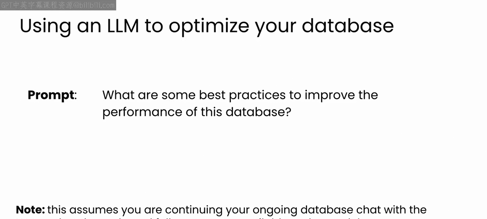

上一节我们介绍了与LLM协作的基本理念。本节中，我们来看看如何从高层次提示开始，逐步深入具体优化问题。

您可以先从一个高层次、通用的提示开始，例如：
> 有哪些最佳实践可以提高这个数据库的性能？

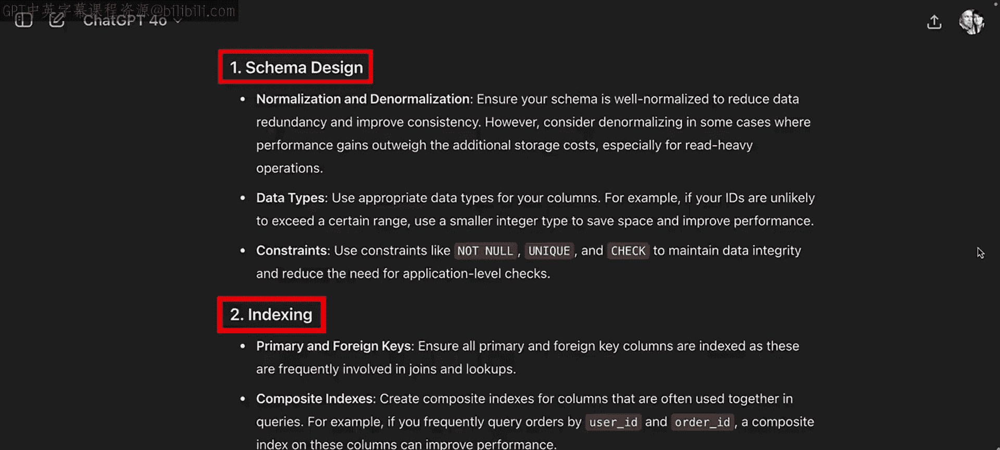

然后，根据LLM给出的建议，您可以深入探讨具体问题。


GPT-4对此提示给出了非常详细的回答，列举了许多应考虑的事项。既然您已经设计了数据库模式，让我们跳过模式设计，直接看下一个建议：**索引**。

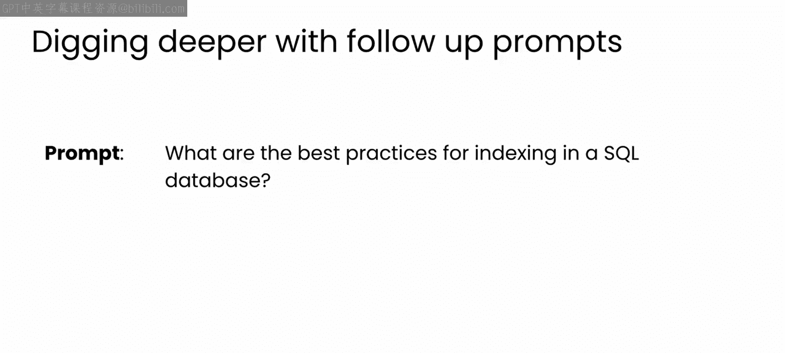

## 索引优化

明智地使用索引可以显著加快数据检索速度，但可能难以确定从何入手。因此，让我们深入一点，向LLM寻求一些索引方面的建议。

如果您对数据库设计相对陌生，可以从一个简单的提示开始，例如：
> 为SQL数据库建立索引的最佳实践是什么？


您很可能会得到一个像这样详细的答案，其中突出了许多索引的最佳实践。

以下是关于索引的一些核心建议：

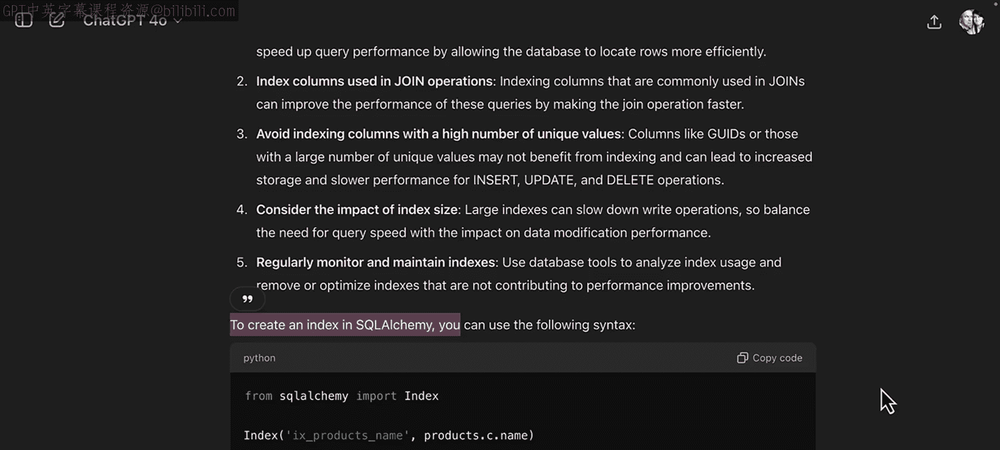

*   **选择要索引的列**：最好从那些您可能用于`WHERE`或`JOIN`操作的列开始。
*   **考虑索引大小**：对于更大、更多样化的数据库，需要考虑索引的大小，并避免为包含大型复杂数据类型（如全局唯一标识符GUID）的列建立索引。

模型随后还演示了如何创建索引。例如，在`products`表的`name`列上创建索引：
```sql
CREATE INDEX IX_products_name ON products(name);
```
只需创建此索引，任何按名称搜索产品的操作都会自动运行得更快。索引是一个强大的工具，但也需要谨慎使用。


编写使用索引的代码时，不能简单地索引每一列并期望性能提升。需要谨慎、有节制地使用索引，并始终彻底测试您的代码。在使用生成代码时，很容易养成不良习惯。

## 查询缓存

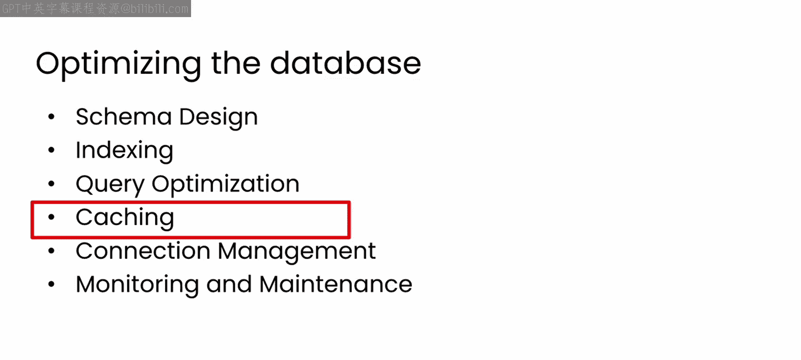

现在让我们回到LLM给出的建议列表，另一个技巧是**缓存**，特别是**查询缓存**。这可以通过存储昂贵查询的结果来帮助减少数据库负载。

如果您有一些相对常见但运行成本高的查询，为什么不只运行一次然后缓存结果呢？后续的查询就可以从缓存中读取，速度会快得多。


这一切都很好。但如果您不知道从何开始怎么办？在这些示例中，我使用的是SQLAlchemy，您可能在使用其他工具，但基本原理是相同的。您可以直接通过类似以下的提示寻求帮助：
> 如何在SQLAlchemy中实现查询缓存？

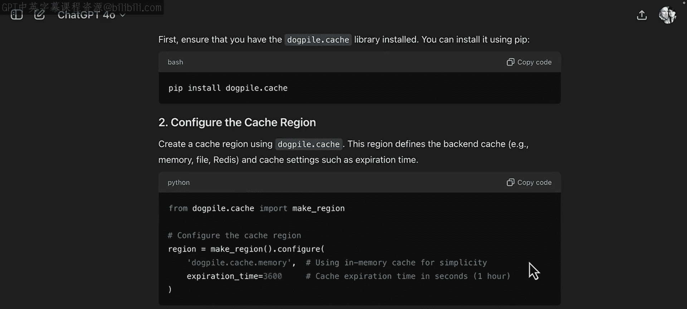


以下是我得到的回复，希望您也能得到类似的内容。LLM建议安装`dogpile.cache`库。在给出安装说明后，它编写了以下可用于执行缓存的示例代码。对于任何其他内容，如果您不理解发生了什么，可以随时通过后续问题向您的LLM深入询问。

在这段代码中，`dogpile.cache`首先创建了一个缓存文件，并设置了一小时（3600秒）的过期时间。

然后，通过使用`@cache_on_arguments`装饰器修饰`get_all_products`查询函数，您表示希望将此函数的结果缓存在内存中，以便快速检索。

好处是您无需更改函数的内容，只需添加装饰器即可。

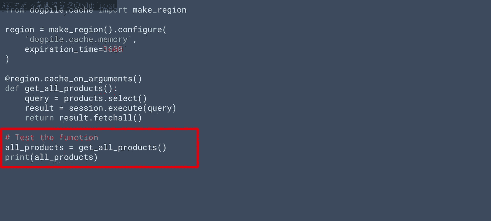


要测试该函数，只需像往常一样调用它。第一次调用或距离上次调用一小时后，函数将执行并返回结果。否则，结果将从缓存中返回。

这是一个暂停视频、尝试运行代码并查看是否能成功运行缓存查询的好时机。一旦成功，您可以使用Python或您正在使用的任何语言中可用的计时工具来验证缓存查询的运行速度确实快得多。

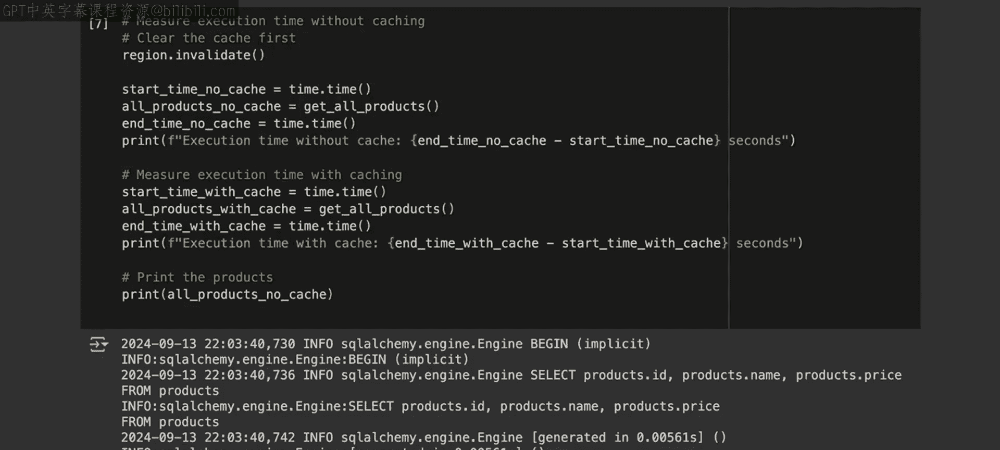


## 数据类型选择

需要快速说明的是，查询缓存是在设计数据库之后实现的，因此我跳过了将模式设计作为一种优化手段。但在整体设计中，您应该考虑一个部分，特别是对于索引而言，正如前面提到的，就是要非常明智地选择数据类型。

您的高级模式、表、连接等可能不会改变，但对于特定列中的数据，您应该始终仔细考虑。为此，您可以提示您的LLM获取有关此方面的详细信息。例如，使用一个简单的提示：
> 在SQL数据库中选择数据类型的最佳实践是什么？

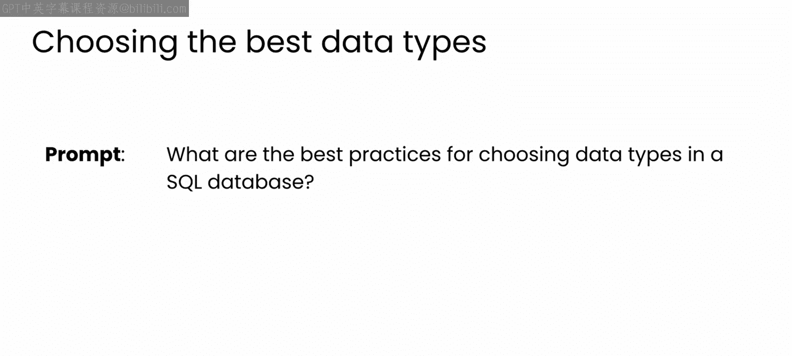


在我的案例中，这个提示产生了很好的结果。如果您对数据库设计有基本的了解，这些建议在很大程度上是常识。然而，它们是一个极好的提醒，提醒您注意并仔细检查LLM生成的代码，以确保其始终遵循最佳实践。

例如，第三点“对字符串使用`TEXT`类型”是显而易见的，但“如果可能，限制长度”的建议是一个很好的观点。您可以看到，模型在创建我们原始模式时并没有遵循这一点。因此，请务必现在暂停视频，返回并更新您的代码。

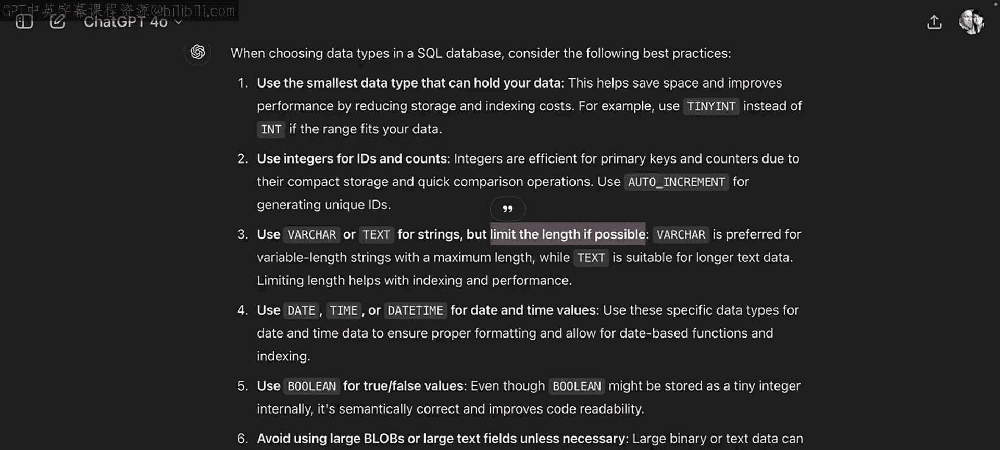

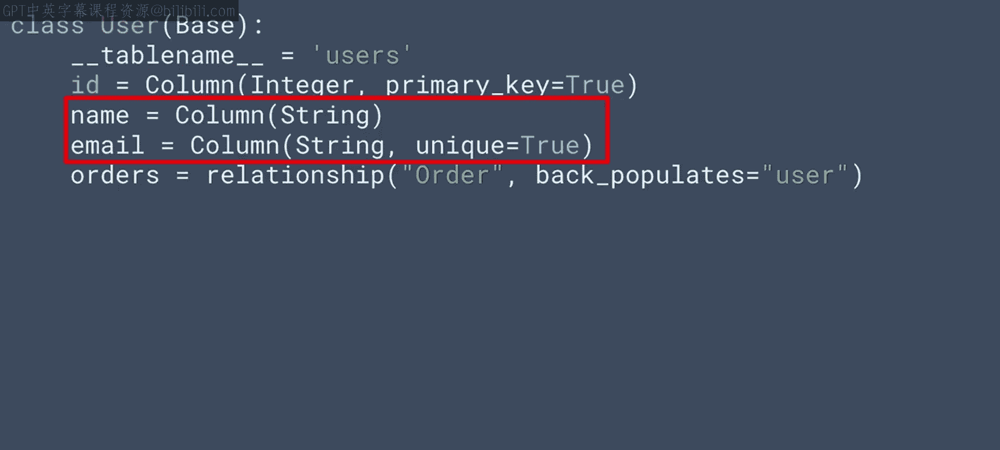


## 总结

在本节课中，我们一起学习了如何利用大语言模型优化数据库性能。我们探讨了三个核心优化方向：

1.  **索引**：通过`CREATE INDEX`语句在关键列上建立索引，加速数据检索。
2.  **缓存**：使用如`dogpile.cache`等工具缓存昂贵查询的结果，减少数据库负载。
3.  **数据类型选择**：遵循最佳实践（如为字符串选择`TEXT`类型并限制长度）来优化存储和性能。

请务必在从头开始构建自己的数据库时，思考其他最佳实践，并确保同时针对模式设计和您将用于处理数据的查询进行优化。在下一个视频中，您将思考一些数据库调试的流程，之后您将为本周练习的第二部分做好准备。