# 65：15_调试 🐛

在本节课中，我们将学习如何利用大语言模型来帮助调试数据库应用中的常见错误。从处理连接问题到分析复杂的查询执行计划，你将掌握一系列实用的调试技巧。

---

## 概述

从本模块开始至今，你已经取得了长足的进步。如果你一直跟随代码实践，现在应该已经掌握了一个相当庞大的代码库。你设计并创建了数据表，实现了增删改查功能，设计了查询语句，甚至可能为了性能优化而重构了部分代码，例如实现了查询缓存。在这个过程中，你很可能遇到了不少错误。

在处理数据库或任何代码时，错误是不可避免的。然而，知道如何有效地处理和调试它们，可以为你节省大量时间和精力。

---

## 处理数据库连接错误

首先，我们来讨论如何处理数据库连接错误。你可能会遇到的一个常见问题是无法连接到数据库。你可以与大语言模型合作，编写代码来处理可能遇到的连接错误。

我们在这个模块中一直以 SQLAlchemy 和 Python 为例，但如果你使用其他技术栈，具体的提示原则同样适用。

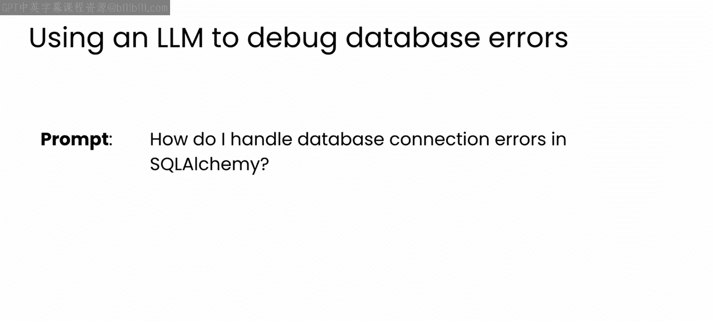

让我们从一个相当通用的问题开始，询问大语言模型如何在 SQLAlchemy 中处理数据库连接错误。

解决方案非常简单。一个基本的 `try...except` 子句来捕获 `OperationalError` 异常并打印出详细信息。你首先尝试使用 `engine.connect()` 连接到数据库。如果发生连接错误，它会被异常块捕获，然后你可以打印出错误信息。这很简单，但却是处理连接问题的非常有效的方法。

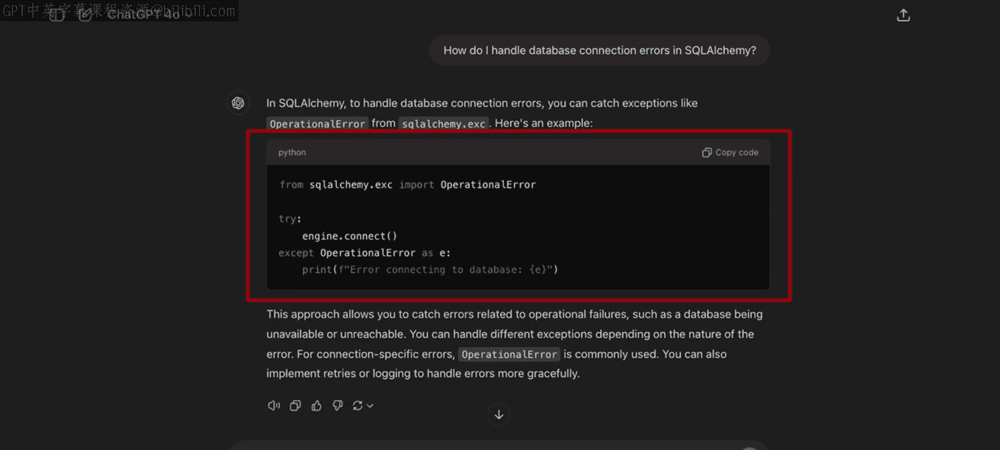

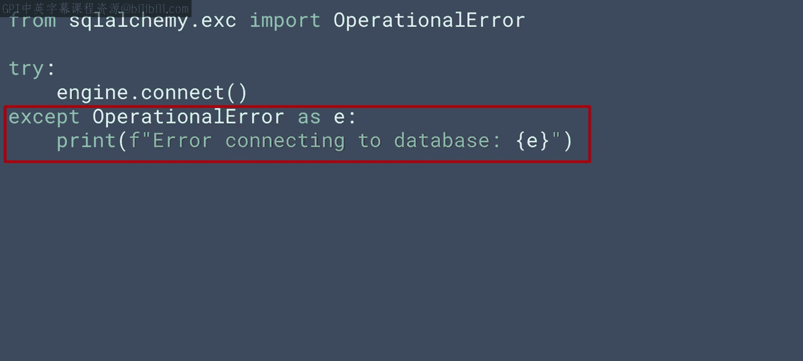

---

## 处理数据操作错误

在之前的视频中，你实现了一系列增删改查操作。随着数据库功能的扩展，你可能会发现一些边界情况会导致这些操作出错。

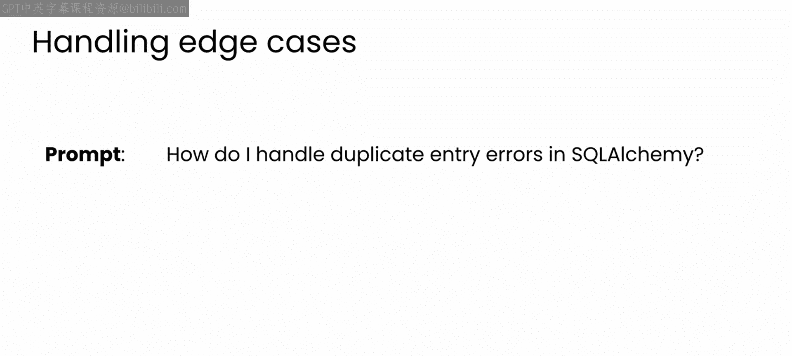

例如，如果你尝试向一个有唯一约束的表中插入重复条目，你的数据库应如何处理这个错误？你可以用类似下面的提示词向大语言模型寻求建议。

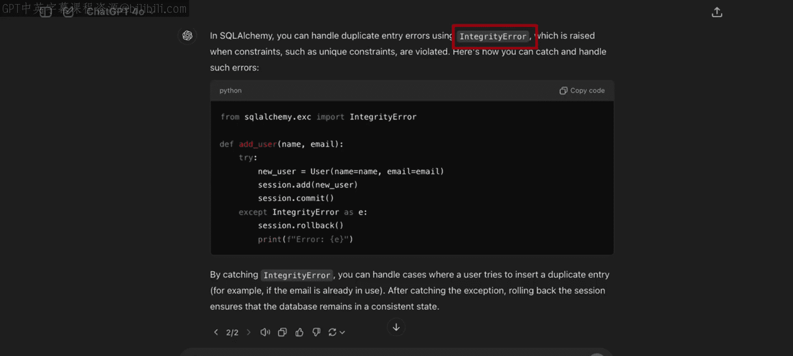

它会给出类似这样的建议：使用 SQLAlchemy 内置的 `IntegrityError` 类型，其接口非常简单。

如果你在使用其他语言或数据库基础设施，模型应该会为你的具体实现提供建议。在示例中，代码处理了尝试向用户表添加重复用户的情况。当然，用户应该是唯一的，因此这个操作应该被禁止。

如果由于 email 列的唯一约束导致重复条目错误，会触发一个 `IntegrityError`，该错误被 `except` 块捕获，然后打印出错误信息。

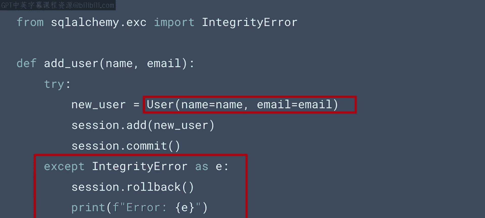

这里的重点不在于具体的实现，而在于大语言模型理解用户表有唯一约束，并利用你所使用的数据库软件中的正确错误类型来帮助你处理错误。

---

## 启用查询日志进行调试

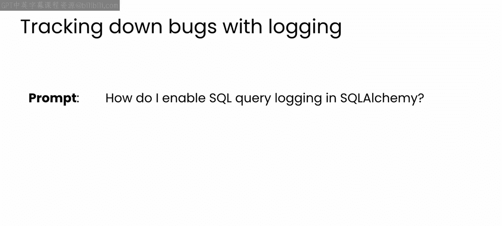

现在让我们继续讨论调试问题。日志记录是调试任何问题的强大工具，SQL 查询也不例外。让我们用一个非常简单的提示词询问大语言模型如何启用 SQL 查询日志。

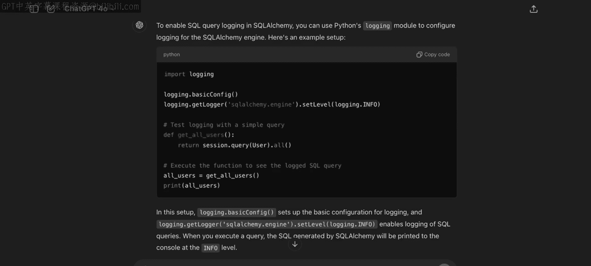

以下是生成的代码。它开启了日志记录，并通过一个查询所有用户的查询来测试。SQL 语句将被打印到控制台。

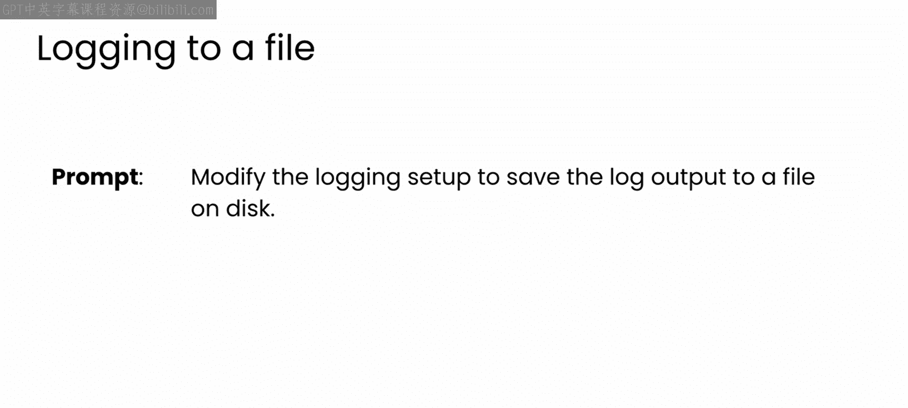

在生产环境中，你可能希望将日志保存到文件中。你可以向大语言模型提出后续请求，修改代码以实现此功能。

它会返回修改后的代码，通过在 `basicConfig` 调用中指定文件名和其他设置参数，将日志输出到文件。

请暂停一下视频，在你自己的数据库设置中实现类似的功能，看看是否能使其正常工作。

好的，希望你能成功地在数据库设置中启用日志记录到文件。

---

## 处理事务错误

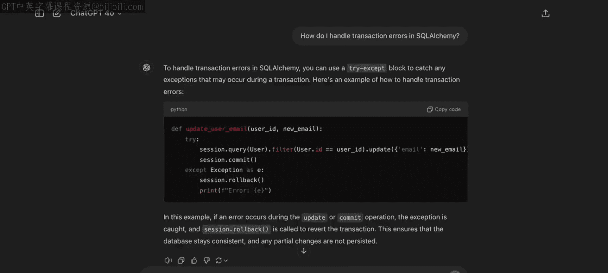

另一种需要考虑的错误是事务错误。这通常发生在你对数据库进行复杂更新时，更新可能在完成前失败，导致数据库处于不一致状态。

这些错误可能造成严重破坏，那么我们如何缓解它们呢？我们可以从询问开始，在回复中，你会看到类似这样的代码。它尝试执行查询。当提交时，它会检查是否有异常。如果有，它会使用我们之前在完整性错误中看到的 `session.rollback()`。这很方便。

---

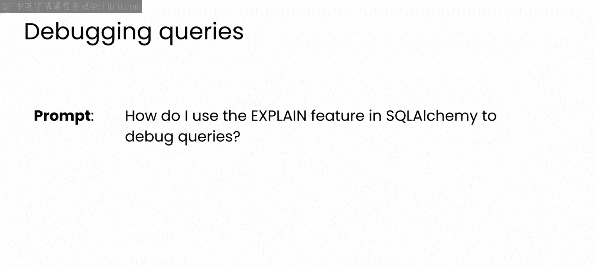

## 分析查询执行计划

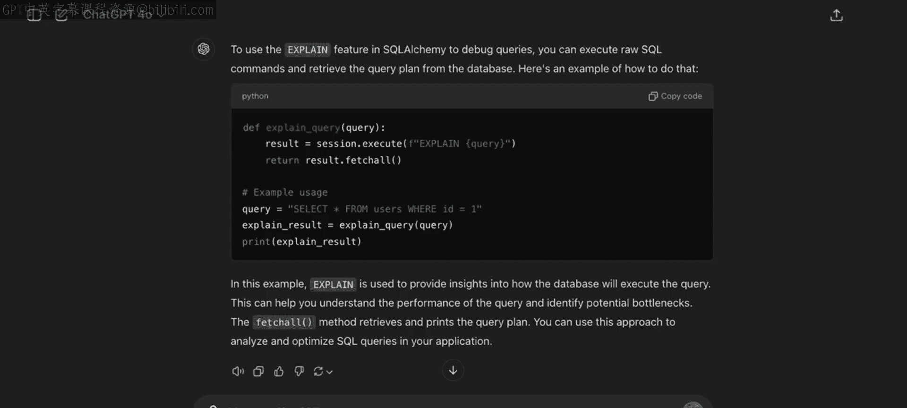

最后，如果你经常使用数据库，你可能知道另一个有用的调试工具是理解查询的执行计划。这主要针对与多个表交互的复杂查询，可以跟踪和揭示访问表的顺序、哪些部分先更新等信息。

在 SQLAlchemy 中，有一个名为 `EXPLAIN` 的功能。让我们看看如何使用它。首先，我将向大语言模型询问一些建议。

它会生成类似这样的代码。

再次提醒，请务必检查这里的代码是否与你的数据库设置匹配。如果你一直在同一个聊天会话中工作，大语言模型可能会跟踪上下文，但它也可能出错，所以请仔细检查所有建议的代码。

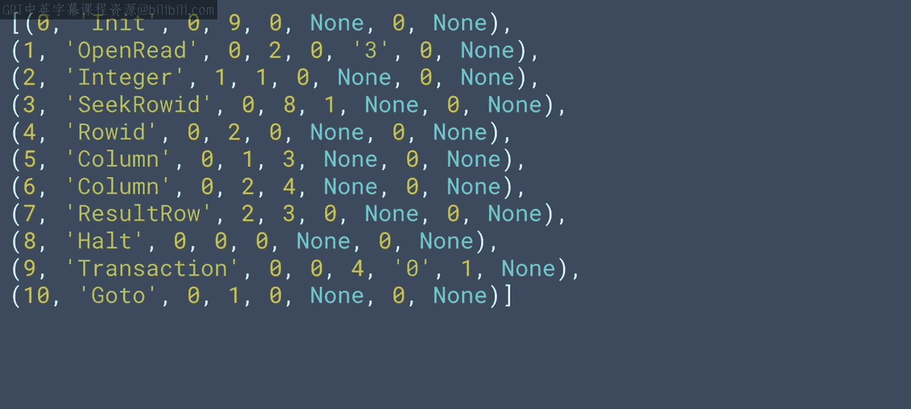

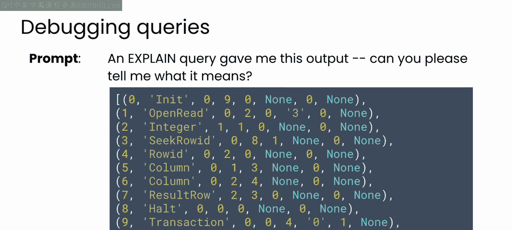

你可以在这里看到一个查询：选择所有匹配 `ID=1` 的用户，并将其传递给 `explain_query` 函数，该函数将执行 `EXPLAIN` 查询并返回运行该查询的完整过程。如果你将其打印出来，可以探索发生了什么，输出结果会像这样。

现在，如果你不理解输出中的所有内容，当然可以直接向大语言模型寻求答案，使用类似这样的查询。

你会得到一个非常详细的答案。我在这里展示了输出的一小部分，它详细展示了该查询是如何一步步执行的。我通常能从这样的输出中学到新东西，因此我鼓励你花时间彻底阅读它。

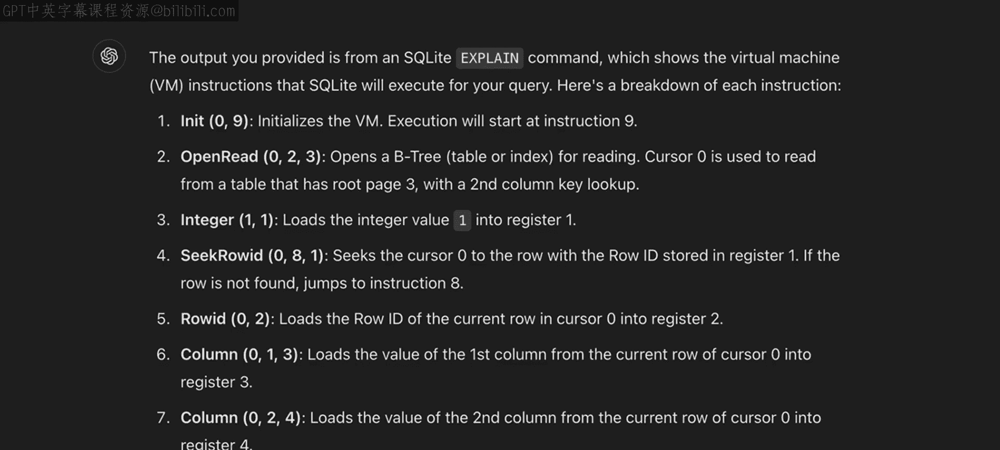

---

## 总结

希望你现在已经体会到大语言模型如何帮助你调试数据库中的错误，并为你使用的任何数据库平台提供代码修复方案。

你现在已经准备好完成本模块的最后练习，亲自尝试调试一些数据库错误。在下一个视频中，我将带你了解练习的一些重要细节。当你完成后，你将准备好进入本课程和专业化的最后一个模块，在那里你将与大语言模型合作，更深入地理解常见的软件设计模式，从而真正提升你的工作流程和构建的产品。我们练习后再见。