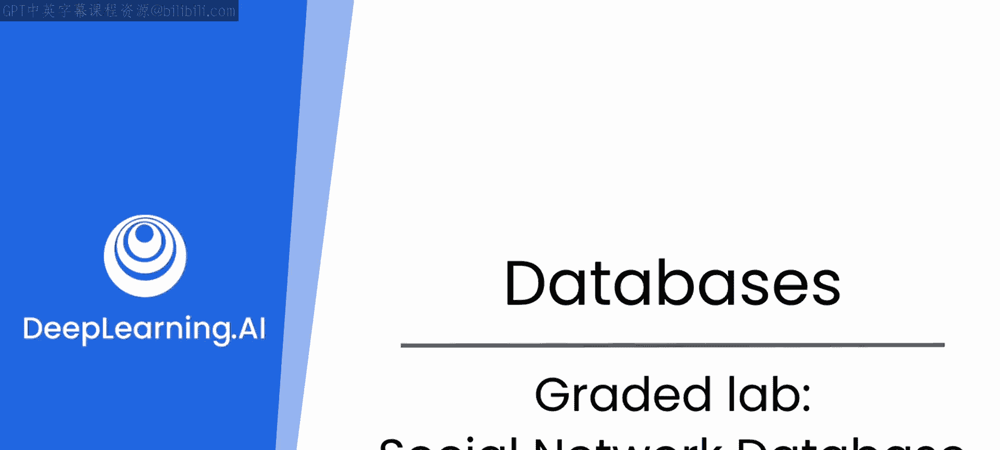
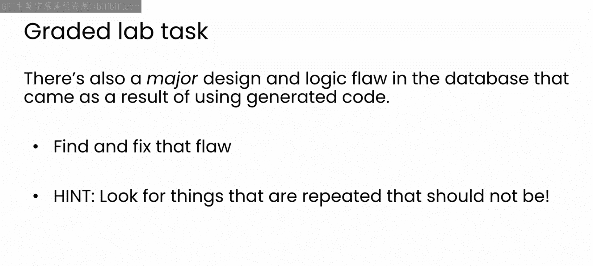

# 66：16_社交网络数据库分级实验

在本节课中，我们将完成一个关于社交网络数据库的分级实验。我们将分析一个由生成式AI代码创建的数据库，识别其中的设计缺陷，并编写代码来查询特定数据。

## 概述

本次实验提供了一个名为 `social_network_db.ipynb` 的笔记本文件，其中包含用于创建和填充一个简单社交网络数据库的代码。该网络包含“人员”和“俱乐部”两种实体，并记录了它们之间的“友谊”和“会员”关系。

你的任务是完成以下三项查询，并修复数据库中存在的一个主要设计缺陷。

## 实验任务

以下是本次实验需要你完成的具体任务。

**任务一：查询俱乐部成员**
编写代码，根据给定的俱乐部名称，找出该俱乐部的所有成员。

**任务二：查询用户好友**
编写代码，根据给定的人员姓名，找出该人员视为好友的所有人。

**任务三：查询谁视其为好友**
编写代码，根据给定的人员姓名，找出所有将该人员视为好友的人。

## 识别与修复设计缺陷

上一节我们介绍了三项查询任务，本节中我们来看看数据库本身存在的问题。这个由生成式AI代码创建的数据库存在一个重大的设计和逻辑缺陷。

请花一些时间尝试发现并修复它。以下是一个小提示：寻找那些本不应重复出现的数据项。

## 总结

本节课中我们一起学习了如何在一个简单的社交网络数据库上进行查询操作，并实践了识别和修复数据库设计缺陷的过程。希望你能享受这个实验活动。完成后，我们将在下一个模块中讨论设计模式。

😊