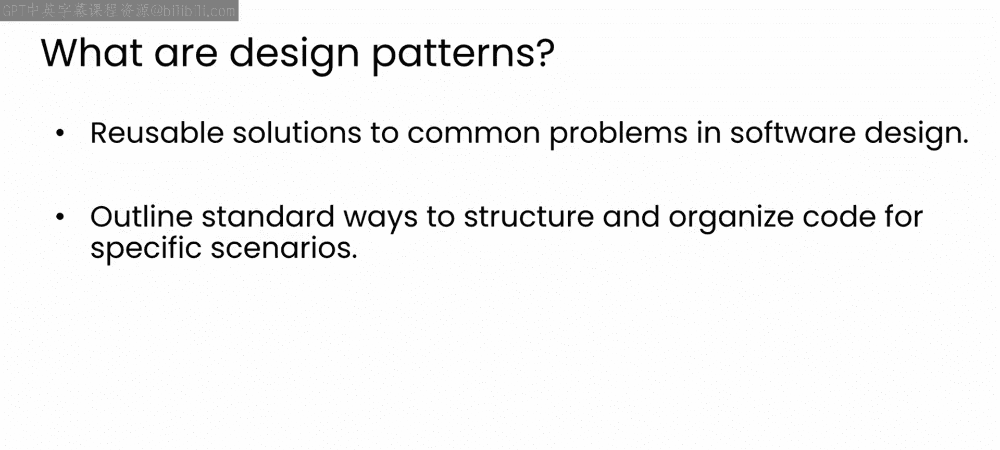
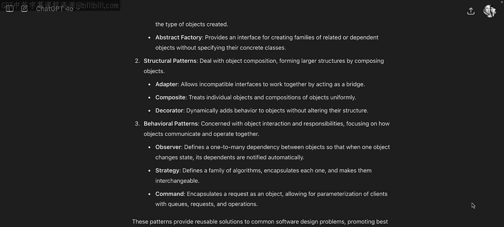
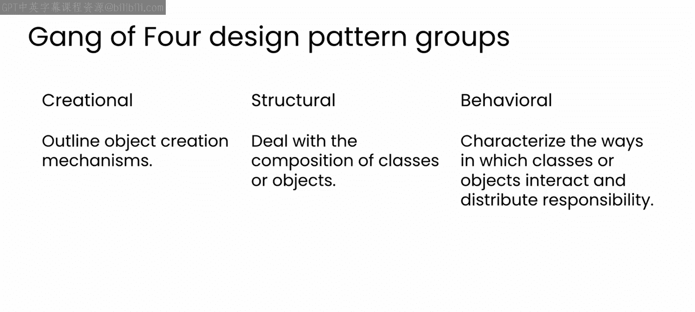

# 67：AI驱动的软件与系统设计 🏗️

在本模块中，我们将学习如何利用大型语言模型来理解和实现关键的软件设计模式，从而提升代码质量和架构设计能力。

## 概述

欢迎来到本课程的最后一个模块。在接下来的学习中，你将探索大型语言模型如何帮助你学习重要的软件设计模式，并指导你在代码中实现它们。

## 什么是设计模式？

在职业生涯的某个阶段，你可能已经学习或使用过设计模式。为了帮助你回忆，设计模式是针对软件设计中常见问题的可复用解决方案，它们为特定场景下的代码结构和组织方式提供了标准化的蓝图。

设计模式为开发者提供了一套标准术语，使他们能够清晰高效地向他人传达想法。它们不仅能提升代码的可读性和复用性，还有助于在设计的早期阶段进行调试和预防问题。

## 本模块的学习目标

在本模块中，你将探索一些设计模式，并与大型语言模型协作，以有效地实现它们。这将同时提升你的编码技能和架构洞察力。

坦白说，我发现许多高级设计模式的代码和思想确实难以理解。在缺乏使用经验的情况下，判断是否应该在构建代码时使用它们一直是个挑战。

## 设计模式的困境与机遇

这些模式经过了实践检验，使用过它们的人都非常推崇。但如果你不了解它们，就很难判断它们是否对你有用。这形成了一个循环。

因此，你将看到大型语言模型如何帮助你更好地理解设计模式、评估它们是否适合你的用例，并最终在代码中实现它们。我们将通过探索著名的“四人组”设计模式思想来完成这一过程。

## 认识“四人组”设计模式

“四人组”指的是四位作者：埃里希·伽玛、理查德·赫尔姆、拉尔夫·约翰逊和约翰·弗利赛德斯。他们在1994年出版了一本开创性的著作，名为《设计模式：可复用面向对象软件的基础》。

这本书是软件工程领域的基石，影响了无数开发者以及许多编程语言的设计。“四人组”模式是理解现代软件架构的基础。

## 设计模式的分类

作者将模式分为三类：创建型、结构型和行为型，每一类服务于软件设计的不同方面。

以下是三类模式的简要说明：

*   **创建型模式**：处理对象的创建机制。
*   **结构型模式**：处理类或对象的组合方式。
*   **行为型模式**：描述类或对象之间如何交互和分配职责。

## 本模块的核心价值

如果你不熟悉使用这些模式，可能会对如何使用、何时使用或为何使用它们感到困惑。或者，你可能已经遇到了一个可以用它们解决的问题，但不确定如何在代码中实现该模式。

这正是本模块的核心内容：将大型语言模型作为结对编程伙伴，帮助你更深入地理解这些模式，并学会如何最大限度地利用它们。

## 总结

本节课我们一起学习了设计模式的基本概念、“四人组”的贡献及其分类。我们明确了本模块的目标：借助AI工具来攻克理解与实现设计模式的难题。

接下来，让我们开始更深入地了解刚刚提到的“四人组”模式。下一个视频再见。