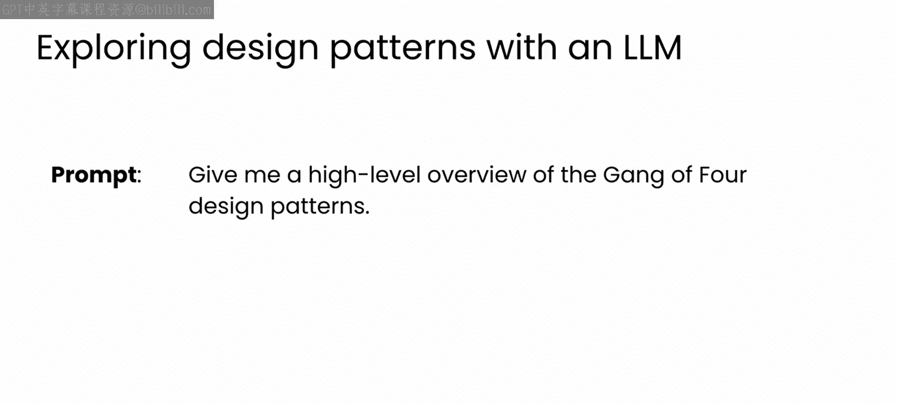
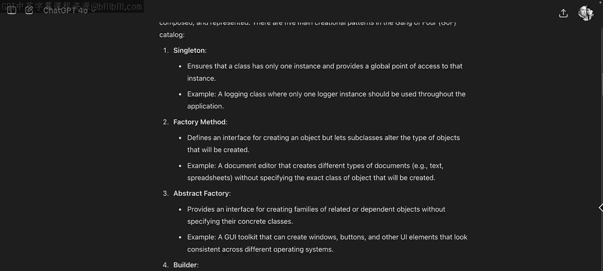
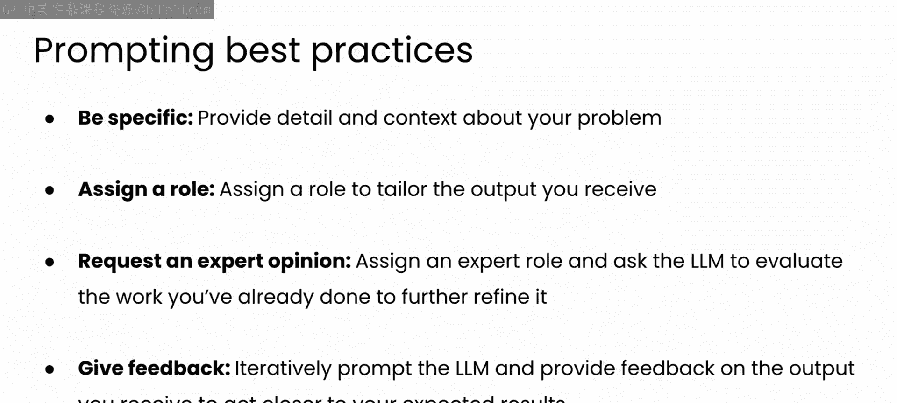

# 68：四人帮设计模式概述 🧩

在本节课中，我们将要学习软件工程中极具影响力的“四人帮”（Gang of Four）设计模式。我们将了解其三大类别，并探讨如何利用大型语言模型（LLM）来学习和应用这些模式。

## 概述

四人帮设计模式在软件开发领域产生了巨大影响。尽管开发者们喜欢讨论所有模式的优缺点，但其中许多模式已被实现为现代编程语言（如Python和JavaScript）的关键特性。

如果你需要一个高层次的设计模式介绍或复习，像ChatGPT这样的大型语言模型是一个很好的起点。

## 利用LLM获取设计模式概览

如果你要求模型提供一个关于四人帮设计模式的高层次概述，它会写出一个很好的总结，让你了解原著书籍和四位作者，并继续讨论我在上一个视频中提到的三个主要模式组：创建型、结构型和行为型。

这里的总结讨论了每组中三个最重要的模式，但实际上总共有23个模式。如果你向模型追问细节，它会深入探讨。

## 深入探讨三大类别

上一节我们介绍了如何利用LLM获取概览，本节中我们来看看这三个类别的具体内容。它们各自在软件架构中服务于独特的目的，并针对特定的设计挑战提供解决方案。

### 创建型模式

创建型模式主要关注类的实例化以及从类创建对象的方式。以下是主要的创建型模式：

*   **单例模式**：确保一个类只有一个实例，并提供对该实例的全局访问。
*   **建造者模式**：将一个复杂对象的构建与其表示分离，使得同样的构建过程可以创建不同的表示。
*   **原型模式**：通过复制一个现有的“原型”实例来指定要创建的对象类型。
*   **工厂方法模式**：定义一个用于创建对象的接口，但让子类决定实例化哪一个类。
*   **抽象工厂模式**：提供一个接口，用于创建相关或依赖对象的家族，而无需指定具体类。

在这些模式中，单例模式和工厂方法模式可能是最重要的，我们将在后续视频中更详细地探讨它们。

### 结构型模式

结构型模式关注类和对象如何组合以形成更大的结构。它们通过识别实现不同实体之间关系的简单方法，来促进更轻松的设计。以下是七种结构型模式：

*   **适配器模式**：通过包装一个已存在类的接口，使接口不兼容的类能够协同工作。
*   **桥接模式**：将抽象部分与其实现部分分离，使它们可以独立地变化。
*   **组合模式**：将对象组合成树形结构以表示“部分-整体”的层次结构，使得客户端对单个对象和组合对象的使用具有一致性。
*   **装饰器模式**：通过将对象放入特殊的包装器对象中，动态地为对象添加新功能。
*   **外观模式**：为一个复杂的子系统（如类库）提供一个简化的接口。
*   **享元模式**：通过尽可能多地与其他类似对象共享数据，来最小化内存使用。
*   **代理模式**：为另一个对象提供一个替身或占位符以控制对它的访问、降低开销或复杂度。

你可能会认出其中一些模式，例如，装饰器模式在Python中很常用，你可能也在其他代码中见过适配器模式和外观模式。

### 行为型模式

行为型模式专注于算法和对象之间的职责分配。这些模式不仅强调对象或其类之间的关系，还强调如何处理对象之间的通信以完成复杂任务。行为型模式共有11种，以下是一些例子：

*   **迭代器模式**：提供一种方法顺序访问一个聚合对象中的各个元素，而又不暴露其内部的表示。这个模式影响了Python中的许多数据类型，包括列表和字典。
*   **策略模式**：定义一系列算法，将每个算法封装起来，并使它们可以互相替换。策略模式让算法的变化独立于使用它的客户端。
*   **模板方法模式**：在一个操作中定义算法的骨架，而将一些步骤延迟到子类中实现。我们将在本模块的后续部分更详细地探讨模板方法模式和策略模式。

## 总结与应用

正如你所见，内容非常丰富，并非所有内容都能立即理解。关键要点是，这些模式是经过数十年软件工程实践演变而来，旨在解决面向对象设计中的常见挑战。

当面临问题时，将这些模式视为潜在的解决方案是很有价值的。然而，它们的技术性质可能难以理解，使得确定何时以及如何有效应用它们变得具有挑战性。

但是，有了LLM作为你的伙伴，你可以运用我们在本课程中讨论的许多技巧，例如分配专家角色并与模型进行持续的来回对话，来帮助你识别某个模式何时可能是你问题的良好解决方案，然后找出如何在代码中实现它。

## 后续学习

在你开始与LLM进行结对编程之前，我认为先查看其中一个模式的实现，看看如何从概念映射到功能代码，会很有帮助。

因此，在下一个视频中，我们将继续探索**单例模式**，我认为这是四人帮模式中比较容易理解的一个。我们下个视频见。