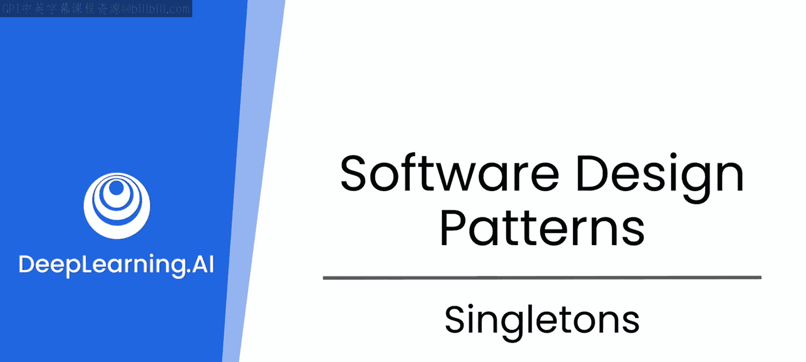
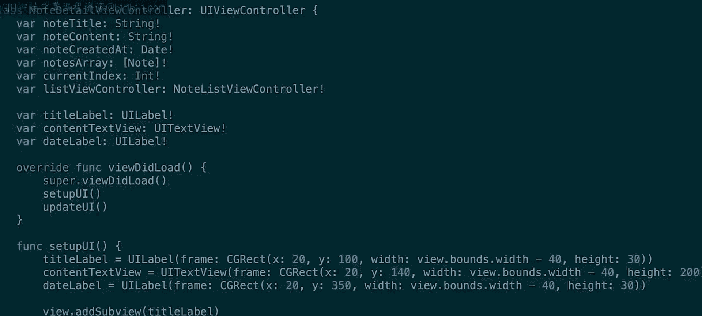
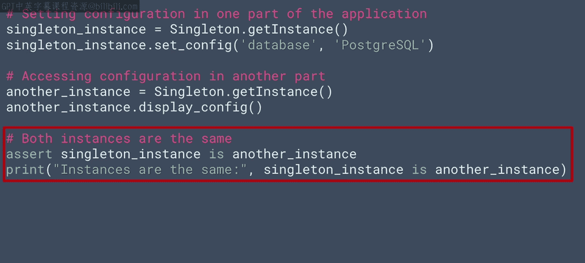
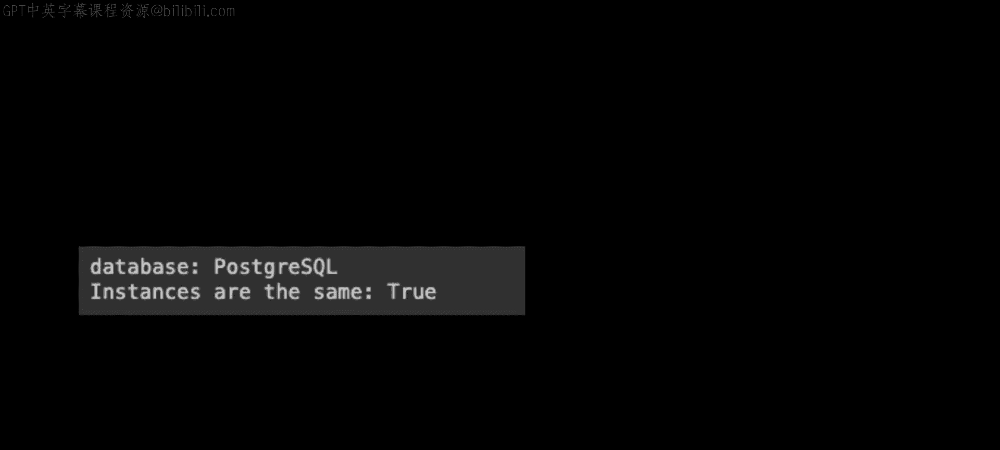

# 69：单例模式 🏗️

在本节课中，我们将学习一种经典的设计模式——单例模式。我们将了解它要解决的问题、其核心实现原理，并通过一个Python代码示例来演示如何创建和使用单例。最后，我们会探讨在更复杂的场景下，如何借助大型语言模型来探索和选择合适的设计模式。

## 概述

单例模式是一种创建型设计模式，它确保一个类只有一个实例，并提供一个全局访问点。这种模式常用于管理共享资源，如配置信息、数据库连接或日志记录器。

## 单例模式的应用背景

我第一次接触“四人帮”（Gang of Four）设计模式是在多年前开发一个移动应用程序时。

iOS或Android等移动操作系统对内存和资源的管理非常严格。

如果应用程序消耗过多资源，系统可能会通过降低其运行速度、限制其后台活动，甚至意外关闭它来做出响应，以确保设备运行流畅。

因此，在为这些操作系统设计应用程序时，通常必须非常小心内存的使用。

如果你需要存储大量必须在应用程序不同部分访问的数据，事情会变得棘手。

在我的案例中，为了在不同视图之间维持状态，我在函数之间传递了大量数据。

我的代码很快就变成了“意大利面条式代码”（spaghetti code）。我真正需要的是某种全局变量。

但在使用多个源文件（这些文件将每个视图分开，并将设计与实现分离）时，没有这样的功能。

这迫使我采用了我刚才提到的技巧：在函数之间或视图之间传递用于维持状态的数据。

这并不高效。

## 单例模式的引入

然后我偶然发现了单例设计模式。它非常简单。

它是一个只能被实例化一次的类，然后允许你拥有可被其他所有类访问的数据和方法。

因为该类只有一个实例，其变量的内容实际上是全局的，并且不会被重复创建。

这完美地解决了我的问题。但在当时，我花了很长时间才弄明白这一点。

## 在Python中实现单例模式

那么，让我们从在Python中实现一个单例开始。实际上这非常简单，尤其是当你之前接触过这种模式时。

以下是代码。

单例模式的关键是 `_instance` 类变量。

最初，它被设置为 `None`。

然后，当类被初始化时，`get_instance` 方法会检查实例是否已经存在。如果不存在，它会创建一个新实例并将其赋值给 `_instance`。

如果实例已经存在，那么它将返回现有的实例。

因此，你可以看到这里的 `_instance` 变量充当了一个“守门员”的角色，确保 `Singleton` 类只能创建一个实例。

这里需要注意的另一件事是，`get_instance` 是一个静态方法，这至关重要。

静态方法可以直接在类上调用，而不需要实例。这允许你从应用程序的任何地方调用 `Singleton.get_instance()`，确保你始终访问的是 `Singleton` 类的单一实例。

现在，这里的单例示例并不是真的那么有用，它不执行任何操作或保存任何数据。

但是，如果你要向类实例添加一些数据，那么你将拥有一个非常有用的对象，可以从应用程序的任何地方访问它。

单例可能保存的数据类型的一个很好的例子是配置变量，这些变量可能需要从应用程序的任何地方访问。

## 向单例添加数据

接下来，让我们看看如何向单例添加数据。这非常简单。

这是之前的类，我们向其中添加了一个配置字典。

该字典在类初始化时创建。

然后定义了用于写入和读取字典的函数。

你还可以添加一个函数，允许我们传递并读取整个字典，就像这样。

请注意，这只是我们上一张幻灯片中同一个类的延续。

好的，现在你有了一个单例类，它只允许一个实例。因此，它非常适合全局功能，并且包含一些数据、变量以及函数。

## 使用单例模式

现在，让我们看看如何实现一些使用单例的代码。

以下是代码。

它首先创建了一个 `Singleton` 的实例，我们称之为 `singleton_instance`。

然后，在该实例上，调用 `set_config`，传递一个键和一个值，其中键是 `database`，值是 `Postgres SQL`，并将其存储在你添加到 `Singleton` 类的配置字典中。

现在，你可以通过创建 `Singleton` 的另一个实例来检查你的单例是否按预期工作，我们称这个实例为 `another_instance`。

如果单例按预期工作，那么从 `display_config` 返回的将是第一个实例中的键值对 `database` 和 `Postgres SQL`，因为它们实际上是同一个实例，只有一个。

但是，如果你真的想测试它们是否是同一个实例，而不是一个只是另一个的副本，你可以像这样做一个断言，测试它们是否是同一个实例。

在Google Colab中运行此代码时，我得到了这些结果。

我们可以看到单例正在按预期工作。

## 总结与展望

希望这能帮助你了解单例模式的工作原理，以及如何在代码中实现“四人帮”模式之一。

好的，这个场景的情况是，我已经知道单例是解决我问题的好方法，并且效果很好。

但是，其他22种设计模式呢？其中一些可能同样适用于类似的场景。

然而，很难知道某个特定模式是否是你的场景的好选择，即使你是一位经验丰富的开发者。

因此，通常你必须尝试不同的模式，或者与已经在你的问题领域拥有专业知识或经验、并且了解如何应用模式的人合作。

但是，如果你能借助LLM（大型语言模型）快速探索和验证不同的模式呢？

这正是你在本模块中要探索的精神。在本模块剩余的视频中，你将与像ChatGPT这样的LLM合作，看看是否可以使用其他一些“四人帮”设计模式来改进一个编码场景，并了解使用LLM来实现经过测试和验证的解决方案如何帮助你避免编写糟糕的代码。

那么，让我们继续下一个视频，看看我们的第一个场景：我们将为一家金融服务公司构建一个应用程序。