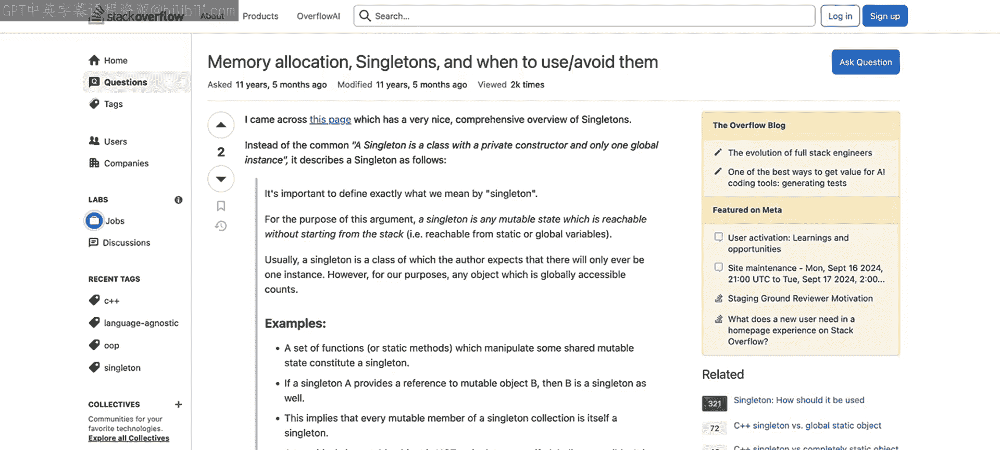
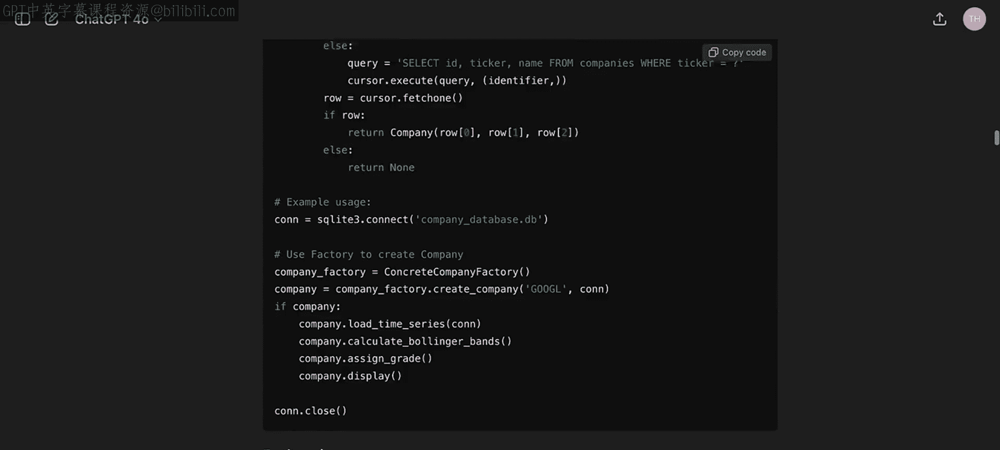
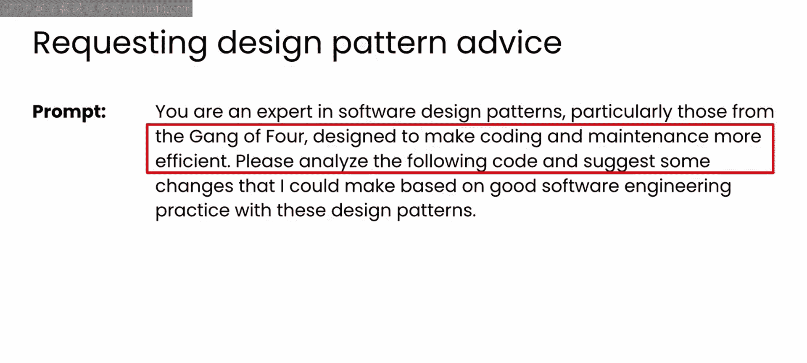
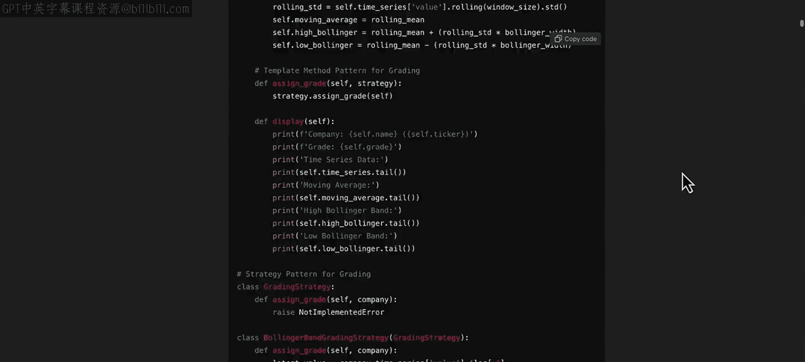
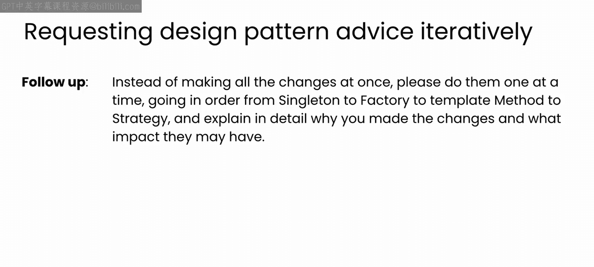
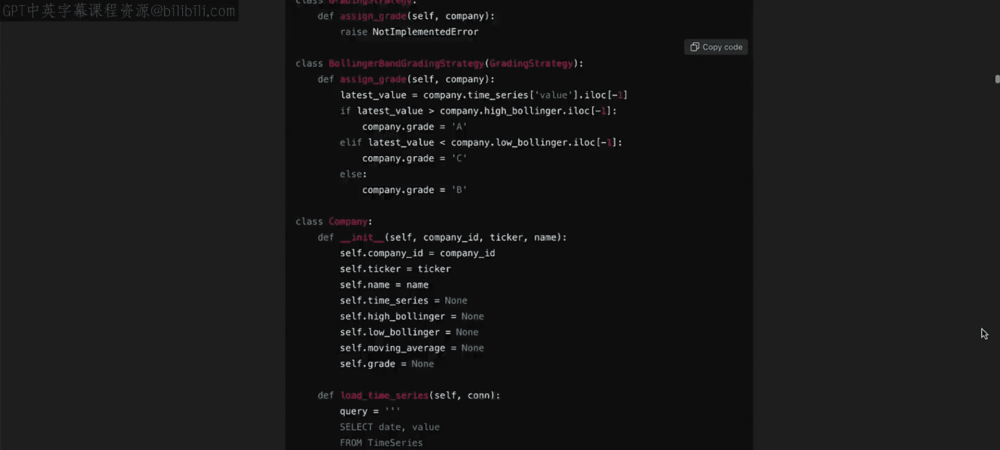

# 70：来自LLM的模式建议 🧠

在本节课中，我们将学习如何利用大型语言模型来分析代码，并获得关于使用设计模式来改进应用程序的建议。我们将通过一个具体的金融应用示例，探索LLM如何识别代码中的问题并提出重构方案。

---

在上一节视频中，我们探讨了一个可以使用单例模式解决的实际问题——管理移动应用中的数据访问。但这可能引发了一个疑问：如果我不是设计模式专家，是如何发现单例模式的呢？

答案是大量的搜索、查阅Stack Overflow以及与同行交流。这些都是很好的学习方式，但可能需要大量时间才能找到所需内容或获得清晰的解释，有时甚至可能一无所获。

如今，聊天机器人的出现为我们提供了另一种获取建议的途径，即与LLM合作，分析和剖析你的代码，然后提出可以改进应用程序或系统的设计模式建议。

因此，让我们通过创建一个示例应用程序，来探索与LLM的这种合作关系，看看像ChatGPT这样的工具如何分析它，并就如何使用恰当的设计模式提出建议。

我创建了一些模拟金融服务中可能使用的应用程序类型的代码。该应用程序拥有一个时间序列数据库。在本例中，数据是给定日期的股票收盘价。

代码还包含了访问和检索数据到公司对象的相关功能，该对象还会基于时间序列计算一些统计数据。顺便提一下，如果你想查看用于创建此代码的提示词，我已将它们保存到一个文本文件中，你可以在视频下方下载。如果你想看看你的LLM会写出什么，可以从中复制粘贴。

这些提示词运用了你在之前数据库模块中学到的策略：首先分配一个角色并提供项目背景，然后概述数据库的模式，指定你想要存储的表和相关列。

后续的提示词会要求LLM创建一些代码来生成合成的股票价格数据并将其添加到数据库中。顺便说一句，这是LLM另一个非常酷的用法：当你没有数据可用时，模型可以帮助你合成一些数据。

最后，另一个后续提示词要求提供一些代码来计算股票价格数据的统计量，在本例中是移动平均线和布林带，并将它们添加到数据库中。

真正酷的是，LLM知道这些量是什么，并生成了为你执行计算的代码。所有这些代码都在一个笔记本中，该笔记本也包含在本视频的下载资源里。此时，我鼓励你下载该笔记本并亲自尝试运行。

我在这段代码中做了一点“手脚”，将一些硬编码的参数改成了全局变量。默认情况下，移动平均线是20天窗口，但我将其设为一个可以更改的全局变量。同样，布林带是移动平均线上下两个标准差的范围，我也将其参数化，以便你可以根据需要设置更宽或更窄的带。

请暂停视频，稍微研究一下这段代码，并随时运用你已有的设计模式知识来审视代码，找出可以改进的地方。完成后，请回来，我们将与LLM合作，利用设计模式来改进代码。

欢迎回来。希望你研究代码的过程有所收获。我相信你已经想到了代码可以改进的一些方式，而我故意做出了一些次优的选择。

现在，让我们探索一下如果你围绕这段代码与LLM交互会发生什么。从一个类似这样的提示词开始：指定LLM的角色是软件设计模式（尤其是“四人帮”模式）的专家。目标是使编码和维护更高效，因此你将要求LLM以此为目标分析代码，并请它建议一些符合良好软件工程实践和设计模式的修改。

在我的案例中，我得到了这样的回答，建议这段代码可以使用四个关键模式。

以下是LLM建议的四个设计模式：

1.  **单例模式**：我们在上一个视频中探讨过。它被推荐用于数据库连接，这很有道理。设计不佳的应用程序可能会多次打开数据库，而不是使用单一连接，这会消耗内存和带宽。老实说，我甚至没想到这一点，我当时只考虑为我们使用的全局变量使用单例。当然，数据库连接是更好的主意。你在研究代码时想到这一点了吗？
2.  **工厂方法模式**：这是一种创建型设计模式，处理对象创建机制。它用于尝试以适合当前情况的方式创建对象。在本例中，LLM建议将其用于创建公司对象。你将在本模块稍后部分更详细地探讨这一点。
3.  **模板方法模式**：这是一种行为模式。根据LLM给出的描述，其用途稍显模糊。它用于遵循特定顺序的操作。
4.  **策略模式**：这也是一种行为模式。LLM建议将其用于我们的评级算法。我们的评级算法是根据公司的价格历史为其打分的功能之一。

你将在后续视频中更仔细地研究这些模式的工作原理。

除了建议这些模式，LLM还继续重构了代码，为我实际实现了这些模式。在我的案例中，提示词结构不佳，导致LLM一次性做出了所有四项更改。我个人更倾向于逐个进行，以便我们能够观察和理解发生了什么。我认为使用生成的代码进行大规模更改通常是不良实践，因为幻觉导致代码出错的风险要高得多。

因此，我用这个提示词进行了跟进，要求LLM逐个模式地更新代码，并在此过程中解释其推理。

然后，LLM依次讲解了每个模式的实现。

接下来，让我们探索LLM为每个模式做了什么。在接下来的几个视频中，你将依次深入研究每个示例。

希望这能成为你未来如何借助像GPT这样的LLM来使用软件设计模式的有用指南。你将首先了解LLM如何将单例模式用于数据库连接，所以请移步下一个视频开始学习。

---

本节课中，我们一起学习了如何利用大型语言模型作为合作伙伴来分析现有代码，并获得关于应用设计模式的建议。我们看到了LLM能够识别代码中的潜在改进点，并具体建议了单例模式、工厂方法模式、模板方法模式和策略模式。重要的是，我们认识到应该逐步应用这些建议，并理解其背后的原理，而不是盲目接受大规模的重构。