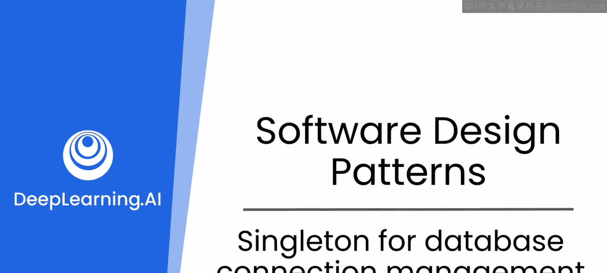
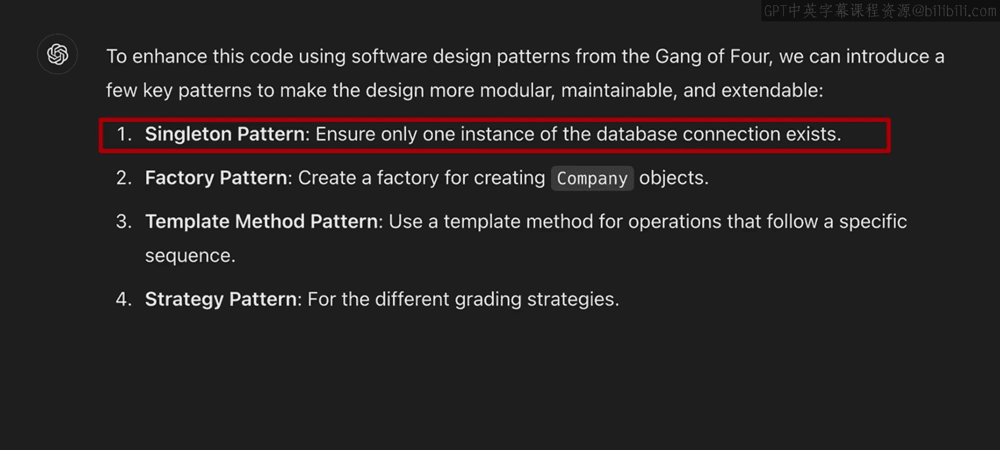
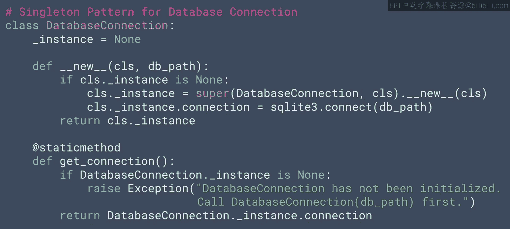
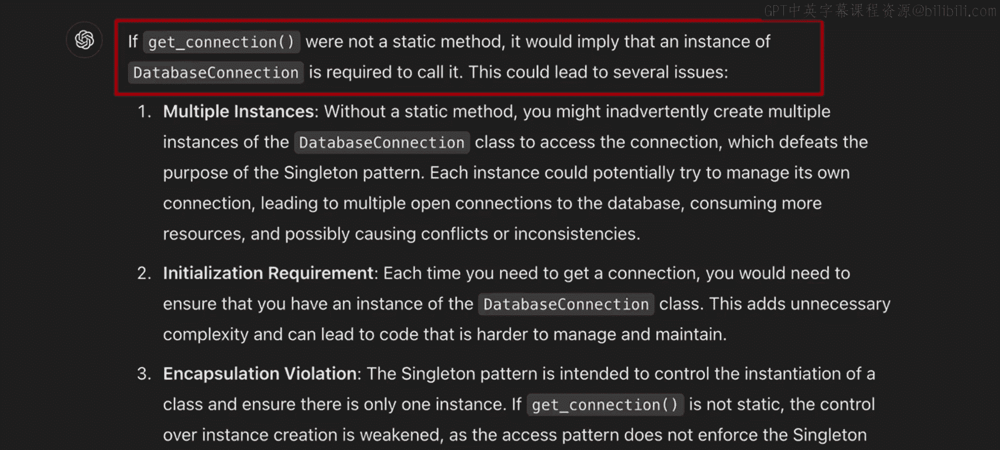
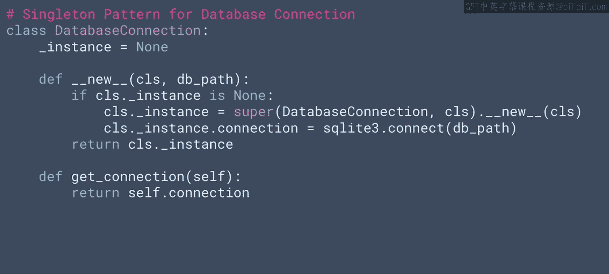
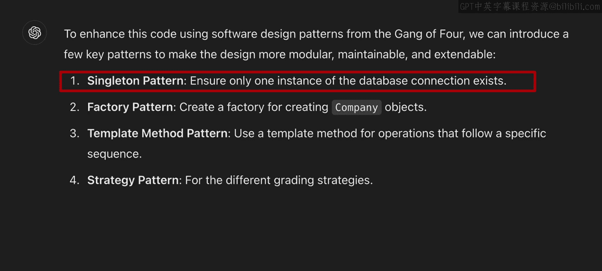
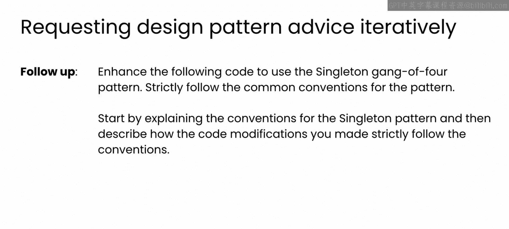
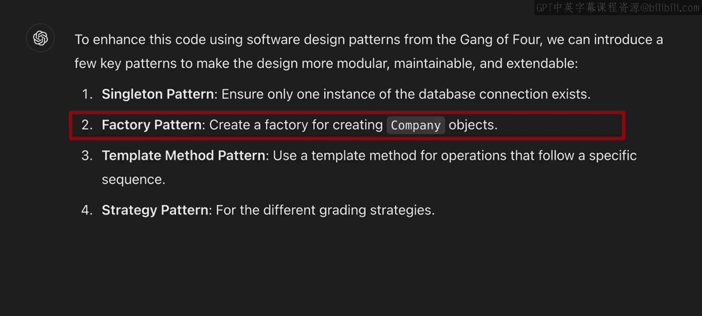

# 71：数据库连接管理器的单例模式 🛠️



在本节课中，我们将学习如何应用设计模式来改进数据库应用程序。具体来说，我们将探讨LLM（大语言模型）如何建议使用单例模式来管理数据库连接，并深入分析生成的代码，理解其优缺点以及如何通过更精确的提示来引导LLM生成更符合规范的代码。

## 概述

在上一个视频中，我们创建了一个用于存储和交互公司股价数据的数据库应用程序。随后，我们要求一个LLM分析这段代码，并参考著名的“四人帮”（Gang of Four）设计模式提出改进建议。第一个建议就是对数据库连接使用单例模式。

## 单例模式的优势



上一节我们介绍了数据库应用程序的初始实现，本节中我们来看看LLM建议的第一个改进点：单例模式。

使用单例模式可以确保在整个应用程序中，我们始终只拥有一个数据库连接实例。随着代码规模的增长，如果没有这种控制，我们可能会意外地创建多个数据库连接。


这种做法显然可以节省系统资源。同时，它还能减少潜在黑客的攻击面，并且由于所有操作都通过单一连接进行，使得代码调试变得更加容易。

## LLM生成的初始代码

经过进一步的提示，LLM生成了以下用于实现数据库连接单例模式的代码。这段代码建立了一个新的`DatabaseConnection`类来处理与SQLite数据库的连接。

```python
class DatabaseConnection:
    _instance = None

    def __init__(self, database_path):
        if DatabaseConnection._instance is not None:
            raise Exception("This class is a singleton!")
        else:
            self.connection = sqlite3.connect(database_path)
            DatabaseConnection._instance = self

    @staticmethod
    def get_instance(database_path):
        if DatabaseConnection._instance is None:
            DatabaseConnection(database_path)
        return DatabaseConnection._instance

    def get_connection(self):
        return self.connection
```

与我们在前几个视频中探讨的标准单例类相比，你是否注意到这段代码缺少了什么？请暂停视频，查看代码，看看是否能找出缺失的部分。

## 识别代码中的“幻觉”

这里实际上存在一个“幻觉”（hallucination）。这是你在检查生成的代码时需要小心的一类问题，如果不仔细审视，可能会带来麻烦。

你发现了吗？如果没有，也不必担心，但未来生成代码时务必保持谨慎。要始终探索和审视代码。问题是，`get_connection`方法没有被设置为静态方法（`static method`）。

所以，正确的代码应该如下所示（注意`get_connection`应为实例方法，但这里讨论的是`get_instance`应为静态方法，原文表述可能略有混淆，核心是关注静态方法的必要性）：



```python
class DatabaseConnection:
    _instance = None

    def __init__(self, database_path):
        if DatabaseConnection._instance is not None:
            raise Exception("This class is a singleton!")
        else:
            self.connection = sqlite3.connect(database_path)
            DatabaseConnection._instance = self

    @staticmethod
    def get_instance(database_path):
        if DatabaseConnection._instance is None:
            DatabaseConnection(database_path)
        return DatabaseConnection._instance

    def get_connection(self):
        return self.connection
```

此时，你可能会想：等等，我们在实例化类时已经检查了实例是否存在，如果存在就直接返回。那为什么还需要静态方法呢？这是一个很好的问题。

## 理解静态方法的重要性

答案非常详细。但一如既往，你可以随时向LLM提问。以下是一个你可以使用的提示词示例：




GPT给出的答案可能会非常详尽。我收到的回复包含了非常详细的信息，建议你花时间阅读，同时也尝试自己进行提示。

但归根结底，缺少静态方法会改变你调用单例的API，这可能导致代码令人困惑。

## 代码对比：有静态方法与无静态方法

通过代码可以更容易理解这一点。如果不使用静态方法，你可能会无意中写出如下代码：

```python
# 不使用静态方法时可能出现的混淆写法
db1 = DatabaseConnection(‘stocks.db’)
con1 = db1.get_connection()

db2 = DatabaseConnection(‘stocks.db’) # 这行实际上不会创建新实例，但看起来像会
con2 = db2.get_connection()
```

在这种情况下，`DatabaseConnection`是一个单例，因此尽管`db1`和`db2`名称不同，但它们是同一个类的实例。同样，`con1`和`con2`也是同一个连接。虽然只有一个连接，但你的代码并没有清晰地展示这一点，这很容易造成混淆。

然而，如果你正确地使用了静态方法（通过`get_instance`），实例化代码将如下所示：

```python
# 使用静态方法获取实例
con = DatabaseConnection.get_instance(‘stocks.db’).get_connection()
```

因为不需要为数据库连接命名（如`db1`或`db2`），当我们获取连接时，直接称其为`con`之类的名称会更直观。与之前的写法相比，这种写法更不容易让人误以为存在多个连接。



当然，你仍然可以尝试创建多个变量来引用它，但连接类本身是单例的这一事实应该让你更清楚地意识到不需要那样做。



## 开发者的专业知识与LLM的协作

这是一个有趣的例子，它展示了开发者自身专业知识的重要性。LLM了解设计模式，也知道如何在代码中实现它们。

但就像人类开发者一样，它并不总是遵循常规路径。它可能生成不完全符合它刚才所述模式的代码。


如果你以前使用过单例模式，或者仅仅通过观看本课程，你可能已经发现了这个问题。


但这里当然存在一点“先有鸡还是先有蛋”的问题：如果你一开始不知道要使用静态方法，你怎么会知道LLM实际上遗漏了它呢？

## 通过精确提示引导LLM

使你的提示词更加具体会有所帮助。例如，你可以修改最初的提示词，要求LLM改进你的代码时这样说：“使用四人帮模式增强以下代码。**严格遵循你所选模式的常见约定**。”



这样明确的指令有助于引导它深入挖掘模式细节。当我尝试这样做时，结果好坏参半。在某些情况下，生成的代码遵循了约定，但有时仍然没有。

另一个有帮助的方法是，先让LLM列出这些约定是什么，然后要求它解释其编写的代码为何遵循这些约定。

以下是一个修改后的提示词示例，用于实现单例模式，并附加了要求其自我解释的指令：


它生成的代码更好了，尽管在包含静态方法方面它仍然选择了一种不同的方法，即使它已经提到那是它将遵循的约定。最终，只有当我询问它为什么没有实际使用静态方法时，它才使用了静态方法并为我创建了一个`get_instance`方法。

因此，我鼓励你尝试这样的指令，进行实验，并与LLM持续对话以推进代码改进。无论何时，只要你能够运用自己的知识，它都将帮助你引导LLM创建出你想要的正确代码。

## 总结与下一节预告

本节课中我们一起学习了如何利用LLM的建议，将单例模式应用于数据库连接管理器。我们分析了LLM生成的初始代码，识别了其中关于静态方法的遗漏，并通过对比代码理解了正确实现的重要性。我们还探讨了如何通过更具体和交互式的提示来引导LLM，使其生成更符合设计模式规范的代码。

完成对单例数据库连接的探索后，我们将继续研究LLM提出的第二个模式建议：使用工厂模式来创建公司对象。我觉得这个建议有点令人费解，它没有解释选择该模式的原因，也没有清晰地描述其作用。

所以，让我们进入下一个视频，更详细地探索工厂方法模式，理解LLM为何建议它，然后与模型合作在代码中实现它。



