# 72：22_工厂模式 🏭

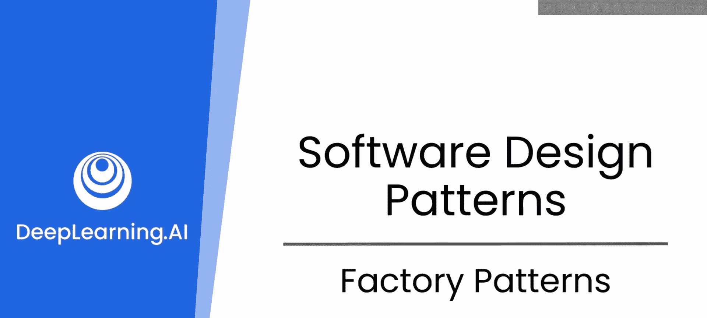

## 概述

在本节课中，我们将学习如何利用工厂模式来改进一个模拟真实世界的数据库应用程序。该程序用于存储和交互处理不同公司及其股价的数据。我们将探讨工厂模式如何帮助我们更灵活地创建不同类型的公司对象，特别是处理那些没有股票代码的海外公司。

## 工厂模式简介

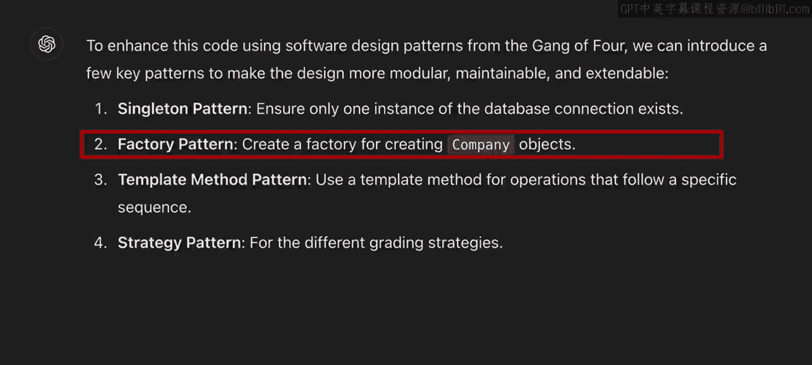

上一节我们介绍了单例模式在管理数据库连接中的应用。本节中，我们来看看另一种设计模式——工厂模式。

通过将代码交给大语言模型分析，我们得知单例模式有助于管理数据库并确保只有一个连接。同时，大语言模型还建议了其他模式，其中之一便是工厂模式。本视频将深入探讨这一模式。

为了更详细地了解工厂模式，我请大语言模型详细解释了它。我之所以这样做，是因为起初我并不清楚在这个应用中使用工厂模式会带来什么好处。


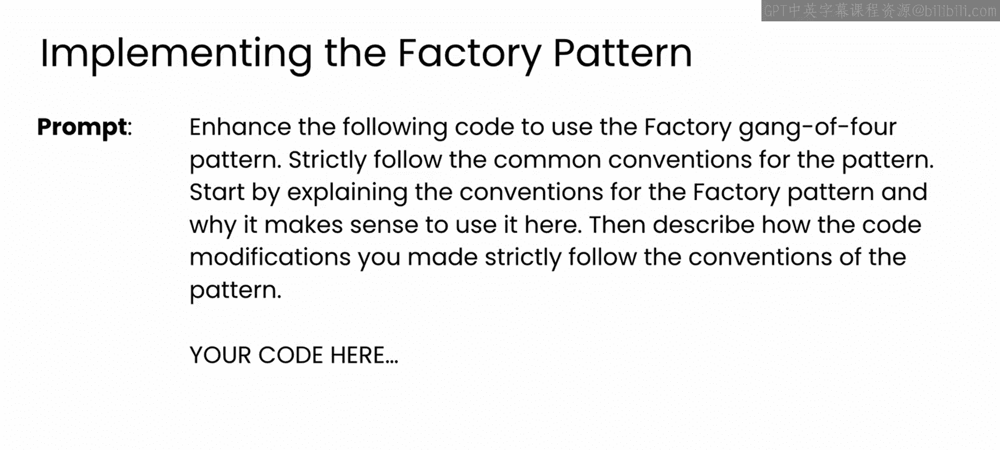

请注意，这里我延续了之前与大语言模型的对话，因此它已经掌握了相关代码背景以及我想学习的内容——即针对此应用的“四人帮”工厂模式。当然，你也可以开启一个新对话，直接提供代码并询问大语言模型为何工厂模式能改进公司对象。然后，你可以请求一些代码来帮助实现这些建议。

无论哪种方式，大语言模型都会给你一个详细的回复。它会将工厂模式描述为一种创建型设计模式，该模式为在超类中创建对象提供了一个接口，但允许子类改变将被创建的对象类型。

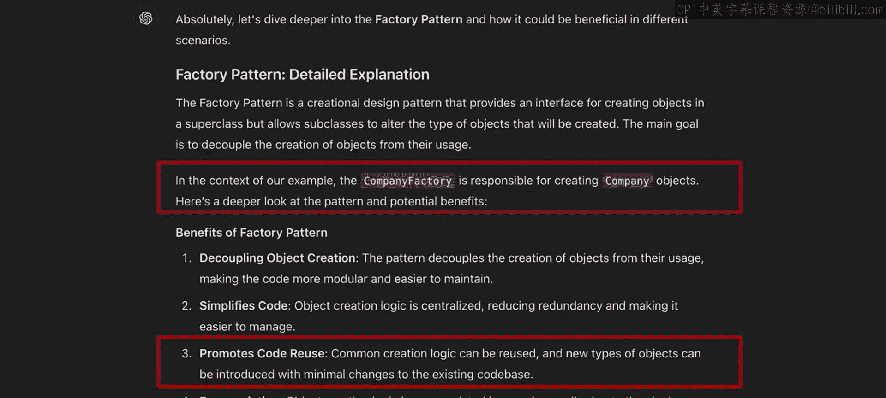

## 工厂模式的核心目标

这是一个相当专业的描述。它接着指出，工厂模式的主要目标是**将对象的创建与使用解耦**。这个说法不那么术语化，但仍然相当抽象。

最后，大语言模型会指出，通过使用工厂模式重构，可以改进代码中的公司对象部分。这将为你提供创建不同类型公司的灵活性。


## 分析现有公司对象的结构

现在，为了思考你可能需要处理的不同公司类型，让我们先更仔细地看看当前公司对象的构造。

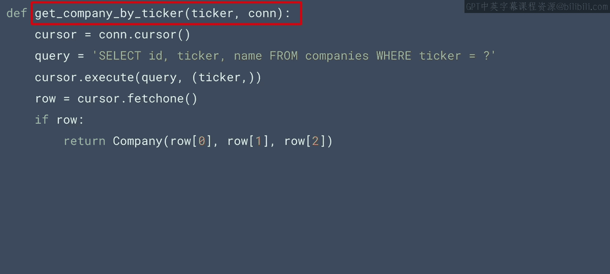

你的应用程序中的公司对象同时拥有一个ID和一个股票代码来代表它。ID只是用于链接时间序列数据库的主键，以便我们可以通过ID进行查询。而公司的标识符则是股票代码。

以下是用于将不同公司数据合成到数据库中的代码。

```python
# 示例：原始公司对象结构
class Company:
    def __init__(self, id, ticker):
        self.id = id
        self.ticker = ticker
```

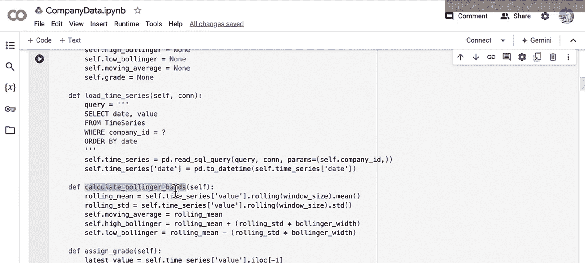

但这种结构引入了一个你可能不希望有的限制：公司必须拥有一个股票代码。但是，如果你想探索其他类型的公司呢？例如，没有股票代码的海外公司。

原始的公司对象设计具有一定的灵活性，因为它同时具有ID和股票代码属性。因此，一家外国公司可以拥有一个唯一的ID来标识。但由于它们没有股票代码，你的代码库中通过股票代码查询公司的部分将无法适用于外国公司。

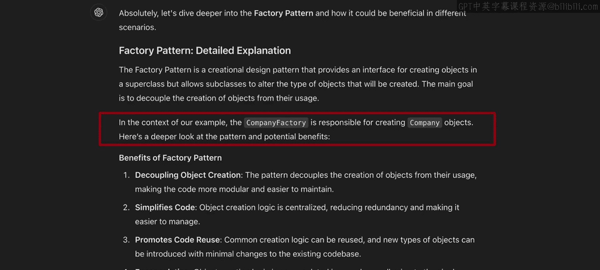


如果你已经拥有大量通过股票代码识别国内公司的遗留代码，回过头去全部修改可能不可行或不可取。那么你能做什么？如何在不进行大规模系统重构的情况下，增加处理外国公司的能力？特别是，能否在不将数据库迁移到全新格式的情况下做到这一点？

## 工厂模式作为解决方案

这就是工厂模式可以发挥作用的地方。工厂模式允许你构建功能来处理不同类型对象的创建，这些对象可以共享共同的特征。一个工厂类处理对象的整体生产，就像真正的工厂一样，而具体类则传递特定的指令来制造这些对象的不同变体。


想象一个汽车工厂，它生产某一型号车辆的三种变体，这些变体在内饰、漆面、音响选项等方面有所不同。底层的汽车是相同的，只有细节在变化。

在工厂设计模式中，具体类包含每个汽车版本的具体变体细节。抽象工厂类则在接到制造新汽车的请求时，在基础汽车对象之上实现这些规格。

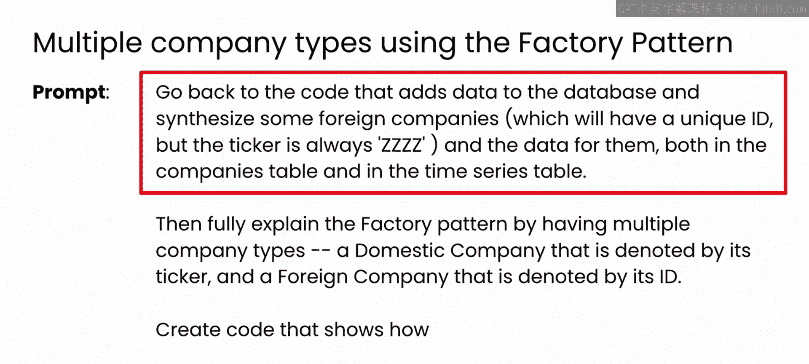

我认为通过查看一些代码，更容易理解这里发生的事情。因此，我请大语言模型帮助我编写一些代码，实现工厂类来帮助我处理创建两种类型的公司对象：外国公司和国内公司。

以下是我为此使用的更详细的提示。再次注意，我延续了之前的对话，在那次对话中，我已指派大语言模型扮演软件设计模式专家的角色，特别是“四人帮”的模式。如果你在一个新聊天中开始，你可能需要在这里重新指派角色，然后在你的初始提示中提供之前聊天会话的任何相关背景。

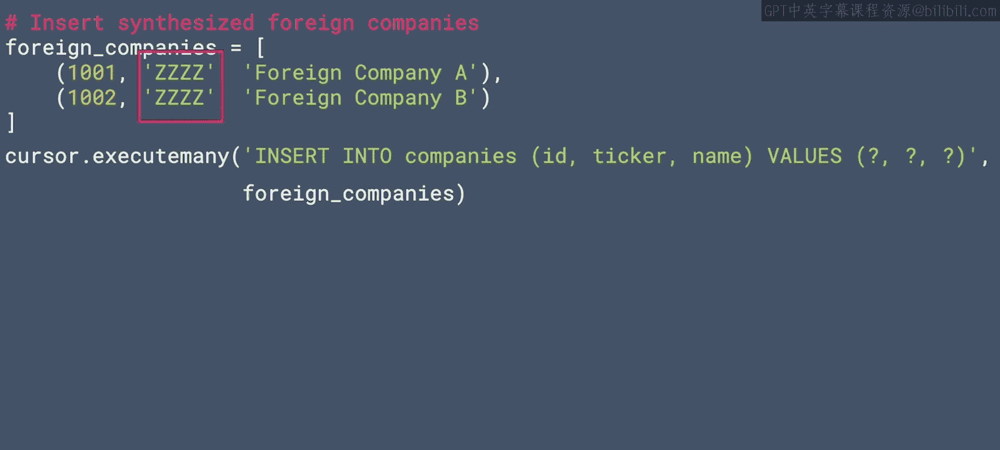

## 实现工厂模式

首先，提示将要求大语言模型用一些外国公司更新数据库，然后为它们添加一些数据。我给出了一些关于如何处理股票代码字段的具体指示。

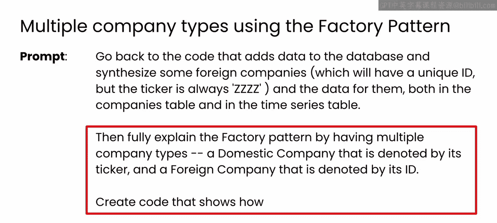


然后，大语言模型编写了创建两个标识符为1001和1002的公司的代码。正如你在这里看到的，两者的股票代码是相同的。因此，仅凭股票代码在数据库中查找公司将无法适用于你现有的功能。而这正是工厂模式可以帮助你解决的问题。


提示的后半部分是解释工厂模式如何处理多种公司类型。在这种情况下，一种是由其股票代码表示的国内公司，另一种是由其ID表示的外国公司。我还要求大语言模型同时创建实现此模式的代码。


以下是抽象公司工厂的代码，它包含了创建具体类的接口。请注意，它有一个静态方法，类似于单例模式，并且它有一个单一的方法 `get_company`。静态方法允许你访问该类并使用该方法，即使该类尚未被实例化。

大语言模型还编写了用于创建特定公司子类的具体工厂类。在本例中，是国内公司和外国公司。这些是非常简单的子类，只是在基础公司对象上添加了一个属性 `company_type`。但你可以想象在某些情况下，你可能想要重写原始公司类中的方法或数据。为了本视频的目的，我保持简单。

现在，当使用公司工厂的 `get_company` 方法时，它会获取数据库中标识符的实例，该实例将使用股票代码（字符串）或ID（整数）进行调用。

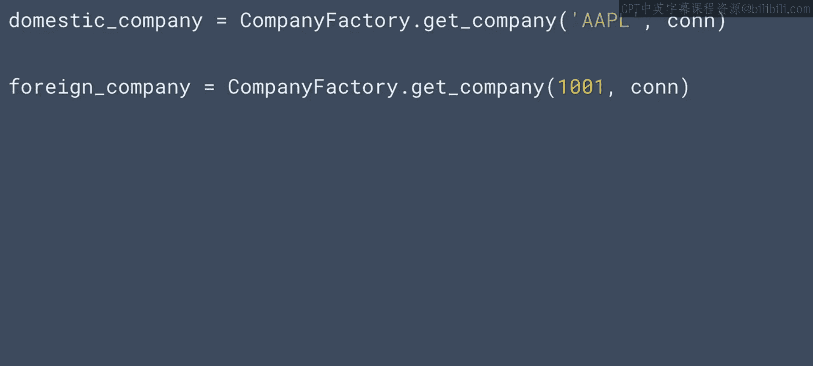

因此，如果标识符是字符串，查询将能够通过 `WHERE` 子句传递该参数，条件是股票代码，这当然会给我们一个国内公司，所以我们返回一个国内公司对象。否则，假设你传入了一个ID，在这种情况下，它可以是任何一种，但我们可以让它返回适当类的实例。

现在你的代码变得简单多了，因为根据你传入的参数类型，`get_company` 将返回一个公司对象，无论参数是股票代码还是ID，并且它应该返回适当的类类型。


正如我之前提到的，除了使用ID或股票代码作为标识符外，这些类之间没有太大区别。但对于一个真实世界的应用程序，可能针对不同地区的公司使用不同的方法，而合理的对象设计，连同工厂模式，可以帮助你抽象这一点。

## 实践与注意事项

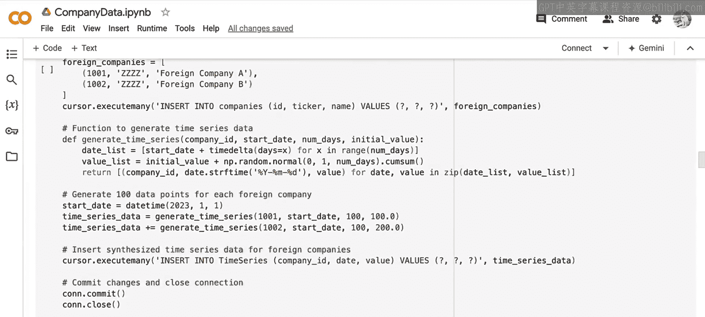

这里有很多代码和细节。花点时间，使用我在公司数据笔记本中提供的代码自己尝试一下，然后你就可以看到工厂模式的实际运作。该笔记本实际上包含了处理此场景的数据库代码的初始版本，以及实现了单例模式和工厂模式以改进此应用程序的更新版本。这将让你更轻松地看到这些模式带来的变化。


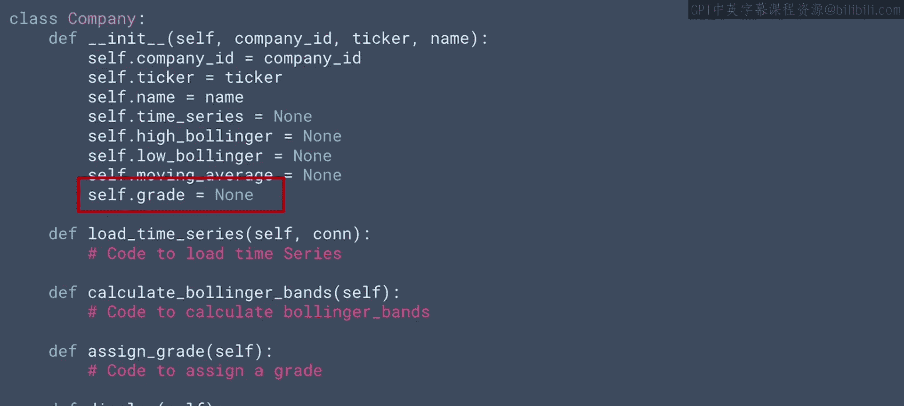

一个有趣的注意事项，也是使用大语言模型编码时可能让你出错的地方，如果你不小心的话。这个应用程序使用单词“grade”来表示我们对公司当前市场地位的看法，并根据其当前价格给出ABC等级。因此，公司对象有一个 `grade` 属性来存储这个信息。


但是“grade”也是一个动词。当ChatGPT看到这个时，它创建了一个名为 `grade` 的方法，然后试图调用它，因此导致了很多失败。我不得不手动重写代码，将其改为 `assign_grade`，以防止作为动作的“grade”和作为结果的“grade”之间的混淆。在生成代码时需要注意这一点，你可以通过确保任何包含数据的属性不要使用像“grade”这样既可以是名词也可以是动词的名称来稍微缓解这个问题。

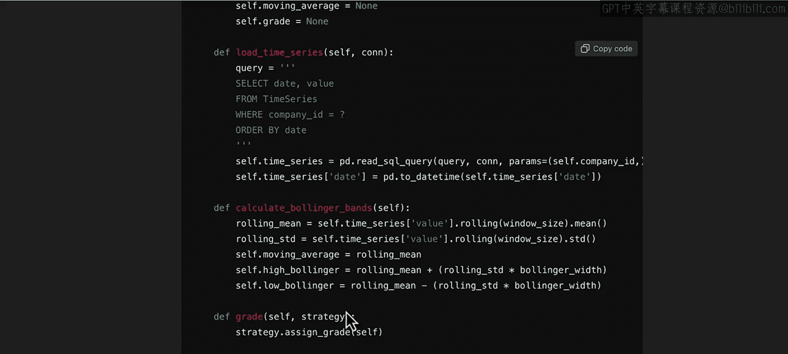

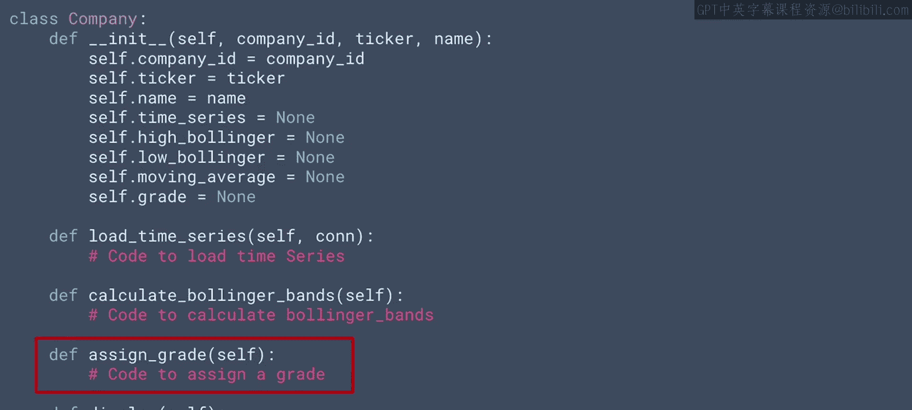

## 扩展练习

好了，在查看和尝试代码之后，我鼓励你做一个自定进度的练习。考虑第三种公司类型，它实际上不是公司，但你可以将其视为公司。一种常见的投资工具是加密货币或其他代币。这些没有收盘价，因为它们全天24小时交易。那么你将如何实现它？有没有办法使用当前的时间序列数据库？还是你需要一个新的？当你没有每日数据时，如何计算布林带等等？

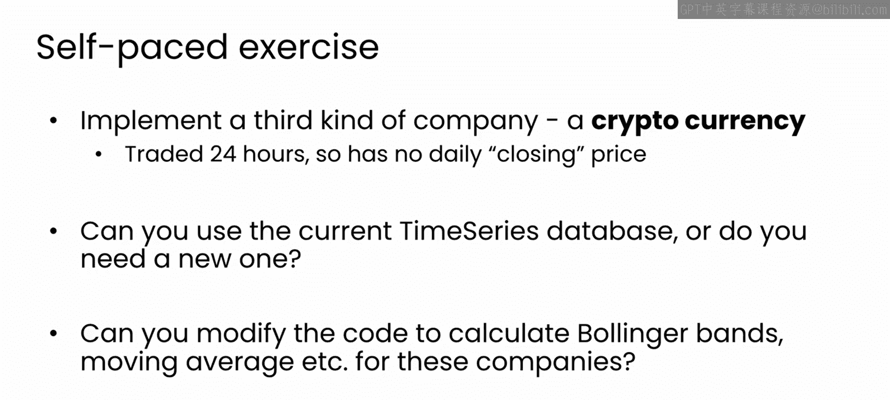


我不会为你提供解决方案，但使用此代码作为起点，扩展它以查看你能否处理加密货币及其公司类型的差异可能会很有趣，这可能需要你重写一些方法。如果你现在还做不到，不用担心，但试着思考一下。在下一个视频中，我们将看看模板设计模式，那可能会提供一些提示。

## 总结

本节课中，我们一起学习了工厂模式。我们了解了它如何通过提供一个统一的接口来创建对象，从而将对象的创建逻辑与使用逻辑解耦。通过重构公司对象，我们实现了能够灵活创建国内和外国两种不同类型公司的工厂，解决了原有设计对股票代码的依赖问题。我们还讨论了在实现过程中可能遇到的命名冲突问题，并提出了一个扩展练习来巩固理解。工厂模式是构建灵活、可扩展软件系统的重要工具。