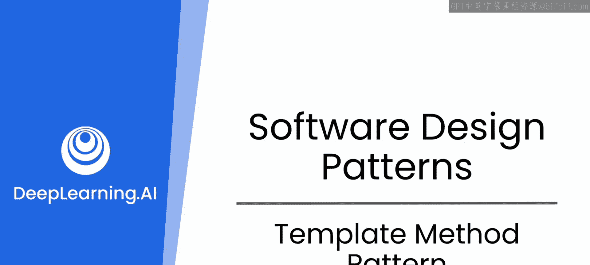
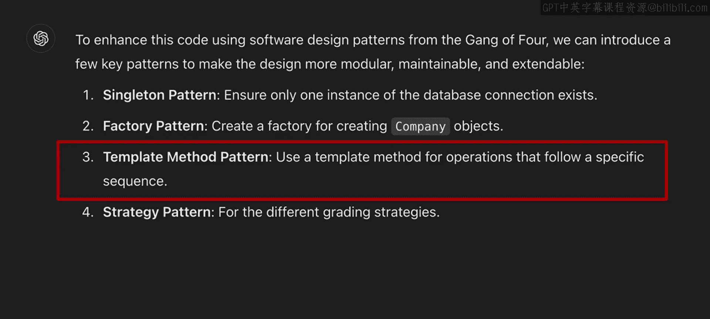
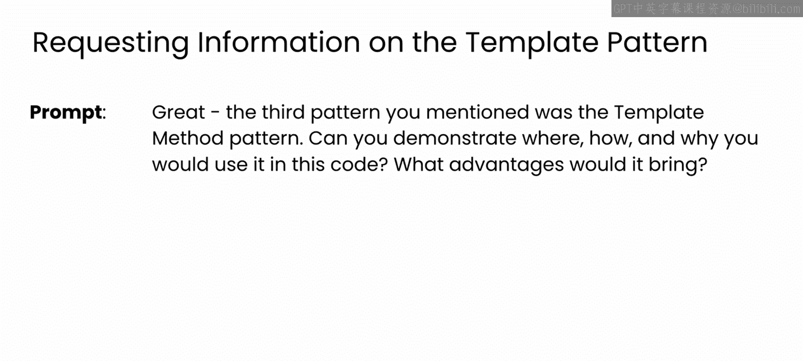
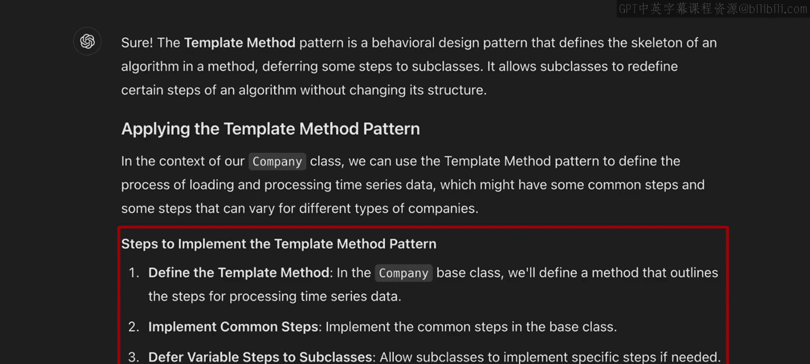
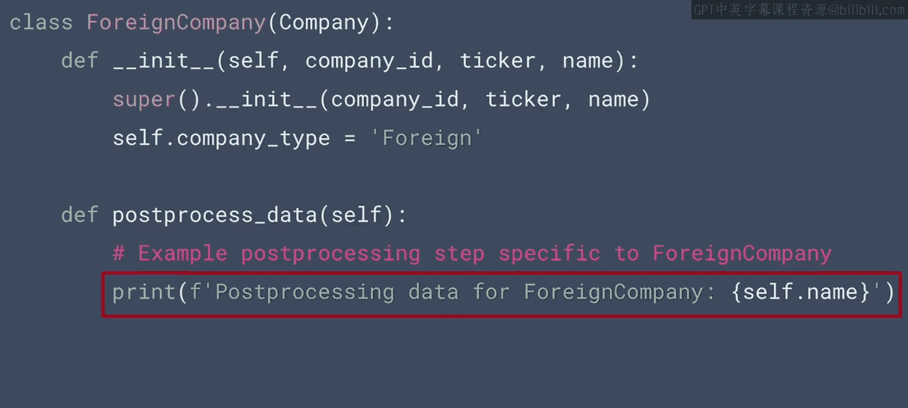
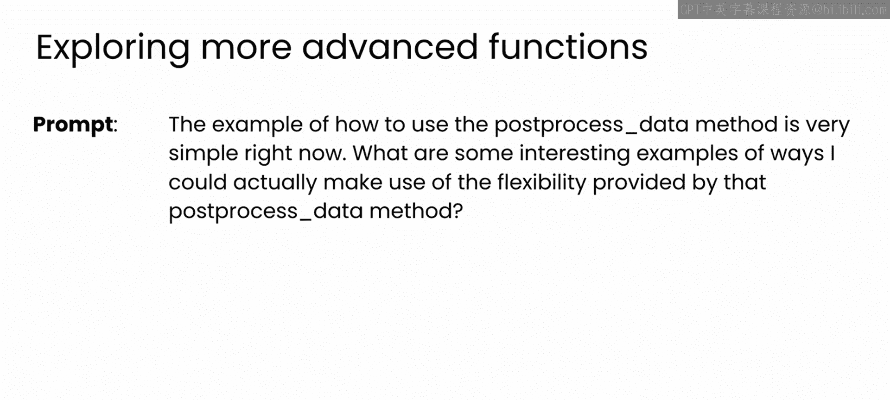
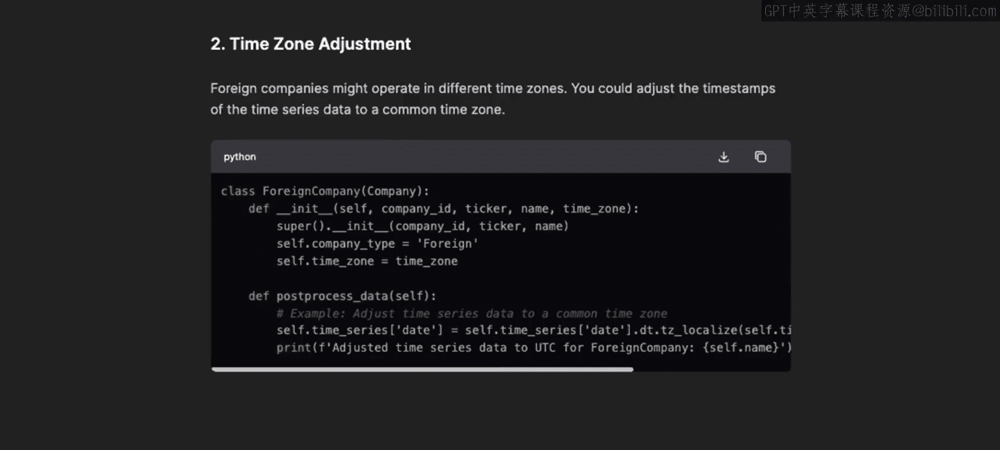

# 73：模板方法模式 🧩



在本节课中，我们将学习如何将大型语言模型作为结对编程伙伴，并探索一种名为“模板方法模式”的设计模式。我们将看到如何利用该模式来重构一个金融服务应用程序的代码，以提高其灵活性和可维护性。

## 概述

在之前的课程中，我们构建了一个模拟的金融服务应用程序。我们首先使用**单例模式**优化了数据库连接，使其更高效、更安全。随后，我们通过**工厂模式**进一步改进了设计，使应用程序能够灵活处理不同类型的公司（例如国内公司和外国公司）。现在，我们将探讨LLM建议的另一个模式——**模板方法模式**，看看它如何为我们提供更好的灵活性。

## 模板方法模式的引入与解释



上一节我们介绍了工厂模式，本节中我们来看看模板方法模式。LLM首先解释了该模式的优点。

LLM指出，当您希望定义一个算法的骨架，同时允许子类在不改变结构的情况下修改该算法的某些部分时，这是一个很好的模式。



接下来，LLM解释了该模式的实际应用场景。它建议将模式应用于公司时间序列数据的分析过程。时间序列分析流程遵循几个通用步骤，通过使用模板方法模式，您可以让子类（例如国内公司和外国公司）来修改这些步骤。

最后，LLM给出了如何实现该模式的高级描述。基于此描述，您需要定义一个分析公司时间序列数据的高级流程，然后在子类中实现一些更改，以调整该流程中的个别步骤。

## 查看LLM生成的代码

以下是LLM为实现该模式而生成的代码。

首先，这是模板方法本身。它是一个相当直接的方法，名为 `process_time_series`。

```python
def process_time_series(self):
    self.load_time_series()
    self.pre_process_data()
    self.calculate_bollinger_bands()
    self.post_process_data()
```



看起来它有四个步骤。其中两个步骤非常熟悉：`load_time_series` 和 `calculate_bollinger_bands`。这两个方法已经存在于您的类中，用于分析公司数据。

例如，如果您想分析一家国内公司的数据，您可能会编写如下代码：实例化一个国内公司对象，为了获取其评级，您需要加载其时间序列数据、计算布林带、选择合适的评级策略、对数据进行评级，然后显示结果。

然而，模板方法已经包含了加载时间序列数据和计算布林带的步骤。因此，模板方法带来的一个直接简化是，它可以将这两行代码合并为一个名为 `process_time_series` 的单一操作。请记住，这个更新后的方法对所有公司子类（无论是国内还是外国公司）都可用。

为了了解这种方法能带来哪些灵活性，让我们再看一下那个模板方法。

除了加载时间序列数据和计算布林带的步骤外，它还有 `pre_process_data` 和 `post_process_data`。这些对类来说是新的。让我们看看AI是如何实现它们的。

在公司基类中，这些方法的实现如下所示：

```python
def pre_process_data(self):
    pass

def post_process_data(self):
    pass
```

它们内部几乎什么都没有。这很合理，因为这里的核心思想是，流程中的某些步骤可以由某些子类重写。

请注意，这个 `pass` 功能是Python特有的，但在大多数语言中都应该存在让子类实现方法的类似特性（例如，在Java中，您可以通过声明一个没有实现的受保护抽象函数来实现）。

回到Python示例，以下是LLM建议对外国公司类所做的更改，您可以看到它重写了 `post_process_data` 函数。

```python
def post_process_data(self):
    print("Post-processing data for a foreign company...")
    # 理论上，这里可以有一些特殊行为
```

理论上，这里可以包含一些特殊行为，但目前看来，它所做的只是打印一条消息，说明外国公司的数据正在进行后处理。

## 探讨更有用的应用场景



现在，您可能觉得为了实现这个模式只是启用打印一条基本消息而做了大量工作。由于我们正在开发的应用程序规模较小且功能有限，LLM能为模板方法模式添加的内容也就只有这么多。

但让我们看看LLM是否能引导您了解一些该模式实际上会更有用的场景示例。

您可以使用如下提示来询问一些更有趣的例子：



> “你能给出一些更具体的例子，说明外国公司可能需要在`post_process_data`方法中做什么吗？”

现在，LLM概述了许多针对外国公司的有趣的数据后处理想法。例如，也许公司位于欧元区，收盘价以欧元计价；或者公司在中国，价格以人民币计价。如果您想与美国公司进行比较，那么您可能需要对数据进行后处理以进行货币转换，使它们具有等效的货币价值。

模型还建议进行时区调整，这对于对齐来自不同国家的数据来说完全合理。它甚至分享了一些关于如何实现这些调整的示例代码。

现在，这些例子更能说明您为何要使用这种模板方法模式，它们可以帮助您判断是否值得重新架构您的应用程序以利用它。



## 开发者的主导作用

需要指出的是，在整个示例中，您作为开发者，仍然主导着整个过程。LLM提出了一个有用的模式，描述了它的好处，展示了一个示例实现，并帮助集思广益了它可能被证明有用的场景。

然而，作为对项目长期方向有全面了解的开发者，是否实际实施该模式将由您决定。

## 总结

本节课中，我们一起学习了如何将LLM作为结对编程伙伴来应用**模板方法模式**。我们看到了该模式如何定义一个算法骨架（`process_time_series`），并通过在基类中预留钩子方法（如 `pre_process_data` 和 `post_process_data`），允许子类（如 `ForeignCompany`）定制特定步骤。这提高了代码的复用性和灵活性。虽然当前示例简单，但LLM帮助我们设想了更复杂的应用场景，如货币转换和时区调整。至此，我们已经看到了应用于项目的三种模式：单例模式、工厂模式和模板方法模式。LLM还建议了另一种模式——策略模式，我们将在下一个视频中一起探索。