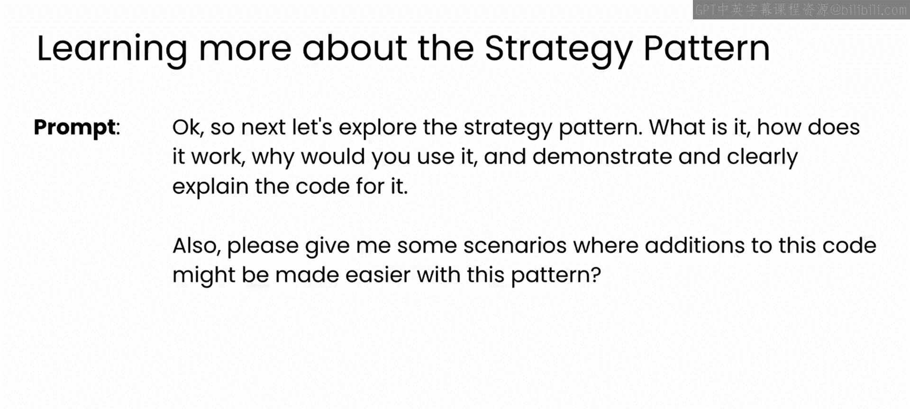
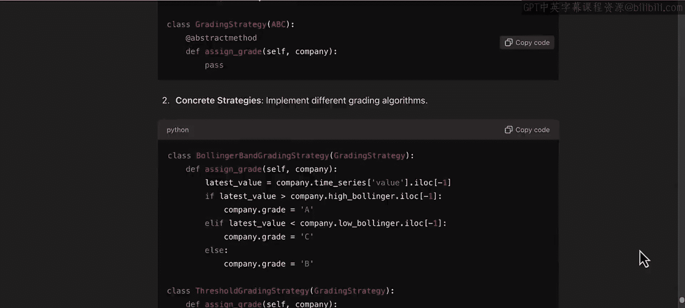
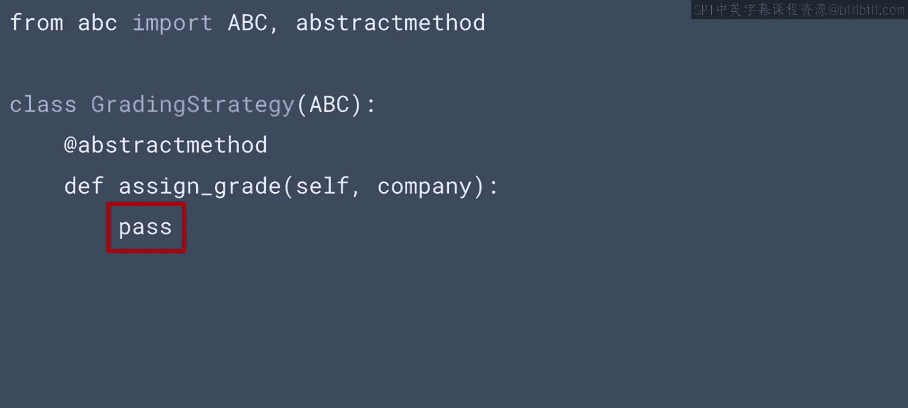
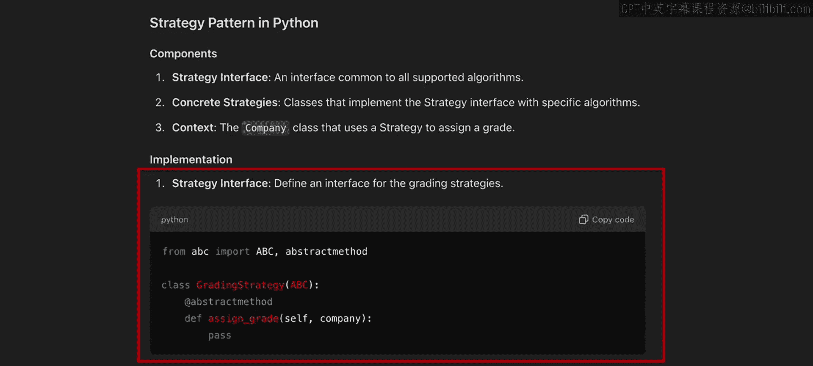
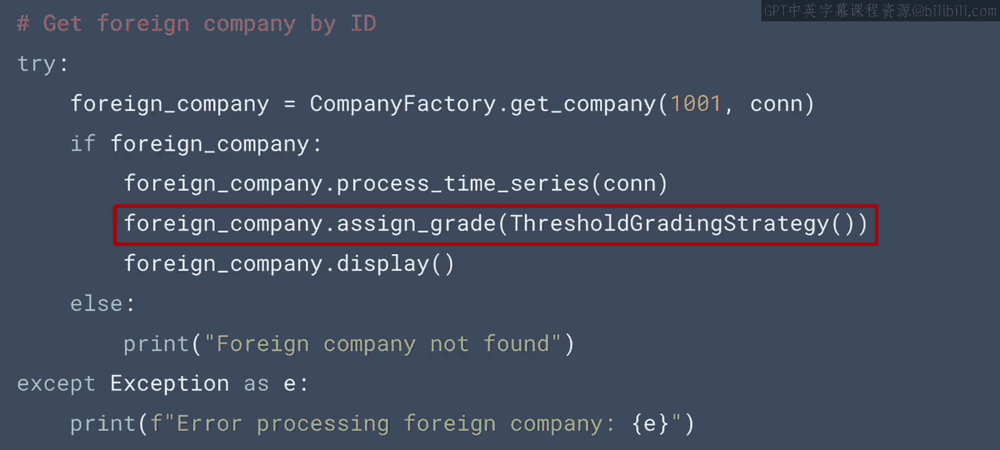

# 74：策略模式 🎯

在本节课中，我们将学习第四种也是最后一种设计模式——策略模式。我们将了解其核心概念、实现步骤，并通过一个具体的代码示例来展示如何应用该模式。

## 概述

上一节我们介绍了模板方法模式，本节中我们来看看策略模式。策略模式是一种行为设计模式，它允许你定义一系列可互换的算法，并在运行时选择最合适的算法来使用。

## 策略模式详解

当LLM最初建议实现模式时，它只提到了“用于不同评分策略的策略模式”。这个描述比较宽泛，因此我们需要进一步澄清这个模式是什么以及在哪里使用它。



GPT回应说，策略模式允许你创建一系列可互换的算法家族，然后使用最合适的算法。例如，如果你希望有多种方式为公司分配评级，这些评分算法可以轻松互换。

需要提醒的是，此处的“评级”是公司的一个属性，指的是对其市场地位的评估。

## 实现步骤



GPT指出，要实现此模式，你需要：
1.  定义一个策略接口。
2.  实现具体的策略类。
3.  修改公司类以及使用它的代码，以适当地选择你想要使用的策略。

这个高层计划是合理的，现在让我们看看生成的代码。

## 代码解析

首先，GPT添加了一个从名为`ABC`的库的导入。如果你不熟悉这个类，可以向LLM询问。简而言之，它是一个用于定义抽象基类和抽象方法的类，适用于你计划创建子类的情况，就像我们这里要做的一样。

以下是定义策略接口的代码：

```python
from abc import ABC, abstractmethod



class GradingStrategy(ABC):
    @abstractmethod
    def assign_grade(self, company):
        pass
```

在这段代码下面，定义了一个名为`GradingStrategy`的类，它有一个名为`assign_grade`的方法。请注意，该方法只包含一个`pass`语句，并且有一个`@abstractmethod`装饰器。这意味着该方法并未在此类中实际实现，而是设计为在子类中被重写。



这种方法对你来说可能是新的，但它与LLM告诉我们的策略模式是一致的。你会期望为策略创建一个接口，然后是该策略的几个具体实现，而这就是我们的模板。

## 具体策略实现

以下是LLM建议的第一个具体策略——布林带评分策略：

```python
class BollingerBandGrading(GradingStrategy):
    def assign_grade(self, company):
        latest_value = company.time_series[-1]
        if latest_value > company.high_band:
            return 'A'
        elif latest_value < company.low_band:
            return 'C'
        else:
            return 'B'
```

请注意，这是一个继承自你刚才看到的`GradingStrategy`类的类，并且它重写了该类中的`assign_grade`方法。

这个方法内部的逻辑非常简单。基本上，如果时间序列中的最新值高于上轨，则给予A级；如果低于下轨，则给予C级；否则给予B级。当然，我不会想用如此简单的算法来做投资决策，但它能接收一个公司并返回一个评级，这对我们的示例来说已经足够。

以下是第二个示例评分策略，称为阈值评分：

```python
class ThresholdGrading(GradingStrategy):
    def assign_grade(self, company):
        latest_value = company.time_series[-1]
        if latest_value > 200:
            return 'A'
        elif latest_value < 100:
            return 'C'
        else:
            return 'B'
```

这个类同样继承自`GradingStrategy`接口，并且也重写了`assign_grade`方法。这个策略似乎基于数值阈值：如果最新值高于200，则给予A级；如果低于100，则给予C级；否则为B级。这同样可能是一种简单的评分方式，但它展示了策略模式如何允许两种不同的方法遵循相同的接口编写。

## 在代码中使用策略

那么，如何在代码中使用这些策略呢？这非常简单，让我们来看一下。

例如，如果你想为国内公司使用布林带评分策略，操作非常直接。以下是检索公司详情并显示它们的代码。但在这一行，当我分配评级时，我只需传入策略，系统就会为我使用布林带评分策略进行评分。

```python
# 使用布林带策略为国内公司评分
domestic_company = get_company_details("DomesticCo")
grade = BollingerBandGrading().assign_grade(domestic_company)
print(f"公司 {domestic_company.name} 的评级是：{grade}")
```

或者，如果我处理一家外国公司，并希望对其使用不同的评分策略，我可以直接将阈值评分策略传递给它，正如你在这里看到的：



```python
# 使用阈值策略为外国公司评分
foreign_company = get_company_details("ForeignCo")
grade = ThresholdGrading().assign_grade(foreign_company)
print(f"公司 {foreign_company.name} 的评级是：{grade}")
```

得益于策略模式创建的接口，我拥有了这种非常灵活的切换评分策略的方式。

## 总结

本节课中我们一起学习了策略模式。这是我要展示的最后一个模式，当然，设计模式还有很多很多。我希望你能看到LLM在分析你的代码、识别你可以尝试的设计模式方面是多么有用。这可以成为提高你所编写代码质量的一种强大方式，并最终帮助你构建更好的软件。毕竟，这一切的核心在于使用所有可用的工具，让你成为一名更出色的程序员。