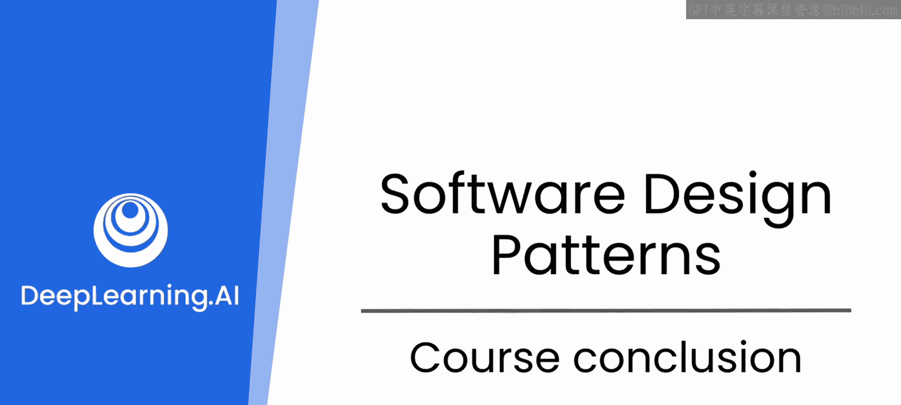

# 75：课程总结 🎉

在本节课中，我们将一起回顾整个课程的核心内容与收获，并对未来的学习与实践提出建议。

恭喜你完成本课程。在过去的三个模块中，你掌握了宝贵的技能来提升你的编码能力。你学会了如何与像ChatGPT这样的大型语言模型合作，将其作为你可靠的结对编程伙伴。

## 模块一回顾：配置驱动开发与数据序列化

上一节我们介绍了课程的整体结构，本节中我们来回顾第一个模块的内容。在第一个模块中，你了解了LLM如何帮助你思考数据序列化，以及它在一种名为“配置驱动开发”的软件设计范式中的作用。

以下是你在该模块中学到的核心概念：
*   你看到了**JSON**文件如何被用来外部化应用程序的配置，使得可能发生变化的设置与应用程序的核心逻辑本身分离开来。
*   你也了解了如何使用类似**pickle**的工具来序列化复杂对象或保存应用程序状态。
*   你利用了ChatGPT对这些概念的深刻理解，实现了一个可配置的应用程序原型，该原型使用DALL-E生成图像。

## 模块二回顾：数据库设计与操作

接下来，我们进入第二个模块的回顾。第二个模块带你进入了数据库的世界。你发现了如何使用ChatGPT来设计健壮且高效的数据库模式，并实现增删改查操作。

以下是该模块的关键要点：
*   将LLM作为数据库专家使用，为你提供了一个强大的工具来构建和管理既具有可扩展性又易于维护的数据库。
*   GPT提供实时见解和建议的能力，帮助你应对复杂的数据库挑战，使你成为一名更熟练的数据库开发者。
*   虽然你操作的示例使用了SQLAlchemy和Python，但你学到的提示词技巧同样适用于其他实现，如PostgreSQL、MySQL或任何其他数据库管理系统。

## 模块三回顾：设计模式的应用

最后，我们来总结第三个模块。在最后一个模块中，你深入探讨了设计模式的领域，重点关注了“四人帮”中的模式。你与LLM合作构建了一个金融服务应用程序，并应用了单例模式、工厂模式和模板方法等模式来改进应用设计并解决实际问题。

以下是本模块的核心收获：
*   GPT全程指导你完成每一步，提供示例和澄清以巩固你的理解。
*   你现在已经具备了扎实的基础，能够使用LLM来思考设计模式，并创建灵活、可重用和可维护的代码。

## 未来之路与重要建议

回顾了所有技术内容后，本节我们将展望未来并讨论一个至关重要的原则。在你继续编码之旅时，请记住，你在这里获得的技能和知识仅仅是一个开始。像ChatGPT、Claude或Gemini这样的LLM将继续成为你强大的盟友，帮助你应对新的挑战并精进你的技艺。

但我鼓励你记住这一点：**不要让LLM主导你的代码**。我注意到一种日益增长的现象，即初级开发者从LLM获取代码后，在没有完全理解的情况下就直接使用。随后，更资深的开发者就不得不承担修复由此产生的缺陷和问题的技术债务。请记住，有一天，你可能会成为那位更资深的开发者。

当我们看到大量为我们生成的代码时，很容易直接使用它，然后转向下一个问题。但请不要这样做。这是在牺牲未来以拯救现在。

相反，请持续实验，持续学习，最重要的是，持续编码。你作为一名熟练且高效的开发者的未来，一片光明。

感谢你参与本课程，祝你编码愉快。

---

**本节课中我们一起学习了**：三个核心模块的知识——配置驱动开发与数据序列化、数据库设计与CRUD操作、以及经典设计模式的应用。更重要的是，我们明确了以LLM为辅助工具的正确态度：理解而非照搬，持续学习与实践是成长为优秀开发者的关键。