# 001：课程介绍与历史背景 🧠

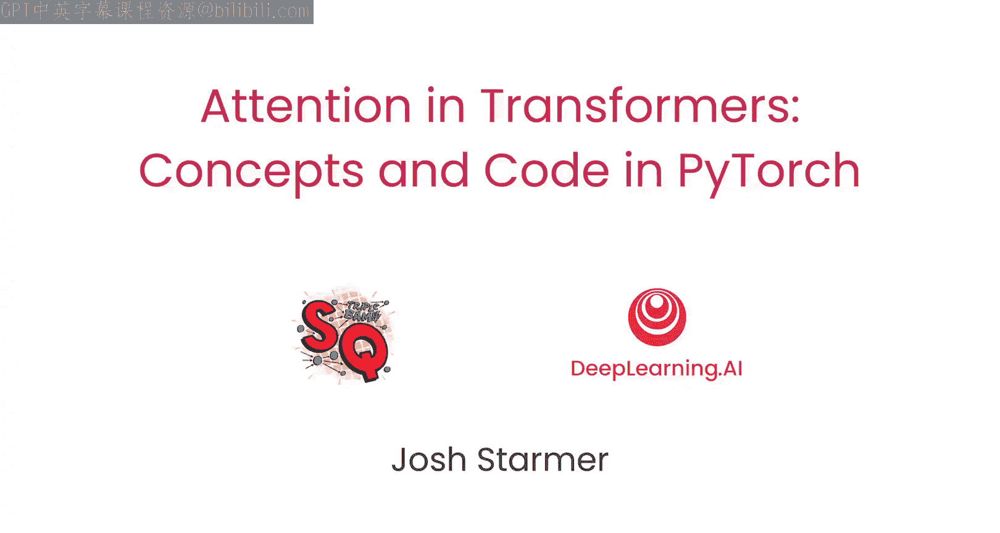

在本节课中，我们将要学习Transformer架构及其核心——注意力机制的基本概念与发展历史。我们将了解注意力机制如何从机器翻译任务中诞生，并最终演变为驱动现代大语言模型的关键技术。

## 课程概述

欢迎来到由Josh Tmer（StatQuest在线教育平台CEO）讲授的《PyTorch中的注意力机制与Transformer概念与代码》课程。本课程将讲解注意力机制，这一最终催生了Transformer架构的关键技术突破。你将学习这些思想如何随时间发展、其工作原理以及如何实现。Transformer架构和注意力算法在大型语言模型的发展中极为重要。

## 注意力机制的起源

上一节我们介绍了课程的整体目标，本节中我们来看看注意力机制诞生的背景。

2014年，许多研究人员致力于机器翻译任务，例如将英语句子翻译成法语。一种非常基础的方法是取每个英语单词，并查找该单词对应的法语翻译。

但这种方法效果不佳。例如，英语和法语中的词序可能不同。在示例中，英语句子以“the European economic area was”开头，但法语中的词序发生了变化。句子的长度也可能不同。这个三词的英语句子“they arrive later”在法语中是五个词。

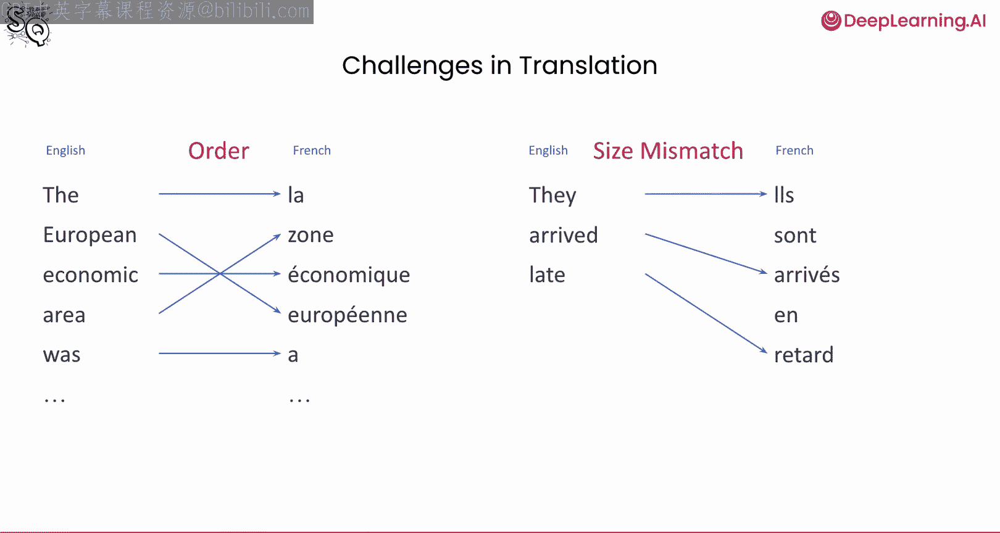

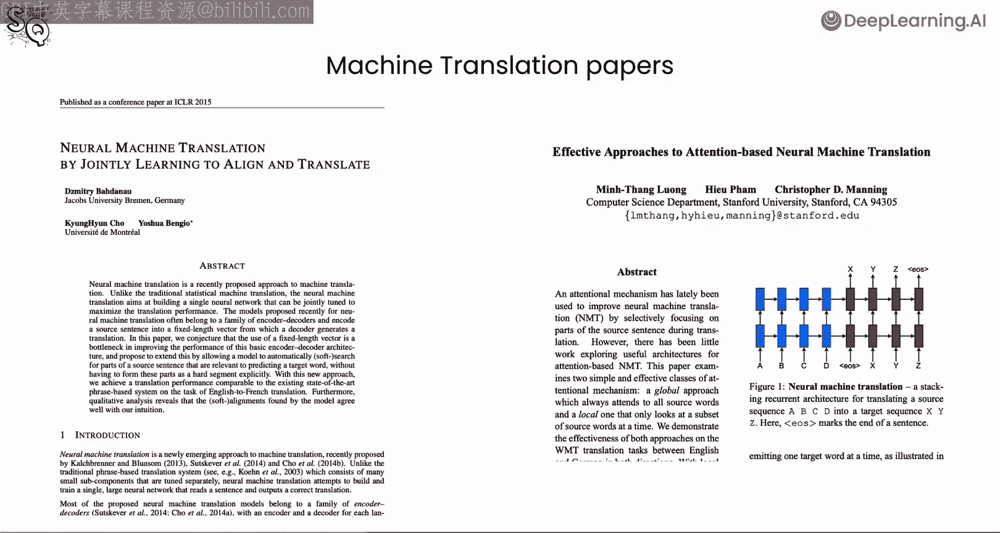

为了应对这些挑战，两个研究小组——蒙特利尔大学的Yoshua Bengio小组和斯坦福大学的Chris Manning小组——独立提出了相似的方法，并发明了注意力机制。幻灯片上引用了这两篇论文。

## 编码器-解码器机制

为了解决上述问题，研究人员发现编码器-解码器机制对翻译是有效的。

编码器一次处理一个单词，并为每个单词生成一个输出向量。早期的方法会生成一个单一的密集向量来表示整个句子的含义。但在这些新论文中，每个单词的向量被保留下来，并提供给解码器使用。

这些针对每个单词的密集向量捕捉了单词在句子上下文中的含义。今天，我们可能会称之为**上下文嵌入**，因为嵌入不仅取决于单词本身，还取决于其周围的单词（即上下文）。

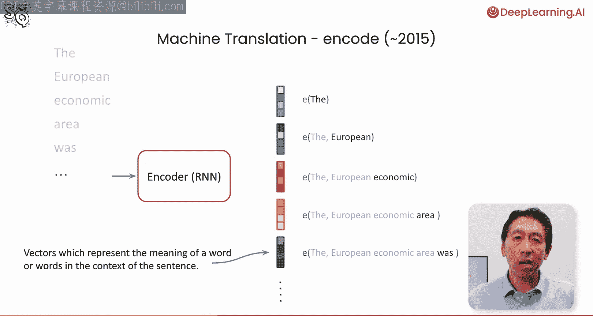

一旦输入句子被转换为向量，解码器便将这些向量作为输入。解码器会一次生成一个单词，以从英语输入中产生法语输出。

## 早期注意力机制的工作原理

现在，这是重要的部分。解码器有一种加权机制，或者说**关注**或**注意**每个输入单词（实际上是每个输入词嵌入）的方式。这种关注是独立进行的，基于输入的位置以及生成输出的当前位置。

例如，当翻译开始时，模型试图生成第一个法语单词，它可能会最**关注**输入中的第一个英语单词。然而，对于第二个单词，在这个例子中，由于法语词序的变化，它将**关注**第四个输入向量，即“area”对应的向量。模型持续地对翻译该步骤最相关的单词进行加权或**关注**。这为我们提供了注意力机制的早期形式。

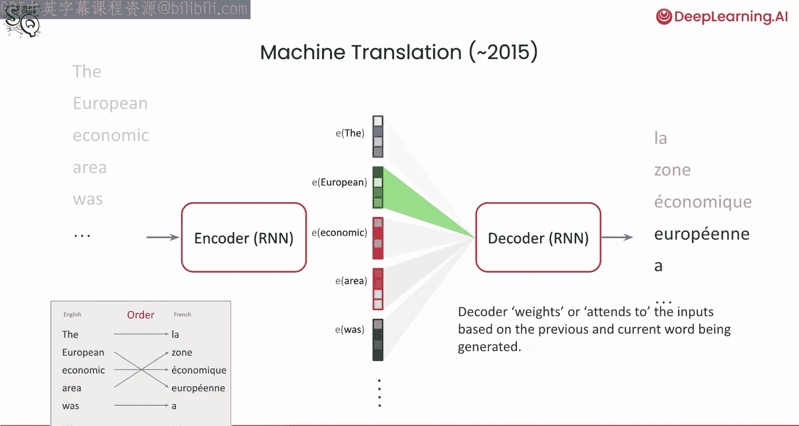

## Transformer架构的诞生

仅仅几年后，在2017年，由Ashish Vaswani、Noam Shazeer、Niki Parmar、Jakob Uszkoreit、Llion Jones、Aidan Gomez、Lukasz Kaiser（他曾在DeepLearning.AI和AI Fund任教）等人撰写的论文《Attention Is All You Need》发表。这篇论文来自我（吴恩达）的前团队——Google Brain团队，它引入了Transformer架构和更通用的注意力形式（Josh今天将详细描述）。该架构专门设计为能够高度扩展地使用GPU。Aidan告诉我，当时设计这个架构时，所有设计选择的首要标准是“这能在GPU上扩展吗？”，这被证明是一个伟大的决定。

这篇论文也研究了机器翻译，所描述的模型同样包含一个编码器和一个解码器。编码器**单次前向传播**为输入句子创建上下文嵌入。解码器然后一次生成一个单词。每个生成的输出都会被反馈给解码器作为下一步的输入，这样在生成下一个单词时，它就知道已经生成了哪些之前的单词。

## Transformer的影响与演变

编码器模型后来成为BERT算法的基础。BERT代表**来自Transformer的双向编码器表示**，它进而成为今天几乎所有用于RAG或推荐应用创建嵌入向量的嵌入模型的基础。

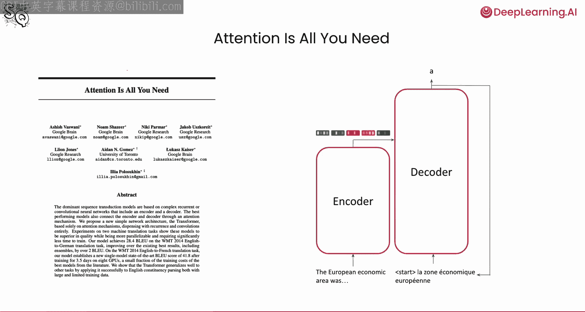

解码器模型此后被用作OpenAI构建的GPT（生成式预训练Transformer）系列大型语言模型的基础，你可能在ChatGPT中使用过它。这个解码器也是大多数其他流行模型的基础，例如来自Anthropic、Google、Mistral和Meta的模型。原始论文仅使用了6层注意力，而例如Meta的Llama 3 405B模型有126层，但基本架构仍然相同。

## 课程安排

以下是本课程的结构安排：

我们将从描述Transformer和注意力背后的主要思想开始，然后继续学习注意力的矩阵运算和代码实现。

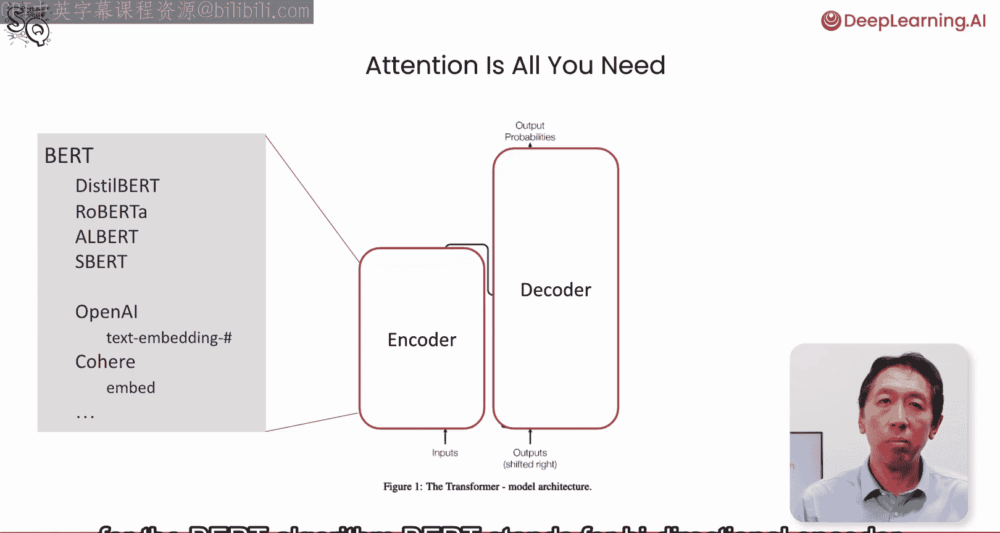

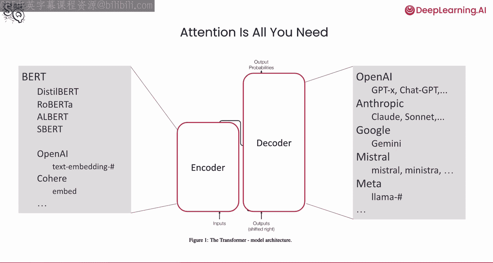

接着，你将学习**自注意力**、**掩码自注意力**之间的区别，并完成PyTorch实现。然后，你将学习吴恩达刚刚描述的**编码器-解码器架构**的细节，以及**多头注意力**。

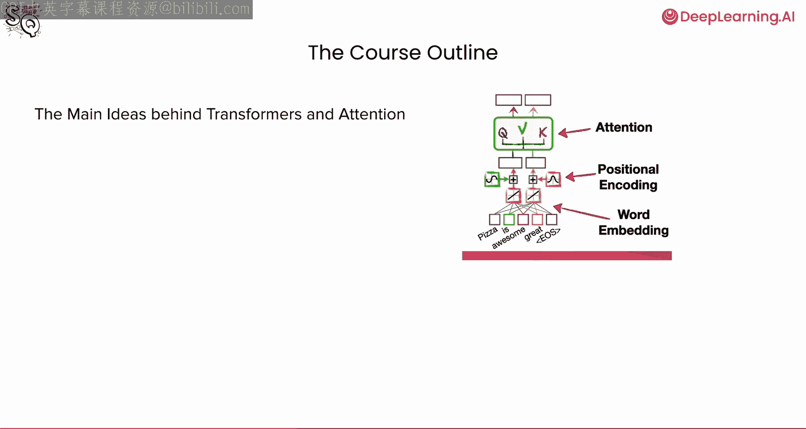

## 致谢与花絮

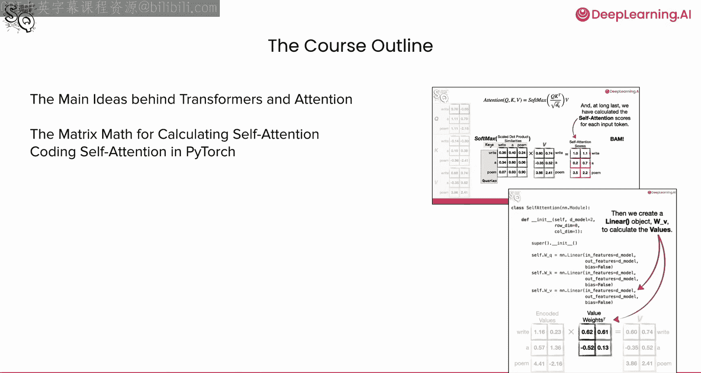

许多人协助了本课程的制作。我要感谢Jeff Lutwig、Eper Ggami和Harun Salami。

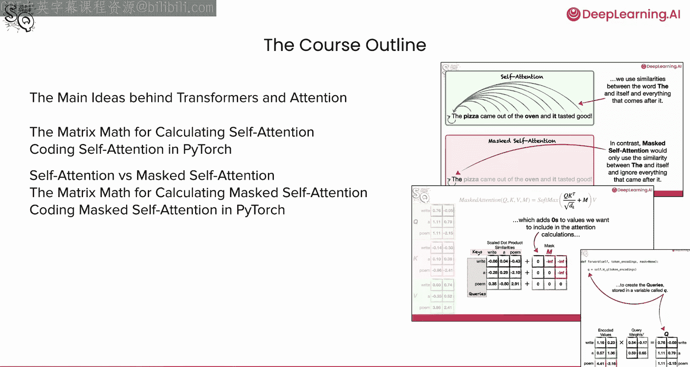

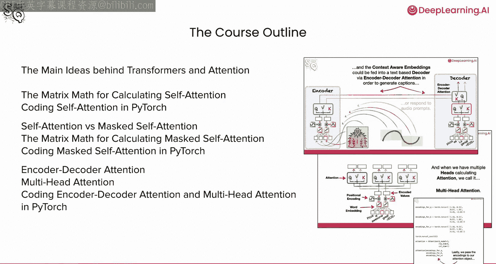

（花絮对话）
嘿，Andrew，面具是怎么回事？哦，我以为你要讲掩码自注意力，我想我可以试着演示一下。嗯，显然我是在“自注意力”。但也许我们俩之间的这段对话，我们可以称之为“交叉注意力”？是的。

---

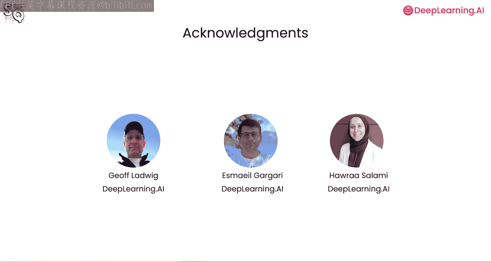

本节课中我们一起学习了Transformer和注意力机制的起源、核心思想及其在自然语言处理发展史上的关键作用。从早期机器翻译中的编码器-解码器与简单注意力，到2017年革命性的《Attention Is All You Need》论文提出可扩展的Transformer架构，我们看到了这项技术如何成为现代BERT、GPT等大语言模型的基石。下一节，我们将深入探讨注意力机制的具体算法与数学原理。