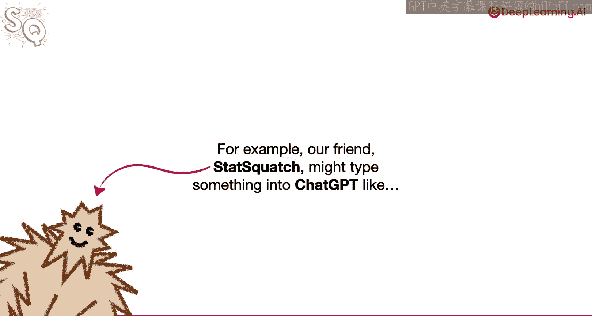
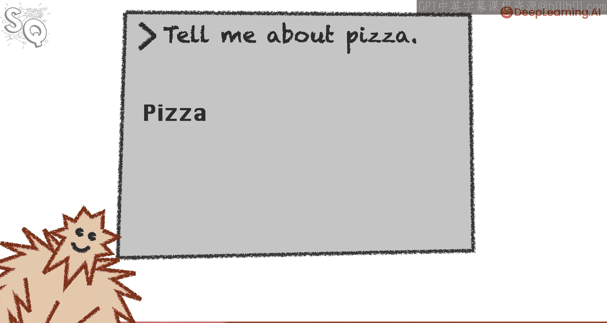
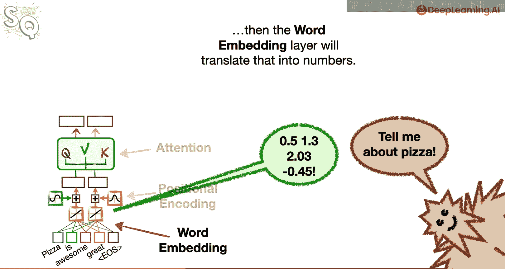
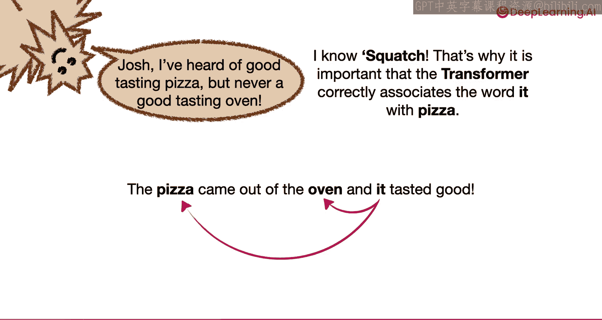
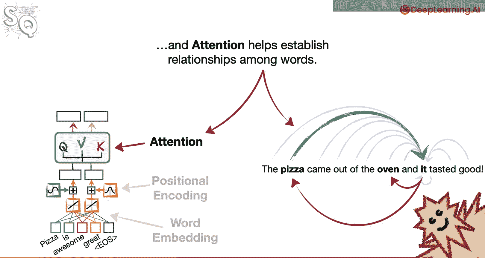

# 002：Transformer与注意力机制的核心思想 🧠

在本节课中，我们将学习Transformer模型及其核心组件——注意力机制的基本概念。我们将了解Transformer如何将文本转换为数字、如何保持词语顺序，以及如何建立词语之间的关系。





---

## 词嵌入：将词语转换为数字

上一节我们介绍了Transformer的总体概念，本节中我们来看看它的第一个核心组件：词嵌入。

Transformer是一种神经网络，而神经网络只能处理数字输入。因此，我们需要将输入的词语、词片段或符号（统称为“词元”）转换为数字。这个过程就是词嵌入。

例如，如果输入是“tell me about pizza”，词嵌入层会将其转换为一系列数字。

```python
# 词嵌入的简化概念：将词语映射为向量
word_to_vector = {
    "tell": [0.1, 0.2, ...],
    "me": [0.3, 0.4, ...],
    "about": [0.5, 0.6, ...],
    "pizza": [0.7, 0.8, ...]
}
```



---

## 位置编码：追踪词语顺序

现在我们已经理解了词嵌入的目的，接下来让我们讨论位置编码，它有助于追踪词语的顺序。

词语的顺序对句子的含义至关重要。例如，“Squatch eats pizza”和“Pizza eats Squatch”使用了完全相同的词语，但含义截然不同。因此，追踪词语顺序非常重要。

有多种方法可以实现位置编码，但具体细节超出了本课的范围。目前，你只需要知道位置编码有助于模型记住词语在句子中的位置。


```python
# 位置编码的简化概念：为每个位置添加一个独特的向量
position_encoding = {
    1: [pe1_1, pe1_2, ...], # 第一个词的位置编码
    2: [pe2_1, pe2_2, ...], # 第二个词的位置编码
    ...
}
# 最终输入 = 词嵌入向量 + 位置编码向量
```

---

## 注意力机制：建立词语间的关系

现在我们知道位置编码有助于追踪词语顺序，接下来让我们谈谈Transformer如何通过注意力机制建立词语之间的关系。



例如，在句子“The pizza came out of the oven, and it tasted good”中，“it”这个词可能指代“pizza”，也可能指代“oven”。显然，“it”应该正确地与“pizza”关联起来。

好消息是，Transformer拥有一种称为“注意力”的机制，可以正确地将“it”与“pizza”关联起来。注意力有多种类型，我们将从最基本的**自注意力**开始描述。

自注意力机制的工作原理是计算句子中每个词与所有其他词（包括其自身）的相似度。例如，它会计算第一个词“The”与句子中所有其他词的相似度，并对句子中的每个词都进行这样的计算。

一旦计算出相似度分数，它们就会被用来决定Transformer如何编码每个词。例如，如果在大量关于披萨的句子中，“it”更常与“pizza”相关联，那么“pizza”的高相似度分数将导致它对“it”的编码产生更大的影响。

以下是自注意力计算过程的简化步骤：

1.  为每个词元创建**查询向量**、**键向量**和**值向量**。
2.  计算查询向量与所有键向量的点积，得到相似度分数。
3.  对相似度分数应用Softmax函数，将其转换为权重（总和为1）。
4.  用这些权重对所有的值向量进行加权求和，得到该位置的输出。

```python
# 自注意力的核心计算（简化示意）
# 假设 Q, K, V 分别是查询、键、值矩阵
attention_scores = Q @ K.T # 计算相似度
attention_weights = softmax(attention_scores) # 转换为权重
output = attention_weights @ V # 加权求和得到输出
```

---

## 总结

本节课中，我们一起学习了Transformer的三个基本构建模块的核心思想：

1.  **词嵌入**：将输入文本中的词元转换为数字向量，以便神经网络处理。
2.  **位置编码**：为词嵌入向量添加位置信息，帮助模型追踪词语在句子中的顺序。
3.  **注意力机制**：通过计算词语间的相似度，建立并编码词语之间的关系，使模型能够理解上下文。



理解这三个部分是如何协同工作的，是掌握Transformer模型的基础。在接下来的课程中，我们将深入探讨它们的实现细节。