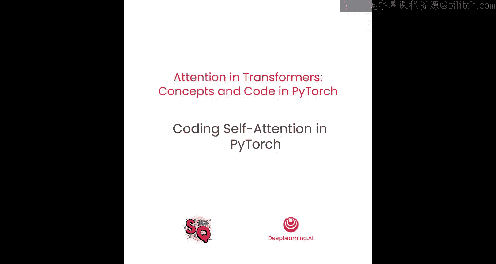
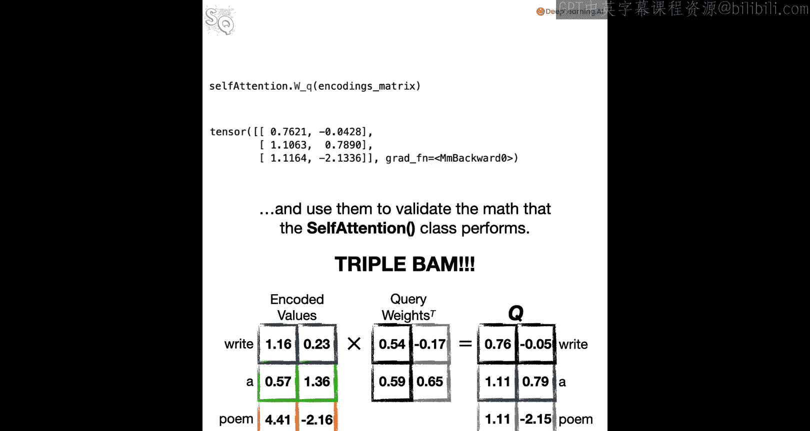

# 004：使用PyTorch实现自注意力机制




## 概述
在本节课中，我们将学习如何使用PyTorch编写一个实现自注意力机制的类。我们将通过代码演示如何创建查询、键和值矩阵，计算注意力分数，并验证计算结果的正确性。

## 导入必要的库
首先，我们需要导入PyTorch及其相关模块，以便创建张量、定义神经网络层并使用辅助函数。

```python
import torch
import torch.nn as nn
import torch.nn.functional as F
```

## 定义自注意力类
接下来，我们定义一个名为 `SelfAttention` 的类，它继承自 `nn.Module`。这是PyTorch中所有神经网络模块的基类。

```python
class SelfAttention(nn.Module):
    def __init__(self, d_model, row_idx=0, col_idx=1):
        super().__init__()
        self.d_model = d_model
        self.row_idx = row_idx
        self.col_idx = col_idx
        self.W_q = nn.Linear(d_model, d_model, bias=False)
        self.W_k = nn.Linear(d_model, d_model, bias=False)
        self.W_v = nn.Linear(d_model, d_model, bias=False)
```

### 初始化方法详解
在 `__init__` 方法中，我们接收以下参数：
- **d_model**：模型的维度，即每个词嵌入向量的长度。
- **row_idx** 和 **col_idx**：用于调整数据索引的便利参数，通常用于处理批次数据。

我们使用 `nn.Linear` 创建三个线性层，分别用于生成查询、键和值矩阵。每个线性层的输入和输出维度都设置为 `d_model`，并且不添加偏置项，这与原始Transformer论文的设计一致。

## 前向传播方法
现在，我们为 `SelfAttention` 类添加 `forward` 方法，用于计算每个词的自注意力分数。

```python
    def forward(self, token_encodings):
        Q = self.W_q(token_encodings)
        K = self.W_k(token_encodings)
        V = self.W_v(token_encodings)

        similarities = torch.matmul(Q, K.transpose(self.row_idx, self.col_idx))
        scaled_similarities = similarities / torch.sqrt(torch.tensor(self.d_model, dtype=torch.float32))
        attention_per = F.softmax(scaled_similarities, dim=-1)
        attention_scores = torch.matmul(attention_per, V)

        return attention_scores
```

### 前向传播步骤解析
以下是计算自注意力的具体步骤：

1.  **计算查询、键和值矩阵**：将输入的词编码分别通过三个线性层，得到查询矩阵 **Q**、键矩阵 **K** 和值矩阵 **V**。
2.  **计算相似度**：使用矩阵乘法计算查询和键之间的相似度，公式为：
    ```
    similarities = Q * K^T
    ```
3.  **缩放相似度**：将相似度除以 `sqrt(d_model)` 进行缩放，以防止梯度消失或爆炸。
4.  **应用Softmax函数**：对缩放后的相似度应用Softmax函数，得到注意力权重矩阵 `attention_per`。
5.  **计算注意力分数**：将注意力权重与值矩阵相乘，得到最终的注意力分数 `attention_scores`。

## 测试自注意力类
为了验证我们的实现是否正确，我们可以创建一个简单的测试用例。

```python
torch.manual_seed(42)

encodings_matrix = torch.tensor([[1.0, 2.0], [3.0, 4.0], [5.0, 6.0]])

self_attention = SelfAttention(d_model=2, row_idx=0, col_idx=1)
attention_scores = self_attention(encodings_matrix)

print("注意力分数矩阵：")
print(attention_scores)
```

### 验证计算过程
为了确保计算正确，我们可以手动检查权重矩阵和中间结果。

以下是打印权重矩阵的代码：

```python
print("查询权重矩阵 W_q：")
print(self_attention.W_q.weight.T)
print("键权重矩阵 W_k：")
print(self_attention.W_k.weight.T)
print("值权重矩阵 W_v：")
print(self_attention.W_v.weight.T)
```

通过比较手动计算的结果与类输出的结果，我们可以验证自注意力机制的正确性。



## 总结
在本节课中，我们一起学习了如何使用PyTorch实现自注意力机制。我们定义了一个 `SelfAttention` 类，它能够计算查询、键和值矩阵，并通过缩放点积注意力机制生成最终的注意力分数。通过测试和验证，我们确保了代码的正确性。掌握自注意力的实现是理解Transformer架构的重要一步。