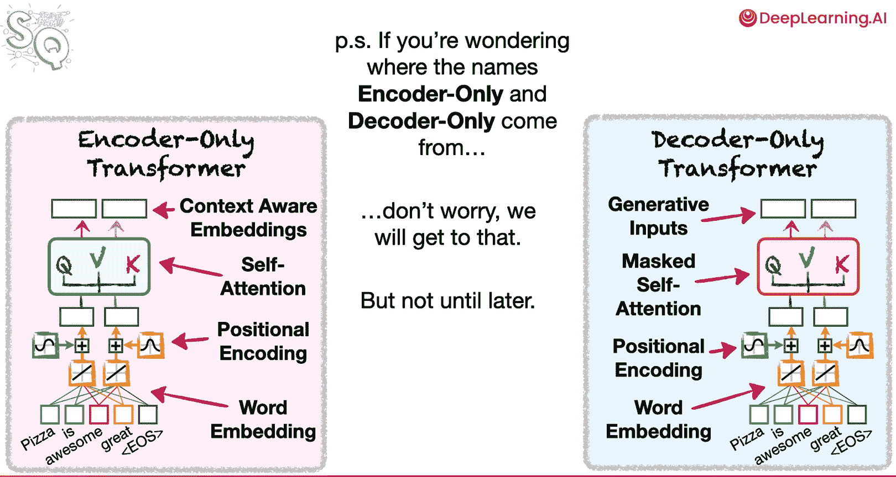

# 005：自注意力与掩码自注意力

## 概述
在本节课中，我们将深入探讨自注意力与掩码自注意力机制的异同。虽然它们的差异看似细微，但对各自能解决的问题类型有着巨大影响。我们将从自注意力能实现的功能开始，逐步过渡到掩码自注意力，并理解它们为何适用于不同的任务。

## 从词嵌入到自注意力
上一节我们介绍了注意力的核心思想是帮助建立词与词之间的关系。现在，我们来看看自注意力机制如何工作，以及它为何强大。

首先，我们需要理解Transformer如何将词语转换为数字，这个过程称为词嵌入。一种简单的方法是为每个词分配一个随机数。例如，对于句子“Pizza is great.”，我们可以为每个词分配随机数。然而，这种方法存在问题：即使“great”和“awesome”含义相似、用法相近，它们也会被分配完全不同的数字。这意味着神经网络需要更多的复杂性和训练数据，因为学会处理“great”并不能帮助它正确处理“awesome”。

因此，理想的情况是，为用法相似的词语分配相似的数字，这样学会使用一个词就能同时帮助学会使用另一个词。同时，由于同一个词可以在不同语境中使用（例如，“great”可以表示正面意义，也可以用于讽刺的负面意义），为每个词分配多个数字（即一个向量）可能更好，这样神经网络就能更容易地适应不同的上下文。

### 构建简单的词嵌入网络
以下是构建一个简单词嵌入网络的步骤，用于处理“Pizza is great.”和“Pizza is awesome.”这两个句子：

1.  为每个独特的词创建神经网络输入节点。
2.  为每个词创建输出节点。
3.  将所有输入连接到至少一个激活函数。在本例中，我们连接到两个激活函数。激活函数的数量决定了我们用来表示每个词的数字（即词嵌入向量）的维度。这里我们将得到两个数字。
4.  为从输入到激活函数的连接添加权重。这些权重就是词嵌入值，初始化为随机数。
5.  将激活函数连接到输出层（具体细节暂不深究）。

由于每个词都有两个嵌入值（分别对应顶部和底部的激活函数），我们可以将每个词绘制在一个二维图上，X轴是顶部嵌入值，Y轴是底部嵌入值。在初始随机权重下，词语“great”和“awesome”的分布可能并不相似。

### 训练词嵌入网络
训练的目标是让网络根据当前词预测下一个词。例如，我们希望输入“pizza”能预测出“is”，输入“is”能预测出“great”或“awesome”。通过使用反向传播等算法调整网络权重（即词嵌入值），最终训练后的词嵌入会使“great”和“awesome”在向量空间中彼此靠近，因为它们出现在相似的上下文中。

然而，仅预测下一个词提供的上下文信息有限。为了获得更好的词嵌入，我们可以使用更复杂的训练数据集和更长的上下文窗口。例如，使用“the pizza came out”四个词来预测下一个词“of”。但这种方法存在一个问题：它忽略了词序。对于神经网络来说，“the pizza came out of”和乱序的“pizza out came the of”输入是一样的，但它们的含义可能天差地别。

## 引入位置编码与自注意力
为了解决词序问题，Transformer引入了**位置编码层**。它在词嵌入向量中添加了位置信息，使模型能够区分词语的顺序。

随后是**自注意力层**。自注意力机制会考虑序列中的所有词（包括目标词之前和之后的词），来计算每个词与其他词的相关性。通过这种方式，我们得到了一种新的嵌入表示，通常称为**上下文感知嵌入**或**语境化嵌入**。

与仅聚类单个词的词嵌入相比，上下文感知嵌入可以帮助聚类相似的句子，甚至相似的文档。

### 仅编码器Transformer的应用
仅使用自注意力的Transformer被称为**仅编码器Transformer**。它们生成的上下文感知嵌入非常有用，可以用于多种任务：

以下是上下文感知嵌入的主要应用场景：
*   **文本聚类**：对句子或文档进行聚类分析。
*   **情感分类**：作为输入，接入一个普通的神经网络来分类文本的情感（如判断推特上关于披萨的评论是正面还是负面）。
*   **特征输入**：作为逻辑回归等分类模型的输入变量。

总之，仅编码器Transformer创建的上下文感知嵌入具有广泛的应用价值。

## 从自注意力到掩码自注意力
了解了仅编码器Transformer（使用自注意力）的强大功能后，我们来讨论另一种Transformer：**仅解码器Transformer**。

与仅编码器Transformer一样，仅解码器Transformer也从词嵌入和位置编码开始。但它不使用标准的自注意力，而是使用**掩码自注意力**。

### 核心区别：能否“向前看”
自注意力与掩码自注意力之间的最大区别在于：
*   **自注意力**：在计算某个词的注意力时，可以查看该词**之前和之后**的所有词。
*   **掩码自注意力**：在计算某个词的注意力时，只能查看该词**之前**的词，而**忽略之后**的词。这就像在注意力权重矩阵上应用了一个掩码，将“未来”信息屏蔽掉。

例如，对于句子“The pizza came out of the oven, and it tasted good.”：
*   计算“the”的自注意力时，会考虑它与序列中所有词（包括其后的词）的相似性。
*   计算“the”的掩码自注意力时，只考虑它与自身及之前词（本例中之前无词）的相似性，忽略其后所有词。
*   计算“it”的掩码自注意力时，只考虑“it”与“The”, “pizza”, “came”, “out”, “of”, “the”, “oven”, “and”的相似性，忽略其后的“tasted”和“good”。

### 仅解码器Transformer与生成任务
由于仅解码器Transformer使用掩码自注意力，永远无法“偷看”未来的词，因此它们可以被训练来出色地完成**生成任务**。

在训练时，我们可以给模型输入一个句子的前半部分（例如，到“it”为止），然后在训练过程中调整模型权重，直到它能够生成句子的剩余部分“tasted good”。这就是为什么像ChatGPT这样的仅解码器Transformer被称为**生成模型**，因为它被专门训练来根据提示生成后续文本。

因此，与创建上下文感知嵌入的仅编码器Transformer不同，仅解码器Transformer创建的是**生成式输入**，可以接入一个简单的神经网络来生成新的词元（tokens）。

## 总结
本节课我们一起学习了自注意力与掩码自注意力的核心区别及其影响：

*   **自注意力**可以查看目标词之前和之后的词，适用于需要理解完整上下文的任务（如文本分类、聚类），是**仅编码器Transformer**的核心。
*   **掩码自注意力**只能查看目标词之前的词，屏蔽未来信息，适用于文本生成任务，是**仅解码器Transformer**（如GPT系列）的核心。

这个相对较小的设计差异，深刻地决定了两种Transformer架构所能解决的问题类型。

> 附注：如果你好奇“仅编码器”和“仅解码器”这些名称的来源，请不要担心，我们将在后续课程中详细讲解。